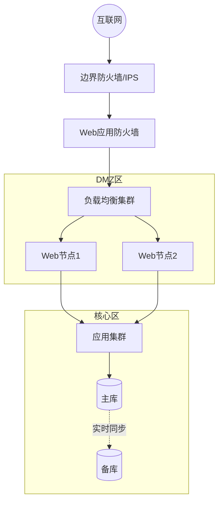
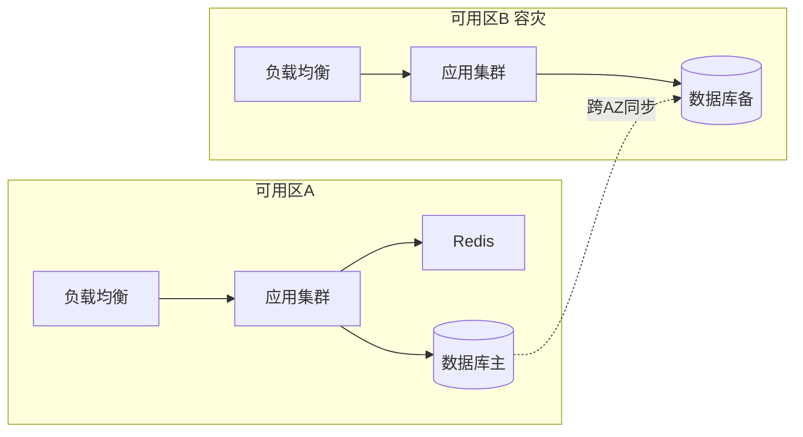
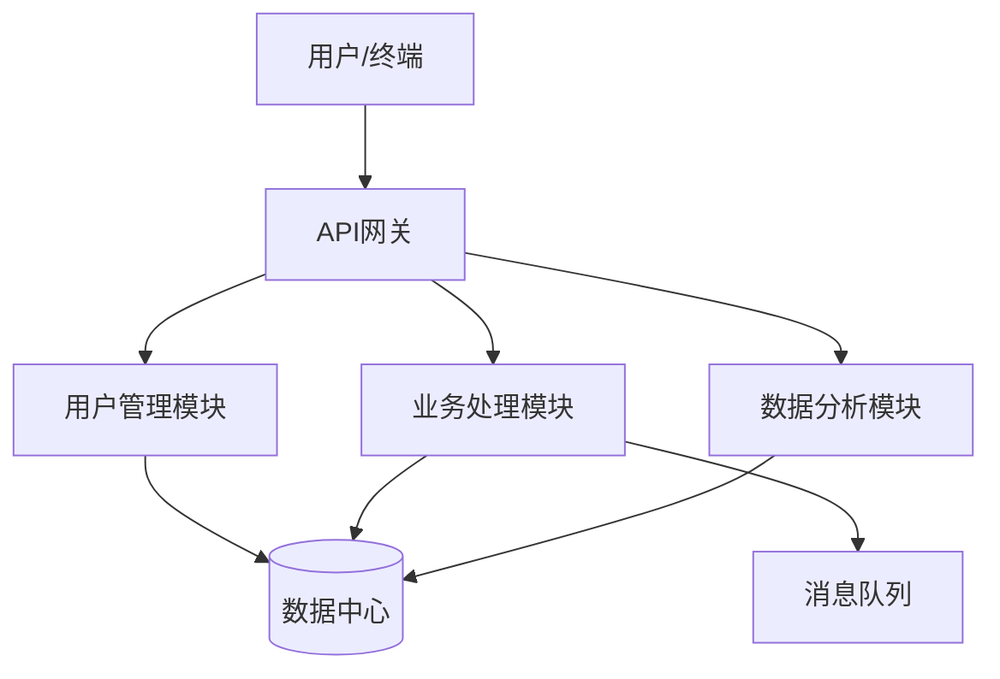
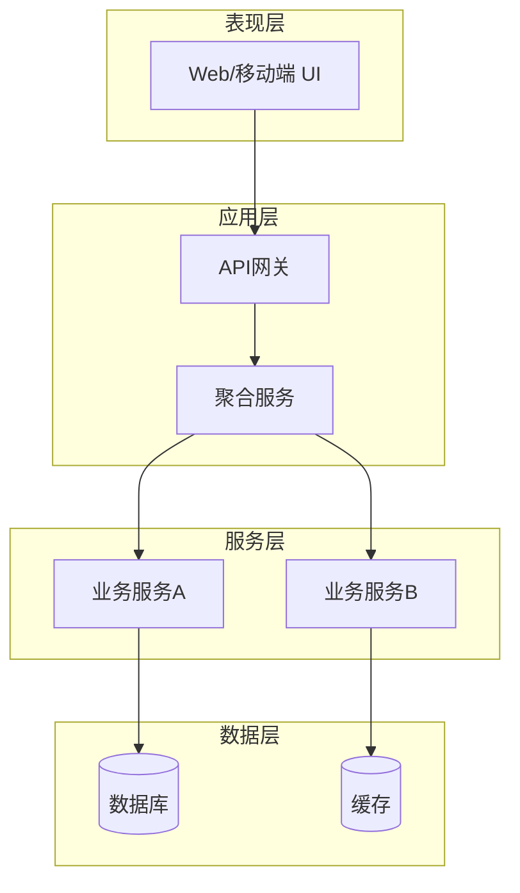
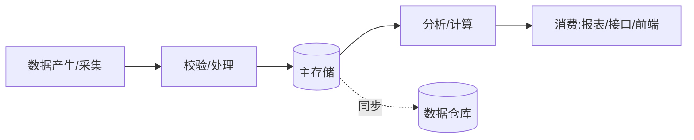
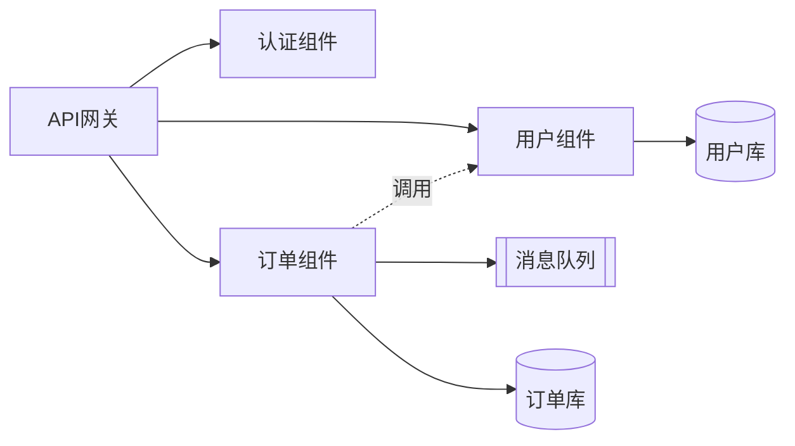
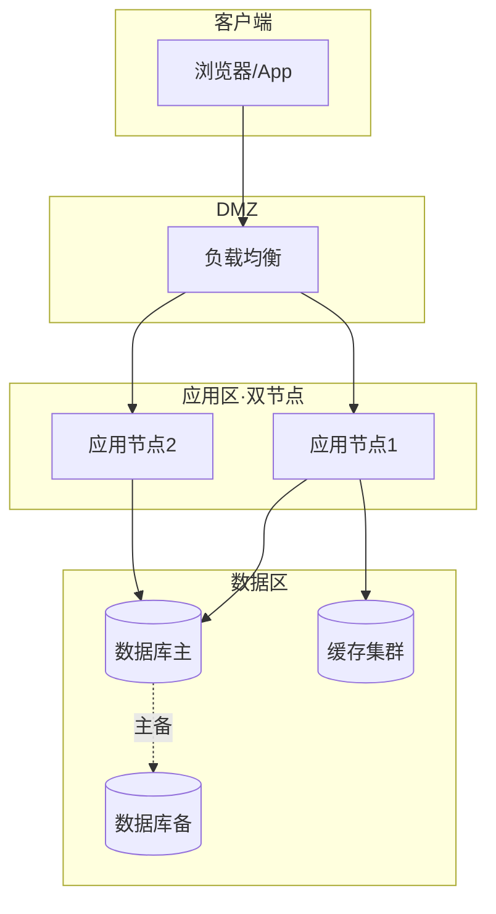
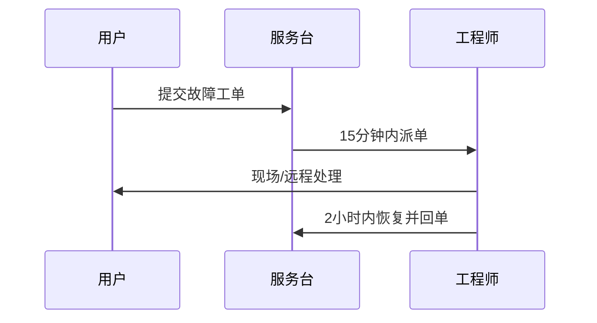
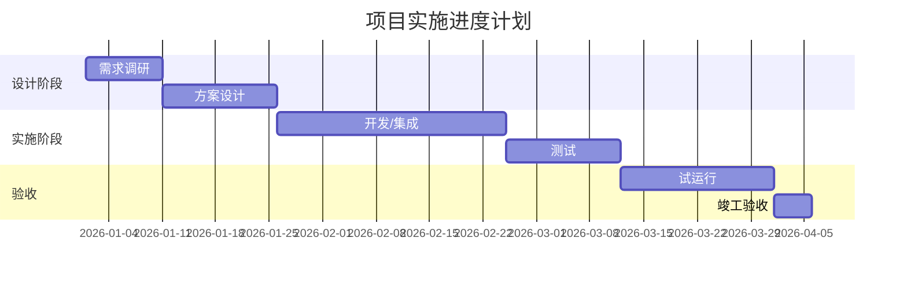
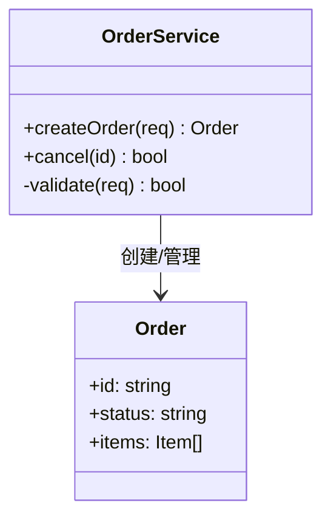

# 图表规范（Mermaid）

architect 与 writer 出图统一规范。所有图以 Mermaid 源码存放于 `architecture/diagrams/*.mmd`，可选用 `mmdc` 渲染。

## 一、网络拓扑图（graph TB/LR）

体现安全域、链路、冗余：


## 二、云/部署架构图

体现可用区、高可用、容灾：


## 三、系统功能模块图（graph TD）

模块划分与数据流：


## 三·补、软件类总体架构四图（软件开发类必含）

软件开发类技术方案的"系统总体技术架构"必须包含以下四图（缺一视为设计不完整）：

### 1. 逻辑分层图（graph TB）

表现层/应用层/服务层/数据层逻辑分层与各层职责：


### 2. 数据主流向图（flowchart LR）

核心业务数据 产生→处理→存储→消费 的主流向：


### 3. 组件图（graph LR）

主要组件（服务/模块/中间件）及依赖调用关系：


### 4. 部署图（graph TB）

物理/云部署拓扑：节点、网络、中间件、数据库部署与高可用：


> 类图可用 `classDiagram`，用于功能模块的"类与算法设计"；用例可用 `graph`/`flowchart` 表达用例关系或参与者-用例图。

## 四、流程时序图（sequenceDiagram）

关键业务/服务响应流程：


## 五、甘特图（gantt，进度计划）



## 六、类图（classDiagram，功能模块"类与算法设计"用）



## 规范要点

1. **语法可解析**：节点/边/方向完整，自检无语法错。
2. **中文标签**：节点名用中文，简洁明确。
3. **图文一致**：图中组件必须在正文有对应说明。
4. **抽象适度**：总体图不超过 ~20 节点，复杂部分拆子图。
5. **渲染降级**：无 mmdc 时保留源码并在正文内嵌 ```mermaid 代码块。
