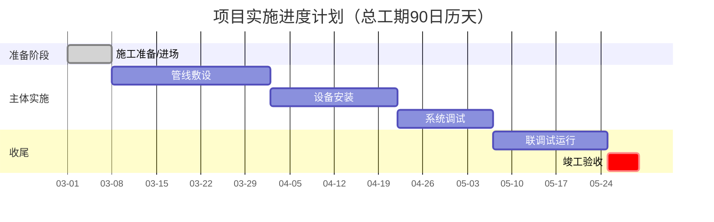

# 技法：进度甘特图（工程类）

工程类进度计划评分的关键——展现**关键线路 + 里程碑 + 与工期承诺的一致性**。

## Mermaid 甘特图模板

## 要点

1. **关键线路标注**：用 `crit` 标注关键工序，体现进度管控能力。
2. **里程碑清晰**：分阶段（准备/实施/收尾/验收），节点可追踪。
3. **总工期一致**：甘特图总工期 = 正文工期承诺 = 满足招标要求（不超最长工期）。
4. **资源匹配**：进度与劳动力/机械投入计划匹配，避免"赶工无资源"。
5. **进度保障措施**：图后补充延误应对（资源加投、并行作业、奖惩）。

## 反面（失分）

- 无关键线路、各工序简单串联 → 显得无管控
- 甘特图工期与正文承诺不一致 → reviewer 必查的硬伤
- 工期超招标最长工期 → 废标风险
