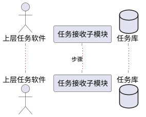

# 第3.1节「任务管理模块」详细设计 提示词

## 一、角色设定

你是一名资深软件详细设计师。请基于本提示词与《系统需求.md》第「任务管理」节，输出《系统建设方案》第 3.1 节「任务管理模块详细设计」的完整内容。

## 二、需求映射（必须严格对齐，禁止扩展）

来自《系统需求.md》「任务管理」原文：

- （1）任务接收：能够接收其他软件任务；能够显示当前和历史任务并入库；能够分解任务为多种指令；能够对任务状态进行监控和显示。
- （2）结果报送：能够将任务结果上报至其他软件；能够将技术状态上报至其他软件。

本模块仅拆分为两个子模块：

- **3.1.1 任务接收子模块**
- **3.1.2 结果报送子模块**

**严禁**自行新增"任务编排、任务优先级调度、用户权限审批、任务模板库"等需求未提到的子模块。

## 三、每个子模块必须按以下五个固定小节输出

> 注意：以下五项是子模块内部的固定结构，标题统一使用四级标题 `#### `。

### (1) 功能模块描述
- 1 段话概述子模块职责，对应到系统需求原文条目。
- 列出输入、输出、关键数据。
- 列出对外依赖（上层任务软件、数据库、其他模块）。

### (2) 操作步骤（含 PlantUML 时序图）
- 用编号步骤描述用户/系统的执行流程（不超过 10 步）。
- 紧跟一张 **PlantUML 时序图**，参与者控制在 5 个以内，节点简单明了。
- 围栏写法：



### (3) 类 / 算法设计（Java 代码描述）
- 仅写**架构性 Java 代码或核心算法**：类签名、关键方法签名、关键算法（如指令分解）的伪代码或精简实现。
- **不要写完整业务实现**，避免长篇代码。
- 用 ```java ... ``` 围栏。建议给出：
  - 主要类：`TaskReceiver`、`TaskDecomposer`、`TaskStateMonitor`、`ResultReporter` 等
  - 关键算法：任务分解算法（任务 → 指令序列）的核心 30 行内 Java 伪代码。

### (4) 用例描述（PlantUML 用例图）
- 列出 2~4 个核心用例（如：接收任务、分解任务、监控任务状态、上报任务结果、上报技术状态）。
- 用 **PlantUML 用例图** 表达：参与者（上层任务软件、操作员、系统）+ 用例椭圆 + 关系。
- 用例图保持简单，节点不超过 10 个。

### (5) 界面设计（HTML 描述）
- 使用 **HTML 片段**绘制界面原型（`<div>` + 内联 CSS 即可），用 ```html ... ``` 围栏。
- 包含：
  - 3.1.1 任务接收：当前任务列表、历史任务列表、任务状态栏、任务详情/指令分解结果区。
  - 3.1.2 结果报送：结果上报按钮、上报状态/日志区、技术状态上报区。
- HTML 不必可运行，重在结构清晰，便于评审。

## 四、本节顶层结构

```
## 3.1 任务管理模块
### 3.1.1 任务接收子模块
#### (1) 功能模块描述
#### (2) 操作步骤（含时序图）
#### (3) 类 / 算法设计
#### (4) 用例描述
#### (5) 界面设计
### 3.1.2 结果报送子模块
#### (1) 功能模块描述
#### (2) 操作步骤（含时序图）
#### (3) 类 / 算法设计
#### (4) 用例描述
#### (5) 界面设计
```

## 五、写作铁律

1. 严禁突破系统需求中"任务管理"的功能边界。
2. PlantUML 图简单明了，避免无关元素。
3. Java 代码仅展示架构与核心算法，不写完整 CRUD。
4. HTML 仅做界面结构示意，不引入外部框架。
5. 全文简体中文，专业、严谨。

## 六、自检清单

- [ ] 子模块仅 2 个：任务接收、结果报送
- [ ] 每个子模块均包含 5 个固定小节
- [ ] 每个子模块至少 1 张 PlantUML 时序图、1 张 PlantUML 用例图、1 段 Java 代码、1 段 HTML
- [ ] 未引入需求外的子模块或能力
