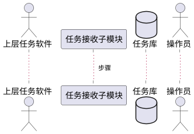

# 第3.1节「任务管理模块」详细设计 提示词

## 一、上下文输入

- `系统需求.md`「任务管理」节
- `_共享_写作规范.md`（附录 A）
- `_共享_界面样式规范.md`（附录 B，界面 HTML 强制套用）
- `knowledge/bid-type/software.md`（软件类第 3 项"功能模块设计"：每个子模块五要素齐全，缺一即设计深度不足）

## 二、章节定位与篇幅

本节为第 3 章的第 1 个一级模块。**目标页数 6~8 页**。

## 三、需求映射（严格不扩大）

来自《系统需求.md》「任务管理」原文：

- （1）任务接收：能够接收其他软件任务；能够显示当前和历史任务并入库；能够分解任务为多种指令；能够对任务状态进行监控和显示。
- （2）结果报送：能够将任务结果上报至其他软件；能够将技术状态上报至其他软件。

仅拆分为：

- **3.1.1 任务接收子模块**
- **3.1.2 结果报送子模块**

不新增"任务编排、任务优先级调度、任务模板库、权限审批"等。

## 四、每个子模块固定五小节（统一模板）

每个子模块都按以下结构产出，标题用四级 `#### `。

### (1) 功能模块描述
- 1 段话：紧扣需求原文条目，说明子模块职责。
- 表格列出：输入（来源 / 字段 / 触发方式）、输出（去向 / 字段）、依赖（其他模块 / 数据库表 / 硬件）。

### (2) 操作步骤（用户操作手册风）
按下列要求撰写，**像甲方使用人员看的操作手册**，不要写"系统自动 / 程序流程"式描述：

- 标明操作入口（默认菜单 / 工具栏 / 快捷键）。可使用如下用语：
  - "在主窗口顶部菜单选择 `文件(F) → 新建任务(N)`，或按快捷键 `Ctrl+N`"
  - "在工具栏点击【新建任务】按钮"
  - "在左侧导航选择【当前任务】节点"
- 表单字段逐项给出：字段名、控件类型（`QLineEdit` / `QComboBox` / `QDateTimeEdit` / `QTextEdit`）、是否必填、取值范围或示例。
- 按钮明确：名称、位置、点击后的反馈（弹出对话框 / 状态栏提示 / 表格刷新）。
- 表格列明确：列名、列宽建议、操作列内含的按钮（如【查看】【重发】【取消】）。
- 编号步骤 ≤10 条。
- 紧跟一张 **PlantUML 时序图**（参与者 ≤5）：上层任务软件、任务接收子模块/结果报送子模块、数据库、界面。



> 操作步骤段落与界面 HTML 必须**同名同位**：步骤里写的菜单/按钮/字段名，必须在界面 HTML 中能找到对应控件。

### (3) 类与算法设计（C++17 + Qt）
- 用 ```cpp ... ``` 围栏写**头文件签名与关键方法**，不写实现细节。
- 必须包含 Qt 的 **信号槽**（`Q_OBJECT`、`signals:`、`public slots:`）。
- 建议类：
  - `TaskReceiver : public QObject`（信号：`taskReceived(Task)`；槽：`onUpperMessage(QByteArray)`）
  - `TaskDecomposer`（核心算法：将 `Task` 拆解为 `QList<Instruction>`）
  - `TaskStateMonitor`（信号：`taskStateChanged(int taskId, TaskState)`）
  - `ResultReporter`（槽：`reportResult(Result)`、`reportTechState(TechState)`）
- 必选 1 个核心算法（≤30 行 C++）：**任务分解算法**（基于任务类型 + 指令模板表 → 生成指令序列）。

### (4) 用例描述（PlantUML 用例图）
- 参与者：上层任务软件、操作员。
- 用例：接收任务、显示当前/历史任务、入库任务、分解任务、监控任务状态、上报任务结果、上报技术状态。
- 节点 ≤12 个。

### (5) 界面设计（HTML，严格套用附录 B 模板）
- **复制附录 B 的 HTML 骨架**，仅修改 `<title>` 与 `qt-content` 区。
- 顶部菜单、工具栏、状态栏保留统一形态，工具栏按钮替换为本模块高频操作：
  - 任务接收界面：【新建任务】【刷新】【查看详情】【分解任务】【删除】
  - 结果报送界面：【上报任务结果】【上报技术状态】【查看上报日志】
- 中央工作区建议结构：
  - **3.1.1 任务接收界面**
    - 上方：`.qt-tabs`（当前任务 / 历史任务）
    - 中部：`.qt-table`（列：任务 ID、来源、内容摘要、状态、接收时间、操作）
    - 右侧或下部：`.qt-group "任务详情"`（任务原文、分解后的指令列表）
  - **3.1.2 结果报送界面**
    - `.qt-group "结果上报"`：选择任务（`.qt-combo`）、上报内容预览（`.qt-textarea`）、【上报】按钮（`.qt-btn-primary`）
    - `.qt-group "技术状态上报"`：状态项表单（版本、配置）、【上报】按钮
    - 下方：`.qt-log` 上报日志
- 状态栏右侧用 `.qt-led` 显示与上层任务软件的连接状态。

## 五、本节顶层结构

```
## 3.1 任务管理模块
### 3.1.1 任务接收子模块
#### (1) 功能模块描述
#### (2) 操作步骤
#### (3) 类与算法设计
#### (4) 用例描述
#### (5) 界面设计
### 3.1.2 结果报送子模块
#### (1)~(5)
```

## 六、写作铁律

1. 严格遵守附录 A 的禁用词与术语统一。
2. 操作步骤以用户手册风撰写，菜单 / 按钮 / 表单 / 表格列 / 快捷键必须明确，且与界面 HTML 一致。
3. 代码使用 C++17 + Qt（含信号槽），≤30 行核心算法。
4. 界面 HTML 必须套用附录 B 模板与 `.qt-*` 类名，不引入外部 CSS 框架。
5. 不增不减子模块。

## 七、自检

- [ ] 子模块仅 2 个
- [ ] 操作步骤包含菜单路径、按钮名、表单字段、表格列、快捷键
- [ ] PlantUML 时序图 / 用例图齐备
- [ ] C++ 代码包含信号槽与 1 个核心算法
- [ ] 两个子模块的 HTML 均严格套用附录 B 骨架
- [ ] 篇幅 6~8 页
- [ ] 对齐 bid-type 第 3 项：每个子模块五要素齐全（功能模块描述/操作步骤/类与算法设计/用例描述/界面设计）
- [ ] 用语去 AI 味
