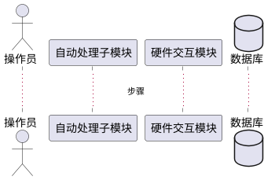

# 第3.2节「数据处理模块」详细设计 提示词

## 一、角色设定

你是一名资深软件详细设计师。请基于本提示词与《系统需求.md》第「数据处理」节，输出《系统建设方案》第 3.2 节「数据处理模块详细设计」的完整内容。

## 二、需求映射（严格对齐，禁止扩展）

来自《系统需求.md》「数据处理」原文：

- （1）自动处理：能够自动控制硬件进行数据处理并记录处理过程；能够生成、读取、导出数据库表；能够基于数据库表比对；能够引导其他功能；能够对异常数据进行告警。
- （2）手动处理：能够对数据进行显示；能够手动控制硬件进行数据处理；能够数据进行拼接；能够自动解析文件名称；能够调用指定算法；能够自动生成 Excel 表；能够把数据保存至文件。

本模块仅拆分为：

- **3.2.1 自动处理子模块**（覆盖：自动控制硬件、过程记录、数据库表 CRUD、表比对、功能引导、异常告警）
- **3.2.2 手动处理子模块**（覆盖：数据显示、手动控硬件、数据拼接、文件名解析、算法调用、Excel 生成、数据保存为文件）

**严禁**自行新增"数据清洗规则引擎、自定义可视化大屏、AI 异常检测模型训练"等需求未出现的能力。"自动处理"中的"异常告警"只描述触发与展示，不展开为独立报警平台。

## 三、每个子模块固定五小节结构

> 每个子模块统一按下列五小节输出，标题使用 `#### `。

### (1) 功能模块描述
- 概述子模块职责（紧扣需求原文条目）。
- 列出输入（数据来源：硬件、文件、数据库表）、输出（数据库记录、Excel、文件、告警事件）。
- 列出依赖：硬件交互模块、数据库、文件系统。

### (2) 操作步骤（含 PlantUML 时序图）
- 编号步骤 ≤10 条。
- 必须包含一张 **PlantUML 时序图**，例如：
  - 自动处理：操作员 → 自动处理子模块 → 硬件交互模块 → 数据库 → 告警提示
  - 手动处理：操作员 → 界面 → 手动处理子模块 → 算法库/Excel 工具 → 文件



### (3) 类 / 算法设计（Java 代码）
- 仅展示架构 + 核心算法。
- 建议类：
  - 自动处理：`AutoProcessor`、`DbTableService`、`TableComparator`、`AnomalyDetector`、`ProcessLogger`
  - 手动处理：`ManualProcessor`、`FileNameParser`、`DataConcatenator`、`AlgorithmInvoker`、`ExcelExporter`、`FileSaver`
- 核心算法（精简实现，≤30 行 Java）必选其一并写出：
  - 数据库表比对算法（基于主键+字段差异）
  - 文件名解析算法（基于规则/正则 → 元数据）
  - 异常数据检测算法（阈值或统计偏差）

### (4) 用例描述（PlantUML 用例图）
- 自动处理子模块用例：自动控制硬件采集、记录处理过程、CRUD 数据库表、数据表比对、引导其他功能、异常告警。
- 手动处理子模块用例：显示数据、手动触发硬件处理、数据拼接、解析文件名、调用算法、导出 Excel、数据保存为文件。
- PlantUML 用例图节点 ≤12 个，参与者：操作员、硬件、其他功能模块。

### (5) 界面设计（HTML）
- HTML 片段（内联 CSS），用 ```html ... ``` 围栏。
- 自动处理界面：处理流程进度区、过程日志区、数据库表操作区（增/删/导入/导出）、比对结果区、告警提示区。
- 手动处理界面：数据展示区（表格/曲线占位）、硬件控制按钮、文件名解析输入框、算法选择下拉框、Excel 导出按钮、保存文件按钮、数据拼接操作面板。

## 四、本节顶层结构

```
## 3.2 数据处理模块
### 3.2.1 自动处理子模块
#### (1)~(5) 五小节
### 3.2.2 手动处理子模块
#### (1)~(5) 五小节
```

## 五、写作铁律

1. 严禁突破"数据处理"需求边界。
2. PlantUML 时序图、用例图简单清晰。
3. Java 代码只展示架构与核心算法，长度可控。
4. HTML 仅展示界面原型结构。
5. 全文简体中文。

## 六、自检清单

- [ ] 子模块仅 2 个：自动处理、手动处理
- [ ] 每个子模块均覆盖原文中全部条目（自动 5 条、手动 7 条），并明确映射
- [ ] 5 个固定小节完整
- [ ] 至少 1 个核心算法的 Java 实现示例
- [ ] 未引入需求外能力
