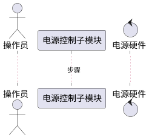

# 第3.3节「硬件交互模块」详细设计 提示词

## 一、角色设定

你是一名资深软件详细设计师。请基于本提示词与《系统需求.md》「硬件交互」节，输出《系统建设方案》第 3.3 节「硬件交互模块详细设计」的完整内容。

## 二、需求映射（严格对齐，禁止扩展）

来自《系统需求.md》「硬件交互」原文（无显式子项，但内含 6 项独立能力）：

> 能够控制电源开机；能够接收电源状态信息；能够对硬件返回的结果保存为文件；能够离线处理文件；能够对硬件交互过程进行入库；能够对结果进行入库。

本模块拆分为以下子模块（不超出原文能力清单）：

- **3.3.1 电源控制子模块**（控制电源开机；接收电源状态信息）
- **3.3.2 硬件结果采集与保存子模块**（结果保存为文件；离线处理文件）
- **3.3.3 交互过程与结果入库子模块**（交互过程入库；结果入库）

**严禁**自行新增"硬件固件升级、硬件远程运维、设备网络拓扑可视化"等需求外能力。

## 三、每个子模块固定五小节结构

> 每个子模块统一按下列五小节输出，标题使用 `#### `。

### (1) 功能模块描述
- 紧扣需求原文条目，1 段话说明子模块职责。
- 列出输入（控制指令、硬件返回数据）、输出（文件、数据库记录、状态信号）。
- 列出依赖（具体硬件类型仅描述为"电源/受控硬件"，不做型号扩展）。

### (2) 操作步骤（含 PlantUML 时序图）
- 编号步骤 ≤10 条。
- 必须给出 **PlantUML 时序图**，例如：
  - 电源控制：操作员/上层模块 → 电源控制子模块 → 电源硬件 → 状态回传
  - 结果采集：硬件 → 采集子模块 → 文件系统；离线模式：操作员 → 子模块 → 历史文件 → 解析结果
  - 入库：交互过程/结果数据 → 入库子模块 → 数据库



### (3) 类 / 算法设计（Java 代码）
- 仅给出架构性 Java 代码（接口/类/关键方法签名）+ 核心算法。
- 建议类：
  - 电源控制：`PowerController` (interface)、`SerialPowerController` / `NetPowerController` 实现、`PowerStatusListener`
  - 结果采集：`HardwareResultCollector`、`OfflineFileProcessor`、`FilePersister`
  - 入库：`InteractionLogService`、`ResultPersistenceService`、`HardwareTxLogEntity`
- 核心算法（任选 1 个，≤30 行 Java）：
  - 硬件交互可靠性算法（指令重试 + 超时回退 + 心跳检测）
  - 离线文件批量处理算法（文件遍历 + 解析 + 入库）

### (4) 用例描述（PlantUML 用例图）
- 参与者：操作员、上层模块（数据处理、任务管理）、电源硬件、数据库、文件系统。
- 用例：控制电源开机、接收电源状态、保存硬件返回结果为文件、离线处理文件、交互过程入库、结果入库。
- 用例图节点 ≤12 个。

### (5) 界面设计（HTML）
- HTML 片段：
  - 电源控制界面：开机/关机按钮（仅按需求只展开"开机"）、电源状态指示灯/状态栏、状态日志。
  - 结果采集界面：实时接收数据展示、保存文件路径选择、离线文件加载与处理按钮。
  - 入库界面：交互日志表格、结果记录表格、入库状态提示。
- 全部使用 ```html ... ``` 围栏，可拆分为多个 HTML 片段（每子模块一个）。

## 四、本节顶层结构

```
## 3.3 硬件交互模块
### 3.3.1 电源控制子模块
#### (1)~(5)
### 3.3.2 硬件结果采集与保存子模块
#### (1)~(5)
### 3.3.3 交互过程与结果入库子模块
#### (1)~(5)
```

## 五、写作铁律

1. 严禁突破"硬件交互"原文 6 项能力（开机控制、接收状态、结果保存为文件、离线处理文件、过程入库、结果入库）。
2. 不展开未描述的硬件型号、协议族；通信方式可作为"实现层选项"提及，不构成新需求。
3. PlantUML 简洁，Java 代码精炼。
4. HTML 仅做结构示意。
5. 全文简体中文。

## 六、自检清单

- [ ] 子模块 3 个，分别完整对应 6 项原子能力
- [ ] 每个子模块均含 5 小节结构
- [ ] 时序图覆盖控制、采集、入库三类交互
- [ ] 用例图含全部 6 个用例
- [ ] 未引入需求外能力
