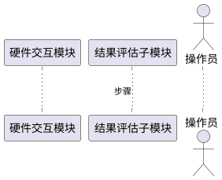

# 第3.4节「结果评估模块」详细设计 提示词

## 一、角色设定

你是一名资深软件详细设计师。请基于本提示词与《系统需求.md》「结果评估」节，输出《系统建设方案》第 3.4 节「结果评估模块详细设计」的完整内容。

## 二、需求映射（严格对齐，禁止扩展）

来自《系统需求.md》「结果评估」原文：

> 能够接收硬件返回结果；能够评判结果接收效果；能够生成时序列表；能够在时序列表手动调整内容；能够调用算法显示结果。

本模块仅拆分为：

- **3.4.1 硬件结果接收与评判子模块**（对应：接收硬件返回结果；评判结果接收效果）
- **3.4.2 时序列表管理子模块**（对应：生成时序列表；时序列表手动调整内容）
- **3.4.3 算法调用与结果展示子模块**（对应：调用算法显示结果）

**严禁**自行新增"评估模型训练、智能打分、报告自动撰写"等需求外能力。

## 三、每个子模块固定五小节结构

### (1) 功能模块描述
- 严格紧扣需求原文条目。
- 列出输入（来自硬件交互模块的结果数据、用户操作）、输出（评判等级/状态、时序列表、可视化结果）。
- 列出依赖：硬件交互模块、数据处理模块。

### (2) 操作步骤（含 PlantUML 时序图）
- 编号步骤 ≤10 条。
- **PlantUML 时序图** 示例：
  - 接收与评判：硬件交互模块 → 评估子模块 → 评判引擎 → 操作员界面
  - 时序列表：评估子模块 → 时序列表组件 → 数据库；操作员 → 时序列表 → 手动调整 → 保存
  - 算法调用：操作员 → 算法管理器 → 算法实现 → 结果展示组件



### (3) 类 / 算法设计（Java 代码）
- 架构性 Java 代码 + 核心算法。
- 建议类：
  - 接收/评判：`HardwareResultReceiver`、`ReceptionQualityEvaluator`、`EvaluationResult`
  - 时序列表：`TimingListGenerator`、`TimingListEditor`、`TimingItem`、`TimingListRepository`
  - 算法调用：`AlgorithmRegistry`、`AlgorithmInvoker`、`ResultRenderer`
- 核心算法（任选 1 个，≤30 行 Java）：
  - 结果接收效果评判算法（基于完整性 / 误码率 / 丢包率等指标加权打分）
  - 时序列表生成算法（基于结果时间戳排序、关键事件提取、按列填表）

### (4) 用例描述（PlantUML 用例图）
- 参与者：操作员、硬件交互模块、算法库。
- 用例（5 个，与原文一一对应）：
  - 接收硬件返回结果
  - 评判结果接收效果
  - 生成时序列表
  - 手动调整时序列表
  - 调用算法显示结果
- 用例图节点 ≤10 个。

### (5) 界面设计（HTML）
- HTML 片段：
  - 评判界面：实时接收数据展示区 + 接收效果指标卡（如完整率、误码率、评级）
  - 时序列表界面：表格控件（列：序号、时间、事件、参数、操作）、新增/编辑/删除按钮、保存按钮
  - 算法结果展示界面：算法选择下拉、运行按钮、结果展示区（图表占位或文本展示）

## 四、本节顶层结构

```
## 3.4 结果评估模块
### 3.4.1 硬件结果接收与评判子模块
#### (1)~(5)
### 3.4.2 时序列表管理子模块
#### (1)~(5)
### 3.4.3 算法调用与结果展示子模块
#### (1)~(5)
```

## 五、写作铁律

1. 严禁突破原文 5 项能力。
2. 不引入需求外的算法体系（如机器学习训练流程），算法调用仅指"调用既有算法库"。
3. PlantUML 简洁、Java 代码精炼、HTML 仅示意。
4. 全文简体中文。

## 六、自检清单

- [ ] 5 项原文能力全部命中，子模块 3 个
- [ ] 每子模块 5 小节齐全
- [ ] 评判算法或时序列表生成算法之一有 Java 实现
- [ ] 用例图 5 个用例齐全
- [ ] 未扩大需求
