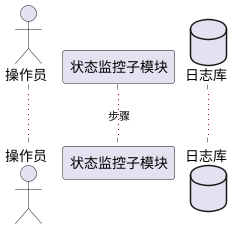

# 第3.5节「系统管理模块」详细设计 提示词

## 一、角色设定

你是一名资深软件详细设计师。请基于本提示词与《系统需求.md》「系统管理」节，输出《系统建设方案》第 3.5 节「系统管理模块详细设计」的完整内容。

## 二、需求映射（严格对齐，禁止扩展）

来自《系统需求.md》「系统管理」原文：

- （1）状态监控：具备查询多种硬件工作状态的功能；具备硬件自检的功能。
- （2）策略管理：具备根据策略生成控制参数的功能；具备增加、修改、删除策略库表内容的功能；具备策略导出功能。
- （3）信息管理：具备硬件配置信息管理功能。

并结合性能要求：

> 日志操作种类 ≥3 种（检索、清除、重置筛选等）；显示的系统状态信息 ≥2 种（磁盘容量、CPU 占用率等）。

本模块拆分为：

- **3.5.1 状态监控子模块**（含：硬件工作状态查询、硬件自检、系统状态信息显示——磁盘/CPU 等 ≥2 种、日志操作 ≥3 种）
- **3.5.2 策略管理子模块**（根据策略生成控制参数、策略库增删改、策略导出）
- **3.5.3 信息管理子模块**（硬件配置信息管理）

> 注：日志检索/清除/重置筛选等性能要求紧邻"系统管理"语境，统一归并到「状态监控子模块」之内描述，不另立"日志中心"子模块以避免扩大需求。系统状态信息显示属于"状态监控"子模块的能力之一，与硬件工作状态查询并列。

**严禁**自行新增"用户管理、角色权限、审计中心、单点登录、消息推送"等需求外子模块。

## 三、每个子模块固定五小节结构

### (1) 功能模块描述
- 紧扣需求原文条目，1 段话职责说明。
- 列出输入、输出、依赖（数据库、硬件交互模块、操作系统）。

### (2) 操作步骤（含 PlantUML 时序图）
- 编号步骤 ≤10 条。
- 必备 **PlantUML 时序图**：
  - 状态监控：操作员 → 状态监控子模块 → 硬件交互模块/操作系统 → 状态显示界面；日志：操作员 → 日志组件 → 日志库（含 ≥3 种操作）
  - 策略管理：操作员 → 策略管理子模块 → 策略库；生成参数：策略管理 → 参数生成器 → 下游模块
  - 信息管理：操作员 → 信息管理子模块 → 配置库



### (3) 类 / 算法设计（Java 代码）
- 架构性 Java 代码 + 核心算法。
- 建议类：
  - 状态监控：`HardwareStatusQueryService`、`HardwareSelfTestService`、`SystemMetricsProvider`（磁盘/CPU）、`LogQueryService`（检索/清除/重置筛选）
  - 策略管理：`StrategyService`、`ControlParamGenerator`、`StrategyExporter`、`StrategyEntity`
  - 信息管理：`HardwareConfigService`、`HardwareConfigEntity`
- 核心算法（任选 1 个，≤30 行 Java）：
  - 硬件自检流程算法（多项检查 → 结果汇总 → 故障定位）
  - 策略→控制参数生成算法（规则匹配 + 参数模板填充）

### (4) 用例描述（PlantUML 用例图）
- 参与者：操作员、硬件、操作系统、下游业务模块。
- 用例（覆盖原文 + 性能要求）：
  - 查询多种硬件工作状态
  - 硬件自检
  - 显示系统状态信息（磁盘容量、CPU 占用率等 ≥2 种）
  - 日志检索 / 日志清除 / 日志重置筛选（≥3 种操作）
  - 根据策略生成控制参数
  - 新增 / 修改 / 删除 策略库内容
  - 策略导出
  - 硬件配置信息管理
- 用例图节点 ≤14 个，必要时合并相近用例（如"日志操作"内聚为 1 个组合包）。

### (5) 界面设计（HTML）
- HTML 片段：
  - 状态监控界面：硬件状态卡片、自检按钮 & 自检报告区、系统状态信息栏（CPU、磁盘等 ≥2 项）、日志查询面板（关键字检索、清除按钮、重置筛选按钮，明确 ≥3 种操作）
  - 策略管理界面：策略库表格（增/改/删/导出按钮）、控制参数生成预览区
  - 信息管理界面：硬件配置表（增/改/删）、配置详情区

## 四、本节顶层结构

```
## 3.5 系统管理模块
### 3.5.1 状态监控子模块
#### (1)~(5)
### 3.5.2 策略管理子模块
#### (1)~(5)
### 3.5.3 信息管理子模块
#### (1)~(5)
```

## 五、写作铁律

1. 严禁引入"用户/权限/角色/审计/SSO"等需求未提及的功能。
2. 日志能力归入"状态监控"子模块，避免另立模块导致需求扩大。
3. 系统状态信息显示种类 ≥2，日志操作种类 ≥3，需在界面与用例中明确体现。
4. PlantUML 简洁、Java 仅展示架构与核心算法、HTML 结构清晰。
5. 全文简体中文。

## 六、自检清单

- [ ] 子模块 3 个（状态监控 / 策略管理 / 信息管理），与原文条目一致
- [ ] 系统状态信息 ≥2 种、日志操作 ≥3 种，已在界面与用例中显式标注
- [ ] 5 小节齐全，PlantUML 时序图 / 用例图 / Java 代码 / HTML 全部具备
- [ ] 未引入需求外能力
