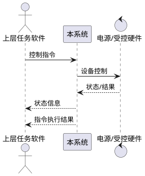

# 第5章「性能与接口设计方案」章节生成提示词

## 一、上下文输入

- `系统需求.md`「性能要求」「接口要求」
- `_共享_写作规范.md`（附录 A）

## 二、章节定位与篇幅

**目标页数 4~5 页**。1 张 PlantUML 时序图、2~3 张字段表。不写业务代码、不写界面。

## 三、写作铁律

1. 性能指标严格引用原文，**≥3 种 / ≥2 种**不得加严或放宽。
2. 接口仅包含原文列出的 3 类：控制指令、状态信息、指令执行结果。
3. 通信实现统一表述为 Qt 网络/串口模块（`QTcpSocket` / `QTcpServer` / `QSerialPort`）。
4. 遵守附录 A 的禁用词。

## 四、本章节小节

### 5.1 性能设计
- **5.1.1 日志性能**：操作种类 ≥3 种（检索、清除、重置筛选等）。指标建议（标注"建议值"）：10 万行级日志检索 ≤2s，清除 / 重置 ≤1s。实现要点：日志表加复合索引、分页查询。
- **5.1.2 系统状态信息显示**：种类 ≥2（含磁盘容量、CPU 占用率等）；刷新频率 ≥1Hz。实现要点：`SystemMetricsProvider` 采集 Linux `/proc` 数据，主线程 `QTimer` 定时刷新。

### 5.2 接口设计
- **5.2.1 控制指令接口**：方向（上层任务软件 → 本系统 / 本系统 → 硬件）、传输（TCP 默认，串口可选）、报文结构字段表。
- **5.2.2 状态信息接口**：方向（硬件 → 本系统、本系统 → 上层）、上报频率（≥1Hz）、报文结构字段表。
- **5.2.3 指令执行结果接口**：方向（本系统 → 上层）、触发时机、报文结构字段表。

每类接口给出字段表：

| 字段名 | 类型 | 长度 | 含义 | 必填 |
|---|---|---|---|---|

报文头/尾、校验位、序号规则说明每类一段（≤80 字）。

提供 1 张 **PlantUML 时序图**（参与者 ≤4）：上层下发指令 → 本系统执行 → 上报状态 → 上报结果。

### 5.3 接口可靠性与异常处理
- 超时与重试（呼应可靠性设计）。
- 报文合法性校验（呼应安全性设计）。
- 异常上报与日志记录（与系统管理日志能力对齐）。

## 五、输出格式

- Markdown，顶层 `# 5. 性能与接口设计方案`。
- 仅 1 张 PlantUML 图；字段表用 Markdown 表格。

## 六、自检

- [ ] 仅 3 类接口
- [ ] 性能指标与原文一致
- [ ] 篇幅 4~5 页
- [ ] 用语去 AI 味
