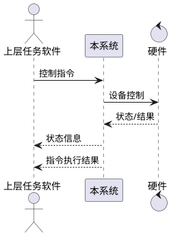

# 第5章「性能与接口设计方案」章节生成提示词

## 一、角色设定

你是一名资深系统设计师，请基于本提示词与系统需求，输出《系统建设方案》第 5 章「性能与接口设计方案」。

## 二、上下文输入

- `系统需求.md`：性能要求、接口要求
- `大纲.md`：第 5 章为合并性章节，无显式三级子目录

## 三、写作铁律

1. 性能指标完全引用系统需求原文，**不得提高或降低**指标。
2. 接口仅包括系统需求明确列出的"控制指令、状态信息、指令执行结果"接口，**严禁**新增"用户登录接口、第三方鉴权接口、监控告警 webhook"等需求外接口。
3. 操作系统：银河麒麟 V10。
4. 全文简体中文，可使用 PlantUML 描述接口交互。

## 四、本章节建议小节

### 5.1 性能设计
直接对齐《系统需求.md》「性能要求」原文：

- 5.1.1 日志性能：操作种类 ≥3 种（检索、清除、重置筛选等）。设计：日志组件支持索引检索、批量清除、筛选条件重置；性能指标（建议）：单次检索响应 ≤2s（10 万行级日志）；清除/重置 ≤1s。
- 5.1.2 系统状态信息显示：种类 ≥2 种，包含磁盘容量、CPU 占用率等。刷新频率（建议）：≥1Hz，准确度与操作系统 API 一致。

> 性能补充指标可作为"实施建议值"，标注为"建议"而非"硬性新增需求"。

给出一张简单的 **PlantUML 组件交互图**：日志组件、系统状态采集组件如何与界面层交互。

### 5.2 接口设计
对齐《系统需求.md》「接口要求」原文：软件接口包括控制指令、状态信息及指令执行结果接口。

针对三类接口，分别给出：
- **5.2.1 控制指令接口**：方向（上层 → 本系统 / 本系统 → 硬件）、传输方式（建议：TCP/串口）、报文结构（建议字段：消息头、指令码、参数、校验、消息尾）、字段说明表。
- **5.2.2 状态信息接口**：方向（本系统 → 上层 / 硬件 → 本系统）、上报频率、报文结构、字段说明表。
- **5.2.3 指令执行结果接口**：方向（本系统 → 上层）、触发时机、报文结构、字段说明表。

接口报文结构使用 Markdown 表格列出字段（字段名 / 类型 / 长度 / 含义 / 必填）。

提供一张 **PlantUML 时序图**，展示一次完整调用：上层下发控制指令 → 本系统执行 → 上报状态 → 上报结果。参与者 ≤4 个。



### 5.3 接口可靠性与异常处理
- 超时与重试机制（呼应可靠性要求）。
- 报文合法性校验（呼应安全性要求）。
- 异常上报与日志记录（与系统管理"日志"对齐）。

## 五、输出格式

- Markdown，顶层 `# 5. 性能与接口设计方案`。
- PlantUML 使用 ```plantuml``` 围栏。
- 不写 Java 业务代码、不写 HTML 界面。

## 六、自检清单

- [ ] 仅包含需求中列出的 3 类接口
- [ ] 性能指标严格引用原文（≥3 / ≥2），未私自加严或放宽
- [ ] PlantUML 简洁、字段表完整
- [ ] 未引入需求外的接口或性能项
