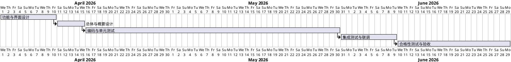

# 第8章「项目实施与进度计划」章节生成提示词

## 一、角色设定

你是一名资深项目经理，请基于本提示词与《项目管理.md》「进度要求」原文，输出《系统建设方案》第 8 章「项目实施与进度计划」。

## 二、上下文输入

- `项目管理.md`「进度要求」：
  - 合同签订 10 个工作日内：完成功能设计和界面设计
  - 合同签订 15 个工作日内：完成总体设计和概要设计
  - 合同签订 60 个工作日内：完成软件编码、单元测试
  - 合同签订 70 个工作日内：完成软件的测试及试运行（集成测试、联调和试运行）
  - 合同签订 90 个工作日内：完成软件合格性测试及验收
  - 2026 年 8 月 31 日完成软件合格性测试及验收

## 三、写作铁律

1. **严格使用上述里程碑日期**，不得改动里程碑名称或天数。
2. 子任务可拆分，但不得新增"用户培训巡讲、运维交接专项"等与五大模块无关的活动；如需提及，归入"售后服务"章节。
3. 全文简体中文。

## 四、本章节须覆盖的小节

### 8.1 项目实施方法论
- 采用迭代式开发 + 阶段评审（与 GJB 438C-2021 兼容）。
- WBS 分解原则：按章节、按模块。

### 8.2 实施阶段划分
按工作日里程碑组织五个阶段：

| 阶段 | 时间约束 | 主要交付 | 主要活动 |
|---|---|---|---|
| 阶段一 功能与界面设计 | ≤10 个工作日 | 功能设计文档、界面原型 | 需求确认、五大模块功能定义、界面 HTML 原型 |
| 阶段二 总体与概要设计 | ≤15 个工作日 | 总体设计说明、概要设计说明 | 架构、技术选型、数据库设计、接口设计 |
| 阶段三 编码与单元测试 | ≤60 个工作日 | 源代码、单元测试报告 | 按模块开发、JUnit 单测、Code Review、注释率 ≥30% 检查 |
| 阶段四 集成测试与试运行 | ≤70 个工作日 | 集成测试报告、联调报告 | 集成测试、硬件联调、试运行问题闭环 |
| 阶段五 合格性测试与验收 | ≤90 个工作日 / 2026-08-31 前 | 合格性测试报告、验收材料 | 合格性测试（功能/性能/边界/安全性/接口）、验收 |

### 8.3 甘特图（PlantUML）
使用 PlantUML 甘特图（@startgantt）展示 5 个阶段，时间以"工作日"标注，简单明了。



> 说明：起始日期为示例，可在生成时调整为合同签订日，但每阶段持续时间应满足里程碑约束并以 2026-08-31 为最终截止日。

### 8.4 关键里程碑与评审节点
- 功能与界面设计评审（第 10 工作日）
- 总体与概要设计评审（第 15 工作日）
- 编码与单元测试出口评审（第 60 工作日）
- 集成测试与试运行出口评审（第 70 工作日）
- 合格性测试与验收（第 90 工作日 / 2026-08-31 前）

### 8.5 风险与应对
- 进度风险：关键阶段延期 → 增加并行任务、调动资源。
- 质量风险：单元测试覆盖率不足 → 加强 Code Review。
- 硬件联调风险：硬件不到位 → 通过仿真器先行验证。
- 与"通用质量特性设计方案"中可靠性、测试性章节联动。

### 8.6 组织与分工
- 项目组结构：项目经理 / 架构师 / 模块开发组（按五大模块）/ 测试组 / 配置管理员 / 质量保证。
- 与甲方协同：定期周报、阶段评审、联调对接。

## 五、输出格式

- Markdown，顶层 `# 8. 项目实施与进度计划`。
- PlantUML 甘特图使用 ```plantuml``` 围栏。
- 表格使用 Markdown 表格。
- 不写 Java / HTML 业务实现。

## 六、自检清单

- [ ] 5 个里程碑天数（10/15/60/70/90）与最终日期 2026-08-31 完全一致
- [ ] 阶段交付物覆盖功能/界面/总体/概要/编码/单测/集测/联调/试运行/合格性测试/验收
- [ ] 甘特图简洁可读
- [ ] 未引入需求外活动
