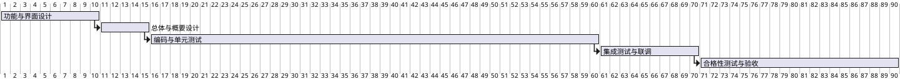

# 第8章「项目实施与进度计划」章节生成提示词

## 一、上下文输入

- `项目管理.md`「进度要求」
- `_共享_写作规范.md`（附录 A）

## 二、章节定位与篇幅

**目标页数 3~4 页**。含 1 张 PlantUML 甘特图 + 1~2 张表格。

## 三、写作铁律

1. **严格使用原文里程碑**：10 / 15 / 60 / 70 / 90 工作日 + 2026-08-31。
2. 不引入需求外活动（培训巡讲、运维代运营等归到第 9 章简述）。
3. 用语克制，遵守附录 A。

## 四、本章节小节

### 8.1 项目实施方法论
- 采用迭代式开发 + 阶段评审，与 GJB 438C-2021 兼容。
- WBS 按章节 / 按模块两条线组织。一段话。

### 8.2 实施阶段划分
**用表格** 展示 5 个阶段：

| 阶段 | 时间约束 | 主要交付 | 主要活动 |
|---|---|---|---|
| 一 功能与界面设计 | ≤10 工作日 | 功能设计、界面原型（Qt 风格 HTML） | 需求确认、五大模块定义、界面原型 |
| 二 总体与概要设计 | ≤15 工作日 | 总体/概要设计说明 | 架构、Qt/数据库选型、接口设计 |
| 三 编码与单元测试 | ≤60 工作日 | 源代码、单测报告 | 模块开发、QtTest 单测、Review、注释率 ≥30% |
| 四 集成测试与试运行 | ≤70 工作日 | 集成测试、联调报告 | 集成测试、硬件联调、问题闭环 |
| 五 合格性测试与验收 | ≤90 工作日 / 2026-08-31 | 合格性测试、验收材料 | 合格性测试、验收 |

### 8.3 甘特图
用 PlantUML `@startgantt` 给出 5 个阶段（横轴可用"工作日"），简单清晰。

### 8.4 关键里程碑与评审节点
- 5 个里程碑表（与 8.2 一致），加一列"评审/验收形式"。

### 8.5 风险与应对
表格：风险项 / 表现 / 应对措施。条目 4~6 条。

### 8.6 组织与分工
- 项目经理 / 架构师 / 5 个模块开发组 / 测试 / 配置管理 / QA。一张表完成。

## 五、输出格式

- Markdown，顶层 `# 8. 项目实施与进度计划`。
- 1 张 PlantUML 甘特图，其余用表格。

## 六、自检

- [ ] 5 个里程碑（10/15/60/70/90 工作日 + 2026-08-31）原文不变
- [ ] 篇幅 3~4 页
- [ ] 用语去 AI 味
