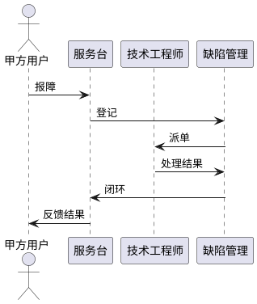

# 第9章「售后服务与保障方案」章节生成提示词

## 一、角色设定

你是一名负责售后与保障体系的项目交付经理。请基于本提示词与系统需求/项目管理原文，输出《系统建设方案》第 9 章「售后服务与保障方案」。

## 二、上下文输入

- `系统需求.md`「保障性要求」：5 年维护，维护期内软件故障/缺陷乙方负责解决。
- `项目管理.md`「售后服务要求」：5 年维护，乙方按甲方要求派人参加系统联调，并共同解决联调中出现的技术问题。
- `项目管理.md`「质保周期要求」：5 年质保维护，乙方派人参加系统联调、所检、外场、用户验收。

## 三、写作铁律

1. **维护期严格为 5 年**，与原文一致，不得擅自延长或缩短。
2. 服务范围以"故障与缺陷修复 + 联调/所检/外场/用户验收支持"为主线，不得扩展为"功能新增承诺、运维代运营"等需求外承诺。
3. 全文简体中文。

## 四、本章节须覆盖的小节

### 9.1 售后服务总体策略
- 维护期：交付验收合格之日起 5 年。
- 服务对象：本系统（《系统需求.md》所定义五大模块）。
- 服务原则：响应及时、问题闭环、持续改进。

### 9.2 服务内容
对齐原文：
- 软件故障与缺陷修复（《系统需求.md》保障性原文）
- 系统联调、所检、外场、用户验收支持（《项目管理.md》质保周期原文）
- 共同解决联调中出现的技术问题（《项目管理.md》售后服务原文）
- 提供软件用户手册及版本更新说明（与维修性要求一致）

可用 Markdown 表格列出服务项目 / 内容 / 触发方式。

### 9.3 服务响应机制
- 报障渠道：电话、邮件、现场。
- 响应分级（建议值，标注"建议"非硬性新增需求）：
  - 紧急（系统不可用）：建议 4 小时内响应、48 小时内修复
  - 一般（功能受限）：建议 1 工作日响应、5 工作日内修复
  - 咨询/优化建议：建议 3 工作日响应
- 响应流程时序图（PlantUML）：用户报障 → 服务台 → 技术工程师 → 缺陷修复 → 验证 → 闭环。

### 9.4 现场支持与联调
- 现场支持范围：系统联调、所检、外场、用户验收。
- 支持方式：派驻工程师、远程协助、现场处置三种组合。
- 与甲方的协同机制。

### 9.5 版本与升级管理
- 维护期内的缺陷修复版本发布机制（仅"故障/缺陷修复"，不承诺新功能）。
- 版本号规则、补丁包发布流程、回退预案。

### 9.6 文档与培训支持
- 维护期内提供软件用户手册更新。
- 应甲方需求开展用户培训（围绕五大模块）。
- 不承诺超出需求的培训规模。

### 9.7 服务保障与质量监督
- 建立服务台账、年度服务总结、问题趋势分析。
- 与甲方约定的定期回访机制。

## 五、输出格式

- Markdown，顶层 `# 9. 售后服务与保障方案`。
- 仅在响应机制处使用一张 PlantUML 时序图。
- 不写 Java / HTML 业务实现。

## 六、自检清单

- [ ] 维护期严格为 5 年
- [ ] 服务范围覆盖原文（故障缺陷修复 + 联调 + 所检 + 外场 + 用户验收）
- [ ] 响应时长以"建议"形式呈现，避免成为额外硬性需求
- [ ] 未承诺需求外能力
