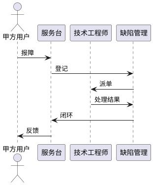

# 第9章「售后服务与保障方案」章节生成提示词

## 一、上下文输入

- `系统需求.md`「保障性要求」
- `项目管理.md`「质保周期要求」「售后服务要求」
- `_共享_写作规范.md`（附录 A）
- `knowledge/bid-type/software.md`（范围红线：只写技术保障侧，不混入商务/报价/罚则）

## 二、章节定位与篇幅

**目标页数 2~3 页**。1 张 PlantUML 时序图 + 1~2 张表格。

## 三、写作铁律

1. 维护期严格为 **5 年**。
2. 服务范围以"故障与缺陷修复 + 联调/所检/外场/用户验收支持"为主线，**不承诺需求外能力**（不承诺新功能、不承诺运维代运营）。
3. 响应时长以"建议值"表述，避免成为额外硬性需求。
4. 遵守附录 A 的禁用词。

## 四、本章节小节

### 9.1 售后服务总体策略
- 一段话：自验收合格之日起 5 年；服务对象为本系统五大模块；故障/缺陷由乙方负责解决。

### 9.2 服务内容
表格列出 4~6 项服务：
- 软件故障与缺陷修复
- 系统联调、所检、外场、用户验收支持
- 共同解决联调技术问题
- 用户手册更新
- 必要的用户培训（围绕五大模块）

### 9.3 服务响应机制
- 报障渠道：电话 / 邮件 / 现场。
- 响应分级表（建议值，明确"建议"二字）：

  | 等级 | 触发条件 | 建议响应时限 | 建议修复时限 |
  |---|---|---|---|
  | 紧急 | 系统不可用 | 4h 内 | 48h 内 |
  | 一般 | 功能受限 | 1 工作日 | 5 工作日 |
  | 咨询 | 使用咨询 / 优化建议 | 3 工作日 | — |

- 1 张 **PlantUML 时序图**（参与者 ≤4）：甲方报障 → 服务台 → 技术工程师 → 缺陷库 → 闭环。

### 9.4 现场支持与联调
- 范围：系统联调 / 所检 / 外场 / 用户验收。
- 方式：派驻、远程、现场处置（一句话）。

### 9.5 版本与升级管理
- 维护期内仅承诺缺陷修复版本；版本号规则与回退预案（一句话）。

### 9.6 文档与培训支持
- 维护期内提供用户手册更新；培训围绕五大模块。

### 9.7 服务保障与质量监督
- 服务台账、年度服务总结、定期回访。

## 五、输出格式

- Markdown，顶层 `# 9. 售后服务与保障方案`。
- 仅 1 张 PlantUML 时序图。

## 六、自检

- [ ] 维护期 5 年
- [ ] 响应时限明确为"建议值"
- [ ] 不承诺需求外能力
- [ ] 对齐 bid-type 范围红线：仅技术保障内容，未混入商务/报价/罚则
- [ ] 篇幅 2~3 页
- [ ] 用语去 AI 味
