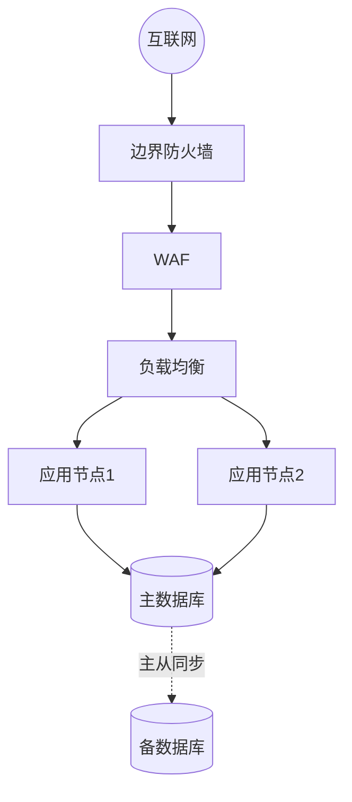
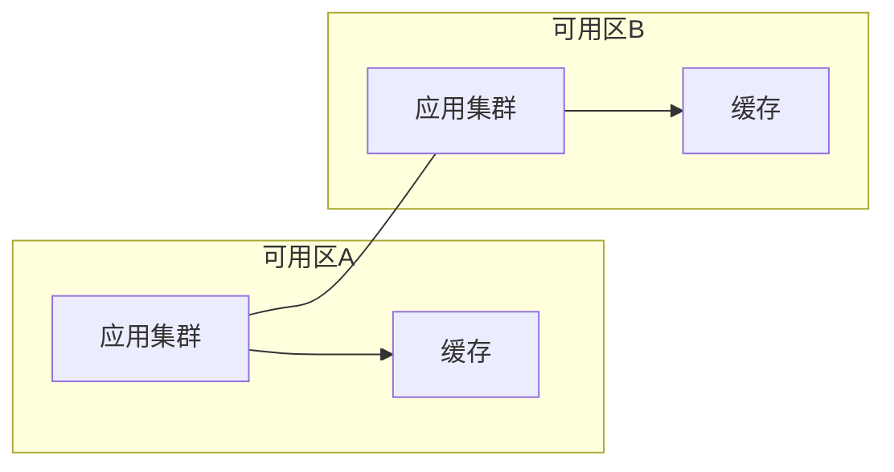
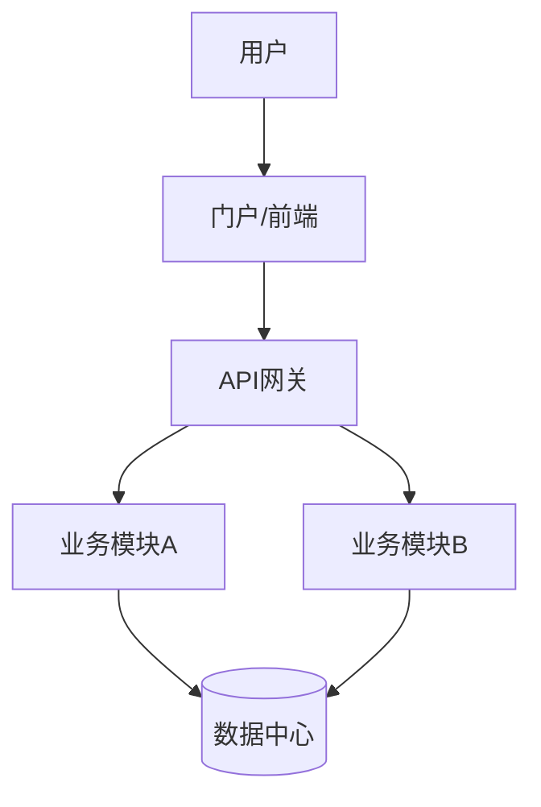

# architecture-design skill

## 流程概览

```text
Step 1: 读技术要求（从 analysis/ 提取约束与技术评分点）
Step 2: 设计分层总体架构
Step 3: 画三张核心图（网络拓扑 / 云·部署架构 / 系统功能模块）
Step 4: 建立决策映射表（架构决策 ↔ 评分点/技术要求）
Step 5: 可选渲染出图（mermaid-cli）
Step 6: 验证（图文一致、语法可解析、评分点覆盖）
```

## Step 1: 读技术要求

读 `analysis/requirement-analysis.md`（技术要求摘要）+ `analysis/scoring-checklist.md`（技术类评分点）。列出：
- 硬性约束（性能/容量/安全等级/合规/预算/技术栈限制）
- 技术类评分点（每个都要在架构中正向覆盖）
- 招标偏好（如国产化、信创、等保 2.0/3.0、双活容灾）

## Step 2: 分层总体架构 → `architecture/overall-design.md`

标准分层（按项目裁剪）：

| 层 | 内容 |
|----|------|
| 接入层 | 负载均衡、WAF、CDN、API 网关 |
| 应用层 | 微服务/模块、业务中台、消息队列 |
| 数据层 | 关系库、缓存、对象存储、数据仓库、备份 |
| 基础设施层 | 计算/网络/存储资源、虚拟化/容器、监控 |
| 安全合规 | 安全域、等保、审计、加密、零信任 |

每层写明：组件、选型理由、与招标要求的对应、冗余/高可用/容灾/弹性设计。

## Step 3: 三张核心图 → `architecture/diagrams/*.mmd`

遵循 `diagram-spec.md`。至少产出：

**网络拓扑图（topology.mmd）** — 安全域、链路、冗余：


**云/部署架构图（cloud-arch.mmd）** — 资源、可用区、容灾：


**系统功能模块图（modules.mmd）** — 模块划分与数据流：


需要时补**关键流程时序图**（sequenceDiagram）。

## Step 4: 决策映射表 → 写入 overall-design.md 末尾

```markdown
| 架构决策 | 对应技术要求/评分点 | 论证要点 |
|---------|-------------------|---------|
| 双可用区主备容灾 | 评分 3.3 容灾设计(6分) | RPO≤X / RTO≤Y |
| WAF+等保三级 | 评分 3.2 安全设计(6分) + 须知合规项 | 满足等保三级要求 |
| 容器化弹性伸缩 | 评分 3.4 可扩展性(4分) | 峰值自动扩容 |
| ... | ... | ... |
```

**铁律：技术类评分点必须 100% 出现在映射表左侧或右侧。**

## Step 5: 可选渲染（mermaid-cli）

环境具备时：
```bash
mmdc -i architecture/diagrams/topology.mmd -o architecture/diagrams/topology.png
```
不可用则跳过，保留 .mmd 源并在 overall-design.md 内嵌 ```mermaid 代码块，标注"渲染待环境支持"。

## Step 6: 验证（Definition of Done）

- [ ] overall-design.md 含：设计目标、分层架构、关键选型、冗余/容灾/弹性、决策映射表
- [ ] diagrams/ ≥ 3 张核心图（拓扑/云架构/功能模块），Mermaid 语法可解析
- [ ] 图文一致（文字描述的组件都在图里，反之亦然）
- [ ] 技术类评分点 100% 被架构覆盖（在决策映射表可查）
- [ ] 无超预算/招标禁止的技术选型
