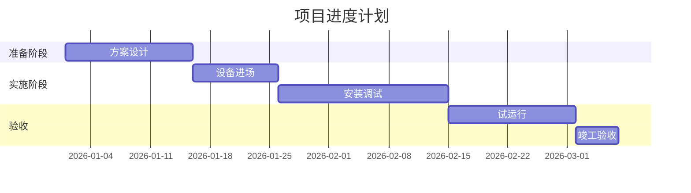

# section-writing skill

## 流程概览

```text
Step 1: 准备（读章纲 + 本章评分点 + 检索素材 + 废标红线 + 写作记忆）
Step 2: 按标书类型选择章节模板与侧重
Step 3: 点对点应答撰写（每个评分点一段，打应答标记）
Step 4: 类型专属产物（采购→偏离表 / 服务→SLA / 工程→甘特图）
Step 5: 废标规避自检
Step 6: AI 味 + 质量自检
```

## Step 1: 准备

读取：
- `chapters/ch-{N}-{slug}.md`（章纲：本章范围、承接评分点）
- `analysis/scoring-checklist.md`（本章承接的评分点 + 应答要求）
- `.agent/task/retrieval-result.md`（检索员提供的可引用素材）
- `analysis/disqualification.md`（废标红线）
- `analysis/deviation-table.md`（采购/工程类应答依据）
- `.claude/memory/writing-memory.md`（作者历轮反馈）
- 重写时：`write-order.md` 中 expert 的失分项与改进建议

## Step 2: 按类型选模板与侧重

加载 `.claude/knowledge/bid-type.md`，按类型组织章节：

**服务类（service）：**
- 服务方案总述 → SLA 指标承诺表 → 团队组织架构 → 人员配置与资质 → 运维管理制度 → 服务响应流程（分级响应时限）→ 应急预案与持续改进

**采购类（procurement）：**
- 产品总体响应 → 配置清单（型号/数量/参数）→ 逐条技术偏离表应答 → 兼容性与集成说明 → 供货与实施计划 → 质保与售后

**工程类（engineering）：**
- 施工组织设计 → 进度计划表（甘特图）→ 资源/机械/人员投入 → 工程质量保障措施 → 安全文明施工 → HSE/环保管理 → 应急预案

**综合类（comprehensive）：** 按大纲混合上述模块。

## Step 3: 点对点应答撰写

对本章承接的**每一个评分点**，写一段明确应答，并打标记：

```markdown
### 3.1 总体技术架构

【应答评分点 3.1：总体架构合理性（8分）】
本项目采用四层总体架构……（用指标、图、清单论证，引用 architecture/diagrams/topology）

【应答评分点 3.2：网络安全设计（6分）】
安全域划分为……，部署 WAF 与等保三级措施……
```

**应答原则：**
- 一个评分点至少一段实质应答，开头用 `【应答评分点 X.Y：名称（分值）】` 标记
- 用可核验内容：指标、数据、表格、流程、清单、量化承诺
- 引用检索素材时标注 `（参考类似项目：XX，已去敏）`
- 主观分评分点：突出差异化亮点与论证深度

## Step 4: 类型专属产物

**采购/工程类——技术偏离表应答**（填回 deviation-table 对应条目，并在正文呈现）：
```markdown
| 序号 | 招标要求 | ★ | 投标响应 | 偏离 | 说明 |
|------|---------|---|---------|------|------|
| 1 | CPU≥16核 | ★ | 实配 32 核 | 正偏离 | 优于要求一倍 |
```
★项严禁负偏离（触废标）。

**服务类——SLA 指标表：**
```markdown
| 服务指标 | 承诺值 | 考核方式 |
|---------|-------|---------|
| 系统可用率 | ≥99.9% | 月度统计 |
| 故障响应 | ≤15分钟 | 工单时间戳 |
| 故障恢复 | ≤2小时 | ... |
```

**工程类——进度计划（Mermaid 甘特图）：**


## Step 5: 废标规避自检

逐条对照 `disqualification.md`，确认本章无任何触碰：
- ★项无负偏离
- 格式/签章/承诺类要求已满足或已占位提示
- 参数无低于硬性门槛

触碰红线 → 立即修正。

## Step 6: AI 味 + 质量自检

加载 `.claude/knowledge/anti-ai.md` 与 `.claude/knowledge/section-quality-checklist.md`：

**防套话/AI 味（违规即改）：**
- 删空喊口号："高度重视""精益求精""一流团队"等无信息量表述
- 疲劳词阈值：见 anti-ai.md
- 不臆造参数/业绩/资质，缺失用 `【待提供：...】` 占位

**质量自检：**
- 本章评分点 100% 有 `【应答评分点】` 标记
- 类型产物齐全（偏离表/SLA/甘特图）
- 表格优先于冗长段落
- 术语与 analysis/architecture 一致

## 输出

`sections/ch-{N}-{slug}.draft.md`，写完清理 `write-order.md`。

## 验证（Definition of Done）

- [ ] 本章承接评分点 100% 应答并标记
- [ ] 类型专属产物齐全
- [ ] 无废标条款触碰
- [ ] 无未标注的臆造内容（缺失均用占位标注）
- [ ] AI 味/套话自检通过
