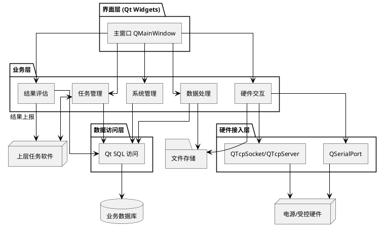

# 2. 总体设计方案

## 2.1 系统设计原则

| 序号 | 原则 | 说明 |
|---|---|---|
| 1 | 模块化与"高内聚、低耦合" | 五个一级模块独立划分，模块间通过接口与信号槽通信 |
| 2 | 可裁剪 | 按系统需求子条目拆分子模块，可独立交付与测试 |
| 3 | 健壮性 | 界面层 + 服务层双校验输入；关键路径捕获异常并入库 |
| 4 | 安全性 | 输入合法性检查；危险操作弹窗二次确认 |
| 5 | 标准化 | 设计、编码、测试、归档按 GJB 438C-2021 执行 |

## 2.2 系统总体技术架构

系统采用 C++17 + Qt 5.15 LTS（Widgets，Fusion 风格）的单机桌面架构，部署于银河麒麟 V10 上位机。逻辑分层如下：

1. 界面层：`QMainWindow` + 多 `QDockWidget` 承载五大模块的工作区
2. 业务层：每个一级模块对应一组 Manager/Service 类
3. 数据访问层：Qt SQL 模块（`QSqlDatabase`、`QSqlQuery`、`QAbstractTableModel`）
4. 硬件交互层：QSerialPort 与 QTcpSocket / QTcpServer
5. 存储层：数据库文件 + 业务文件目录

数据主流向：任务接收 → 指令分解 → 硬件控制 → 结果采集 → 数据处理 → 结果评估 → 结果上报。

### 组件图

### 部署图

## 2.3 设计约束符合性设计

### 2.3.1 架构专项设计

- 模块划分：五个一级业务模块在源码工程内对应独立目录与命名空间，通过抽象基类暴露接口，模块间使用 Qt 信号槽解耦。
- 可裁剪：每个子模块的功能粒度对应系统需求中的一条原子能力，便于按里程碑分阶段交付。
- 复用：通用能力（日志、配置、数据库访问、消息编解码）下沉到 common 库。

### 2.3.2 开发语言选型适配

- 语言：C++17。编译器为银河麒麟 V10 自带或软件源中的 GCC。
- 框架：Qt 5.15 LTS（LGPL），自带 Widgets、SQL、SerialPort、Network、Test 模块，可在麒麟 V10 上运行。
- 构建：qmake 或 CMake，二选一确定后在工程模板中固化。
- 配套：单元测试 QtTest；静态检查 cppcheck、clang-tidy；代码风格 Google C++ Style 加内部约束；文档化注释采用 Doxygen 格式。

### 2.3.3 部署环境适配设计

| 项 | 取值 | 说明 |
|---|---|---|
| 操作系统 | 银河麒麟 V10 | 强约束 |
| 桌面环境 | UKUI / X11 | Qt Widgets 原生兼容 |
| 数据库 | SQLite 3.x | 主选，嵌入式，零运维 |
| 数据库（备选） | 达梦 DM8 / 人大金仓 KingbaseES V8R6 | 信创场景 |
| 字符集 | UTF-8 | 数据库与文件一致 |
| 时区 | 本地时区 | 与上位机一致 |
| 中间件 | 无 | 单机部署，不依赖外部服务 |

## 2.4 核心技术选型与应用

| 技术项 | 选型 | 版本 | 用途 |
|---|---|---|---|
| 语言 | C++ | C++17 | 全栈实现 |
| GUI 框架 | Qt Widgets（Fusion 风格） | 5.15 LTS | 桌面 UI |
| 构建 | qmake / CMake | 随 Qt / 3.16+ | 工程构建 |
| 数据库 | SQLite / DM8 / KingbaseES | 3.x / DM8 / V8R6 | 业务数据持久化 |
| 数据访问 | Qt SQL 模块 | 随 Qt | `QSqlDatabase` / `QSqlQuery` / 模型 |
| 串口 | QSerialPort | 随 Qt | 与电源等硬件串口通信 |
| 网络 | QTcpSocket / QTcpServer | 随 Qt | 与上层任务软件、TCP 型硬件通信 |
| Excel 导出 | QXlsx | 1.4+ | 自动生成 Excel |
| 日志 | spdlog 或 Qt 日志框架 | 1.x / 随 Qt | 日志检索、清除、重置筛选 |
| 单元测试 | QtTest | 随 Qt | 模块与服务单元测试 |
| 静态检查 | cppcheck / clang-tidy | 当前稳定版 | 编码合规检查 |

## 2.5 执行标准与规范体系

| 类别 | 标准/规范 | 说明 |
|---|---|---|
| 设计 | GJB 438C-2021《军用软件开发文档通用要求》 | 全文档骨架来源 |
| 编码 | Google C++ Style + 内部补充 | 命名、文件组织、错误处理 |
| 注释 | 内部规范 | 源代码注释行 ≥ 总代码行 30%，自动统计 |
| 文档 | 甲方提供的文档模板 | 设计说明、用户手册按模板执行 |
| 配置管理 | 内部规范 | 基线管理、变更评审、版本号规则 |
