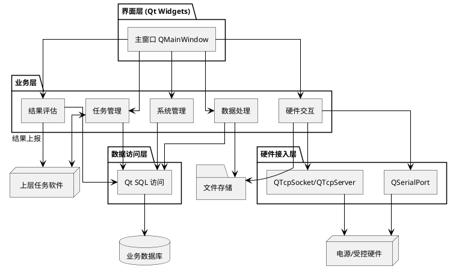
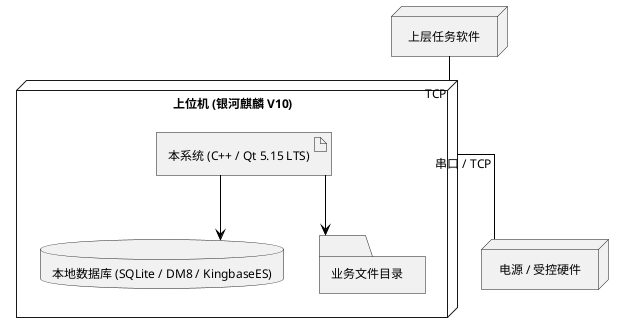

# 2. 总体设计方案

## 2.1 系统设计原则

本系统在设计阶段确立五项基本原则，作为后续详细设计、编码与测试的判定标准。原则之间互为支撑，分别覆盖软件工程、可靠运行、人机交互与标准合规四个维度。

**模块化与"高内聚、低耦合"原则**。系统按系统需求中的五个一级功能模块进行物理划分，每个模块在源码工程中对应独立的目录与命名空间。模块对外通过抽象基类与 Qt 信号槽暴露能力，对内封装实现细节。这一原则保证了任意元素的设计更改不会向其他模块传递不必要的影响，同时也使得后续可按需对模块进行替换、裁剪或增补。

**可裁剪原则**。每个一级模块进一步按系统需求中的原子能力拆分为若干子模块。子模块功能粒度严格对应需求条目，便于按工作日里程碑分阶段交付，便于测试人员按特性组织测试用例，也便于在维护期内进行定点修复。

**健壮性原则**。系统对外部输入（来自上层任务软件、操作员、硬件以及离线文件）一律先校验后处理。界面层使用 Qt 提供的 `QValidator` 系列控件限制输入；服务层在接收输入后再进行类型、范围、长度与枚举值的二次校验；接口层对报文进行帧头、长度与 CRC 校验。关键路径上的异常通过分层异常体系捕获，并写入系统日志表以便事后追溯。

**安全性原则**。系统需求对安全性提出两条要求：输入信息的合法性检查与误操作防护。本方案在健壮性原则之外，对清除日志、删除策略、清空配置、电源开机等危险操作设置二次确认机制，关键操作均记录操作员、时间、模块与内容。系统需求未提及用户、角色、权限子系统，本方案不引入相关设计。

**标准化原则**。设计、编码、测试、归档、维护全过程按 GJB 438C-2021 执行，文档按甲方提供的模板编制，技术状态按基线方式管理。

## 2.2 系统总体技术架构

系统采用 C++17 与 Qt 5.15 LTS（Widgets，Fusion 风格）构建的单机桌面架构，部署于银河麒麟 V10 上位机。该选型在 LGPL 协议下取得长期稳定版本，自带界面、SQL、串口、网络、测试等模块，能在麒麟 V10 上经过常规软件源安装并稳定运行，避免引入第三方界面框架与额外的运行时环境。

### 2.2.1 逻辑分层

系统采用经典的"界面—业务—数据/硬件—存储"四层逻辑结构。

界面层位于最上层，以 `QMainWindow` 为主窗口，在窗口内通过 `QDockWidget`、`QTabWidget` 与多窗口切换承载五大模块的工作区。界面层只负责数据展示与用户输入采集，不承担业务逻辑。

业务层是系统的核心。每个一级业务模块对应一组 Manager/Service 类，按职责进一步拆分。模块之间通过抽象基类与 Qt 信号槽进行通信，避免直接相互依赖。业务层向上为界面层提供调用接口，向下使用数据访问层与硬件交互层完成任务。

数据访问层封装对数据库的访问，使用 Qt SQL 模块中的 `QSqlDatabase`、`QSqlQuery` 与 `QAbstractTableModel`。该层屏蔽底层数据库差异，使业务层在 SQLite、达梦 DM8 与人大金仓 KingbaseES 之间切换时无需修改。

硬件交互层封装与电源等受控硬件的通信。串口通信使用 `QSerialPort`，网络通信使用 `QTcpSocket` 与 `QTcpServer`。该层向上以抽象基类 `IPowerController`、`HardwareResultCollector` 等暴露接口，向下根据具体硬件类型选择串口或网络实现。

存储层位于最底层，包括本地数据库文件以及业务文件目录。数据库文件存储任务、指令、交互日志、结果、评估、策略、配置、系统日志等结构化数据；业务文件目录存储硬件返回的原始数据、Excel 导出文件、配置导出文件等。

### 2.2.2 数据主流向

系统的数据主流向沿"任务—指令—硬件—结果"链条展开。上层任务软件通过 TCP 接口下发任务，任务管理模块接收任务并写入任务库，之后将任务分解为一组指令。指令通过硬件交互模块下发至电源等受控硬件，硬件执行后回传状态与结果。状态信息进入系统管理与结果评估模块用于显示与评判，结果数据进入数据处理模块进行自动或手动处理并入库。结果评估模块对接收效果进行评判，生成时序列表并按需调用算法展示结果，最终通过任务管理模块向上层任务软件上报任务结果与技术状态。系统管理模块在整个过程中提供策略、配置、状态监控与日志能力。

### 2.2.3 组件图

### 2.2.4 部署图

## 2.3 设计约束符合性设计

### 2.3.1 架构专项设计

架构层面着重解决"五大模块如何相对独立又能协同工作"的问题。本方案的解决思路是：以抽象基类与 Qt 信号槽为通信骨架，以 common 库下沉通用能力。

每个一级模块向外暴露的接口都以抽象基类形式存在。例如硬件交互模块对外提供 `IPowerController` 与 `HardwareResultCollector` 两类接口；任务管理模块对外提供 `TaskReceiver` 与 `ResultReporter` 两类接口。其他模块在编译期只依赖这些抽象基类，不依赖具体实现。模块之间的异步通信使用 Qt 的信号槽机制，例如硬件交互模块在采集到结果后发出 `resultReceived(Result)` 信号，结果评估模块作为槽函数接收并处理。

通用能力（日志、配置读取、数据库连接、消息编解码、CRC 校验、时间工具）下沉到 common 库，所有模块在依赖关系上单向指向 common，不存在反向依赖与循环依赖。

这一架构布局使得任意单一模块的变更被限制在自身目录与接口契约内，对其他模块的影响仅体现在抽象基类的方法签名上，便于评审与回归测试。

### 2.3.2 开发语言选型适配

系统选型 C++17 作为开发语言。C++ 在嵌入式与桌面工业软件领域具备长期稳定的工具链支持，与 Qt 框架原生匹配，并能在银河麒麟 V10 自带或软件源中安装的 GCC 编译器上完成构建。C++17 提供的 `std::optional`、`std::filesystem`、`if constexpr`、结构化绑定等特性可显著提升代码可读性。

界面与基础设施统一使用 Qt 5.15 LTS。Qt 5.15 是 Qt 5 系列的长期支持版本，模块齐全（Widgets、SQL、SerialPort、Network、Test、Concurrent、PrintSupport），在 LGPL v3 协议下可用于商业与军工领域。该版本在银河麒麟 V10 上已有成熟实践案例，可通过软件源安装或源码构建。

配套工具链方面，构建工具使用 qmake 或 CMake；单元测试使用 QtTest 框架；静态检查使用 cppcheck 与 clang-tidy；代码风格按 Google C++ Style 加内部补充约束；文档化注释采用 Doxygen 兼容格式，便于自动生成接口文档。

### 2.3.3 部署环境适配设计

部署环境严格遵循系统需求中的设计约束：操作系统为银河麒麟 V10。系统在该平台下完成全部开发、测试与验收。本方案对部署环境的适配从桌面环境、运行时、数据库、字符集、时区五个方面提出具体要求。

桌面环境上，银河麒麟 V10 默认提供 UKUI 与 X11 兼容层，Qt Widgets 原生支持 X11，无需额外适配。系统通过 Qt 的 `setStyle("Fusion")` 接口固定外观风格，使得不同主题下的界面表现一致。

运行时上，系统作为独立可执行程序运行，不依赖容器、虚拟机或外部服务。Qt 库通过软件源安装或随安装包一同分发。

数据库上，主选 SQLite 3.x，通过 Qt SQL 的 QSQLITE 驱动访问；备选达梦 DM8 与人大金仓 KingbaseES，使用厂家提供的 Qt 驱动或通用 ODBC 驱动接入。三种数据库在表结构与字段类型上保持兼容。

字符集统一为 UTF-8，覆盖源代码、数据库、配置文件、界面与日志。时区与操作系统一致，时间字段统一存储为本地时间或 UTC（在表设计阶段确定）。

## 2.4 核心技术选型与应用

本节给出本系统使用的全部关键技术与选型理由。技术栈以 C++17 与 Qt 为核心，避免引入与 Qt 体系不兼容的第三方组件。

**编程语言 C++17**。承载全部业务实现、界面、数据访问与硬件通信。使用编译器为银河麒麟 V10 上的 GCC（版本不低于 7.5，支持 C++17）。

**界面框架 Qt Widgets 5.15 LTS（Fusion 风格）**。Widgets 较 QML 更适合工业桌面应用，控件库齐全、性能稳定。Fusion 风格在 Linux 平台具备一致的视觉表现，便于在不同主题间统一界面外观。

**构建工具 qmake 或 CMake**。两者均能在银河麒麟 V10 上稳定运行。qmake 是 Qt 默认构建工具，配置简单；CMake 提供更强的跨平台与依赖管理能力。在工程模板中固定其一作为基准，避免混用。

**数据库 SQLite 3.x（主选）**。SQLite 嵌入式部署、零运维、单文件存储，与 Qt SQL 通过 QSQLITE 驱动原生集成，满足本系统单机部署的场景。备选达梦 DM8 与人大金仓 KingbaseES V8R6，用于信创合规要求更严格的场景。

**数据访问 Qt SQL 模块**。使用 `QSqlDatabase` 管理连接，`QSqlQuery` 执行 SQL，`QAbstractTableModel`/`QSqlTableModel` 与 `QTableView` 联动展示数据。不引入额外的 ORM 框架，降低运行时复杂度。

**串口通信 QSerialPort**。用于与电源等支持串口接入的硬件通信。该模块封装了串口枚举、波特率配置、读写与状态查询，跨 Linux 与 Windows 接口一致。

**网络通信 QTcpSocket 与 QTcpServer**。用于与上层任务软件以及支持 TCP 接入的硬件通信。基于事件驱动的异步模型，便于与 Qt 信号槽集成。

**Excel 导出 QXlsx**。开源 Qt 库，支持 xlsx 文件的读写。用于数据处理模块的"自动生成 Excel 表"功能。

**日志 spdlog 或 Qt 日志框架**。spdlog 提供高性能异步日志，并支持按等级、按模块过滤；Qt 自带的 `QLoggingCategory` 也可作为备选，使用更轻量。两者均可与本系统的日志检索、清除、重置筛选三类操作配合。

**单元测试 QtTest**。Qt 官方测试框架，与构建工具集成度高。每个模块附带 `test_xxx.cpp` 测试源码，按 GTest 风格组织断言。

**静态检查 cppcheck 与 clang-tidy**。在持续集成流水线中作为代码合入前的检查门禁，覆盖空指针、未初始化变量、未使用变量、可疑类型转换等典型问题。

**代码风格 Google C++ Style 加内部补充约束**。统一命名、文件组织、注释、错误处理与异常使用习惯。内部补充约束包括：注释使用中文；文件编码 UTF-8；行宽 100；不允许 `using namespace` 全局展开。

下表汇总本系统使用的核心技术及其用途，作为后续详细设计与编码的依据。

| 技术项 | 选型 | 版本 | 用途 |
|---|---|---|---|
| 编程语言 | C++ | C++17 | 全栈实现 |
| 界面框架 | Qt Widgets（Fusion 风格） | 5.15 LTS | 桌面 UI |
| 构建 | qmake / CMake | 随 Qt / 3.16+ | 工程构建 |
| 数据库 | SQLite / DM8 / KingbaseES | 3.x / DM8 / V8R6 | 业务数据持久化 |
| 数据访问 | Qt SQL 模块 | 随 Qt | QSqlDatabase / QSqlQuery |
| 串口 | QSerialPort | 随 Qt | 串口通信 |
| 网络 | QTcpSocket / QTcpServer | 随 Qt | TCP 通信 |
| Excel 导出 | QXlsx | 1.4+ | 自动生成 Excel |
| 日志 | spdlog 或 Qt 日志框架 | 1.x / 随 Qt | 日志检索 / 清除 / 重置筛选 |
| 单元测试 | QtTest | 随 Qt | 单元测试 |
| 静态检查 | cppcheck / clang-tidy | 当前稳定版 | 编码合规检查 |

## 2.5 执行标准与规范体系

本系统的研制过程遵循一套完整的标准与规范体系，以保障设计、编码、测试、归档、维护各环节的一致性与可追溯性。

主标准为 GJB 438C-2021《军用软件开发文档通用要求》。本方案的章节组织、文档要素、版本与基线、变更控制均按该标准执行。在文档编制阶段，按甲方提供的模板形成软件设计说明、软件用户手册与测试相关材料。

编码规范以 Google C++ Style 为基础，再叠加内部补充约束。Google C++ Style 提供命名、文件组织、内存管理、并发模型、异常使用方面的清晰约定；内部补充约束包括中文注释、UTF-8 编码、固定行宽、禁止全局 `using namespace`、禁止裸 `new`/`delete` 等条目。

文档规范按甲方提供的模板执行，覆盖封面、目录、版本记录、章节体例、图表编号、字体字号等要素。文档源文件以 Markdown 维护，按需导出为 Word 或 PDF 提交。

注释规范要求源代码注释行不少于总代码行的 30%。注释分为两类：模块、类、函数级的 Doxygen 文档化注释，描述用途、参数、返回值、异常；行内注释用于说明非显而易见的实现意图。持续集成流水线在合入前自动统计注释率，未达 30% 不允许合入。

配置管理规范以基线方式管理技术状态。功能基线、分配基线与产品基线分别在三个关键评审节点冻结，基线之间的变更需走变更评审流程。版本号规则为"主版本.次版本.修订号-补丁号"，主版本对应基线，修订号对应缺陷修复。源代码使用 Git 仓库维护，提交信息按规范填写。

| 类别 | 标准 / 规范 | 说明 |
|---|---|---|
| 设计 | GJB 438C-2021 | 全文档骨架来源 |
| 编码 | Google C++ Style + 内部补充 | 命名、文件组织、错误处理 |
| 注释 | 内部规范 | 注释行 ≥ 总代码行 30%，自动统计 |
| 文档 | 甲方模板 | 设计说明、用户手册 |
| 配置管理 | 内部规范 | 基线管理、变更评审、版本号规则 |
| 测试 | 内部规范 + 甲方要求 | 用例、覆盖率、出口准则 |
