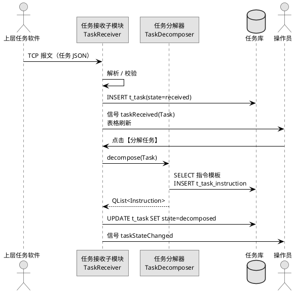
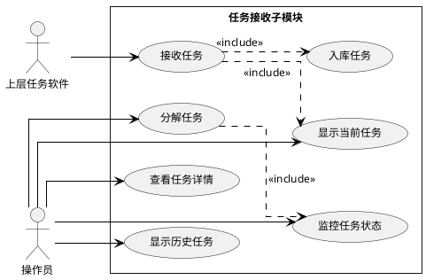
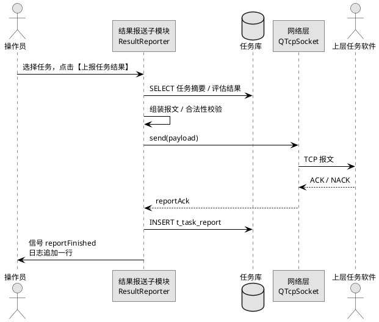
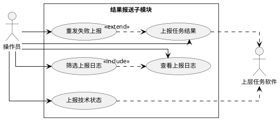

# 3. 功能模块详细设计

本章按系统需求中给出的五类功能逐一展开，仅拆分需求原文中已明确的能力，不引入额外功能。每个一级模块固定包含若干子模块，每个子模块按"功能模块描述 / 操作步骤 / 类与算法设计 / 用例描述 / 界面设计"五小节组织。

## 3.1 任务管理模块

本节对应《系统需求.md》「任务管理」原文中的两条能力：

- 任务接收：能够接收其他软件任务；能够显示当前和历史任务并入库；能够分解任务为多种指令；能够对任务状态进行监控和显示。
- 结果报送：能够将任务结果上报至其他软件；能够将技术状态上报至其他软件。

据此拆分为两个子模块：**3.1.1 任务接收子模块**、**3.1.2 结果报送子模块**。两个子模块在源码工程内对应同一命名空间 `task`，共用任务管理相关数据表 `t_task` / `t_task_instruction` / `t_task_report` / `t_tech_state_report`。

### 3.1.1 任务接收子模块

#### (1) 功能模块描述

本子模块负责接收上层任务软件下发的任务报文，落库后在界面上以"当前任务/历史任务"两份视图展示；按任务类型将任务分解为一组可执行指令交给硬件交互模块；对任务及其下属指令的状态进行监控并在界面同步显示。

| 项 | 来源 / 去向 | 字段 / 内容 | 触发方式 |
|---|---|---|---|
| 输入 | 上层任务软件 | `taskNo` / `sourceSystem` / `content`（任务原文，JSON）/ `taskType` | TCP 长连接，被动接收 |
| 输入 | 操作员 | 表单：任务编号、来源、内容；操作：刷新、查看、分解、删除 | 工具栏、菜单或快捷键 |
| 输出 | 任务库（`t_task` / `t_task_instruction`） | 任务主记录、指令明细 | 任务落库、分解、状态变更时写入 |
| 输出 | 硬件交互模块 | `QList<Instruction>` | 信号 `instructionsReady(taskId, list)` |
| 输出 | 界面 | 任务表格、状态徽标 | 信号 `taskStateChanged(taskId, state)` |
| 依赖 | 数据访问层 | `QSqlDatabase` / `QSqlQuery` | 启动期建立连接 |
| 依赖 | 网络层 | `QTcpServer` / `QTcpSocket` | 监听上层任务软件 |
| 依赖 | 指令模板表 | `t_strategy`（任务类型 → 指令模板） | 任务分解时查表 |

任务状态机：`received → decomposed → running → done | failed`，每次跃迁均写入 `t_task.state` 并通过信号推送至界面。

#### (2) 操作步骤

操作员通过主窗口左侧导航的【任务管理】节点进入本子模块，工作区默认显示"当前任务"选项卡。常用操作如下：

1. 在主窗口顶部菜单选择 `文件(F) → 新建任务(N)`，或按快捷键 `Ctrl+N`，弹出【新建任务】对话框。表单字段：
   - 任务编号（`QLineEdit`，必填，示例 `T20260825-001`）
   - 来源系统（`QComboBox`，必填，下拉项来自 `t_strategy` 中登记的上层系统）
   - 任务类型（`QComboBox`，必填，取值如 `数据采集` / `比对` / `自检引导`）
   - 接收时间（`QDateTimeEdit`，必填，默认当前时间）
   - 任务内容（`QTextEdit`，必填，JSON 文本）
2. 点击对话框右下角【确定】按钮（蓝色 `.qt-btn-primary`），系统进行字段类型与 JSON 合法性校验，校验通过后将记录写入 `t_task`，状态置为 `received`，状态栏左侧提示"任务已入库"，表格自动刷新。校验失败时状态栏改用警告色提示并保留对话框。
3. 在工具栏点击【刷新】按钮，或按 `F5`，重新拉取 `t_task` 中状态为 `received / decomposed / running` 的记录并填充"当前任务"表。
4. 切换至"历史任务"选项卡，工具栏【刷新】会改为按"接收时间倒序、前 200 条"加载 `state ∈ {done, failed}` 的记录。需要更多记录时按 `Ctrl+F` 唤起【查找】对话框，按编号、来源、时间区间筛选。
5. 在表格中选中一行，工具栏【查看详情】按钮可用。点击后右侧【任务详情】分组框 (`.qt-group`) 显示任务原文与已生成指令列表。
6. 在已选中的任务行（状态为 `received`）上点击工具栏【分解任务】按钮，弹出确认对话框；点击【确定】后调用 `TaskDecomposer::decompose()`，生成的指令写入 `t_task_instruction`，任务状态跃迁为 `decomposed`，详情分组刷新指令列表。
7. 任务状态在运行期由 `TaskStateMonitor` 推送信号自动更新表格中"状态"列与状态徽标颜色，操作员无需手动刷新。
8. 在表格的"操作"列点击【查看】跳转到详情分组；点击【重发】将指令重新派发至硬件交互模块（仅在 `failed` 状态下可用）。
9. 在已选中的任务行上点击工具栏【删除】按钮（红色 `.qt-btn-danger`），弹出 `QDialog` 二次确认。仅允许删除状态为 `received` 或 `failed` 的任务；级联清理 `t_task_instruction` 中的明细。
10. 状态栏右侧 `.qt-led` 指示与上层任务软件的连接状态：在线绿色、离线灰色、异常黄色；离线超过 30 秒时弹出非阻塞提示。

操作步骤涉及的菜单 / 按钮 / 表单字段 / 表格列均与本子模块界面 HTML 一一对应（见第 (5) 节）。

**任务接收时序图：**



#### (3) 类与算法设计（C++17 + Qt）

任务接收子模块包含四个核心类，对外仅暴露信号槽与少量必要的查询方法。

```cpp
// task/TaskReceiver.h
#pragma once
#include <QObject>
#include <QTcpServer>
#include <QTcpSocket>
#include "TaskTypes.h"

class TaskReceiver : public QObject {
    Q_OBJECT
public:
    explicit TaskReceiver(QObject* parent = nullptr);
    bool listen(quint16 port);

signals:
    void taskReceived(const Task& task);
    void linkStateChanged(LinkState state);

public slots:
    void onUpperMessage(const QByteArray& payload);

private:
    bool parseAndValidate(const QByteArray& bytes, Task* out, QString* err) const;
    bool persist(const Task& task);
    QTcpServer server_;
};
```

```cpp
// task/TaskDecomposer.h
#pragma once
#include <QObject>
#include "TaskTypes.h"

class TaskDecomposer : public QObject {
    Q_OBJECT
public:
    explicit TaskDecomposer(QObject* parent = nullptr);

public slots:
    QList<Instruction> decompose(const Task& task);

signals:
    void instructionsReady(int taskId, const QList<Instruction>& list);

private:
    QList<InstructionTemplate> loadTemplates(const QString& taskType) const;
};
```

```cpp
// task/TaskStateMonitor.h
#pragma once
#include <QObject>
#include <QTimer>
#include "TaskTypes.h"

class TaskStateMonitor : public QObject {
    Q_OBJECT
public:
    explicit TaskStateMonitor(QObject* parent = nullptr);
    void start(int intervalMs = 1000);

signals:
    void taskStateChanged(int taskId, TaskState state);

public slots:
    void onInstructionFinished(int taskId, int instId, bool ok);

private:
    void scanRunningTasks();
    QTimer timer_;
};
```

**核心算法：任务分解算法**（基于任务类型 + 指令模板表，生成指令序列；C++17）：

```cpp
QList<Instruction> TaskDecomposer::decompose(const Task& task) {
    QList<Instruction> out;
    const auto templates = loadTemplates(task.type);
    if (templates.isEmpty()) {
        emit instructionsReady(task.id, out);
        return out;
    }
    QVariantMap ctx = task.params;
    int seq = 1;
    for (const auto& tpl : templates) {
        if (!tpl.condition.isEmpty() && !evalCond(tpl.condition, ctx)) continue;
        Instruction inst;
        inst.taskId = task.id;
        inst.seq    = seq++;
        inst.code   = tpl.code;
        inst.param  = render(tpl.paramTemplate, ctx);
        inst.state  = QStringLiteral("pending");
        out.append(inst);
    }
    persistInstructions(out);
    emit instructionsReady(task.id, out);
    return out;
}
```

说明：`loadTemplates` 从 `t_strategy` 读取指令模板（按 `taskType` 过滤、按 `seq` 排序）；`evalCond` 仅支持等值/区间表达式；`render` 用任务参数替换模板占位符 `${key}`。该算法本体 24 行，符合 ≤30 行约束。

#### (4) 用例描述



#### (5) 界面设计

中央工作区由"当前任务 / 历史任务"两个选项卡加右侧"任务详情"分组组成。工具栏按钮为本子模块的高频操作：【新建任务】【刷新】【查看详情】【分解任务】【删除】。

```html
<!doctype html>
<html lang="zh-CN">
<head>
<meta charset="utf-8" />
<title>任务接收子模块 - 界面原型</title>
<style>
:root{--qt-bg:#f0f0f0;--qt-panel:#fafafa;--qt-border:#b8b8b8;--qt-border-dark:#707070;--qt-text:#202020;--qt-text-muted:#606060;--qt-primary:#2a82da;--qt-primary-hover:#3a92ea;--qt-danger:#c62828;--qt-warning:#f9a825;--qt-success:#2e7d32;--qt-row-alt:#e8e8e8;}
body{font-family:"Microsoft YaHei","Noto Sans CJK SC",sans-serif;font-size:12px;color:var(--qt-text);background:var(--qt-bg);margin:0;}
.qt-window{border:1px solid var(--qt-border-dark);background:var(--qt-bg);}
.qt-menubar{background:#e6e6e6;border-bottom:1px solid var(--qt-border);padding:2px 6px;}
.qt-menubar span{padding:2px 10px;cursor:default;}
.qt-menubar span:hover{background:var(--qt-primary);color:#fff;}
.qt-toolbar{background:#ededed;border-bottom:1px solid var(--qt-border);padding:4px 6px;display:flex;gap:6px;align-items:center;}
.qt-toolbtn{padding:4px 10px;border:1px solid var(--qt-border);background:var(--qt-panel);cursor:pointer;}
.qt-toolbtn:hover{border-color:var(--qt-border-dark);background:#fff;}
.qt-statusbar{background:#e6e6e6;border-top:1px solid var(--qt-border);padding:3px 8px;color:var(--qt-text-muted);font-size:11px;display:flex;justify-content:space-between;}
.qt-main{display:flex;min-height:420px;}
.qt-side{width:200px;background:var(--qt-panel);border-right:1px solid var(--qt-border);padding:6px;}
.qt-content{flex:1;padding:8px;display:flex;flex-direction:column;gap:8px;}
.qt-group{border:1px solid var(--qt-border);background:var(--qt-panel);padding:8px 10px 10px;position:relative;border-radius:2px;}
.qt-group-title{position:absolute;top:-9px;left:10px;background:var(--qt-panel);padding:0 6px;color:var(--qt-text-muted);font-size:11px;}
.qt-row{display:flex;gap:8px;align-items:center;margin:4px 0;flex-wrap:wrap;}
.qt-label{min-width:90px;color:var(--qt-text);}
.qt-input,.qt-combo,.qt-spin{height:22px;padding:0 6px;border:1px solid var(--qt-border);background:#fff;font-size:12px;}
.qt-btn,.qt-btn-primary,.qt-btn-danger{height:24px;padding:0 12px;border:1px solid var(--qt-border);background:linear-gradient(#fafafa,#e6e6e6);cursor:pointer;font-size:12px;}
.qt-btn-primary{background:linear-gradient(var(--qt-primary-hover),var(--qt-primary));color:#fff;border-color:#1d6fbf;}
.qt-btn-danger{background:linear-gradient(#e04848,var(--qt-danger));color:#fff;border-color:#9b1f1f;}
.qt-table{width:100%;border-collapse:collapse;background:#fff;font-size:12px;}
.qt-table th{background:#e6e6e6;border:1px solid var(--qt-border);padding:4px 6px;text-align:left;font-weight:normal;}
.qt-table td{border:1px solid var(--qt-border);padding:4px 6px;}
.qt-table tbody tr:nth-child(even){background:var(--qt-row-alt);}
.qt-tabs{display:flex;gap:0;border-bottom:1px solid var(--qt-border);}
.qt-tab{padding:4px 12px;border:1px solid var(--qt-border);border-bottom:none;background:#e6e6e6;cursor:pointer;}
.qt-tab.active{background:var(--qt-panel);font-weight:bold;}
.qt-textarea{width:100%;min-height:60px;border:1px solid var(--qt-border);background:#fff;font-family:Consolas,"Courier New",monospace;font-size:11px;padding:4px 6px;box-sizing:border-box;}
.qt-led{display:inline-block;width:10px;height:10px;border-radius:50%;border:1px solid #888;vertical-align:middle;}
.qt-led-on{background:var(--qt-success);}
.qt-led-off{background:#aaa;}
.qt-led-warn{background:var(--qt-warning);}
.qt-split{display:flex;gap:8px;}
.qt-split > .qt-left{flex:2;display:flex;flex-direction:column;gap:6px;}
.qt-split > .qt-right{flex:1;display:flex;flex-direction:column;gap:6px;}
.qt-badge{display:inline-block;padding:1px 6px;border-radius:2px;font-size:11px;color:#fff;}
.qt-badge.recv{background:#6c757d;}
.qt-badge.dec{background:var(--qt-primary);}
.qt-badge.run{background:var(--qt-warning);color:#000;}
.qt-badge.done{background:var(--qt-success);}
.qt-badge.fail{background:var(--qt-danger);}
</style>
</head>
<body>
<div class="qt-window">
  <div class="qt-menubar">
    <span>文件(F)</span><span>编辑(E)</span><span>视图(V)</span><span>工具(T)</span><span>帮助(H)</span>
  </div>
  <div class="qt-toolbar">
    <button class="qt-toolbtn">新建任务</button>
    <button class="qt-toolbtn">刷新</button>
    <button class="qt-toolbtn">查看详情</button>
    <button class="qt-toolbtn">分解任务</button>
    <button class="qt-toolbtn">删除</button>
  </div>
  <div class="qt-main">
    <div class="qt-side">
      <div style="font-weight:bold;margin-bottom:4px;">任务管理</div>
      <div style="padding:2px 4px;background:#dceeff;">▸ 当前任务</div>
      <div style="padding:2px 4px;">▸ 历史任务</div>
      <div style="padding:2px 4px;">▸ 结果上报</div>
    </div>
    <div class="qt-content">
      <div class="qt-tabs">
        <div class="qt-tab active">当前任务</div>
        <div class="qt-tab">历史任务</div>
      </div>
      <div class="qt-split">
        <div class="qt-left">
          <table class="qt-table">
            <colgroup>
              <col style="width:140px"><col style="width:100px"><col><col style="width:80px"><col style="width:140px"><col style="width:100px">
            </colgroup>
            <thead><tr><th>任务编号</th><th>来源</th><th>内容摘要</th><th>状态</th><th>接收时间</th><th>操作</th></tr></thead>
            <tbody>
              <tr><td>T20260825-001</td><td>上层任务软件</td><td>数据采集 ch1-ch4</td><td><span class="qt-badge dec">分解</span></td><td>2026-08-25 09:10:22</td><td><button class="qt-btn">查看</button></td></tr>
              <tr><td>T20260825-002</td><td>上层任务软件</td><td>比对 任务包 v2</td><td><span class="qt-badge run">运行</span></td><td>2026-08-25 09:11:05</td><td><button class="qt-btn">查看</button></td></tr>
              <tr><td>T20260825-003</td><td>上层任务软件</td><td>自检引导 项目 A</td><td><span class="qt-badge recv">接收</span></td><td>2026-08-25 09:12:48</td><td><button class="qt-btn">查看</button></td></tr>
              <tr><td>T20260825-004</td><td>上层任务软件</td><td>数据采集 ch5</td><td><span class="qt-badge fail">失败</span></td><td>2026-08-25 09:13:30</td><td><button class="qt-btn">重发</button></td></tr>
            </tbody>
          </table>
        </div>
        <div class="qt-right">
          <div class="qt-group">
            <div class="qt-group-title">任务详情</div>
            <div class="qt-row"><span class="qt-label">任务编号</span><input class="qt-input" style="width:200px" value="T20260825-001" readonly></div>
            <div class="qt-row"><span class="qt-label">来源</span><input class="qt-input" style="width:200px" value="上层任务软件" readonly></div>
            <div class="qt-row"><span class="qt-label">任务原文</span></div>
            <textarea class="qt-textarea" readonly>{ "type":"数据采集","channels":[1,2,3,4],"duration":60 }</textarea>
            <div class="qt-row"><span class="qt-label">指令列表</span></div>
            <table class="qt-table">
              <thead><tr><th>序号</th><th>指令码</th><th>参数</th><th>状态</th></tr></thead>
              <tbody>
                <tr><td>1</td><td>PWR_ON</td><td>{}</td><td><span class="qt-badge done">完成</span></td></tr>
                <tr><td>2</td><td>CFG_CH</td><td>{"ch":[1,2,3,4]}</td><td><span class="qt-badge done">完成</span></td></tr>
                <tr><td>3</td><td>ACQ_START</td><td>{"dur":60}</td><td><span class="qt-badge run">运行</span></td></tr>
              </tbody>
            </table>
          </div>
        </div>
      </div>
    </div>
  </div>
  <div class="qt-statusbar">
    <span>就绪</span>
    <span>上层任务软件: <span class="qt-led qt-led-on"></span> 在线</span>
    <span>2026-08-25 09:14:00</span>
  </div>
</div>
</body>
</html>
```

界面对应操作步骤中提及的所有控件：菜单 `文件(F)`、工具栏【新建任务】【刷新】【查看详情】【分解任务】【删除】、表格列（任务编号、来源、内容摘要、状态、接收时间、操作）、右侧"任务详情"分组与指令列表、状态栏右侧的连接状态指示灯。

### 3.1.2 结果报送子模块

#### (1) 功能模块描述

本子模块负责将任务执行结果与软件技术状态上报至上层任务软件。结果上报取自 `t_hw_result` 与 `t_eval_reception` 的汇总，按上层接口约定打包后发送；技术状态上报取本机软件版本、关键配置项快照。所有上报记录写入 `t_task_report` / `t_tech_state_report`，失败可重发。

| 项 | 来源 / 去向 | 字段 / 内容 | 触发方式 |
|---|---|---|---|
| 输入 | 任务库 / 结果库 | `taskId` / `reportContent` | 操作员选择任务后组装 |
| 输入 | 配置层 | `version` / `configSnapshot` | 读取应用配置 |
| 输出 | 上层任务软件 | 任务结果报文 / 技术状态报文 | TCP 主动发送 |
| 输出 | `t_task_report` / `t_tech_state_report` | 上报内容、时间、状态 | 每次上报后写入 |
| 输出 | 界面 | 上报日志、上报状态徽标 | 信号 `reportFinished` |
| 依赖 | 任务接收子模块 | 任务编号、任务状态 | 跨模块调用查询接口 |
| 依赖 | 网络层 | `QTcpSocket` | 共享同一连接 |

上报状态：`success`（确认回执）/ `failed`（超时、协议错误或对端拒绝）。失败记录在日志区高亮，允许从上报日志中选中后【重发】。

#### (2) 操作步骤

操作员在左侧导航点击【结果上报】节点进入本子模块，工作区分为"结果上报""技术状态上报""上报日志"三部分。常用操作如下：

1. 在主窗口菜单选择 `工具(T) → 结果上报(R)`，或在左侧导航点击【结果上报】节点，进入本子模块工作区。
2. 在【结果上报】分组中：
   - 任务选择（`QComboBox`，必填，候选项为状态 `done / failed` 的任务编号）
   - 上报对象（`QComboBox`，必填，默认"上层任务软件"，配置中可扩展）
   - 上报内容（`QTextEdit`，必填，自动填充任务结果摘要，可在上报前手动调整）
   - 备注（`QLineEdit`，选填，长度 ≤ 128）
3. 点击【上报任务结果】按钮（`.qt-btn-primary`），系统对内容长度与 JSON 合法性进行校验，校验通过后通过 TCP 发送报文并等待回执，回执到达前按钮置灰，状态栏左侧提示"上报中…"。
4. 上报完成后，结果写入 `t_task_report`，下方【上报日志】区追加一行；成功为绿色，失败为红色，并在日志末尾给出错误码与简短原因。
5. 在【技术状态上报】分组中查看本机版本（`QLineEdit`，只读，取自应用配置）与配置快照预览（`QTextEdit`，只读）。如需调整，按 `Ctrl+E` 唤起【编辑配置项】对话框，从而修改之后再上报。
6. 点击【上报技术状态】按钮（`.qt-btn-primary`），系统组装包含版本、配置快照、本机时间的报文上报，记录写入 `t_tech_state_report`。
7. 在【上报日志】区点击工具栏【查看上报日志】按钮，唤起完整日志窗格；可按时间、上报对象、状态进行筛选（呼应日志检索能力）。
8. 在【上报日志】列表中选中一条状态为 `failed` 的记录，工具栏【重发】按钮可用；点击后按原报文重新发送，新记录追加到 `t_task_report` 或 `t_tech_state_report`。
9. 危险操作【清除日志】使用 `.qt-btn-danger`，点击后弹出 `QDialog` 二次确认，清理范围限定为本子模块日志，不影响系统日志表。
10. 状态栏右侧 `.qt-led` 标识与上层任务软件的连接状态，连接断开时所有上报按钮置灰并在状态栏显示"链路离线，请检查网络"。

**结果上报时序图：**



#### (3) 类与算法设计（C++17 + Qt）

```cpp
// task/ResultReporter.h
#pragma once
#include <QObject>
#include "TaskTypes.h"

class ResultReporter : public QObject {
    Q_OBJECT
public:
    explicit ResultReporter(QObject* parent = nullptr);

public slots:
    void reportResult(const TaskResult& result);
    void reportTechState(const TechState& state);
    void resend(qint64 reportId);

signals:
    void reportFinished(qint64 reportId, bool ok, const QString& msg);
    void linkStateChanged(LinkState state);

private:
    bool validate(const TaskResult& r, QString* err) const;
    QByteArray pack(const TaskResult& r) const;
    QByteArray pack(const TechState& s) const;
    void persistAndEmit(qint64 id, bool ok, const QString& msg);
};
```

```cpp
// task/ReportLogModel.h
#pragma once
#include <QAbstractTableModel>
#include "TaskTypes.h"

class ReportLogModel : public QAbstractTableModel {
    Q_OBJECT
public:
    enum Column { Time, Target, Type, State, Detail };
    int rowCount(const QModelIndex&) const override;
    int columnCount(const QModelIndex&) const override;
    QVariant data(const QModelIndex& idx, int role) const override;

public slots:
    void onReportFinished(qint64 reportId, bool ok, const QString& msg);
    void filter(const ReportFilter& f);
};
```

核心逻辑（结果组装与上报，本子模块控制流；19 行 C++）：

```cpp
void ResultReporter::reportResult(const TaskResult& result) {
    QString err;
    if (!validate(result, &err)) {
        emit reportFinished(-1, false, err);
        return;
    }
    const QByteArray payload = pack(result);
    const qint64 id = beginPersist(result, payload);
    auto onAck = [this, id](bool ok, const QString& m) {
        commitPersist(id, ok, m);
        emit reportFinished(id, ok, m);
    };
    if (!net_->isOnline()) {
        onAck(false, QStringLiteral("link offline"));
        return;
    }
    net_->sendWithAck(payload, onAck, /*timeoutMs=*/3000);
}
```

说明：`beginPersist` 先以 `state=sending` 写入 `t_task_report`，`commitPersist` 在回执到达或超时后更新 `state` 与详情，呼应"接收 → 落库 → 等待回执 → 状态回写"的四步流程。

#### (4) 用例描述



#### (5) 界面设计

中央工作区由"结果上报""技术状态上报""上报日志"三段竖向组合而成。工具栏按钮为【上报任务结果】【上报技术状态】【查看上报日志】【重发】【清除日志】。

```html
<!doctype html>
<html lang="zh-CN">
<head>
<meta charset="utf-8" />
<title>结果报送子模块 - 界面原型</title>
<style>
:root{--qt-bg:#f0f0f0;--qt-panel:#fafafa;--qt-border:#b8b8b8;--qt-border-dark:#707070;--qt-text:#202020;--qt-text-muted:#606060;--qt-primary:#2a82da;--qt-primary-hover:#3a92ea;--qt-danger:#c62828;--qt-warning:#f9a825;--qt-success:#2e7d32;--qt-row-alt:#e8e8e8;}
body{font-family:"Microsoft YaHei","Noto Sans CJK SC",sans-serif;font-size:12px;color:var(--qt-text);background:var(--qt-bg);margin:0;}
.qt-window{border:1px solid var(--qt-border-dark);background:var(--qt-bg);}
.qt-menubar{background:#e6e6e6;border-bottom:1px solid var(--qt-border);padding:2px 6px;}
.qt-menubar span{padding:2px 10px;cursor:default;}
.qt-menubar span:hover{background:var(--qt-primary);color:#fff;}
.qt-toolbar{background:#ededed;border-bottom:1px solid var(--qt-border);padding:4px 6px;display:flex;gap:6px;align-items:center;}
.qt-toolbtn{padding:4px 10px;border:1px solid var(--qt-border);background:var(--qt-panel);cursor:pointer;}
.qt-toolbtn:hover{border-color:var(--qt-border-dark);background:#fff;}
.qt-statusbar{background:#e6e6e6;border-top:1px solid var(--qt-border);padding:3px 8px;color:var(--qt-text-muted);font-size:11px;display:flex;justify-content:space-between;}
.qt-main{display:flex;min-height:420px;}
.qt-side{width:200px;background:var(--qt-panel);border-right:1px solid var(--qt-border);padding:6px;}
.qt-content{flex:1;padding:8px;display:flex;flex-direction:column;gap:8px;}
.qt-group{border:1px solid var(--qt-border);background:var(--qt-panel);padding:10px 10px 10px;position:relative;border-radius:2px;}
.qt-group-title{position:absolute;top:-9px;left:10px;background:var(--qt-panel);padding:0 6px;color:var(--qt-text-muted);font-size:11px;}
.qt-row{display:flex;gap:8px;align-items:center;margin:4px 0;flex-wrap:wrap;}
.qt-label{min-width:90px;color:var(--qt-text);}
.qt-input,.qt-combo,.qt-spin{height:22px;padding:0 6px;border:1px solid var(--qt-border);background:#fff;font-size:12px;}
.qt-btn,.qt-btn-primary,.qt-btn-danger{height:24px;padding:0 12px;border:1px solid var(--qt-border);background:linear-gradient(#fafafa,#e6e6e6);cursor:pointer;font-size:12px;}
.qt-btn-primary{background:linear-gradient(var(--qt-primary-hover),var(--qt-primary));color:#fff;border-color:#1d6fbf;}
.qt-btn-danger{background:linear-gradient(#e04848,var(--qt-danger));color:#fff;border-color:#9b1f1f;}
.qt-textarea{width:100%;min-height:60px;border:1px solid var(--qt-border);background:#fff;font-family:Consolas,"Courier New",monospace;font-size:11px;padding:4px 6px;box-sizing:border-box;}
.qt-log{height:140px;border:1px solid var(--qt-border);background:#fff;font-family:Consolas,"Courier New",monospace;font-size:11px;padding:4px 6px;overflow:auto;}
.qt-log .ok{color:var(--qt-success);}
.qt-log .err{color:var(--qt-danger);}
.qt-led{display:inline-block;width:10px;height:10px;border-radius:50%;border:1px solid #888;vertical-align:middle;}
.qt-led-on{background:var(--qt-success);}
.qt-led-off{background:#aaa;}
.qt-led-warn{background:var(--qt-warning);}
</style>
</head>
<body>
<div class="qt-window">
  <div class="qt-menubar">
    <span>文件(F)</span><span>编辑(E)</span><span>视图(V)</span><span>工具(T)</span><span>帮助(H)</span>
  </div>
  <div class="qt-toolbar">
    <button class="qt-toolbtn">上报任务结果</button>
    <button class="qt-toolbtn">上报技术状态</button>
    <button class="qt-toolbtn">查看上报日志</button>
    <button class="qt-toolbtn">重发</button>
    <button class="qt-toolbtn">清除日志</button>
  </div>
  <div class="qt-main">
    <div class="qt-side">
      <div style="font-weight:bold;margin-bottom:4px;">任务管理</div>
      <div style="padding:2px 4px;">▸ 当前任务</div>
      <div style="padding:2px 4px;">▸ 历史任务</div>
      <div style="padding:2px 4px;background:#dceeff;">▸ 结果上报</div>
    </div>
    <div class="qt-content">
      <div class="qt-group">
        <div class="qt-group-title">结果上报</div>
        <div class="qt-row">
          <span class="qt-label">任务选择</span>
          <select class="qt-combo" style="width:200px"><option>T20260825-001（done）</option><option>T20260825-002（done）</option><option>T20260825-004（failed）</option></select>
          <span class="qt-label" style="margin-left:16px">上报对象</span>
          <select class="qt-combo" style="width:200px"><option>上层任务软件</option></select>
        </div>
        <div class="qt-row"><span class="qt-label">上报内容</span></div>
        <textarea class="qt-textarea">{ "taskNo":"T20260825-001","grade":"A","integrity":0.998,"errorRate":1e-6 }</textarea>
        <div class="qt-row"><span class="qt-label">备注</span><input class="qt-input" style="width:320px"></div>
        <div class="qt-row" style="justify-content:flex-end">
          <button class="qt-btn-primary">上报</button>
          <button class="qt-btn">取消</button>
        </div>
      </div>
      <div class="qt-group">
        <div class="qt-group-title">技术状态上报</div>
        <div class="qt-row"><span class="qt-label">软件版本</span><input class="qt-input" style="width:200px" value="V1.0.0-build20260820" readonly></div>
        <div class="qt-row"><span class="qt-label">配置快照</span></div>
        <textarea class="qt-textarea" readonly>{ "os":"银河麒麟 V10","qt":"5.15 LTS","db":"SQLite 3.x","strategy":"S20260820" }</textarea>
        <div class="qt-row" style="justify-content:flex-end">
          <button class="qt-btn-primary">上报</button>
        </div>
      </div>
      <div class="qt-group">
        <div class="qt-group-title">上报日志</div>
        <div class="qt-log">
[2026-08-25 09:14:11] <span class="ok">SUCCESS</span> 任务结果 T20260825-001 → 上层任务软件 (ack 32ms)
[2026-08-25 09:14:35] <span class="ok">SUCCESS</span> 技术状态 V1.0.0 → 上层任务软件 (ack 28ms)
[2026-08-25 09:15:02] <span class="err">FAILED </span> 任务结果 T20260825-004 → 上层任务软件 (timeout 3000ms, code=NET_TIMEOUT)
[2026-08-25 09:15:18] <span class="ok">SUCCESS</span> 任务结果 T20260825-004 → 上层任务软件 (重发, ack 41ms)
        </div>
      </div>
    </div>
  </div>
  <div class="qt-statusbar">
    <span>就绪</span>
    <span>上层任务软件: <span class="qt-led qt-led-on"></span> 在线</span>
    <span>2026-08-25 09:15:20</span>
  </div>
</div>
</body>
</html>
```

界面与操作步骤同名同位：菜单 `工具(T) → 结果上报(R)`、工具栏【上报任务结果】【上报技术状态】【查看上报日志】【重发】【清除日志】、【结果上报】/【技术状态上报】/【上报日志】三个 `.qt-group` 分组、状态栏右侧链路状态指示灯。

