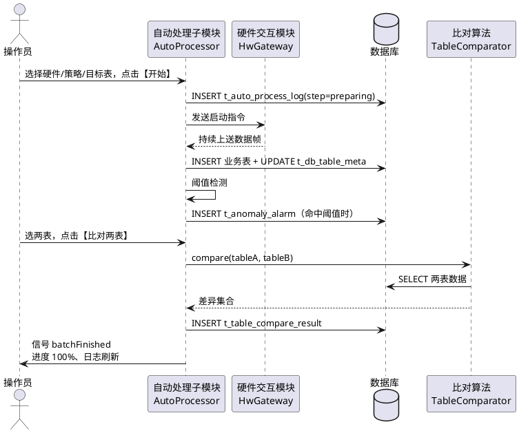
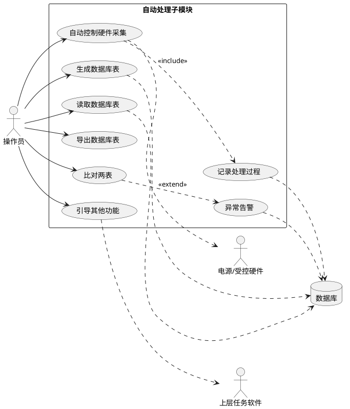
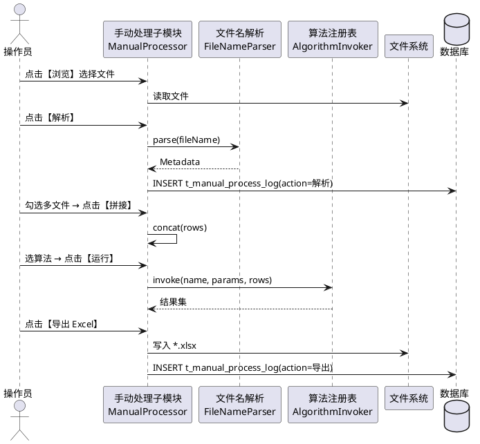
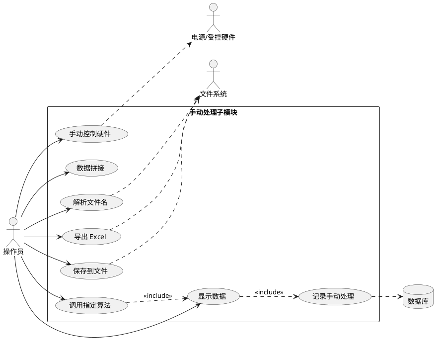

## 3.2 数据处理模块

本节对应《系统需求.md》「数据处理」原文中的两条能力：

- 自动处理：能够自动控制硬件进行数据处理并记录处理过程；能够生成、读取、导出数据库表；能够基于数据库表比对；能够引导其他功能；能够对异常数据进行告警。
- 手动处理：能够对数据进行显示；能够手动控制硬件进行数据处理；能够数据进行拼接；能够自动解析文件名称；能够调用指定算法；能够自动生成 Excel 表；能够把数据保存至文件。

据此拆分为两个子模块：**3.2.1 自动处理子模块**、**3.2.2 手动处理子模块**。两个子模块在源码工程内对应同一命名空间 `process`，共用数据处理相关数据表 `t_auto_process_log` / `t_db_table_meta` / `t_table_compare_result` / `t_anomaly_alarm` / `t_manual_process_log`，并复用硬件交互模块的指令通道与数据库访问层。

### 3.2.1 自动处理子模块

#### (1) 功能模块描述

本子模块按操作员选定的处理策略，自动驱动电源/受控硬件完成一轮数据处理，全过程逐步落入 `t_auto_process_log`；处理产生或读取的业务表登记在 `t_db_table_meta`，并提供生成、读取、导出与两表比对能力；当数据触发阈值时写入 `t_anomaly_alarm` 并以信号通知界面；处理结果可作为后续模块（结果评估、手动处理）的输入，由此引导其他功能继续执行。

| 项 | 来源 / 去向 | 字段 / 内容 | 触发方式 |
|---|---|---|---|
| 输入 | 操作员 | 硬件选择、处理策略、目标表、告警阈值 | 工具栏【启动自动处理】 |
| 输入 | 硬件交互模块 | 硬件返回报文与状态 | 信号 `frameArrived(hwId, payload)` |
| 输入 | 任务管理模块 | 已分解任务的指令序列 | 信号 `instructionsReady(taskId, list)` |
| 输入 | 业务表 | 由 `t_db_table_meta` 登记的表 | 读取或比对时 SQL 查询 |
| 输出 | `t_auto_process_log` | 处理步骤、批次、时间、详情 | 每跨越一个处理阶段写入 |
| 输出 | `t_db_table_meta` + 业务表 | 表名、用途；表数据 | 生成新表 / 读取 / 导出时写入 |
| 输出 | `t_table_compare_result` | 左表、右表、差异条数、差异明细 | 点击【比对两表】后写入 |
| 输出 | `t_anomaly_alarm` | 级别、来源、内容、时间 | 阈值或统计偏差触发 |
| 输出 | 其他功能模块 | 处理完毕的批次号 | 信号 `batchFinished(batchId)` 引导手动处理或结果评估 |
| 依赖 | 硬件交互模块 | 指令发送 / 状态回执 | 跨模块信号槽 |
| 依赖 | 数据访问层 | `QSqlDatabase` / `QSqlQuery` | 启动期建立连接 |

自动处理批次状态机：`idle → preparing → running → finished | aborted | failed`，每次跃迁均在状态栏与日志区同步显示，并以 `batch_id` 串联同一批次的全部 `t_auto_process_log` 与 `t_anomaly_alarm` 记录。

#### (2) 操作步骤

操作员通过主窗口左侧导航的【数据处理】节点进入本子模块，工作区默认显示"运行控制"分组与"数据库表"选项卡。常用操作如下：

1. 在主窗口顶部菜单选择 `工具(T) → 自动处理(A)`，或在工具栏点击【启动自动处理】按钮（蓝色 `.qt-btn-primary`），系统切换到本子模块界面，运行控制分组的字段进入可编辑状态。
2. 在【运行控制】分组填写表单字段：
   - 硬件选择（`QComboBox`，必填，下拉项来自 `t_hw_config`，示例 `电源-A / 信号采集器-1`）
   - 处理策略（`QComboBox`，必填，下拉项来自 `t_strategy`，示例 `采集-比对-评估`）
   - 目标表（`QComboBox`，必填，下拉项来自 `t_db_table_meta`，示例 `result_20260826`）
   - 告警阈值（`QSpinBox`，必填，单位"次/分钟"，取值 1~10000，默认 100）
3. 点击【开始】按钮，系统校验字段完整性后向硬件交互模块发送启动指令，工具栏【开始】置灰、【停止】(`.qt-btn-danger`) 与【暂停】置为可用；中部进度条 `.qt-progress` 显示当前批次百分比；过程日志同步写入下方 `.qt-log` 与 `t_auto_process_log`。
4. 在【数据库表】选项卡的工具按钮组依序提供四个操作：
   - 【生成新表】：弹出对话框输入"表名（必填）/用途（选填）"，点击【确定】后在数据库创建空表并写入 `t_db_table_meta`，表格刷新。
   - 【读取表】：选中表格中某行，点击后将该表内容加载到下方预览 `.qt-table`，列宽按字段类型自适应。
   - 【导出表】：选中行后点击，弹出 `QFileDialog` 选择 `*.csv` / `*.xlsx` 路径，导出完成后状态栏左侧提示"导出 N 行"。
   - 【比对两表】：在表格中按住 `Ctrl` 选中两行，点击后调用 `TableComparator::compare()`，结果写入 `t_table_compare_result`，并自动切到"比对结果"选项卡。
5. 切换至【比对结果】选项卡，左右两张 `.qt-table` 分别显示表 A、表 B 的差异行；列固定为：主键、字段名、A 值、B 值，差异格用 `--qt-warning` 高亮。按 `Ctrl+F` 唤起【查找】对话框可按主键定位。
6. 切换至【告警列表】选项卡，`.qt-table` 列：时间、级别、来源、内容、操作（列宽分别为 140/60/120/自适应/100）。新增告警时弹出 `QDialog` 提示，操作员可在【操作】列点击【处理】将 `t_anomaly_alarm.handled` 置 1。
7. 在运行期按 `F5` 刷新当前批次状态；按 `Ctrl+L` 清空下方日志显示区（仅清屏，不删除 `t_auto_process_log` 中的记录）。
8. 处理结束后，状态栏左侧提示"完成 N 条记录"，右侧告警计数同步刷新；批次号、起止时间、记录条数、告警条数四项写入【批次摘要】分组并保留 7 天可回看。
9. 在【批次摘要】分组点击【引导手动处理】按钮，系统以当前 `batch_id` 为参数发出 `batchFinished` 信号，手动处理子模块自动定位到对应批次的数据文件；点击【引导结果评估】则跳转到 3.4 结果评估模块并预填批次号。
10. 异常或紧急情况下点击工具栏【停止】按钮，弹出 `QDialog` 二次确认；确认后向硬件交互模块发送停止指令，批次状态置 `aborted`，日志区追加红色一行"批次 X 已中止"。状态栏右侧 `.qt-led` 反映电源/受控硬件的在线状态（绿/灰/黄）。

操作步骤涉及的菜单 / 按钮 / 表单字段 / 表格列均与本子模块界面 HTML 一一对应（见第 (5) 节）。

**自动处理时序图：**



#### (3) 类与算法设计（C++17 + Qt）

自动处理子模块包含五个核心类，对外仅暴露信号槽与少量必要的查询方法。

```cpp
// process/AutoProcessor.h
#pragma once
#include <QObject>
#include <QString>
#include "ProcessTypes.h"

class AutoProcessor : public QObject {
    Q_OBJECT
public:
    explicit AutoProcessor(QObject* parent = nullptr);
    bool configure(const RunConfig& cfg);

signals:
    void progressChanged(int percent);
    void anomalyDetected(const Anomaly& a);
    void batchFinished(const QString& batchId);
    void stateChanged(BatchState s);

public slots:
    void start();
    void stop();
    void onFrameArrived(int hwId, const QByteArray& payload);

private:
    QString beginBatch();
    void logStep(const QString& step, const QString& detail);
    RunConfig cfg_;
    QString   batchId_;
};
```

```cpp
// process/DbTableService.h
#pragma once
#include <QObject>
#include <QSqlDatabase>
#include "ProcessTypes.h"

class DbTableService : public QObject {
    Q_OBJECT
public:
    explicit DbTableService(QSqlDatabase db, QObject* parent = nullptr);

public slots:
    bool createTable(const QString& name, const QString& purpose, const TableSchema& s);
    bool readTable (const QString& name, RowSet* out);
    bool exportTable(const QString& name, const QString& filePath);

signals:
    void tableChanged(const QString& name);

private:
    QSqlDatabase db_;
};
```

```cpp
// process/TableComparator.h
#pragma once
#include <QObject>
#include "ProcessTypes.h"

class TableComparator : public QObject {
    Q_OBJECT
public:
    explicit TableComparator(QObject* parent = nullptr);

public slots:
    CompareResult compare(const QString& left, const QString& right,
                          const QStringList& pkCols);

signals:
    void compareFinished(const CompareResult& r);
};
```

```cpp
// process/AnomalyDetector.h
#pragma once
#include <QObject>
#include "ProcessTypes.h"

class AnomalyDetector : public QObject {
    Q_OBJECT
public:
    explicit AnomalyDetector(QObject* parent = nullptr);

public slots:
    void check(const Sample& s);     // 阈值 / 统计偏差
    void setThreshold(int perMinute);

signals:
    void anomalyDetected(const Anomaly& a);
};
```

```cpp
// process/ProcessLogger.h
#pragma once
#include <QObject>
#include <QSqlDatabase>

class ProcessLogger : public QObject {
    Q_OBJECT
public:
    explicit ProcessLogger(QSqlDatabase db, QObject* parent = nullptr);

public slots:
    void writeStep(const QString& batchId, int hwId,
                   const QString& step, const QString& detail);
};
```

**核心算法：数据库表比对算法**（主键交集 + 字段差异输出；C++17）：

```cpp
CompareResult TableComparator::compare(const QString& left,
                                       const QString& right,
                                       const QStringList& pkCols) {
    CompareResult r{left, right, 0, {}};
    const RowSet a = loadRows(left);
    const RowSet b = loadRows(right);
    const QStringList cols = intersect(a.cols, b.cols);
    QHash<QString, int> idxB;
    for (int i = 0; i < b.rows.size(); ++i)
        idxB.insert(makeKey(b.rows[i], pkCols), i);
    for (const auto& rowA : a.rows) {
        const QString k = makeKey(rowA, pkCols);
        if (!idxB.contains(k)) { r.onlyLeft.append(k);  ++r.diffCount; continue; }
        const auto& rowB = b.rows[idxB.value(k)];
        for (const QString& c : cols) {
            if (rowA.value(c) != rowB.value(c)) {
                r.diffs.append({k, c, rowA.value(c), rowB.value(c)});
                ++r.diffCount;
            }
        }
        idxB.remove(k);
    }
    for (auto it = idxB.constBegin(); it != idxB.constEnd(); ++it) {
        r.onlyRight.append(it.key()); ++r.diffCount;
    }
    emit compareFinished(r);
    return r;
}
```

说明：`loadRows` 调用 `DbTableService::readTable` 加载两表数据；`intersect` 取字段名交集，避免被字段顺序或新增列影响；`makeKey` 按 `pkCols` 拼接主键串。差异集合包括"仅左表主键""仅右表主键""共同主键下字段值差异"三类，写入 `t_table_compare_result.diff_detail`（JSON）。算法本体 25 行，符合 ≤30 行约束。

#### (4) 用例描述



#### (5) 界面设计

中央工作区由"运行控制"分组、"数据库表 / 比对结果 / 告警列表"三选项卡与底部日志区组成。工具栏按钮为本子模块的高频操作：【启动自动处理】【停止】【暂停】【生成新表】【读取表】【导出表】【比对两表】。

```html
<!doctype html>
<html lang="zh-CN">
<head>
<meta charset="utf-8" />
<title>自动处理子模块 - 界面原型</title>
<style>
:root{--qt-bg:#f0f0f0;--qt-panel:#fafafa;--qt-border:#b8b8b8;--qt-border-dark:#707070;--qt-text:#202020;--qt-text-muted:#606060;--qt-primary:#2a82da;--qt-primary-hover:#3a92ea;--qt-danger:#c62828;--qt-warning:#f9a825;--qt-success:#2e7d32;--qt-row-alt:#e8e8e8;}
body{font-family:"Microsoft YaHei","Noto Sans CJK SC",sans-serif;font-size:12px;color:var(--qt-text);background:var(--qt-bg);margin:0;}
.qt-window{border:1px solid var(--qt-border-dark);background:var(--qt-bg);}
.qt-menubar{background:#e6e6e6;border-bottom:1px solid var(--qt-border);padding:2px 6px;}
.qt-menubar span{padding:2px 10px;cursor:default;}
.qt-menubar span:hover{background:var(--qt-primary);color:#fff;}
.qt-toolbar{background:#ededed;border-bottom:1px solid var(--qt-border);padding:4px 6px;display:flex;gap:6px;align-items:center;}
.qt-toolbtn{padding:4px 10px;border:1px solid var(--qt-border);background:var(--qt-panel);cursor:pointer;}
.qt-toolbtn:hover{border-color:var(--qt-border-dark);background:#fff;}
.qt-statusbar{background:#e6e6e6;border-top:1px solid var(--qt-border);padding:3px 8px;color:var(--qt-text-muted);font-size:11px;display:flex;justify-content:space-between;}
.qt-main{display:flex;min-height:480px;}
.qt-side{width:200px;background:var(--qt-panel);border-right:1px solid var(--qt-border);padding:6px;}
.qt-content{flex:1;padding:8px;display:flex;flex-direction:column;gap:8px;}
.qt-group{border:1px solid var(--qt-border);background:var(--qt-panel);padding:8px 10px 10px;position:relative;border-radius:2px;}
.qt-group-title{position:absolute;top:-9px;left:10px;background:var(--qt-panel);padding:0 6px;color:var(--qt-text-muted);font-size:11px;}
.qt-row{display:flex;gap:8px;align-items:center;margin:4px 0;flex-wrap:wrap;}
.qt-label{min-width:90px;color:var(--qt-text);}
.qt-input,.qt-combo,.qt-spin{height:22px;padding:0 6px;border:1px solid var(--qt-border);background:#fff;font-size:12px;}
.qt-btn,.qt-btn-primary,.qt-btn-danger{height:24px;padding:0 12px;border:1px solid var(--qt-border);background:linear-gradient(#fafafa,#e6e6e6);cursor:pointer;font-size:12px;}
.qt-btn-primary{background:linear-gradient(var(--qt-primary-hover),var(--qt-primary));color:#fff;border-color:#1d6fbf;}
.qt-btn-danger{background:linear-gradient(#e04848,var(--qt-danger));color:#fff;border-color:#9b1f1f;}
.qt-table{width:100%;border-collapse:collapse;background:#fff;font-size:12px;}
.qt-table th{background:#e6e6e6;border:1px solid var(--qt-border);padding:4px 6px;text-align:left;font-weight:normal;}
.qt-table td{border:1px solid var(--qt-border);padding:4px 6px;}
.qt-table tbody tr:nth-child(even){background:var(--qt-row-alt);}
.qt-table td.diff{background:#fff3cd;}
.qt-tabs{display:flex;gap:0;border-bottom:1px solid var(--qt-border);}
.qt-tab{padding:4px 12px;border:1px solid var(--qt-border);border-bottom:none;background:#e6e6e6;cursor:pointer;}
.qt-tab.active{background:var(--qt-panel);font-weight:bold;}
.qt-progress{height:14px;border:1px solid var(--qt-border);background:#fff;position:relative;width:240px;}
.qt-progress > span{display:block;height:100%;background:var(--qt-primary);}
.qt-log{height:120px;border:1px solid var(--qt-border);background:#fff;font-family:Consolas,"Courier New",monospace;font-size:11px;padding:4px 6px;overflow:auto;}
.qt-log .ok{color:var(--qt-success);}
.qt-log .warn{color:var(--qt-warning);}
.qt-log .err{color:var(--qt-danger);}
.qt-led{display:inline-block;width:10px;height:10px;border-radius:50%;border:1px solid #888;vertical-align:middle;}
.qt-led-on{background:var(--qt-success);}
.qt-led-off{background:#aaa;}
.qt-led-warn{background:var(--qt-warning);}
.qt-split{display:flex;gap:8px;}
.qt-split > div{flex:1;}
.qt-badge{display:inline-block;padding:1px 6px;border-radius:2px;font-size:11px;color:#fff;}
.qt-badge.info{background:#6c757d;}
.qt-badge.warn{background:var(--qt-warning);color:#000;}
.qt-badge.err{background:var(--qt-danger);}
</style>
</head>
<body>
<div class="qt-window">
  <div class="qt-menubar">
    <span>文件(F)</span><span>编辑(E)</span><span>视图(V)</span><span>工具(T)</span><span>帮助(H)</span>
  </div>
  <div class="qt-toolbar">
    <button class="qt-toolbtn">启动自动处理</button>
    <button class="qt-toolbtn">停止</button>
    <button class="qt-toolbtn">暂停</button>
    <button class="qt-toolbtn">生成新表</button>
    <button class="qt-toolbtn">读取表</button>
    <button class="qt-toolbtn">导出表</button>
    <button class="qt-toolbtn">比对两表</button>
  </div>
  <div class="qt-main">
    <div class="qt-side">
      <div style="font-weight:bold;margin-bottom:4px;">数据处理</div>
      <div style="padding:2px 4px;background:#dceeff;">▸ 自动处理</div>
      <div style="padding:2px 4px;">▸ 手动处理</div>
      <div style="padding:2px 4px;">▸ 批次摘要</div>
    </div>
    <div class="qt-content">
      <div class="qt-group">
        <div class="qt-group-title">运行控制</div>
        <div class="qt-row">
          <span class="qt-label">硬件选择</span>
          <select class="qt-combo" style="width:200px"><option>电源-A</option><option>信号采集器-1</option></select>
          <span class="qt-label" style="margin-left:16px">处理策略</span>
          <select class="qt-combo" style="width:200px"><option>采集-比对-评估</option><option>仅采集</option></select>
        </div>
        <div class="qt-row">
          <span class="qt-label">目标表</span>
          <select class="qt-combo" style="width:200px"><option>result_20260826</option><option>result_20260825</option></select>
          <span class="qt-label" style="margin-left:16px">告警阈值</span>
          <input class="qt-spin" type="number" value="100" min="1" max="10000" style="width:80px"><span style="color:var(--qt-text-muted);">次/分钟</span>
        </div>
        <div class="qt-row">
          <span class="qt-label">批次进度</span>
          <div class="qt-progress"><span style="width:65%"></span></div>
          <span style="color:var(--qt-text-muted);">65%（B20260826-003）</span>
          <button class="qt-btn-primary" style="margin-left:16px">开始</button>
          <button class="qt-btn-danger">停止</button>
          <button class="qt-btn">暂停</button>
        </div>
      </div>
      <div>
        <div class="qt-tabs">
          <div class="qt-tab active">数据库表</div>
          <div class="qt-tab">比对结果</div>
          <div class="qt-tab">告警列表</div>
        </div>
        <div class="qt-group" style="border-top:none">
          <div class="qt-row">
            <button class="qt-btn-primary">生成新表</button>
            <button class="qt-btn">读取表</button>
            <button class="qt-btn">导出表</button>
            <button class="qt-btn">比对两表</button>
          </div>
          <table class="qt-table">
            <colgroup><col style="width:200px"><col><col style="width:140px"><col style="width:100px"></colgroup>
            <thead><tr><th>表名</th><th>用途</th><th>登记时间</th><th>行数</th></tr></thead>
            <tbody>
              <tr><td>result_20260826</td><td>当日采集结果</td><td>2026-08-26 09:02:10</td><td>12,480</td></tr>
              <tr><td>result_20260825</td><td>昨日采集结果</td><td>2026-08-25 09:01:55</td><td>12,310</td></tr>
              <tr><td>ref_baseline</td><td>基线参考</td><td>2026-08-01 10:00:00</td><td>12,000</td></tr>
            </tbody>
          </table>
        </div>
      </div>
      <div class="qt-group">
        <div class="qt-group-title">处理日志</div>
        <div class="qt-log">
[2026-08-26 09:02:11] <span class="ok">INFO </span> 批次 B20260826-003 启动，硬件 电源-A，策略 采集-比对-评估
[2026-08-26 09:02:14] <span class="ok">INFO </span> t_auto_process_log: step=preparing 写入完成
[2026-08-26 09:02:28] <span class="ok">INFO </span> 业务表 result_20260826 已生成（登记 t_db_table_meta）
[2026-08-26 09:05:02] <span class="warn">WARN </span> 通道 ch3 偏差 1.8σ，写入 t_anomaly_alarm(level=warn)
[2026-08-26 09:07:11] <span class="ok">INFO </span> 表比对 result_20260826 vs ref_baseline 差异 23 条
        </div>
      </div>
    </div>
  </div>
  <div class="qt-statusbar">
    <span>完成 8,112 条记录</span>
    <span>电源/受控硬件: <span class="qt-led qt-led-on"></span> 在线</span>
    <span>告警: 1 警告 / 0 错误</span>
    <span>2026-08-26 09:07:20</span>
  </div>
</div>
</body>
</html>
```

界面与操作步骤同名同位：菜单 `工具(T) → 自动处理(A)`、工具栏【启动自动处理】【停止】【暂停】【生成新表】【读取表】【导出表】【比对两表】、【运行控制】分组的硬件选择 / 处理策略 / 目标表 / 告警阈值字段与进度条、【数据库表】/【比对结果】/【告警列表】三选项卡、状态栏左侧记录数与右侧 `.qt-led` 硬件状态指示。

### 3.2.2 手动处理子模块

#### (1) 功能模块描述

本子模块面向需要操作员介入的离线场景，对硬件返回文件或自动处理批次产物进行显示、拼接、解析、算法运行与导出。文件可由 `QFileDialog` 浏览选择，文件名按命名规则正则自动解析为元数据；多文件勾选后【拼接】成单一数据集；选择算法并配置参数后【运行】，结果在中央 `QTableView` 与日志区呈现；可一键导出 Excel 或另存为 `*.csv` / `*.txt` / `*.dat`。每一次操作均在 `t_manual_process_log` 留痕。

| 项 | 来源 / 去向 | 字段 / 内容 | 触发方式 |
|---|---|---|---|
| 输入 | 文件系统 | `*.dat` / `*.csv` / `*.bin`，按命名规则携带元数据 | 工具栏【浏览】 |
| 输入 | 自动处理子模块 | 批次号 `batchId` 引导定位 | 信号 `batchFinished(batchId)` |
| 输入 | 操作员 | 算法选择、算法参数、拼接源勾选 | 表单与列表 |
| 输入 | 硬件交互模块 | 手动指令回执 | 信号 `hwAck(cmdId, ok)` |
| 输出 | 中央数据视图 | 表格 / 曲线占位 | 模型刷新 |
| 输出 | Excel 文件 | `*.xlsx`（基于 QXlsx） | 【导出 Excel】 |
| 输出 | 保存文件 | `*.csv` / `*.txt` / `*.dat` | 【另存为】 |
| 输出 | `t_manual_process_log` | 操作员、动作、目标、时间、结果 | 每次动作后写入 |
| 依赖 | 硬件交互模块 | 手动指令通道 | 跨模块信号槽 |
| 依赖 | 文件系统 | `QFile` / `QFileDialog` | 浏览与保存 |

`action` 字段取值与原文 7 条能力一一对应：`显示 / 控制 / 拼接 / 解析 / 算法 / 导出 / 保存`，便于按动作类型回溯操作员行为。

#### (2) 操作步骤

操作员通过主窗口左侧导航【数据处理 → 手动处理】节点进入本子模块。常用操作如下：

1. 主菜单 `工具(T) → 手动处理(M)`，或工具栏点击【手动处理】按钮进入子模块；若由自动处理子模块的【引导手动处理】触发进入，则文件路径已预填为该批次产物目录。
2. 在【文件解析】分组点击【浏览】按钮，弹出 `QFileDialog` 选择数据文件；表单字段：
   - 文件路径（`QLineEdit`，必填，长 320px，示例 `/data/B20260826-003/ch1_2026-08-26_090212.dat`）
   - 文件类型过滤（`QComboBox`，必填，可选 `*.dat / *.csv / *.bin / 全部`）
3. 点击【解析】按钮，调用 `FileNameParser::parse()`，按命名规则正则提取元数据并填入下方只读字段（均为 `QLineEdit`）：通道号、采集时间、批次号、序号、版本。解析失败时弹出 `QDialog` 提示，并在【手动处理日志】写入 `action=解析, result=failed` 一行。
4. 在右侧【拼接源】列表（`.qt-tree`）勾选多个候选文件（同批次会按时间排序），点击【拼接】按钮，调用 `DataConcatenator::concat()`，结果写入中央 `QTableView`（默认列：行号、时间、通道、值；列宽 60 / 140 / 80 / 自适应）。状态栏左侧提示"拼接 N 个文件，共 M 行"。
5. 在左侧【算法面板】选择算法（`QComboBox`，必填，下拉项来自算法注册表，示例 `滑动均值 / FFT / 阈值过滤`），下方参数表（`QTableView`，列：参数名、类型、值）按所选算法动态加载。
6. 点击【运行】按钮，算法以中央表格当前数据为输入执行，结果回写中央表格新增列或新增 Tab；底部 `.qt-log` 同步输出运行耗时、行数、异常计数；动作记录写入 `t_manual_process_log(action=算法, target=算法名)`。
7. 在【算法面板】点击【调用其他算法】按钮，可将当前结果作为下一个算法的输入，串接 2~3 个算法形成处理序列（不引入引擎概念，仅做顺序调用）。
8. 在硬件控制行的【手动控制硬件】区下拉选择指令（如 `PWR_ON / PWR_OFF / SELF_CHECK`），点击【下发】按钮，指令通过硬件交互模块发送，回执显示在 `.qt-log`；动作记录写入 `t_manual_process_log(action=控制, target=指令码)`。
9. 在底部按钮区按需点击：
   - 【导出 Excel】：弹出 `QFileDialog` 选择 `*.xlsx` 路径，调用 `ExcelExporter::save()`，导出当前中央表格全部行；
   - 【另存为】：弹出 `QFileDialog` 选择 `*.csv` / `*.txt` / `*.dat` 路径与编码（默认 UTF-8）；
   - 【清空】（`.qt-btn-danger`）：弹出 `QDialog` 二次确认，清空中央表格、参数表与日志显示区（不删除已写入 `t_manual_process_log` 的历史记录）。
10. 快捷键约定：`Ctrl+S` 触发【另存为】、`F5` 重新解析当前文件、`Ctrl+L` 清屏日志；状态栏右侧 `.qt-led` 反映电源/受控硬件在线状态。

**手动处理时序图：**



#### (3) 类与算法设计（C++17 + Qt）

手动处理子模块包含六个核心类，按"解析→拼接→算法→导出/保存"的处理顺序组织。

```cpp
// process/ManualProcessor.h
#pragma once
#include <QObject>
#include "ProcessTypes.h"

class ManualProcessor : public QObject {
    Q_OBJECT
public:
    explicit ManualProcessor(QObject* parent = nullptr);

signals:
    void datasetChanged(const RowSet& rows);
    void logMessage(const QString& level, const QString& text);

public slots:
    void openFile(const QString& path);
    void parseFileName(const QString& path);
    void concatFiles(const QStringList& paths);
    void runAlgorithm(const QString& name, const QVariantMap& params);
    void sendHwCommand(const QString& code, const QVariantMap& args);
    void exportExcel(const QString& path);
    void saveAs(const QString& path, const QString& format);
};
```

```cpp
// process/FileNameParser.h
#pragma once
#include <QObject>
#include <QRegularExpression>
#include "ProcessTypes.h"

class FileNameParser : public QObject {
    Q_OBJECT
public:
    explicit FileNameParser(QObject* parent = nullptr);
    void registerRule(const QString& name, const QString& pattern,
                      const QStringList& fields);

public slots:
    bool parse(const QString& fileName, Metadata* out, QString* err) const;

signals:
    void parseFailed(const QString& fileName, const QString& reason);

private:
    struct Rule { QString name; QRegularExpression re; QStringList fields; };
    QList<Rule> rules_;
};
```

```cpp
// process/DataConcatenator.h
#pragma once
#include <QObject>
#include "ProcessTypes.h"

class DataConcatenator : public QObject {
    Q_OBJECT
public:
    explicit DataConcatenator(QObject* parent = nullptr);

public slots:
    RowSet concat(const QList<RowSet>& sources, ConcatMode mode);

signals:
    void concatFinished(int totalRows, int sourceCount);
};
```

```cpp
// process/AlgorithmInvoker.h
#pragma once
#include <QObject>
#include <functional>
#include "ProcessTypes.h"

class AlgorithmInvoker : public QObject {
    Q_OBJECT
public:
    using Fn = std::function<RowSet(const RowSet&, const QVariantMap&)>;
    explicit AlgorithmInvoker(QObject* parent = nullptr);
    void registerAlgo(const QString& name, Fn fn);

public slots:
    RowSet invoke(const QString& name, const QVariantMap& params,
                  const RowSet& input);

signals:
    void invokeFinished(const QString& name, int rows, qint64 elapsedMs);
};
```

```cpp
// process/ExcelExporter.h
#pragma once
#include <QObject>
#include "ProcessTypes.h"

class ExcelExporter : public QObject {
    Q_OBJECT
public:
    explicit ExcelExporter(QObject* parent = nullptr);

public slots:
    bool save(const QString& path, const RowSet& rows);   // 基于 QXlsx

signals:
    void exported(const QString& path, int rows);
};
```

```cpp
// process/FileSaver.h
#pragma once
#include <QObject>
#include "ProcessTypes.h"

class FileSaver : public QObject {
    Q_OBJECT
public:
    explicit FileSaver(QObject* parent = nullptr);

public slots:
    bool save(const QString& path, const QString& format, const RowSet& rows);

signals:
    void saved(const QString& path, qint64 bytes);
};
```

**核心算法：文件名解析算法**（正则 + 命名规则映射；C++17）：

```cpp
bool FileNameParser::parse(const QString& fileName,
                           Metadata* out, QString* err) const {
    const QString base = QFileInfo(fileName).fileName();
    for (const auto& rule : rules_) {
        const auto m = rule.re.match(base);
        if (!m.hasMatch()) continue;
        if (m.lastCapturedIndex() < rule.fields.size()) continue;
        out->ruleName = rule.name;
        for (int i = 0; i < rule.fields.size(); ++i) {
            const QString key = rule.fields[i];
            const QString val = m.captured(i + 1);
            out->set(key, normalize(key, val));
        }
        if (!out->has("batchId") || !out->has("channel")) {
            *err = QStringLiteral("命中规则但缺少必填字段");
            emit const_cast<FileNameParser*>(this)
                ->parseFailed(fileName, *err);
            return false;
        }
        return true;
    }
    *err = QStringLiteral("未匹配任何命名规则");
    emit const_cast<FileNameParser*>(this)
        ->parseFailed(fileName, *err);
    return false;
}
```

说明：`rules_` 由 `registerRule` 在启动期注入，按注册顺序匹配，首次命中即返回；`normalize` 对时间字段（如 `2026-08-26_090212`）统一归一为 ISO 8601，对通道字段归一为 `ch1` 形式；当命中规则但缺少 `batchId` 或 `channel` 时仍视为失败，避免后续算法读到空字段。算法本体 24 行，符合 ≤30 行约束。

#### (4) 用例描述



#### (5) 界面设计

中央工作区分为三段：顶部【文件解析】分组、中部左中右三栏（算法面板 / 数据视图 / 拼接源）、底部按钮区与日志。工具栏按钮：【浏览】【解析】【拼接】【运行算法】【调用其他算法】【导出 Excel】【另存为】【清空】。

```html
<!doctype html>
<html lang="zh-CN">
<head>
<meta charset="utf-8" />
<title>手动处理子模块 - 界面原型</title>
<style>
:root{--qt-bg:#f0f0f0;--qt-panel:#fafafa;--qt-border:#b8b8b8;--qt-border-dark:#707070;--qt-text:#202020;--qt-text-muted:#606060;--qt-primary:#2a82da;--qt-primary-hover:#3a92ea;--qt-danger:#c62828;--qt-warning:#f9a825;--qt-success:#2e7d32;--qt-row-alt:#e8e8e8;}
body{font-family:"Microsoft YaHei","Noto Sans CJK SC",sans-serif;font-size:12px;color:var(--qt-text);background:var(--qt-bg);margin:0;}
.qt-window{border:1px solid var(--qt-border-dark);background:var(--qt-bg);}
.qt-menubar{background:#e6e6e6;border-bottom:1px solid var(--qt-border);padding:2px 6px;}
.qt-menubar span{padding:2px 10px;cursor:default;}
.qt-menubar span:hover{background:var(--qt-primary);color:#fff;}
.qt-toolbar{background:#ededed;border-bottom:1px solid var(--qt-border);padding:4px 6px;display:flex;gap:6px;align-items:center;}
.qt-toolbtn{padding:4px 10px;border:1px solid var(--qt-border);background:var(--qt-panel);cursor:pointer;}
.qt-toolbtn:hover{border-color:var(--qt-border-dark);background:#fff;}
.qt-statusbar{background:#e6e6e6;border-top:1px solid var(--qt-border);padding:3px 8px;color:var(--qt-text-muted);font-size:11px;display:flex;justify-content:space-between;}
.qt-main{display:flex;min-height:500px;}
.qt-side{width:200px;background:var(--qt-panel);border-right:1px solid var(--qt-border);padding:6px;}
.qt-content{flex:1;padding:8px;display:flex;flex-direction:column;gap:8px;}
.qt-group{border:1px solid var(--qt-border);background:var(--qt-panel);padding:8px 10px 10px;position:relative;border-radius:2px;}
.qt-group-title{position:absolute;top:-9px;left:10px;background:var(--qt-panel);padding:0 6px;color:var(--qt-text-muted);font-size:11px;}
.qt-row{display:flex;gap:8px;align-items:center;margin:4px 0;flex-wrap:wrap;}
.qt-label{min-width:80px;color:var(--qt-text);}
.qt-input,.qt-combo,.qt-spin{height:22px;padding:0 6px;border:1px solid var(--qt-border);background:#fff;font-size:12px;}
.qt-btn,.qt-btn-primary,.qt-btn-danger{height:24px;padding:0 12px;border:1px solid var(--qt-border);background:linear-gradient(#fafafa,#e6e6e6);cursor:pointer;font-size:12px;}
.qt-btn-primary{background:linear-gradient(var(--qt-primary-hover),var(--qt-primary));color:#fff;border-color:#1d6fbf;}
.qt-btn-danger{background:linear-gradient(#e04848,var(--qt-danger));color:#fff;border-color:#9b1f1f;}
.qt-table{width:100%;border-collapse:collapse;background:#fff;font-size:12px;}
.qt-table th{background:#e6e6e6;border:1px solid var(--qt-border);padding:4px 6px;text-align:left;font-weight:normal;}
.qt-table td{border:1px solid var(--qt-border);padding:4px 6px;}
.qt-table tbody tr:nth-child(even){background:var(--qt-row-alt);}
.qt-tree{border:1px solid var(--qt-border);background:#fff;height:200px;overflow:auto;padding:4px 6px;font-size:12px;}
.qt-tree .node{padding:1px 4px;}
.qt-tree .node input{margin-right:4px;}
.qt-log{height:110px;border:1px solid var(--qt-border);background:#fff;font-family:Consolas,"Courier New",monospace;font-size:11px;padding:4px 6px;overflow:auto;}
.qt-log .ok{color:var(--qt-success);}
.qt-log .warn{color:var(--qt-warning);}
.qt-log .err{color:var(--qt-danger);}
.qt-led{display:inline-block;width:10px;height:10px;border-radius:50%;border:1px solid #888;vertical-align:middle;}
.qt-led-on{background:var(--qt-success);}
.qt-led-off{background:#aaa;}
.qt-led-warn{background:var(--qt-warning);}
.qt-split3{display:flex;gap:8px;}
.qt-split3 > .qt-col-left{flex:1;display:flex;flex-direction:column;gap:6px;}
.qt-split3 > .qt-col-mid{flex:2;display:flex;flex-direction:column;gap:6px;}
.qt-split3 > .qt-col-right{flex:1;display:flex;flex-direction:column;gap:6px;}
</style>
</head>
<body>
<div class="qt-window">
  <div class="qt-menubar">
    <span>文件(F)</span><span>编辑(E)</span><span>视图(V)</span><span>工具(T)</span><span>帮助(H)</span>
  </div>
  <div class="qt-toolbar">
    <button class="qt-toolbtn">浏览</button>
    <button class="qt-toolbtn">解析</button>
    <button class="qt-toolbtn">拼接</button>
    <button class="qt-toolbtn">运行算法</button>
    <button class="qt-toolbtn">调用其他算法</button>
    <button class="qt-toolbtn">导出 Excel</button>
    <button class="qt-toolbtn">另存为</button>
    <button class="qt-toolbtn">清空</button>
  </div>
  <div class="qt-main">
    <div class="qt-side">
      <div style="font-weight:bold;margin-bottom:4px;">数据处理</div>
      <div style="padding:2px 4px;">▸ 自动处理</div>
      <div style="padding:2px 4px;background:#dceeff;">▸ 手动处理</div>
      <div style="padding:2px 4px;">▸ 批次摘要</div>
    </div>
    <div class="qt-content">
      <div class="qt-group">
        <div class="qt-group-title">文件解析</div>
        <div class="qt-row">
          <span class="qt-label">文件路径</span>
          <input class="qt-input" style="width:320px" value="/data/B20260826-003/ch1_2026-08-26_090212.dat">
          <select class="qt-combo" style="width:120px"><option>*.dat</option><option>*.csv</option><option>*.bin</option><option>全部</option></select>
          <button class="qt-btn">浏览</button>
          <button class="qt-btn-primary">解析</button>
        </div>
        <div class="qt-row">
          <span class="qt-label">通道号</span><input class="qt-input" style="width:100px" value="ch1" readonly>
          <span class="qt-label">采集时间</span><input class="qt-input" style="width:160px" value="2026-08-26T09:02:12" readonly>
          <span class="qt-label">批次号</span><input class="qt-input" style="width:160px" value="B20260826-003" readonly>
          <span class="qt-label">序号</span><input class="qt-input" style="width:60px" value="001" readonly>
        </div>
      </div>

      <div class="qt-split3">
        <div class="qt-col-left">
          <div class="qt-group">
            <div class="qt-group-title">算法面板</div>
            <div class="qt-row">
              <span class="qt-label">算法选择</span>
              <select class="qt-combo" style="width:140px"><option>滑动均值</option><option>FFT</option><option>阈值过滤</option></select>
            </div>
            <table class="qt-table">
              <colgroup><col style="width:90px"><col style="width:70px"><col></colgroup>
              <thead><tr><th>参数名</th><th>类型</th><th>值</th></tr></thead>
              <tbody>
                <tr><td>window</td><td>int</td><td><input class="qt-input" style="width:80px" value="16"></td></tr>
                <tr><td>step</td><td>int</td><td><input class="qt-input" style="width:80px" value="4"></td></tr>
                <tr><td>edgeMode</td><td>enum</td><td><select class="qt-combo" style="width:100px"><option>zero</option><option>mirror</option></select></td></tr>
              </tbody>
            </table>
            <div class="qt-row" style="margin-top:6px">
              <button class="qt-btn-primary">运行</button>
              <button class="qt-btn">调用其他算法</button>
            </div>
            <div class="qt-row" style="margin-top:6px">
              <span class="qt-label">手动控制硬件</span>
              <select class="qt-combo" style="width:120px"><option>PWR_ON</option><option>PWR_OFF</option><option>SELF_CHECK</option></select>
              <button class="qt-btn">下发</button>
            </div>
          </div>
        </div>
        <div class="qt-col-mid">
          <div class="qt-group" style="flex:1;display:flex;flex-direction:column;gap:4px;">
            <div class="qt-group-title">数据视图</div>
            <table class="qt-table">
              <colgroup><col style="width:60px"><col style="width:140px"><col style="width:80px"><col><col style="width:90px"></colgroup>
              <thead><tr><th>行号</th><th>时间</th><th>通道</th><th>原始值</th><th>算法结果</th></tr></thead>
              <tbody>
                <tr><td>1</td><td>2026-08-26 09:02:12.001</td><td>ch1</td><td>0.512</td><td>0.508</td></tr>
                <tr><td>2</td><td>2026-08-26 09:02:12.002</td><td>ch1</td><td>0.520</td><td>0.510</td></tr>
                <tr><td>3</td><td>2026-08-26 09:02:12.003</td><td>ch1</td><td>0.498</td><td>0.512</td></tr>
                <tr><td>4</td><td>2026-08-26 09:02:12.004</td><td>ch1</td><td>0.531</td><td>0.516</td></tr>
                <tr><td>5</td><td>2026-08-26 09:02:12.005</td><td>ch1</td><td>0.504</td><td>0.515</td></tr>
              </tbody>
            </table>
          </div>
        </div>
        <div class="qt-col-right">
          <div class="qt-group">
            <div class="qt-group-title">拼接源</div>
            <div class="qt-tree">
              <div class="node"><input type="checkbox" checked>ch1_2026-08-26_090212.dat</div>
              <div class="node"><input type="checkbox" checked>ch1_2026-08-26_090312.dat</div>
              <div class="node"><input type="checkbox">ch1_2026-08-26_090412.dat</div>
              <div class="node"><input type="checkbox">ch2_2026-08-26_090212.dat</div>
              <div class="node"><input type="checkbox">ch2_2026-08-26_090312.dat</div>
            </div>
            <div class="qt-row" style="margin-top:6px">
              <button class="qt-btn-primary">拼接</button>
              <button class="qt-btn">全选</button>
            </div>
          </div>
        </div>
      </div>

      <div class="qt-row" style="justify-content:flex-end">
        <button class="qt-btn-primary">导出 Excel</button>
        <button class="qt-btn">另存为</button>
        <button class="qt-btn-danger">清空</button>
      </div>

      <div class="qt-group">
        <div class="qt-group-title">手动处理日志</div>
        <div class="qt-log">
[2026-08-26 09:10:02] <span class="ok">INFO </span> 解析 ch1_2026-08-26_090212.dat 命中规则 R1
[2026-08-26 09:10:18] <span class="ok">INFO </span> 拼接 2 个文件，共 12,000 行
[2026-08-26 09:10:42] <span class="ok">INFO </span> 运行算法 滑动均值（window=16, step=4）耗时 86ms
[2026-08-26 09:11:05] <span class="warn">WARN </span> 下发 PWR_OFF 等待 1.2s 收到 ACK
[2026-08-26 09:11:30] <span class="ok">INFO </span> 导出 Excel /export/manual_20260826_091130.xlsx 12,000 行
        </div>
      </div>
    </div>
  </div>
  <div class="qt-statusbar">
    <span>拼接 2 个文件，共 12,000 行</span>
    <span>电源/受控硬件: <span class="qt-led qt-led-on"></span> 在线</span>
    <span>2026-08-26 09:11:32</span>
  </div>
</div>
</body>
</html>
```

界面与操作步骤同名同位：菜单 `工具(T) → 手动处理(M)`、工具栏【浏览】【解析】【拼接】【运行算法】【调用其他算法】【导出 Excel】【另存为】【清空】、【文件解析】分组的文件路径与解析结果只读字段、左侧【算法面板】（算法选择 / 参数表 / 运行 / 调用其他算法 / 手动控制硬件）、中央【数据视图】表格（行号、时间、通道、原始值、算法结果）、右侧【拼接源】树（多选 + 拼接）、底部【导出 Excel】【另存为】【清空】按钮、状态栏右侧 `.qt-led` 硬件状态指示。
