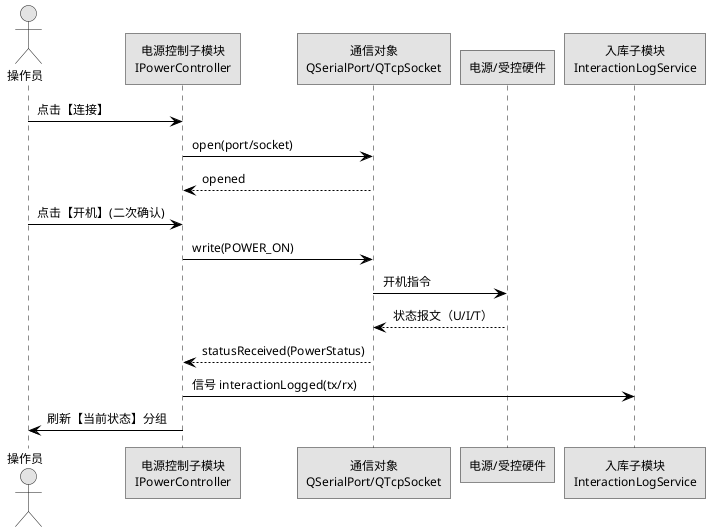
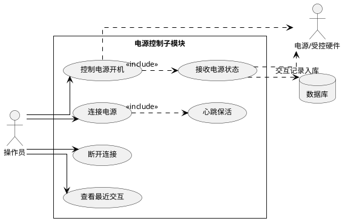
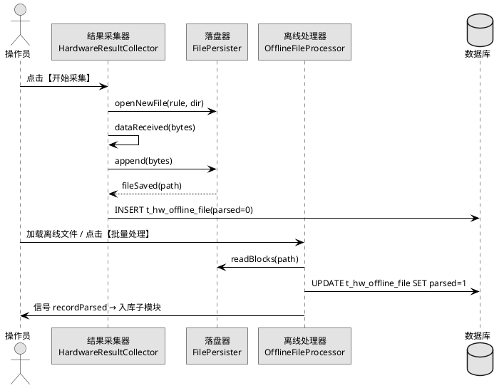
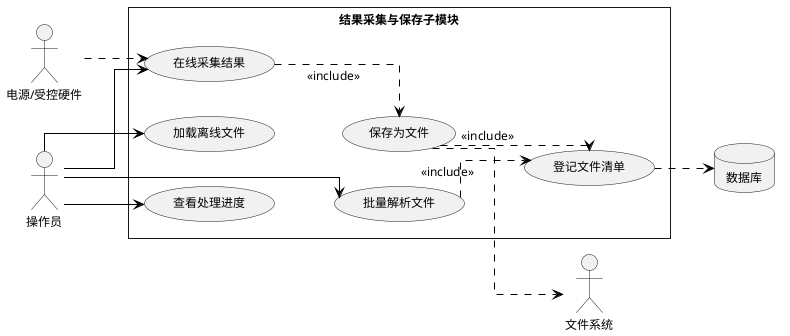
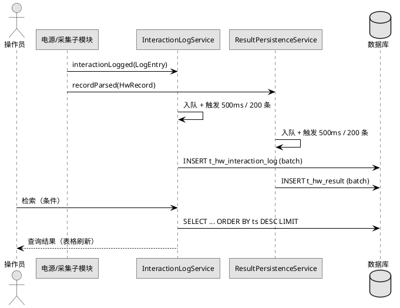
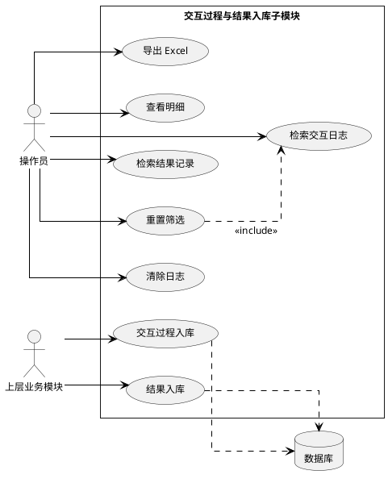

## 3.3 硬件交互模块

本节对应《系统需求.md》「硬件交互」原文中的六条能力：

- 能够控制电源开机；
- 能够接收电源状态信息；
- 能够对硬件返回的结果保存为文件；
- 能够离线处理文件；
- 能够对硬件交互过程进行入库；
- 能够对结果进行入库。

据此拆分为三个子模块：**3.3.1 电源控制子模块**（前两条）、**3.3.2 硬件结果采集与保存子模块**（中间两条）、**3.3.3 交互过程与结果入库子模块**（后两条）。三个子模块在源码工程内对应同一命名空间 `hw`，共用数据库表 `t_hw_config` / `t_hw_interaction_log` / `t_hw_result` / `t_hw_offline_file`，并通过抽象通信接口屏蔽串口与 TCP 差异。

### 3.3.1 电源控制子模块

#### (1) 功能模块描述

本子模块负责按操作员指令向电源/受控硬件下发开机命令，并以 1 Hz 周期接收电源状态信息（电压、电流、温度等）在界面同步刷新。通信物理层支持串口（`QSerialPort`）与 TCP（`QTcpSocket`）两种方式，运行期由配置决定具体实现。

| 项 | 来源 / 去向 | 字段 / 内容 | 触发方式 |
|---|---|---|---|
| 输入 | 操作员 | 通信方式、端口、波特率、IP+Port、刷新频率 | 工具栏 / 表单 |
| 输入 | 电源/受控硬件 | 状态报文（电压 / 电流 / 温度 / 运行模式） | 周期上报 |
| 输出 | 电源/受控硬件 | 开机指令 / 心跳指令 | TCP 或串口下发 |
| 输出 | 界面 | 当前状态分组刷新、`.qt-led` 状态变色 | 信号 `statusReceived(PowerStatus)` |
| 输出 | 交互过程入库子模块 | 一次握手 / 一次开机指令对应的收发对 | 信号 `interactionLogged(LogEntry)` |
| 依赖 | 数据访问层 | `t_hw_config`（读取硬件连接参数） | 启动期与"连接"动作 |
| 依赖 | Qt 通信模块 | `QSerialPort` / `QTcpSocket` | 按 `link_type` 选择 |

控制状态机：`disconnected → connecting → connected → powered_on → fault`。任一跃迁均通过信号 `linkStateChanged` 推送至界面与交互过程入库子模块。

#### (2) 操作步骤

操作员通过主窗口左侧导航的【硬件交互】节点进入本子模块，工作区默认显示"电源控制"分页。常用操作如下：

1. 在主窗口顶部菜单选择 `工具(T) → 电源控制(P)`，或在左侧导航点击【电源控制】节点，进入本子模块工作区。
2. 在【通信配置】分组中填写连接参数：
   - 通信方式（`QComboBox`，必填，取值 `串口` / `TCP`）
   - 端口号（串口为 `QComboBox`，必填，候选 `COM1`…`COM8` / `/dev/ttyS0`…`/dev/ttyS7`；TCP 为 `QLineEdit + QSpinBox`，必填，示例 `192.168.10.20 : 5025`）
   - 波特率（`QComboBox`，串口模式必填，取值 9600 / 19200 / 38400 / 115200，默认 115200）
   - 刷新频率（`QComboBox`，必填，取值 1 Hz / 2 Hz / 5 Hz，默认 1 Hz）
3. 点击工具栏【连接】按钮，或按 `F6`。系统按表单参数实例化 `SerialPowerController` 或 `TcpPowerController`，握手成功后状态栏右侧【硬件连接】`.qt-led` 由灰转绿，状态栏左侧提示"已连接"。握手失败时 `.qt-led` 转黄并在状态栏给出错误码。
4. 点击工具栏【开机】按钮，弹出 `QDialog` 二次确认（标题"电源开机确认"，正文显示当前硬件名称、通信方式、端口）。点击对话框右下角【确定】按钮（`.qt-btn-primary`）后，下发开机指令并等待状态回传。
5. 状态回传到达后，【当前状态】分组的电压、电流、温度、运行模式四个 `QLabel` 同步刷新；同时通过信号 `interactionLogged` 把"开机指令 + 状态回执"两条记录交给 3.3.3 入库。
6. 连接保持期间，状态信息按【刷新频率】下拉所选周期自动刷新。操作员可在下拉框直接切换频率，无需重启连接。
7. 点击工具栏【心跳】按钮可强制立即发送一次心跳指令，用于人工排障；连续 3 次心跳失败将自动断开连接并把状态栏【硬件连接】`.qt-led` 转黄。
8. 点击工具栏【断开】按钮，立即停止周期任务并关闭通信对象。断开过程不写库，仅在状态栏与日志区提示。
9. 在表格【最近交互】中选中任一行，工具栏【查看报文】按钮可用，弹出非模态窗口显示原始报文 16 进制 dump，便于操作员复核。
10. 状态栏右侧 `.qt-led` 同时标识【硬件连接】与【数据库连接】两个对象。任一离线时主操作按钮（【开机】【心跳】）按需置灰，避免误操作。

操作步骤涉及的菜单 / 按钮 / 表单字段 / 表格列均与本子模块界面 HTML 一一对应（见第 (5) 节）。

**电源控制时序图：**



#### (3) 类与算法设计（C++17 + Qt）

电源控制子模块以抽象基类 `IPowerController` 屏蔽通信方式差异，串口与 TCP 各提供一个子类。心跳与周期状态查询由基类统一调度，子类仅负责 `doWrite` / `doRead`。

```cpp
// hw/IPowerController.h
#pragma once
#include <QObject>
#include "HwTypes.h"

class IPowerController : public QObject {
    Q_OBJECT
public:
    explicit IPowerController(QObject* parent = nullptr);
    virtual ~IPowerController() = default;
    virtual bool open(const HwConnConfig& cfg) = 0;
    virtual void close() = 0;
    virtual bool powerOn() = 0;
    void setRefreshRateHz(int hz);

signals:
    void linkStateChanged(LinkState s);
    void statusReceived(const PowerStatus& st);
    void interactionLogged(const LogEntry& e);

protected:
    virtual qint64 doWrite(const QByteArray& payload) = 0;
    virtual QByteArray doRead(int timeoutMs) = 0;
};
```

```cpp
// hw/SerialPowerController.h
#pragma once
#include <QSerialPort>
#include "IPowerController.h"

class SerialPowerController : public IPowerController {
    Q_OBJECT
public:
    explicit SerialPowerController(QObject* parent = nullptr);
    bool open(const HwConnConfig& cfg) override;
    void close() override;
    bool powerOn() override;

protected:
    qint64 doWrite(const QByteArray& payload) override;
    QByteArray doRead(int timeoutMs) override;

private:
    QSerialPort port_;
};
```

```cpp
// hw/TcpPowerController.h
#pragma once
#include <QTcpSocket>
#include "IPowerController.h"

class TcpPowerController : public IPowerController {
    Q_OBJECT
public:
    explicit TcpPowerController(QObject* parent = nullptr);
    bool open(const HwConnConfig& cfg) override;
    void close() override;
    bool powerOn() override;

protected:
    qint64 doWrite(const QByteArray& payload) override;
    QByteArray doRead(int timeoutMs) override;

private:
    QTcpSocket sock_;
};
```

**核心算法：硬件交互可靠性算法**（超时重试 + 心跳保活 + 失败回退；C++17，27 行）：

```cpp
bool IPowerController::sendReliable(const QByteArray& payload, QByteArray* reply) {
    constexpr int kMaxRetry   = 3;
    constexpr int kTimeoutMs  = 800;
    constexpr int kBackoffMs  = 200;
    int attempt = 0, backoff = kBackoffMs;
    while (attempt++ < kMaxRetry) {
        if (doWrite(payload) <= 0) {
            emit linkStateChanged(LinkState::Fault);
            return false;
        }
        QByteArray ans = doRead(kTimeoutMs);
        if (!ans.isEmpty() && checkCrc(ans)) {
            heartbeatMissed_ = 0;
            if (reply) *reply = ans;
            emit interactionLogged({Dir::Tx, payload, Now(), "success"});
            emit interactionLogged({Dir::Rx, ans,     Now(), "success"});
            return true;
        }
        emit interactionLogged({Dir::Tx, payload, Now(), "timeout"});
        QThread::msleep(backoff);
        backoff = std::min(backoff * 2, 1600);
    }
    if (++heartbeatMissed_ >= 3) {
        close();
        emit linkStateChanged(LinkState::Disconnected);
    }
    return false;
}
```

说明：算法对单次指令实现"指数退避重试 + CRC 校验 + 心跳计数失败回退"，所有收发对在算法内部直接触发 `interactionLogged` 信号交由 3.3.3 落库；重试次数、超时、退避基数均为常量，便于在 `t_hw_config` 扩展为参数。本体 27 行，符合 ≤30 行约束。

#### (4) 用例描述



#### (5) 界面设计

中央工作区由【通信配置】【当前状态】【操作】【最近交互】四个 `.qt-group` 分组组成。工具栏按钮为本子模块的高频操作：【连接】【开机】【心跳】【断开】【查看报文】。

```html
<!doctype html>
<html lang="zh-CN">
<head>
<meta charset="utf-8" />
<title>电源控制子模块 - 界面原型</title>
<style>
:root{--qt-bg:#f0f0f0;--qt-panel:#fafafa;--qt-border:#b8b8b8;--qt-border-dark:#707070;--qt-text:#202020;--qt-text-muted:#606060;--qt-primary:#2a82da;--qt-primary-hover:#3a92ea;--qt-danger:#c62828;--qt-warning:#f9a825;--qt-success:#2e7d32;--qt-row-alt:#e8e8e8;}
body{font-family:"Microsoft YaHei","Noto Sans CJK SC",sans-serif;font-size:12px;color:var(--qt-text);background:var(--qt-bg);margin:0;}
.qt-window{border:1px solid var(--qt-border-dark);background:var(--qt-bg);}
.qt-menubar{background:#e6e6e6;border-bottom:1px solid var(--qt-border);padding:2px 6px;}
.qt-menubar span{padding:2px 10px;cursor:default;}
.qt-menubar span:hover{background:var(--qt-primary);color:#fff;}
.qt-toolbar{background:#ededed;border-bottom:1px solid var(--qt-border);padding:4px 6px;display:flex;gap:6px;align-items:center;}
.qt-toolbtn{padding:4px 10px;border:1px solid var(--qt-border);background:var(--qt-panel);cursor:pointer;}
.qt-toolbtn:hover{border-color:var(--qt-border-dark);background:#fff;}
.qt-statusbar{background:#e6e6e6;border-top:1px solid var(--qt-border);padding:3px 8px;color:var(--qt-text-muted);font-size:11px;display:flex;justify-content:space-between;}
.qt-main{display:flex;min-height:420px;}
.qt-side{width:200px;background:var(--qt-panel);border-right:1px solid var(--qt-border);padding:6px;}
.qt-content{flex:1;padding:8px;display:flex;flex-direction:column;gap:8px;}
.qt-group{border:1px solid var(--qt-border);background:var(--qt-panel);padding:10px 10px 10px;position:relative;border-radius:2px;}
.qt-group-title{position:absolute;top:-9px;left:10px;background:var(--qt-panel);padding:0 6px;color:var(--qt-text-muted);font-size:11px;}
.qt-row{display:flex;gap:8px;align-items:center;margin:4px 0;flex-wrap:wrap;}
.qt-label{min-width:90px;color:var(--qt-text);}
.qt-input,.qt-combo,.qt-spin{height:22px;padding:0 6px;border:1px solid var(--qt-border);background:#fff;font-size:12px;}
.qt-btn,.qt-btn-primary,.qt-btn-danger{height:24px;padding:0 12px;border:1px solid var(--qt-border);background:linear-gradient(#fafafa,#e6e6e6);cursor:pointer;font-size:12px;}
.qt-btn-primary{background:linear-gradient(var(--qt-primary-hover),var(--qt-primary));color:#fff;border-color:#1d6fbf;}
.qt-btn-danger{background:linear-gradient(#e04848,var(--qt-danger));color:#fff;border-color:#9b1f1f;}
.qt-table{width:100%;border-collapse:collapse;background:#fff;font-size:12px;}
.qt-table th{background:#e6e6e6;border:1px solid var(--qt-border);padding:4px 6px;text-align:left;font-weight:normal;}
.qt-table td{border:1px solid var(--qt-border);padding:4px 6px;}
.qt-table tbody tr:nth-child(even){background:var(--qt-row-alt);}
.qt-led{display:inline-block;width:10px;height:10px;border-radius:50%;border:1px solid #888;vertical-align:middle;}
.qt-led-on{background:var(--qt-success);}
.qt-led-off{background:#aaa;}
.qt-led-warn{background:var(--qt-warning);}
.qt-split{display:flex;gap:8px;}
.qt-split > .qt-left{flex:1;display:flex;flex-direction:column;gap:8px;}
.qt-split > .qt-right{flex:1;display:flex;flex-direction:column;gap:8px;}
.qt-metric{font-size:18px;font-weight:bold;color:var(--qt-text);}
</style>
</head>
<body>
<div class="qt-window">
  <div class="qt-menubar">
    <span>文件(F)</span><span>编辑(E)</span><span>视图(V)</span><span>工具(T)</span><span>帮助(H)</span>
  </div>
  <div class="qt-toolbar">
    <button class="qt-toolbtn">连接</button>
    <button class="qt-toolbtn">开机</button>
    <button class="qt-toolbtn">心跳</button>
    <button class="qt-toolbtn">断开</button>
    <button class="qt-toolbtn">查看报文</button>
  </div>
  <div class="qt-main">
    <div class="qt-side">
      <div style="font-weight:bold;margin-bottom:4px;">硬件交互</div>
      <div style="padding:2px 4px;background:#dceeff;">▸ 电源控制</div>
      <div style="padding:2px 4px;">▸ 结果采集</div>
      <div style="padding:2px 4px;">▸ 交互日志</div>
    </div>
    <div class="qt-content">
      <div class="qt-split">
        <div class="qt-left">
          <div class="qt-group">
            <div class="qt-group-title">通信配置</div>
            <div class="qt-row"><span class="qt-label">通信方式</span><select class="qt-combo" style="width:120px"><option>串口</option><option>TCP</option></select></div>
            <div class="qt-row"><span class="qt-label">端口号</span><select class="qt-combo" style="width:120px"><option>/dev/ttyS0</option><option>/dev/ttyS1</option><option>COM1</option></select></div>
            <div class="qt-row"><span class="qt-label">IP : Port</span><input class="qt-input" style="width:140px" value="192.168.10.20"><input class="qt-spin" style="width:60px" value="5025"></div>
            <div class="qt-row"><span class="qt-label">波特率</span><select class="qt-combo" style="width:120px"><option>115200</option><option>38400</option><option>19200</option><option>9600</option></select></div>
            <div class="qt-row"><span class="qt-label">刷新频率</span><select class="qt-combo" style="width:120px"><option>1 Hz</option><option>2 Hz</option><option>5 Hz</option></select></div>
          </div>
          <div class="qt-group">
            <div class="qt-group-title">操作</div>
            <div class="qt-row" style="justify-content:flex-start">
              <button class="qt-btn-primary">连接</button>
              <button class="qt-btn-primary">开机</button>
              <button class="qt-btn">心跳</button>
              <button class="qt-btn-danger">断开</button>
            </div>
          </div>
        </div>
        <div class="qt-right">
          <div class="qt-group">
            <div class="qt-group-title">当前状态</div>
            <div class="qt-row"><span class="qt-label">连接</span><span class="qt-led qt-led-on"></span><span style="margin-left:6px">已连接</span></div>
            <div class="qt-row"><span class="qt-label">运行模式</span><span class="qt-metric">POWER_ON</span></div>
            <div class="qt-row"><span class="qt-label">电压 (V)</span><span class="qt-metric">28.05</span></div>
            <div class="qt-row"><span class="qt-label">电流 (A)</span><span class="qt-metric">3.21</span></div>
            <div class="qt-row"><span class="qt-label">温度 (°C)</span><span class="qt-metric">42.6</span></div>
            <div class="qt-row"><span class="qt-label">最近刷新</span><span>2026-08-25 09:18:04</span></div>
          </div>
        </div>
      </div>
      <div class="qt-group">
        <div class="qt-group-title">最近交互</div>
        <table class="qt-table">
          <colgroup><col style="width:160px"><col style="width:60px"><col style="width:120px"><col><col style="width:90px"><col style="width:100px"></colgroup>
          <thead><tr><th>时间</th><th>方向</th><th>指令码</th><th>报文（摘要）</th><th>状态</th><th>操作</th></tr></thead>
          <tbody>
            <tr><td>2026-08-25 09:17:55</td><td>TX</td><td>POWER_ON</td><td>AA 55 01 00 ... CRC=0x8F</td><td>success</td><td><button class="qt-btn">查看报文</button></td></tr>
            <tr><td>2026-08-25 09:17:55</td><td>RX</td><td>STATUS</td><td>AA 55 81 0C U=28.05 I=3.21 ...</td><td>success</td><td><button class="qt-btn">查看报文</button></td></tr>
            <tr><td>2026-08-25 09:18:01</td><td>TX</td><td>HEARTBEAT</td><td>AA 55 02 00 CRC=0x12</td><td>success</td><td><button class="qt-btn">查看报文</button></td></tr>
            <tr><td>2026-08-25 09:18:04</td><td>RX</td><td>STATUS</td><td>AA 55 81 0C U=28.05 I=3.21 ...</td><td>success</td><td><button class="qt-btn">查看报文</button></td></tr>
          </tbody>
        </table>
      </div>
    </div>
  </div>
  <div class="qt-statusbar">
    <span>就绪</span>
    <span>硬件连接: <span class="qt-led qt-led-on"></span> 在线　数据库: <span class="qt-led qt-led-on"></span> 在线</span>
    <span>2026-08-25 09:18:04</span>
  </div>
</div>
</body>
</html>
```

界面对应操作步骤中提及的所有控件：菜单 `工具(T) → 电源控制(P)`、工具栏【连接】【开机】【心跳】【断开】【查看报文】、【通信配置】/【当前状态】/【操作】/【最近交互】四个分组、状态栏右侧【硬件连接】与【数据库】两个 `.qt-led`。

### 3.3.2 硬件结果采集与保存子模块

#### (1) 功能模块描述

本子模块负责把硬件实时返回的数据流写入文件（在线采集），并对操作员加载的离线文件按既定格式解析后入库（离线处理）。文件命名按"任务编号 + 通道 + 时间戳"规则生成，统一保存在配置目录下；离线文件清单维护在 `t_hw_offline_file`，避免重复处理。

| 项 | 来源 / 去向 | 字段 / 内容 | 触发方式 |
|---|---|---|---|
| 输入 | 电源/受控硬件 | 实时数据流（`QByteArray`） | 信号 `dataReceived` |
| 输入 | 操作员 | 保存路径、命名规则、离线文件路径列表 | 表单 / `QFileDialog` |
| 输出 | 文件系统 | 二进制文件（`.dat`），单文件 ≤ 1 GB，超出自动滚动 | `FilePersister` 写入 |
| 输出 | `t_hw_offline_file` | 文件路径、字节数、是否已解析、处理完成时间 | 离线加载与处理完成时写入 |
| 输出 | 上层结果入库子模块 | 解析后的样本块 + 摘要 | 信号 `recordParsed` |
| 输出 | 界面 | 进度条、处理日志、文件列表表格 | 信号 `progressChanged`、`fileSaved` |
| 依赖 | 数据访问层 | `t_hw_offline_file`、`t_hw_config` | 启动期与离线加载时 |
| 依赖 | Qt I/O | `QFile` / `QFileSystemWatcher` | 文件落盘与监视 |

文件命名规则：`<task_id>_<channel>_<yyyyMMddHHmmss>.dat`；当 `task_id` 为空（手动采集）时取 `MANUAL`。同名冲突时追加 `-1`、`-2` 后缀。

#### (2) 操作步骤

操作员通过左侧导航的【结果采集】节点进入本子模块，中央工作区采用两个 `.qt-tab` 切换"在线采集"与"离线处理"。常用操作如下：

1. 在主窗口顶部菜单选择 `工具(T) → 结果采集(R)`，或在左侧导航点击【结果采集】节点。
2. 默认进入【在线采集】Tab，在【采集配置】分组中填写：
   - 保存目录（`QLineEdit + 浏览…` 按钮，必填，点击【浏览】唤起 `QFileDialog::getExistingDirectory`）
   - 命名规则（`QComboBox`，必填，候选 `任务编号_通道_时间`、`通道_时间`、`MANUAL_时间`）
   - 单文件上限（`QSpinBox`，必填，默认 1024 MB，超过自动滚动）
   - 关联任务（`QComboBox`，选填，列出当前状态为 `running` 的任务编号）
3. 点击工具栏【开始采集】按钮（`.qt-btn-primary`），或按 `F7`。系统调用 `HardwareResultCollector::start`，按命名规则创建文件并实时写入，下方 `.qt-progress` 显示当前文件大小占上限的百分比，每 200 ms 刷新一次。
4. 采集过程中【停止】按钮始终可用；点击【停止】后弹出 `QDialog` 显示"已保存文件路径"列表，操作员确认后路径写入 `t_hw_offline_file`（`parsed=0`），便于后续离线处理。
5. 切换至【离线处理】Tab，点击工具栏【加载离线文件】按钮，唤起 `QFileDialog::getOpenFileNames` 多选；新加载的文件写入 `t_hw_offline_file` 并显示在文件列表 `.qt-table` 中。
6. 在文件列表中勾选若干行，点击工具栏【批量处理】按钮（`.qt-btn-primary`）。系统按记录块顺序解析，进度条按"已处理字节 / 总字节"刷新，处理日志区追加每个文件的解析摘要（块数、最大/最小值、CRC 校验通过率）。
7. 处理过程中点击【暂停】可暂停下一个块的解析，再次点击恢复；点击【停止】将放弃当前文件剩余部分但保留已解析结果。
8. 单个文件处理完成后，对应行【状态】列由 `pending` 变为 `parsed`，`t_hw_offline_file.parsed` 置 1，`processed_time` 写入当前时间；解析出的样本块通过信号 `recordParsed` 交给 3.3.3 落库。
9. 在文件列表右键菜单或工具栏【移除】按钮（`.qt-btn-danger`）可从清单中删除选中记录，删除前弹出 `QDialog` 二次确认；删除仅作用于 `t_hw_offline_file` 记录，磁盘文件保留。
10. 状态栏右侧 `.qt-led` 同时显示【硬件连接】与【数据库】两路状态；在线采集时左侧附加显示"当前文件大小 / 上限"，离线处理时显示"已处理 / 待处理"两个计数。

**结果采集与保存时序图：**



#### (3) 类与算法设计（C++17 + Qt）

本子模块由三个类构成：`HardwareResultCollector` 在线采集器、`FilePersister` 文件落盘器、`OfflineFileProcessor` 离线处理器。三者通过信号槽解耦，便于在线 / 离线两条路径复用同一落盘与解析逻辑。

```cpp
// hw/HardwareResultCollector.h
#pragma once
#include <QObject>
#include "HwTypes.h"

class FilePersister;
class HardwareResultCollector : public QObject {
    Q_OBJECT
public:
    explicit HardwareResultCollector(FilePersister* fp, QObject* parent = nullptr);
    bool start(const CollectConfig& cfg);
    void stop();

signals:
    void dataReceived(const QByteArray& bytes);
    void fileSaved(const QString& path);
    void progressChanged(qint64 bytes, qint64 limit);

public slots:
    void onBytesIn(const QByteArray& bytes);

private:
    FilePersister* fp_;
    CollectConfig  cfg_;
};
```

```cpp
// hw/FilePersister.h
#pragma once
#include <QObject>
#include <QFile>

class FilePersister : public QObject {
    Q_OBJECT
public:
    explicit FilePersister(QObject* parent = nullptr);
    bool   openNewFile(const NamingRule& rule, const QString& dir);
    qint64 append(const QByteArray& bytes);
    void   closeFile();
    QString currentPath() const;

signals:
    void rolled(const QString& closedPath);

private:
    QString buildName(const NamingRule& r) const;
    QFile   file_;
    qint64  limit_ = 1024LL * 1024 * 1024;
};
```

```cpp
// hw/OfflineFileProcessor.h
#pragma once
#include <QObject>
#include <QStringList>

class OfflineFileProcessor : public QObject {
    Q_OBJECT
public:
    explicit OfflineFileProcessor(QObject* parent = nullptr);

public slots:
    void load(const QStringList& paths);
    void processBatch(const QStringList& paths);
    void pause();
    void resume();
    void stop();

signals:
    void progressChanged(int percent);
    void fileFinished(const QString& path, bool ok, const QString& summary);
    void recordParsed(const HwRecord& rec);
};
```

**核心控制流：离线文件分块解析**（按 16 字节块头驱动，CRC 校验后入库；24 行 C++）：

```cpp
void OfflineFileProcessor::processOne(const QString& path) {
    QFile f(path);
    if (!f.open(QIODevice::ReadOnly)) {
        emit fileFinished(path, false, QStringLiteral("open failed"));
        return;
    }
    const qint64 total = f.size();
    int passed = 0, failed = 0;
    while (!f.atEnd() && !stopped_) {
        if (paused_) { QThread::msleep(20); continue; }
        QByteArray head = f.read(16);
        if (head.size() < 16) break;
        const quint32 len = readU32LE(head, 4);
        QByteArray body = f.read(len);
        if (body.size() < (int)len) { ++failed; break; }
        if (!checkCrc(head + body)) { ++failed; continue; }
        emit recordParsed(decode(head, body));
        ++passed;
        emit progressChanged(int(f.pos() * 100 / std::max<qint64>(total, 1)));
    }
    f.close();
    emit fileFinished(path, failed == 0,
        QStringLiteral("blocks=%1, crcFail=%2").arg(passed).arg(failed));
}
```

说明：解析按"16 字节定长头 + 变长数据体 + CRC"协议分块循环，每解析一块即通过信号交付 3.3.3 入库；`pause/stop` 标志由界面按钮置位，实现可中断处理。本体 24 行，符合 ≤30 行约束。

#### (4) 用例描述



#### (5) 界面设计

中央工作区由【在线采集】【离线处理】两个 `.qt-tab` 组成。【在线采集】Tab 包含【采集配置】分组 + 进度条 + 处理日志；【离线处理】Tab 包含文件列表表格 + 进度条 + 处理日志。工具栏按钮：【开始采集】【停止】【加载离线文件】【批量处理】【暂停】【移除】。

```html
<!doctype html>
<html lang="zh-CN">
<head>
<meta charset="utf-8" />
<title>硬件结果采集与保存子模块 - 界面原型</title>
<style>
:root{--qt-bg:#f0f0f0;--qt-panel:#fafafa;--qt-border:#b8b8b8;--qt-border-dark:#707070;--qt-text:#202020;--qt-text-muted:#606060;--qt-primary:#2a82da;--qt-primary-hover:#3a92ea;--qt-danger:#c62828;--qt-warning:#f9a825;--qt-success:#2e7d32;--qt-row-alt:#e8e8e8;}
body{font-family:"Microsoft YaHei","Noto Sans CJK SC",sans-serif;font-size:12px;color:var(--qt-text);background:var(--qt-bg);margin:0;}
.qt-window{border:1px solid var(--qt-border-dark);background:var(--qt-bg);}
.qt-menubar{background:#e6e6e6;border-bottom:1px solid var(--qt-border);padding:2px 6px;}
.qt-menubar span{padding:2px 10px;cursor:default;}
.qt-menubar span:hover{background:var(--qt-primary);color:#fff;}
.qt-toolbar{background:#ededed;border-bottom:1px solid var(--qt-border);padding:4px 6px;display:flex;gap:6px;align-items:center;}
.qt-toolbtn{padding:4px 10px;border:1px solid var(--qt-border);background:var(--qt-panel);cursor:pointer;}
.qt-toolbtn:hover{border-color:var(--qt-border-dark);background:#fff;}
.qt-statusbar{background:#e6e6e6;border-top:1px solid var(--qt-border);padding:3px 8px;color:var(--qt-text-muted);font-size:11px;display:flex;justify-content:space-between;}
.qt-main{display:flex;min-height:420px;}
.qt-side{width:200px;background:var(--qt-panel);border-right:1px solid var(--qt-border);padding:6px;}
.qt-content{flex:1;padding:8px;display:flex;flex-direction:column;gap:8px;}
.qt-group{border:1px solid var(--qt-border);background:var(--qt-panel);padding:10px 10px 10px;position:relative;border-radius:2px;}
.qt-group-title{position:absolute;top:-9px;left:10px;background:var(--qt-panel);padding:0 6px;color:var(--qt-text-muted);font-size:11px;}
.qt-row{display:flex;gap:8px;align-items:center;margin:4px 0;flex-wrap:wrap;}
.qt-label{min-width:90px;color:var(--qt-text);}
.qt-input,.qt-combo,.qt-spin{height:22px;padding:0 6px;border:1px solid var(--qt-border);background:#fff;font-size:12px;}
.qt-btn,.qt-btn-primary,.qt-btn-danger{height:24px;padding:0 12px;border:1px solid var(--qt-border);background:linear-gradient(#fafafa,#e6e6e6);cursor:pointer;font-size:12px;}
.qt-btn-primary{background:linear-gradient(var(--qt-primary-hover),var(--qt-primary));color:#fff;border-color:#1d6fbf;}
.qt-btn-danger{background:linear-gradient(#e04848,var(--qt-danger));color:#fff;border-color:#9b1f1f;}
.qt-table{width:100%;border-collapse:collapse;background:#fff;font-size:12px;}
.qt-table th{background:#e6e6e6;border:1px solid var(--qt-border);padding:4px 6px;text-align:left;font-weight:normal;}
.qt-table td{border:1px solid var(--qt-border);padding:4px 6px;}
.qt-table tbody tr:nth-child(even){background:var(--qt-row-alt);}
.qt-tabs{display:flex;gap:0;border-bottom:1px solid var(--qt-border);}
.qt-tab{padding:4px 12px;border:1px solid var(--qt-border);border-bottom:none;background:#e6e6e6;cursor:pointer;}
.qt-tab.active{background:var(--qt-panel);font-weight:bold;}
.qt-progress{height:14px;border:1px solid var(--qt-border);background:#fff;position:relative;}
.qt-progress > span{display:block;height:100%;background:var(--qt-primary);}
.qt-log{height:120px;border:1px solid var(--qt-border);background:#fff;font-family:Consolas,"Courier New",monospace;font-size:11px;padding:4px 6px;overflow:auto;}
.qt-led{display:inline-block;width:10px;height:10px;border-radius:50%;border:1px solid #888;vertical-align:middle;}
.qt-led-on{background:var(--qt-success);}
.qt-led-off{background:#aaa;}
.qt-led-warn{background:var(--qt-warning);}
</style>
</head>
<body>
<div class="qt-window">
  <div class="qt-menubar">
    <span>文件(F)</span><span>编辑(E)</span><span>视图(V)</span><span>工具(T)</span><span>帮助(H)</span>
  </div>
  <div class="qt-toolbar">
    <button class="qt-toolbtn">开始采集</button>
    <button class="qt-toolbtn">停止</button>
    <button class="qt-toolbtn">加载离线文件</button>
    <button class="qt-toolbtn">批量处理</button>
    <button class="qt-toolbtn">暂停</button>
    <button class="qt-toolbtn">移除</button>
  </div>
  <div class="qt-main">
    <div class="qt-side">
      <div style="font-weight:bold;margin-bottom:4px;">硬件交互</div>
      <div style="padding:2px 4px;">▸ 电源控制</div>
      <div style="padding:2px 4px;background:#dceeff;">▸ 结果采集</div>
      <div style="padding:2px 4px;">▸ 交互日志</div>
    </div>
    <div class="qt-content">
      <div class="qt-tabs">
        <div class="qt-tab active">在线采集</div>
        <div class="qt-tab">离线处理</div>
      </div>
      <div class="qt-group">
        <div class="qt-group-title">采集配置</div>
        <div class="qt-row">
          <span class="qt-label">保存目录</span>
          <input class="qt-input" style="width:320px" value="/data/hw/2026-08-25">
          <button class="qt-btn">浏览…</button>
          <span class="qt-label" style="margin-left:16px">命名规则</span>
          <select class="qt-combo" style="width:200px"><option>任务编号_通道_时间</option><option>通道_时间</option><option>MANUAL_时间</option></select>
        </div>
        <div class="qt-row">
          <span class="qt-label">单文件上限</span><input class="qt-spin" style="width:80px" value="1024"> MB
          <span class="qt-label" style="margin-left:16px">关联任务</span>
          <select class="qt-combo" style="width:200px"><option>T20260825-002（running）</option><option>（无）</option></select>
        </div>
        <div class="qt-row">
          <span class="qt-label">当前文件</span>
          <input class="qt-input" style="width:420px" value="/data/hw/2026-08-25/T20260825-002_CH1_20260825091830.dat" readonly>
        </div>
        <div class="qt-row">
          <span class="qt-label">文件进度</span>
          <div class="qt-progress" style="flex:1"><span style="width:48%"></span></div>
          <span style="margin-left:6px">491 / 1024 MB</span>
        </div>
      </div>
      <div class="qt-group">
        <div class="qt-group-title">处理日志</div>
        <div class="qt-log">
[2026-08-25 09:18:30] START  采集 → /data/hw/2026-08-25/T20260825-002_CH1_20260825091830.dat
[2026-08-25 09:18:45] WRITE  64 MB（速率 4.3 MB/s）
[2026-08-25 09:19:30] ROLL   达到单文件上限，新建 ...-1.dat
[2026-08-25 09:20:11] SAVED  /data/hw/2026-08-25/T20260825-002_CH1_20260825091830-1.dat（已登记 t_hw_offline_file）
        </div>
      </div>
      <div class="qt-group">
        <div class="qt-group-title">离线文件列表</div>
        <table class="qt-table">
          <colgroup><col style="width:40px"><col><col style="width:100px"><col style="width:100px"><col style="width:160px"><col style="width:120px"></colgroup>
          <thead><tr><th><input type="checkbox"></th><th>文件路径</th><th>大小 (MB)</th><th>状态</th><th>处理完成时间</th><th>操作</th></tr></thead>
          <tbody>
            <tr><td><input type="checkbox" checked></td><td>/data/hw/2026-08-25/T20260825-002_CH1_20260825091830.dat</td><td>1024</td><td>parsed</td><td>2026-08-25 09:21:02</td><td><button class="qt-btn">查看摘要</button></td></tr>
            <tr><td><input type="checkbox" checked></td><td>/data/hw/2026-08-25/T20260825-002_CH1_20260825091830-1.dat</td><td>491</td><td>pending</td><td>—</td><td><button class="qt-btn">查看摘要</button></td></tr>
            <tr><td><input type="checkbox"></td><td>/data/hw/2026-08-24/MANUAL_CH2_20260824180000.dat</td><td>312</td><td>parsed</td><td>2026-08-24 18:05:42</td><td><button class="qt-btn">查看摘要</button></td></tr>
          </tbody>
        </table>
      </div>
    </div>
  </div>
  <div class="qt-statusbar">
    <span>已处理 1 / 待处理 1</span>
    <span>硬件连接: <span class="qt-led qt-led-on"></span> 在线　数据库: <span class="qt-led qt-led-on"></span> 在线</span>
    <span>2026-08-25 09:21:10</span>
  </div>
</div>
</body>
</html>
```

界面与操作步骤同名同位：菜单 `工具(T) → 结果采集(R)`、工具栏【开始采集】【停止】【加载离线文件】【批量处理】【暂停】【移除】、【在线采集】/【离线处理】两个 Tab、【采集配置】/【处理日志】/【离线文件列表】三个分组、状态栏右侧【硬件连接】与【数据库】两个 `.qt-led`。

### 3.3.3 交互过程与结果入库子模块

#### (1) 功能模块描述

本子模块负责把 3.3.1 产生的"指令收发对"写入 `t_hw_interaction_log`，把 3.3.2 解析出的样本块写入 `t_hw_result`，并提供基于 `QAbstractTableModel` 的查询模型供界面分页展示与筛选。检索条件覆盖时间范围、方向、指令码、状态、关键字。

| 项 | 来源 / 去向 | 字段 / 内容 | 触发方式 |
|---|---|---|---|
| 输入 | 电源控制子模块 | `LogEntry`（方向、指令码、报文、时间、状态） | 信号 `interactionLogged` |
| 输入 | 结果采集与保存子模块 | `HwRecord`（任务 ID、硬件 ID、文件路径、摘要、时间） | 信号 `recordParsed` |
| 输入 | 操作员 | 检索条件、清除范围、重置筛选指令 | 顶部 `.qt-row` 筛选条 |
| 输出 | `t_hw_interaction_log` | 一次 tx 一次 rx 各一行 | 入库后 `committed` |
| 输出 | `t_hw_result` | 摘要 + 文件路径 + 任务 ID + 硬件 ID | 入库后 `committed` |
| 输出 | 界面 | 两张表格按筛选条件分页显示 | 模型 `dataChanged` |
| 依赖 | 数据访问层 | `QSqlDatabase` / `QSqlQuery`（事务批量提交） | 启动期与每次写入 |
| 依赖 | 上层 | 3.3.1 与 3.3.2 子模块的信号 | 应用启动期连接 |

入库策略：每 500 ms 或队列长度达到 200 触发一次事务提交，单条记录失败不影响其余记录；提交失败的记录在内存队列中重试 3 次后写入应用日志。

#### (2) 操作步骤

操作员通过左侧导航的【交互日志】节点进入本子模块，中央 `.qt-tabs` 提供"交互日志""结果记录"两个 Tab。常用操作如下：

1. 在主窗口顶部菜单选择 `视图(V) → 交互日志`，或按 `Ctrl+L`，进入本子模块工作区。
2. 中央顶部为筛选条 `.qt-row`，从左至右排列：
   - 时间起止（`QDateTimeEdit` ×2，选填，默认最近 24 小时）
   - 方向（`QComboBox`，选填，取值 `全部` / `tx` / `rx`，仅【交互日志】Tab 可见）
   - 指令码（`QLineEdit`，选填，支持前缀匹配）
   - 状态（`QComboBox`，选填，取值 `全部` / `success` / `timeout` / `failed`）
   - 关键字（`QLineEdit`，选填，对报文摘要 / 文件路径全文匹配）
3. 点击【检索】按钮（`.qt-btn-primary`），或按 `F5`。`InteractionQueryModel` / `ResultQueryModel` 重新执行 SQL 并按页加载，表格下方分页区显示"第 X / 共 Y 页"，每页 100 行。
4. 点击【重置筛选】按钮（`.qt-btn`）将所有筛选控件还原为默认值，并自动触发一次检索。
5. 切换 Tab 至【交互日志】，表格列固定为：时间、方向、指令码、参数、报文摘要、状态（共 6 列；列宽与 `t_hw_interaction_log` 字段一一对应）；切换 Tab 至【结果记录】，表格列固定为：时间、任务 ID、硬件 ID、内容摘要、保存路径、状态（共 6 列；对应 `t_hw_result`）。
6. 在任一表格中选中一行，工具栏【查看明细】按钮可用，弹出非模态窗口显示原始报文或样本块摘要，便于排障与复核。
7. 点击工具栏【刷新日志】按钮，或按 `F5`，按当前筛选条件重新执行查询（与【检索】等价；快捷键便于无鼠标场景操作）。
8. 点击工具栏【导出 Excel】按钮（呼应主菜单 `文件(F) → 导出 Excel`），按当前筛选结果导出 `.xlsx`，路径由 `QFileDialog::getSaveFileName` 指定。
9. 点击工具栏【清除】按钮（`.qt-btn-danger`），弹出 `QDialog` 二次确认，文案明确显示"将物理删除 `t_hw_interaction_log` 中筛选范围内的记录"。【清除】仅作用于当前 Tab 对应的表，且会写入 `t_sys_log` 一条操作审计。
10. 状态栏左侧实时显示"待入库队列长度 / 已入库总数"，右侧 `.qt-led` 标识【硬件连接】与【数据库】两个对象的在线状态；数据库离线时所有写入操作进入重试队列，界面给出黄色告警。

操作步骤涉及的菜单 / 按钮 / 表单字段 / 表格列均与本子模块界面 HTML 一一对应（见第 (5) 节）。

**入库与查询时序图：**



#### (3) 类与算法设计（C++17 + Qt）

本子模块由两个服务类（`InteractionLogService`、`ResultPersistenceService`）+ 两个查询模型类（`InteractionQueryModel`、`ResultQueryModel`）组成。服务类负责批量入库，模型类负责按筛选条件分页加载并暴露给界面。

```cpp
// hw/InteractionLogService.h
#pragma once
#include <QObject>
#include <QQueue>
#include <QTimer>
#include "HwTypes.h"

class InteractionLogService : public QObject {
    Q_OBJECT
public:
    explicit InteractionLogService(QObject* parent = nullptr);
    void start(int flushIntervalMs = 500, int batchLimit = 200);

public slots:
    void onLogEntry(const LogEntry& e);

signals:
    void committed(int n);
    void writeFailed(int n, const QString& err);

private:
    bool flush();
    QQueue<LogEntry> q_;
    QTimer timer_;
    int    batchLimit_ = 200;
};
```

```cpp
// hw/ResultPersistenceService.h
#pragma once
#include <QObject>
#include <QQueue>
#include <QTimer>
#include "HwTypes.h"

class ResultPersistenceService : public QObject {
    Q_OBJECT
public:
    explicit ResultPersistenceService(QObject* parent = nullptr);
    void start(int flushIntervalMs = 500, int batchLimit = 200);

public slots:
    void onRecordParsed(const HwRecord& r);

signals:
    void committed(int n);
    void writeFailed(int n, const QString& err);

private:
    bool flush();
    QQueue<HwRecord> q_;
    QTimer timer_;
    int    batchLimit_ = 200;
};
```

```cpp
// hw/InteractionQueryModel.h
#pragma once
#include <QAbstractTableModel>
#include "HwTypes.h"

class InteractionQueryModel : public QAbstractTableModel {
    Q_OBJECT
public:
    enum Column { Time, Direction, InstCode, Param, Payload, State, _Count };
    int      rowCount(const QModelIndex&) const override;
    int      columnCount(const QModelIndex&) const override;
    QVariant data(const QModelIndex& idx, int role) const override;
    QVariant headerData(int s, Qt::Orientation o, int role) const override;

public slots:
    void setFilter(const LogFilter& f);
    void refresh();
    int  removeFiltered();

private:
    QList<LogEntry> rows_;
    LogFilter       filter_;
};
```

**核心控制流：入库筛选 + 批量事务提交**（队列驱动，单条失败不阻塞整批；20 行 C++）：

```cpp
bool InteractionLogService::flush() {
    if (q_.isEmpty()) return true;
    QSqlDatabase db = QSqlDatabase::database();
    if (!db.transaction()) { emit writeFailed(q_.size(), db.lastError().text()); return false; }
    QSqlQuery sql(db);
    sql.prepare(QStringLiteral(
        "INSERT INTO t_hw_interaction_log(hw_id,direction,inst_code,payload,ts,state) "
        "VALUES(?,?,?,?,?,?)"));
    int ok = 0, fail = 0;
    while (!q_.isEmpty()) {
        const LogEntry e = q_.dequeue();
        if (!acceptByPolicy(e)) continue;
        sql.addBindValue(e.hwId); sql.addBindValue(e.dir == Dir::Tx ? "tx" : "rx");
        sql.addBindValue(e.instCode); sql.addBindValue(e.payload);
        sql.addBindValue(e.ts); sql.addBindValue(e.state);
        sql.exec() ? ++ok : ++fail;
    }
    if (!db.commit()) { db.rollback(); emit writeFailed(ok + fail, db.lastError().text()); return false; }
    emit committed(ok);
    return fail == 0;
}
```

说明：`acceptByPolicy` 用于按硬件配置过滤无须留痕的指令（如纯心跳），避免日志表膨胀；外部参数化的 `flushIntervalMs` / `batchLimit` 与队列阈值共同形成"双条件触发"策略，呼应入库性能要求。本体 20 行，符合 ≤30 行约束。

#### (4) 用例描述



#### (5) 界面设计

中央工作区由筛选条 `.qt-row` + `.qt-tabs`（交互日志 / 结果记录）+ 两张 `.qt-table` 构成。工具栏按钮：【检索】【重置筛选】【刷新日志】【查看明细】【导出 Excel】【清除】。

```html
<!doctype html>
<html lang="zh-CN">
<head>
<meta charset="utf-8" />
<title>交互过程与结果入库子模块 - 界面原型</title>
<style>
:root{--qt-bg:#f0f0f0;--qt-panel:#fafafa;--qt-border:#b8b8b8;--qt-border-dark:#707070;--qt-text:#202020;--qt-text-muted:#606060;--qt-primary:#2a82da;--qt-primary-hover:#3a92ea;--qt-danger:#c62828;--qt-warning:#f9a825;--qt-success:#2e7d32;--qt-row-alt:#e8e8e8;}
body{font-family:"Microsoft YaHei","Noto Sans CJK SC",sans-serif;font-size:12px;color:var(--qt-text);background:var(--qt-bg);margin:0;}
.qt-window{border:1px solid var(--qt-border-dark);background:var(--qt-bg);}
.qt-menubar{background:#e6e6e6;border-bottom:1px solid var(--qt-border);padding:2px 6px;}
.qt-menubar span{padding:2px 10px;cursor:default;}
.qt-menubar span:hover{background:var(--qt-primary);color:#fff;}
.qt-toolbar{background:#ededed;border-bottom:1px solid var(--qt-border);padding:4px 6px;display:flex;gap:6px;align-items:center;}
.qt-toolbtn{padding:4px 10px;border:1px solid var(--qt-border);background:var(--qt-panel);cursor:pointer;}
.qt-toolbtn:hover{border-color:var(--qt-border-dark);background:#fff;}
.qt-statusbar{background:#e6e6e6;border-top:1px solid var(--qt-border);padding:3px 8px;color:var(--qt-text-muted);font-size:11px;display:flex;justify-content:space-between;}
.qt-main{display:flex;min-height:420px;}
.qt-side{width:200px;background:var(--qt-panel);border-right:1px solid var(--qt-border);padding:6px;}
.qt-content{flex:1;padding:8px;display:flex;flex-direction:column;gap:8px;}
.qt-group{border:1px solid var(--qt-border);background:var(--qt-panel);padding:10px 10px 10px;position:relative;border-radius:2px;}
.qt-group-title{position:absolute;top:-9px;left:10px;background:var(--qt-panel);padding:0 6px;color:var(--qt-text-muted);font-size:11px;}
.qt-row{display:flex;gap:8px;align-items:center;margin:4px 0;flex-wrap:wrap;}
.qt-label{min-width:64px;color:var(--qt-text);}
.qt-input,.qt-combo,.qt-spin{height:22px;padding:0 6px;border:1px solid var(--qt-border);background:#fff;font-size:12px;}
.qt-btn,.qt-btn-primary,.qt-btn-danger{height:24px;padding:0 12px;border:1px solid var(--qt-border);background:linear-gradient(#fafafa,#e6e6e6);cursor:pointer;font-size:12px;}
.qt-btn-primary{background:linear-gradient(var(--qt-primary-hover),var(--qt-primary));color:#fff;border-color:#1d6fbf;}
.qt-btn-danger{background:linear-gradient(#e04848,var(--qt-danger));color:#fff;border-color:#9b1f1f;}
.qt-table{width:100%;border-collapse:collapse;background:#fff;font-size:12px;}
.qt-table th{background:#e6e6e6;border:1px solid var(--qt-border);padding:4px 6px;text-align:left;font-weight:normal;}
.qt-table td{border:1px solid var(--qt-border);padding:4px 6px;}
.qt-table tbody tr:nth-child(even){background:var(--qt-row-alt);}
.qt-tabs{display:flex;gap:0;border-bottom:1px solid var(--qt-border);}
.qt-tab{padding:4px 12px;border:1px solid var(--qt-border);border-bottom:none;background:#e6e6e6;cursor:pointer;}
.qt-tab.active{background:var(--qt-panel);font-weight:bold;}
.qt-led{display:inline-block;width:10px;height:10px;border-radius:50%;border:1px solid #888;vertical-align:middle;}
.qt-led-on{background:var(--qt-success);}
.qt-led-off{background:#aaa;}
.qt-led-warn{background:var(--qt-warning);}
.qt-badge{display:inline-block;padding:1px 6px;border-radius:2px;font-size:11px;color:#fff;}
.qt-badge.ok{background:var(--qt-success);}
.qt-badge.to{background:var(--qt-warning);color:#000;}
.qt-badge.err{background:var(--qt-danger);}
.qt-pager{display:flex;gap:6px;align-items:center;justify-content:flex-end;color:var(--qt-text-muted);}
</style>
</head>
<body>
<div class="qt-window">
  <div class="qt-menubar">
    <span>文件(F)</span><span>编辑(E)</span><span>视图(V)</span><span>工具(T)</span><span>帮助(H)</span>
  </div>
  <div class="qt-toolbar">
    <button class="qt-toolbtn">检索</button>
    <button class="qt-toolbtn">重置筛选</button>
    <button class="qt-toolbtn">刷新日志</button>
    <button class="qt-toolbtn">查看明细</button>
    <button class="qt-toolbtn">导出 Excel</button>
    <button class="qt-toolbtn">清除</button>
  </div>
  <div class="qt-main">
    <div class="qt-side">
      <div style="font-weight:bold;margin-bottom:4px;">硬件交互</div>
      <div style="padding:2px 4px;">▸ 电源控制</div>
      <div style="padding:2px 4px;">▸ 结果采集</div>
      <div style="padding:2px 4px;background:#dceeff;">▸ 交互日志</div>
    </div>
    <div class="qt-content">
      <div class="qt-group">
        <div class="qt-group-title">筛选条件</div>
        <div class="qt-row">
          <span class="qt-label">时间起</span><input class="qt-input" style="width:160px" value="2026-08-25 00:00:00">
          <span class="qt-label">时间止</span><input class="qt-input" style="width:160px" value="2026-08-25 23:59:59">
          <span class="qt-label">方向</span><select class="qt-combo" style="width:80px"><option>全部</option><option>tx</option><option>rx</option></select>
          <span class="qt-label">状态</span><select class="qt-combo" style="width:100px"><option>全部</option><option>success</option><option>timeout</option><option>failed</option></select>
        </div>
        <div class="qt-row">
          <span class="qt-label">指令码</span><input class="qt-input" style="width:160px" placeholder="如 POWER_ON / HEARTBEAT">
          <span class="qt-label">关键字</span><input class="qt-input" style="width:240px" placeholder="报文摘要 / 文件路径">
          <button class="qt-btn-primary">检索</button>
          <button class="qt-btn">重置筛选</button>
          <button class="qt-btn-danger">清除</button>
        </div>
      </div>
      <div class="qt-tabs">
        <div class="qt-tab active">交互日志</div>
        <div class="qt-tab">结果记录</div>
      </div>
      <table class="qt-table">
        <colgroup><col style="width:160px"><col style="width:60px"><col style="width:120px"><col style="width:160px"><col><col style="width:80px"></colgroup>
        <thead><tr><th>时间</th><th>方向</th><th>指令码</th><th>参数</th><th>报文摘要</th><th>状态</th></tr></thead>
        <tbody>
          <tr><td>2026-08-25 09:17:55</td><td>TX</td><td>POWER_ON</td><td>{}</td><td>AA 55 01 00 ... CRC=0x8F</td><td><span class="qt-badge ok">success</span></td></tr>
          <tr><td>2026-08-25 09:17:55</td><td>RX</td><td>STATUS</td><td>U=28.05 I=3.21</td><td>AA 55 81 0C ...</td><td><span class="qt-badge ok">success</span></td></tr>
          <tr><td>2026-08-25 09:18:01</td><td>TX</td><td>HEARTBEAT</td><td>{}</td><td>AA 55 02 00 CRC=0x12</td><td><span class="qt-badge ok">success</span></td></tr>
          <tr><td>2026-08-25 09:18:35</td><td>TX</td><td>ACQ_START</td><td>{"dur":60}</td><td>AA 55 11 04 ...</td><td><span class="qt-badge to">timeout</span></td></tr>
          <tr><td>2026-08-25 09:18:36</td><td>TX</td><td>ACQ_START</td><td>{"dur":60}（重试）</td><td>AA 55 11 04 ...</td><td><span class="qt-badge ok">success</span></td></tr>
        </tbody>
      </table>
      <div class="qt-pager">
        <span>共 1248 条　第</span><input class="qt-spin" style="width:50px" value="1"><span>/ 13 页</span>
        <button class="qt-btn">上一页</button><button class="qt-btn">下一页</button>
      </div>
    </div>
  </div>
  <div class="qt-statusbar">
    <span>待入库 0 / 已入库 1248</span>
    <span>硬件连接: <span class="qt-led qt-led-on"></span> 在线　数据库: <span class="qt-led qt-led-on"></span> 在线</span>
    <span>2026-08-25 09:21:30</span>
  </div>
</div>
</body>
</html>
```

界面与操作步骤同名同位：菜单 `视图(V) → 交互日志`、工具栏【检索】【重置筛选】【刷新日志】【查看明细】【导出 Excel】【清除】、【筛选条件】分组、【交互日志】/【结果记录】两个 Tab、底部分页区、状态栏左侧"待入库 / 已入库"计数与右侧【硬件连接】、【数据库】两个 `.qt-led`。
