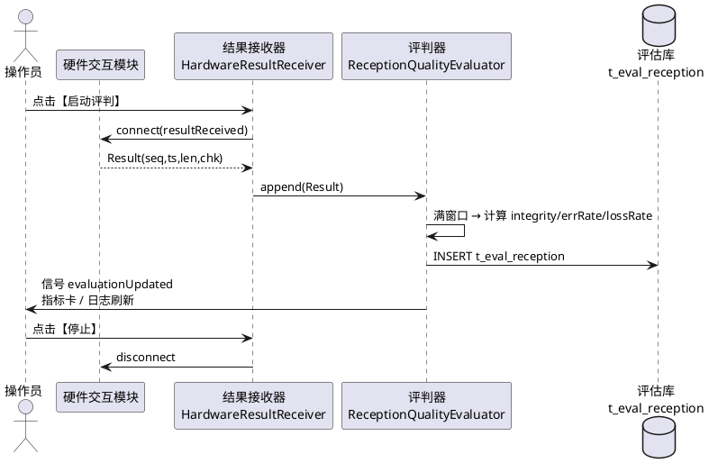
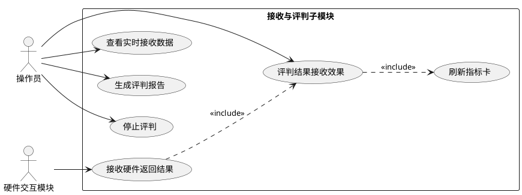
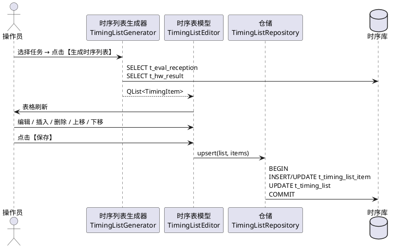
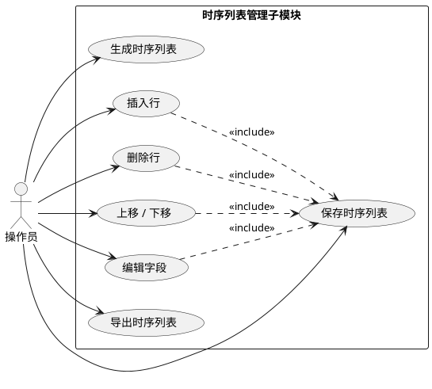
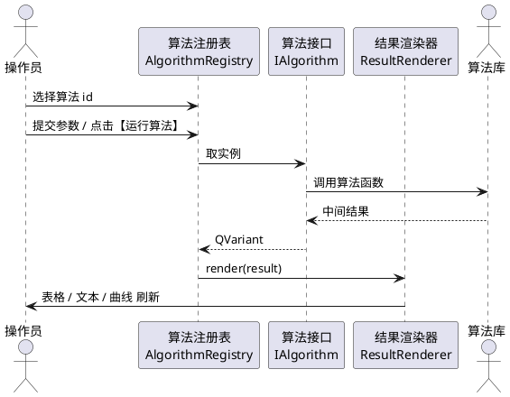
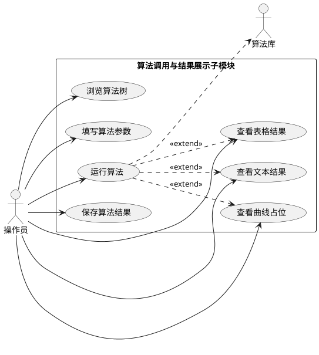

## 3.4 结果评估模块

### 3.4.0 业务分析

结果评估是任务完成之后"给试验打分"的环节，业务核心是 **"看得到、能判好坏、能复盘"**。本模块面向用户提供从原始结果到评级、再到时序复盘和算法复算的完整闭环。

1. **谁在使用、什么时候使用**
   - 主要用户：值班操作员（实时盯接收效果）、技术负责人（结果评级与回溯）、分析员（事后跑算法进一步定量分析）。
   - 触发场景：试验过程中需要实时看到数据是否完整、是否有误码或丢包；试验结束时要给出一份"接收质量评级"作为任务结果的关键指标；事后需要按时序列表逐条复盘关键事件；遇到争议时需重新跑指定算法验证结论。
2. **当前痛点（如果没有这个模块）**
   - 接收质量缺乏统一打分口径，全靠人工读日志判断；
   - 没有时序列表，事后复盘只能逐条翻日志，效率低；
   - 算法分散在不同脚本中，无法在统一界面调度与展示；
   - 评判结果与任务结果脱节，难以一并回送上层。
3. **本模块的业务价值**
   - **接收效果实时评判**：按窗口对完整率、误码率、丢包率加权打分，给出 A/B/C 评级并落入 `t_eval_reception`，呼应需求"能够接收硬件返回结果；能够评判结果接收效果"。
   - **时序列表自动生成 + 手动微调**：基于评估库与硬件结果库自动抽取关键事件生成时序列表，提供插入 / 删除 / 上移 / 下移 / 编辑 / 保存 / 导出操作，呼应"能够生成时序列表；能够在时序列表手动调整内容"。
   - **统一的算法调度与结果展示**：算法以 `IAlgorithm` 抽象注册，参数表自动生成，结果按表格 / 文本 / 曲线占位三种视图自适应渲染，呼应"能够调用算法显示结果"。
   - **闭环输出**：评级与时序列表既作为本模块输出，又通过任务管理模块的"结果上报"上送到上层任务软件，形成业务闭环。
4. **关键业务流程**：硬件交互模块推送结果 → 接收与评判（窗口打分 → 评级落库） → 自动生成时序列表 → 操作员手动微调 → 调用算法复算 → 结果导出或交付任务管理模块上报。

本节对应《系统需求.md》「结果评估」原文中的五条能力：

- 能够接收硬件返回结果；
- 能够评判结果接收效果；
- 能够生成时序列表；
- 能够在时序列表手动调整内容；
- 能够调用算法显示结果。

据此拆分为三个子模块：**3.4.1 硬件结果接收与评判子模块**、**3.4.2 时序列表管理子模块**、**3.4.3 算法调用与结果展示子模块**。三个子模块在源码工程内归属同一命名空间 `eval`，共用结果评估相关数据表 `t_eval_reception` / `t_timing_list` / `t_timing_list_item`，并通过硬件交互模块、数据处理模块对外联动。

### 3.4.1 硬件结果接收与评判子模块

#### (1) 功能模块描述

本子模块负责从硬件交互模块持续接收返回结果，在窗口实时滚动展示，并按设定窗口对完整率、误码率、丢包率进行加权打分，给出 A/B/C 接收评级。评判记录与每次评判窗口的指标快照写入 `t_eval_reception`，作为时序列表生成与上层任务结果上报的来源。

| 项 | 来源 / 去向 | 字段 / 内容 | 触发方式 |
|---|---|---|---|
| 输入 | 硬件交互模块 | `Result { seq, timestamp, length, checksum, payload }` | 信号 `resultReceived(Result)` |
| 输入 | 操作员 | 控制按钮：启动评判、停止、生成评判报告 | 工具栏、菜单或快捷键 |
| 输入 | 配置层 | 评判窗口大小、权重 `w_int / w_err / w_loss`、A/B/C 阈值 | 启动期读取 |
| 输出 | 评估结果表（`t_eval_reception`） | `integrity / error_rate / loss_rate / grade / eval_time` | 每窗口评判结束后写入 |
| 输出 | 界面 | 指标卡刷新、实时表格滚动、评判日志 | 信号 `evaluationUpdated(EvaluationResult)` |
| 输出 | 文件 | 评判报告（`*.csv` / `*.txt`） | `QFileDialog` 保存 |
| 依赖 | 硬件交互模块 | 结果信号源 | 启动期建立连接 |
| 依赖 | 数据访问层 | `QSqlDatabase` / `QSqlQuery` | 启动期建立连接 |

评判状态：`idle → running → stopped`。`running` 状态下每接收 N 条（默认 200）或满 T 秒（默认 5 s）触发一次窗口评判，按权重打分映射为 A/B/C 评级。

#### (2) 操作步骤

操作员通过主窗口左侧导航的【结果评估】节点进入本子模块，工作区默认显示"接收与评判"页。常用操作如下：

1. 在主窗口顶部菜单选择 `视图(V) → 结果评估(E)`，或按快捷键 `F4`，进入本子模块；左侧导航高亮"接收与评判"。
2. 在【评判参数】分组中配置：
   - 窗口大小（`QSpinBox`，必填，范围 50~2000，默认 200，单位"条"）
   - 时间窗（`QSpinBox`，必填，范围 1~60，默认 5，单位"秒"）
   - 权重（三个 `QSpinBox`，必填，整数百分比，默认 50 / 30 / 20，含义：完整率 / 误码率 / 丢包率，三者之和需等于 100）
   - A 阈值（`QSpinBox`，必填，默认 90）/ B 阈值（`QSpinBox`，必填，默认 75）
3. 点击工具栏【启动评判】按钮，系统连接硬件交互模块的 `resultReceived(Result)` 信号，状态切换为 `running`，状态栏左侧提示"评判运行中"，工具栏【启动评判】置灰、【停止】可用。
4. 中央【实时接收数据】表（`.qt-table`）自动滚动显示最近 500 条记录，列：序号、时间、长度（字节）、校验、状态。状态列取值 `OK / ERR / LOSS`。
5. 顶部 4 个【指标卡】（`.qt-group`）每完成一次窗口评判刷新一次：完整率（百分比，两位小数）、误码率（科学计数法）、丢包率（百分比，两位小数）、接收评级（A/B/C，对应绿/黄/红角标）。
6. 每个窗口评判结束后【评判日志】（`.qt-log`）追加一行：`[时间] window=200 integrity=99.50% errRate=2.3e-6 lossRate=0.50% grade=A`；评级为 C 时整行红色。
7. 点击工具栏【停止】按钮，断开信号订阅，状态切换为 `stopped`，状态栏提示"评判已停止"。
8. 点击工具栏【生成评判报告】按钮，弹 `QFileDialog`，默认文件名 `eval_<yyyyMMddHHmmss>.csv`；导出内容为当次评判会话内所有窗口的指标行与汇总评级。
9. 按 `Ctrl+L` 清空评判日志（仅清屏，不影响 `t_eval_reception`）；按 `F1` 唤起本子模块用户手册。
10. 状态栏右侧 `.qt-led` 给出三项指示：【接收速率】（条/秒，文字）、【评级】（最近一次窗口评级，三色徽标）、【数据库连接】（绿色在线、灰色离线）。

操作步骤涉及的菜单 / 按钮 / 表单字段 / 表格列均与本子模块界面 HTML 一一对应（见第 (5) 节）。

**接收与评判时序图：**



#### (3) 类与算法设计（C++17 + Qt）

本子模块由结果接收器与评判器两个核心类构成，对外仅暴露信号槽与必要的查询方法。

```cpp
// eval/HardwareResultReceiver.h
#pragma once
#include <QObject>
#include "EvalTypes.h"

class HardwareResultReceiver : public QObject {
    Q_OBJECT
public:
    explicit HardwareResultReceiver(QObject* parent = nullptr);
    bool start();
    void stop();

signals:
    void resultReceived(const Result& r);
    void linkStateChanged(LinkState s);

public slots:
    void onHwPayload(const QByteArray& bytes);

private:
    bool parse(const QByteArray& bytes, Result* out) const;
    bool running_ = false;
};
```

```cpp
// eval/ReceptionQualityEvaluator.h
#pragma once
#include <QObject>
#include "EvalTypes.h"

struct EvaluationResult {
    double integrity;
    double errorRate;
    double lossRate;
    QChar  grade;       // 'A' / 'B' / 'C'
    QDateTime evalTime;
};

class ReceptionQualityEvaluator : public QObject {
    Q_OBJECT
public:
    explicit ReceptionQualityEvaluator(const EvalConfig& cfg, QObject* parent = nullptr);

public slots:
    void append(const Result& r);
    void flush();

signals:
    void evaluationUpdated(const EvaluationResult& er);

private:
    EvalConfig cfg_;
    QVector<Result> window_;
    void persist(const EvaluationResult& er) const;
};
```

**核心算法：接收效果评判算法**（加权打分 → 评级；C++17，本体 22 行）：

```cpp
void ReceptionQualityEvaluator::append(const Result& r) {
    window_.append(r);
    if (window_.size() < cfg_.windowSize) return;
    int okCnt = 0, errCnt = 0, lossCnt = 0;
    quint32 expected = window_.first().seq;
    for (const auto& x : window_) {
        if (x.seq != expected) lossCnt += (x.seq - expected);
        expected = x.seq + 1;
        if (x.checksumOk) ++okCnt; else ++errCnt;
    }
    const int total = okCnt + errCnt + lossCnt;
    EvaluationResult er;
    er.integrity = double(okCnt) / total;
    er.errorRate = double(errCnt) / std::max(1, okCnt + errCnt);
    er.lossRate  = double(lossCnt) / total;
    const double score = cfg_.wInt * er.integrity * 100.0
                       + cfg_.wErr * (1.0 - er.errorRate) * 100.0
                       + cfg_.wLoss * (1.0 - er.lossRate) * 100.0;
    er.grade = score >= cfg_.thresholdA ? 'A' : (score >= cfg_.thresholdB ? 'B' : 'C');
    er.evalTime = QDateTime::currentDateTime();
    persist(er);
    emit evaluationUpdated(er);
    window_.clear();
}
```

说明：`cfg_.wInt / wErr / wLoss` 取自配置层的归一化权重（百分比 ÷ 100）。`persist` 通过 `QSqlQuery` 将 `EvaluationResult` 落库到 `t_eval_reception`。窗口未满时累积，满后一次性算分并清窗；`flush()` 在【停止】时把不足一窗的数据按当前样本数补算尾窗。

#### (4) 用例描述



#### (5) 界面设计

中央工作区自上而下：顶部 4 个指标卡（完整率、误码率、丢包率、评级）、中部【实时接收数据】表、底部【评判日志】。工具栏按钮为本子模块的高频操作：【启动评判】【停止】【生成评判报告】【清空日志】【参数】【帮助】。

```html
<!doctype html>
<html lang="zh-CN">
<head>
<meta charset="utf-8" />
<title>硬件结果接收与评判子模块 - 界面原型</title>
<style>
:root{--qt-bg:#f0f0f0;--qt-panel:#fafafa;--qt-border:#b8b8b8;--qt-border-dark:#707070;--qt-text:#202020;--qt-text-muted:#606060;--qt-primary:#2a82da;--qt-primary-hover:#3a92ea;--qt-danger:#c62828;--qt-warning:#f9a825;--qt-success:#2e7d32;--qt-row-alt:#e8e8e8;}
body{font-family:"Microsoft YaHei","Noto Sans CJK SC",sans-serif;font-size:12px;color:var(--qt-text);background:var(--qt-bg);margin:0;}
.qt-window{border:1px solid var(--qt-border-dark);background:var(--qt-bg);}
.qt-menubar{background:#e6e6e6;border-bottom:1px solid var(--qt-border);padding:2px 6px;}
.qt-menubar span{padding:2px 10px;cursor:default;}
.qt-menubar span:hover{background:var(--qt-primary);color:#fff;}
.qt-toolbar{background:#ededed;border-bottom:1px solid var(--qt-border);padding:4px 6px;display:flex;gap:6px;align-items:center;}
.qt-toolbtn{padding:4px 10px;border:1px solid var(--qt-border);background:var(--qt-panel);cursor:pointer;}
.qt-toolbtn:hover{border-color:var(--qt-border-dark);background:#fff;}
.qt-statusbar{background:#e6e6e6;border-top:1px solid var(--qt-border);padding:3px 8px;color:var(--qt-text-muted);font-size:11px;display:flex;justify-content:space-between;}
.qt-main{display:flex;min-height:460px;}
.qt-side{width:200px;background:var(--qt-panel);border-right:1px solid var(--qt-border);padding:6px;}
.qt-content{flex:1;padding:8px;display:flex;flex-direction:column;gap:8px;}
.qt-group{border:1px solid var(--qt-border);background:var(--qt-panel);padding:10px 10px 10px;position:relative;border-radius:2px;}
.qt-group-title{position:absolute;top:-9px;left:10px;background:var(--qt-panel);padding:0 6px;color:var(--qt-text-muted);font-size:11px;}
.qt-row{display:flex;gap:8px;align-items:center;margin:4px 0;flex-wrap:wrap;}
.qt-label{min-width:90px;color:var(--qt-text);}
.qt-input,.qt-combo,.qt-spin{height:22px;padding:0 6px;border:1px solid var(--qt-border);background:#fff;font-size:12px;}
.qt-btn,.qt-btn-primary,.qt-btn-danger{height:24px;padding:0 12px;border:1px solid var(--qt-border);background:linear-gradient(#fafafa,#e6e6e6);cursor:pointer;font-size:12px;}
.qt-btn-primary{background:linear-gradient(var(--qt-primary-hover),var(--qt-primary));color:#fff;border-color:#1d6fbf;}
.qt-btn-danger{background:linear-gradient(#e04848,var(--qt-danger));color:#fff;border-color:#9b1f1f;}
.qt-table{width:100%;border-collapse:collapse;background:#fff;font-size:12px;}
.qt-table th{background:#e6e6e6;border:1px solid var(--qt-border);padding:4px 6px;text-align:left;font-weight:normal;}
.qt-table td{border:1px solid var(--qt-border);padding:4px 6px;}
.qt-table tbody tr:nth-child(even){background:var(--qt-row-alt);}
.qt-log{height:120px;border:1px solid var(--qt-border);background:#fff;font-family:Consolas,"Courier New",monospace;font-size:11px;padding:4px 6px;overflow:auto;}
.qt-log .ok{color:var(--qt-success);}
.qt-log .err{color:var(--qt-danger);}
.qt-log .warn{color:var(--qt-warning);}
.qt-led{display:inline-block;width:10px;height:10px;border-radius:50%;border:1px solid #888;vertical-align:middle;}
.qt-led-on{background:var(--qt-success);}
.qt-led-off{background:#aaa;}
.qt-led-warn{background:var(--qt-warning);}
.qt-kpi{display:flex;gap:8px;}
.qt-kpi > .qt-group{flex:1;text-align:center;}
.qt-kpi .v{font-size:22px;font-weight:bold;color:var(--qt-text);padding:6px 0 2px;}
.qt-kpi .v.g{color:var(--qt-success);}
.qt-kpi .v.y{color:var(--qt-warning);}
.qt-kpi .v.r{color:var(--qt-danger);}
.qt-badge{display:inline-block;padding:1px 6px;border-radius:2px;font-size:11px;color:#fff;}
.qt-badge.ok{background:var(--qt-success);}
.qt-badge.err{background:var(--qt-danger);}
.qt-badge.loss{background:var(--qt-warning);color:#000;}
</style>
</head>
<body>
<div class="qt-window">
  <div class="qt-menubar">
    <span>文件(F)</span><span>编辑(E)</span><span>视图(V)</span><span>工具(T)</span><span>帮助(H)</span>
  </div>
  <div class="qt-toolbar">
    <button class="qt-toolbtn">启动评判</button>
    <button class="qt-toolbtn">停止</button>
    <button class="qt-toolbtn">生成评判报告</button>
    <button class="qt-toolbtn">清空日志</button>
    <button class="qt-toolbtn">参数</button>
    <button class="qt-toolbtn">帮助</button>
  </div>
  <div class="qt-main">
    <div class="qt-side">
      <div style="font-weight:bold;margin-bottom:4px;">结果评估</div>
      <div style="padding:2px 4px;background:#dceeff;">▸ 接收与评判</div>
      <div style="padding:2px 4px;">▸ 时序列表</div>
      <div style="padding:2px 4px;">▸ 算法调用</div>
    </div>
    <div class="qt-content">
      <div class="qt-kpi">
        <div class="qt-group"><div class="qt-group-title">完整率</div><div class="v g">99.50%</div><div style="color:var(--qt-text-muted);">window=200</div></div>
        <div class="qt-group"><div class="qt-group-title">误码率</div><div class="v g">2.3e-6</div><div style="color:var(--qt-text-muted);">滑动 5s</div></div>
        <div class="qt-group"><div class="qt-group-title">丢包率</div><div class="v y">0.50%</div><div style="color:var(--qt-text-muted);">lossCnt=1</div></div>
        <div class="qt-group"><div class="qt-group-title">接收评级</div><div class="v g">A</div><div style="color:var(--qt-text-muted);">score=96.8</div></div>
      </div>
      <div class="qt-group">
        <div class="qt-group-title">评判参数</div>
        <div class="qt-row">
          <span class="qt-label">窗口大小</span><input class="qt-spin" style="width:80px" value="200">
          <span class="qt-label" style="margin-left:16px">时间窗(s)</span><input class="qt-spin" style="width:80px" value="5">
          <span class="qt-label" style="margin-left:16px">权重(完/误/丢)</span>
          <input class="qt-spin" style="width:60px" value="50">
          <input class="qt-spin" style="width:60px" value="30">
          <input class="qt-spin" style="width:60px" value="20">
          <span class="qt-label" style="margin-left:16px">A 阈值</span><input class="qt-spin" style="width:60px" value="90">
          <span class="qt-label" style="margin-left:8px">B 阈值</span><input class="qt-spin" style="width:60px" value="75">
        </div>
      </div>
      <div class="qt-group">
        <div class="qt-group-title">实时接收数据</div>
        <table class="qt-table">
          <colgroup><col style="width:80px"><col style="width:160px"><col style="width:80px"><col style="width:80px"><col style="width:100px"></colgroup>
          <thead><tr><th>序号</th><th>时间</th><th>长度</th><th>校验</th><th>状态</th></tr></thead>
          <tbody>
            <tr><td>10231</td><td>2026-08-25 09:20:01.103</td><td>512</td><td>OK</td><td><span class="qt-badge ok">OK</span></td></tr>
            <tr><td>10232</td><td>2026-08-25 09:20:01.108</td><td>512</td><td>OK</td><td><span class="qt-badge ok">OK</span></td></tr>
            <tr><td>10233</td><td>2026-08-25 09:20:01.113</td><td>512</td><td>FAIL</td><td><span class="qt-badge err">ERR</span></td></tr>
            <tr><td>10235</td><td>2026-08-25 09:20:01.123</td><td>512</td><td>OK</td><td><span class="qt-badge loss">LOSS</span></td></tr>
            <tr><td>10236</td><td>2026-08-25 09:20:01.128</td><td>512</td><td>OK</td><td><span class="qt-badge ok">OK</span></td></tr>
          </tbody>
        </table>
      </div>
      <div class="qt-group">
        <div class="qt-group-title">评判日志</div>
        <div class="qt-log">
[2026-08-25 09:19:55] <span class="ok">INFO </span> 评判已启动 window=200 windowSec=5
[2026-08-25 09:20:00] <span class="ok">EVAL </span> window=200 integrity=99.50% errRate=2.3e-6 lossRate=0.50% grade=A score=96.8
[2026-08-25 09:20:05] <span class="warn">EVAL </span> window=200 integrity=96.00% errRate=8.1e-5 lossRate=2.00% grade=B score=82.4
[2026-08-25 09:20:10] <span class="err">EVAL </span> window=200 integrity=88.00% errRate=4.2e-4 lossRate=8.50% grade=C score=66.1
        </div>
      </div>
    </div>
  </div>
  <div class="qt-statusbar">
    <span>接收速率: 196 条/s</span>
    <span>评级: <span class="qt-led qt-led-on"></span> A</span>
    <span>数据库: <span class="qt-led qt-led-on"></span> 在线 | 2026-08-25 09:20:10</span>
  </div>
</div>
</body>
</html>
```

界面与操作步骤同名同位：菜单 `视图(V) → 结果评估(E)`、工具栏【启动评判】【停止】【生成评判报告】【清空日志】【参数】【帮助】、四个指标卡（完整率 / 误码率 / 丢包率 / 接收评级）、【实时接收数据】五列表、【评判日志】、状态栏【接收速率】【评级】【数据库连接】三项指示。

### 3.4.2 时序列表管理子模块

#### (1) 功能模块描述

本子模块负责根据已有的接收评判结果与硬件返回结果生成时序列表，并允许操作员在列表中手动插入、删除、调整顺序与编辑字段，最终落库与导出。一个时序列表对应 `t_timing_list` 一条主记录，列表中的每一行存储于 `t_timing_list_item`。

| 项 | 来源 / 去向 | 字段 / 内容 | 触发方式 |
|---|---|---|---|
| 输入 | 评估库 / 硬件结果库 | `t_eval_reception`、`t_hw_result` | 生成时序列表时查询 |
| 输入 | 操作员 | 列表名称、单元格编辑、行操作 | 工具栏、菜单、单元格双击 |
| 输出 | `t_timing_list` | `title / task_id / created_time / updated_time` | 保存时写入 |
| 输出 | `t_timing_list_item` | `seq / event_time / event_name / params / modified_by / modified_at` | 保存时批量 upsert |
| 输出 | 文件 | `*.csv` / `*.xlsx` 时序列表导出 | 点击【导出】 |
| 输出 | 界面 | 表格刷新、字段编辑面板 | 信号 `listChanged(listId)` |
| 依赖 | 接收与评判子模块 | 评判窗口快照 | 通过 `task_id` / 时间区间筛选 |

行编辑遵循以下规则：所有手动修改在【字段编辑】分组内完成，提交后 `modified_by` 自动填入当前操作员标识、`modified_at` 填入系统时间，便于审计。

#### (2) 操作步骤

操作员通过左侧导航【时序列表】节点或主菜单进入本子模块，工作区显示一张可编辑表格与右侧字段编辑分组。常用操作如下：

1. 在主菜单选择 `视图(V) → 时序列表(T)`，或按快捷键 `F6`，进入本子模块。
2. 在【列表选择】行（顶部）选择已有列表或新建：
   - 列表名称（`QComboBox`，必填，下拉项来自 `t_timing_list.title`，含【新建…】项）
   - 关联任务（`QComboBox`，选填，下拉项为 `t_task` 中 `state ∈ {done, failed}` 的任务编号）
3. 选择【新建…】时弹出【新建时序列表】对话框，填写：列表名称（`QLineEdit`，必填，长度 ≤ 128）、关联任务（`QComboBox`，选填）、备注（`QLineEdit`，选填）；点击【确定】后空表入库。
4. 点击工具栏【生成时序列表】按钮，系统调用 `TimingListGenerator::generate(taskId)`，基于 `t_eval_reception` 与 `t_hw_result` 自动生成行项填入中央表，状态栏提示"已生成 N 行"。
5. 中央【时序列表】表（`.qt-table`，可编辑）列与列宽：序号（60px）、事件时间（180px）、事件名（160px）、参数 JSON（自适应）、修改人（100px）、操作（100px，最右）。双击单元格进入内联编辑（`QLineEdit` / `QComboBox`）。
6. 选中一行后在右侧【字段编辑】分组（`.qt-group`）修改：事件时间（`QDateTimeEdit`，必填）、事件名（`QComboBox`，必填，候选项来自字典）、参数 JSON（`QTextEdit`，选填）；点击【应用】回写到表格。
7. 工具栏【插入行】在当前选中行之上插入空行；【删除行】使用 `.qt-btn-danger` 并弹出 `QDialog` 二次确认；【上移】【下移】调整选中行的 `seq` 字段，相邻行 `seq` 同步交换。
8. 点击工具栏【保存】按钮，系统对每行字段进行非空与时间格式校验，校验通过后以事务方式 upsert 至 `t_timing_list_item`，主表 `updated_time` 同步刷新；校验失败时表格中失败单元格红框提示并定位到首个错误行。
9. 点击工具栏【导出】按钮，弹 `QFileDialog`，可选 `*.csv` / `*.xlsx`，默认文件名 `timing_<title>_<yyyyMMddHHmm>`。
10. 状态栏右侧 `.qt-led` 同步显示数据库连接状态；行项数量与最近修改时间在状态栏中部显示。

操作步骤涉及的菜单 / 按钮 / 表单字段 / 表格列均与本子模块界面 HTML 一一对应（见第 (5) 节）。

**时序列表生成与编辑时序图：**



#### (3) 类与算法设计（C++17 + Qt）

本子模块由生成器、表模型、仓储三类协同。

```cpp
// eval/TimingListGenerator.h
#pragma once
#include <QObject>
#include "EvalTypes.h"

class TimingListGenerator : public QObject {
    Q_OBJECT
public:
    explicit TimingListGenerator(QObject* parent = nullptr);

public slots:
    QList<TimingItem> generate(int taskId);

signals:
    void generated(int taskId, const QList<TimingItem>& items);

private:
    QList<TimingItem> loadEvalEvents(int taskId) const;
    QList<TimingItem> loadHwEvents(int taskId) const;
};
```

```cpp
// eval/TimingListEditor.h
#pragma once
#include <QAbstractTableModel>
#include "EvalTypes.h"

class TimingListEditor : public QAbstractTableModel {
    Q_OBJECT
public:
    enum Column { Seq, EventTime, EventName, Params, ModifiedBy, Action };
    int rowCount(const QModelIndex&) const override;
    int columnCount(const QModelIndex&) const override;
    QVariant data(const QModelIndex& idx, int role) const override;
    bool setData(const QModelIndex& idx, const QVariant& v, int role) override;
    Qt::ItemFlags flags(const QModelIndex& idx) const override;

public slots:
    void load(const QList<TimingItem>& items);
    void insertRowAt(int row);
    void removeRowAt(int row);
    void moveUp(int row);
    void moveDown(int row);

signals:
    void rowsModified();
};
```

```cpp
// eval/TimingListRepository.h
#pragma once
#include <QObject>
#include "EvalTypes.h"

class TimingListRepository : public QObject {
    Q_OBJECT
public:
    explicit TimingListRepository(QObject* parent = nullptr);
    int  upsertList(const TimingList& list);
    bool upsertItems(int listId, const QList<TimingItem>& items);
    QList<TimingItem> loadItems(int listId) const;
};
```

**核心算法：时序列表生成算法**（按时间戳排序 + 关键事件抽取；C++17，本体 23 行）：

```cpp
QList<TimingItem> TimingListGenerator::generate(int taskId) {
    QList<TimingItem> evs;
    evs += loadEvalEvents(taskId);   // 评判窗口落点 → grade 变更点
    evs += loadHwEvents(taskId);     // 硬件返回中的状态翻转 / 报警
    std::sort(evs.begin(), evs.end(),
              [](const TimingItem& a, const TimingItem& b){ return a.eventTime < b.eventTime; });
    QList<TimingItem> picked;
    QString lastName;
    for (const auto& e : evs) {
        const bool keyEvent = (e.eventName == QStringLiteral("GradeChanged")
                            || e.eventName == QStringLiteral("LossBurst")
                            || e.eventName == QStringLiteral("HwAlarm")
                            || e.eventName == QStringLiteral("EvalSummary"));
        const bool changed = (e.eventName != lastName);
        if (keyEvent || changed) {
            TimingItem it = e;
            it.seq = picked.size() + 1;
            picked.append(it);
            lastName = e.eventName;
        }
    }
    emit generated(taskId, picked);
    return picked;
}
```

说明：`loadEvalEvents` 从 `t_eval_reception` 按 `task_id` 抽取每窗口结束时的 grade、丢包突发等离散事件；`loadHwEvents` 从硬件返回结果库抽取状态翻转与告警点。归并、按时间戳排序后，仅保留关键事件类型或事件名发生变化的行，避免列表行数膨胀。

#### (4) 用例描述



#### (5) 界面设计

中央工作区左侧是可编辑【时序列表】表，右侧是【字段编辑】分组；底部按钮区放【保存】【导出】。工具栏按钮：【生成时序列表】【插入行】【删除行】【上移】【下移】【保存】【导出】。

```html
<!doctype html>
<html lang="zh-CN">
<head>
<meta charset="utf-8" />
<title>时序列表管理子模块 - 界面原型</title>
<style>
:root{--qt-bg:#f0f0f0;--qt-panel:#fafafa;--qt-border:#b8b8b8;--qt-border-dark:#707070;--qt-text:#202020;--qt-text-muted:#606060;--qt-primary:#2a82da;--qt-primary-hover:#3a92ea;--qt-danger:#c62828;--qt-warning:#f9a825;--qt-success:#2e7d32;--qt-row-alt:#e8e8e8;}
body{font-family:"Microsoft YaHei","Noto Sans CJK SC",sans-serif;font-size:12px;color:var(--qt-text);background:var(--qt-bg);margin:0;}
.qt-window{border:1px solid var(--qt-border-dark);background:var(--qt-bg);}
.qt-menubar{background:#e6e6e6;border-bottom:1px solid var(--qt-border);padding:2px 6px;}
.qt-menubar span{padding:2px 10px;cursor:default;}
.qt-menubar span:hover{background:var(--qt-primary);color:#fff;}
.qt-toolbar{background:#ededed;border-bottom:1px solid var(--qt-border);padding:4px 6px;display:flex;gap:6px;align-items:center;}
.qt-toolbtn{padding:4px 10px;border:1px solid var(--qt-border);background:var(--qt-panel);cursor:pointer;}
.qt-toolbtn:hover{border-color:var(--qt-border-dark);background:#fff;}
.qt-statusbar{background:#e6e6e6;border-top:1px solid var(--qt-border);padding:3px 8px;color:var(--qt-text-muted);font-size:11px;display:flex;justify-content:space-between;}
.qt-main{display:flex;min-height:460px;}
.qt-side{width:200px;background:var(--qt-panel);border-right:1px solid var(--qt-border);padding:6px;}
.qt-content{flex:1;padding:8px;display:flex;flex-direction:column;gap:8px;}
.qt-group{border:1px solid var(--qt-border);background:var(--qt-panel);padding:10px 10px 10px;position:relative;border-radius:2px;}
.qt-group-title{position:absolute;top:-9px;left:10px;background:var(--qt-panel);padding:0 6px;color:var(--qt-text-muted);font-size:11px;}
.qt-row{display:flex;gap:8px;align-items:center;margin:4px 0;flex-wrap:wrap;}
.qt-label{min-width:80px;color:var(--qt-text);}
.qt-input,.qt-combo,.qt-spin{height:22px;padding:0 6px;border:1px solid var(--qt-border);background:#fff;font-size:12px;}
.qt-btn,.qt-btn-primary,.qt-btn-danger{height:24px;padding:0 12px;border:1px solid var(--qt-border);background:linear-gradient(#fafafa,#e6e6e6);cursor:pointer;font-size:12px;}
.qt-btn-primary{background:linear-gradient(var(--qt-primary-hover),var(--qt-primary));color:#fff;border-color:#1d6fbf;}
.qt-btn-danger{background:linear-gradient(#e04848,var(--qt-danger));color:#fff;border-color:#9b1f1f;}
.qt-table{width:100%;border-collapse:collapse;background:#fff;font-size:12px;}
.qt-table th{background:#e6e6e6;border:1px solid var(--qt-border);padding:4px 6px;text-align:left;font-weight:normal;}
.qt-table td{border:1px solid var(--qt-border);padding:4px 6px;}
.qt-table tbody tr:nth-child(even){background:var(--qt-row-alt);}
.qt-table tbody tr.sel{background:#dceeff;}
.qt-textarea{width:100%;min-height:60px;border:1px solid var(--qt-border);background:#fff;font-family:Consolas,"Courier New",monospace;font-size:11px;padding:4px 6px;box-sizing:border-box;}
.qt-led{display:inline-block;width:10px;height:10px;border-radius:50%;border:1px solid #888;vertical-align:middle;}
.qt-led-on{background:var(--qt-success);}
.qt-led-off{background:#aaa;}
.qt-led-warn{background:var(--qt-warning);}
.qt-split{display:flex;gap:8px;}
.qt-split > .qt-left{flex:2;display:flex;flex-direction:column;gap:6px;}
.qt-split > .qt-right{flex:1;display:flex;flex-direction:column;gap:6px;}
</style>
</head>
<body>
<div class="qt-window">
  <div class="qt-menubar">
    <span>文件(F)</span><span>编辑(E)</span><span>视图(V)</span><span>工具(T)</span><span>帮助(H)</span>
  </div>
  <div class="qt-toolbar">
    <button class="qt-toolbtn">生成时序列表</button>
    <button class="qt-toolbtn">插入行</button>
    <button class="qt-toolbtn">删除行</button>
    <button class="qt-toolbtn">上移</button>
    <button class="qt-toolbtn">下移</button>
    <button class="qt-toolbtn">保存</button>
    <button class="qt-toolbtn">导出</button>
  </div>
  <div class="qt-main">
    <div class="qt-side">
      <div style="font-weight:bold;margin-bottom:4px;">结果评估</div>
      <div style="padding:2px 4px;">▸ 接收与评判</div>
      <div style="padding:2px 4px;background:#dceeff;">▸ 时序列表</div>
      <div style="padding:2px 4px;">▸ 算法调用</div>
    </div>
    <div class="qt-content">
      <div class="qt-group">
        <div class="qt-group-title">列表选择</div>
        <div class="qt-row">
          <span class="qt-label">列表名称</span>
          <select class="qt-combo" style="width:240px"><option>T20260825-001 时序</option><option>T20260825-002 时序</option><option>新建…</option></select>
          <span class="qt-label" style="margin-left:16px">关联任务</span>
          <select class="qt-combo" style="width:200px"><option>T20260825-001（done）</option></select>
        </div>
      </div>
      <div class="qt-split">
        <div class="qt-left">
          <div class="qt-group">
            <div class="qt-group-title">时序列表</div>
            <table class="qt-table">
              <colgroup><col style="width:60px"><col style="width:180px"><col style="width:160px"><col><col style="width:100px"><col style="width:100px"></colgroup>
              <thead><tr><th>序号</th><th>事件时间</th><th>事件名</th><th>参数</th><th>修改人</th><th>操作</th></tr></thead>
              <tbody>
                <tr><td>1</td><td>2026-08-25 09:19:55.000</td><td>EvalStart</td><td>{ "window":200 }</td><td>-</td><td><button class="qt-btn">编辑</button></td></tr>
                <tr><td>2</td><td>2026-08-25 09:20:00.103</td><td>EvalSummary</td><td>{ "grade":"A","score":96.8 }</td><td>-</td><td><button class="qt-btn">编辑</button></td></tr>
                <tr class="sel"><td>3</td><td>2026-08-25 09:20:05.220</td><td>GradeChanged</td><td>{ "from":"A","to":"B" }</td><td>op01</td><td><button class="qt-btn">编辑</button></td></tr>
                <tr><td>4</td><td>2026-08-25 09:20:07.812</td><td>LossBurst</td><td>{ "count":17 }</td><td>-</td><td><button class="qt-btn">编辑</button></td></tr>
                <tr><td>5</td><td>2026-08-25 09:20:10.300</td><td>GradeChanged</td><td>{ "from":"B","to":"C" }</td><td>-</td><td><button class="qt-btn">编辑</button></td></tr>
                <tr><td>6</td><td>2026-08-25 09:20:14.005</td><td>HwAlarm</td><td>{ "code":"CH3_OVER" }</td><td>-</td><td><button class="qt-btn">编辑</button></td></tr>
              </tbody>
            </table>
          </div>
        </div>
        <div class="qt-right">
          <div class="qt-group">
            <div class="qt-group-title">字段编辑</div>
            <div class="qt-row"><span class="qt-label">序号</span><input class="qt-spin" style="width:80px" value="3" readonly></div>
            <div class="qt-row"><span class="qt-label">事件时间</span><input class="qt-input" style="width:200px" value="2026-08-25 09:20:05.220"></div>
            <div class="qt-row"><span class="qt-label">事件名</span>
              <select class="qt-combo" style="width:200px"><option>GradeChanged</option><option>EvalSummary</option><option>LossBurst</option><option>HwAlarm</option></select>
            </div>
            <div class="qt-row"><span class="qt-label">参数 JSON</span></div>
            <textarea class="qt-textarea">{ "from":"A", "to":"B" }</textarea>
            <div class="qt-row" style="justify-content:flex-end">
              <button class="qt-btn-primary">应用</button>
              <button class="qt-btn">取消</button>
            </div>
          </div>
          <div class="qt-group">
            <div class="qt-group-title">行操作</div>
            <div class="qt-row">
              <button class="qt-btn">插入行</button>
              <button class="qt-btn">上移</button>
              <button class="qt-btn">下移</button>
              <button class="qt-btn-danger">删除行</button>
            </div>
          </div>
        </div>
      </div>
      <div class="qt-row" style="justify-content:flex-end">
        <button class="qt-btn-primary">保存</button>
        <button class="qt-btn">导出</button>
      </div>
    </div>
  </div>
  <div class="qt-statusbar">
    <span>列表行数: 6</span>
    <span>最近修改: op01 @ 2026-08-25 09:20:30</span>
    <span>数据库: <span class="qt-led qt-led-on"></span> 在线 | 2026-08-25 09:20:30</span>
  </div>
</div>
</body>
</html>
```

界面与操作步骤同名同位：菜单 `视图(V) → 时序列表(T)`、工具栏【生成时序列表】【插入行】【删除行】【上移】【下移】【保存】【导出】、【列表选择】行、中央【时序列表】六列表（序号、事件时间、事件名、参数、修改人、操作）、右侧【字段编辑】与【行操作】分组、底部【保存】【导出】、状态栏右侧数据库指示灯。

### 3.4.3 算法调用与结果展示子模块

#### (1) 功能模块描述

本子模块负责通过统一接口 `IAlgorithm` 调度算法库中可用的算法，把参数表单提交到选定算法执行，并将算法返回的 `QVariant` 结果路由到表格、文本或简易曲线占位三种视图中展示，必要时可写回数据库或导出文件。

| 项 | 来源 / 去向 | 字段 / 内容 | 触发方式 |
|---|---|---|---|
| 输入 | 算法库 | `IAlgorithm` 子类（动态注册或编译期注册） | 启动期 / 插件目录扫描 |
| 输入 | 操作员 | 算法选择、参数表、运行 / 保存按钮 | 工具栏、菜单 |
| 输入 | 数据源 | `t_eval_reception` / `t_timing_list_item` / 文件 | 算法参数中显式引用 |
| 输出 | 界面 | 表格视图 / 文本视图 / 曲线占位 | 信号 `algorithmFinished(QVariant)` |
| 输出 | 文件或数据库 | 算法结果可选保存 | 点击【保存结果】 |
| 依赖 | 数据处理模块 | 通用数据读取 | 复用现有数据访问层 |
| 依赖 | 评估库 / 时序库 | 提供算法输入数据 | 通过 `QSqlQuery` |

算法本身不在本模块实现，本模块只提供注册、查找、参数收集、执行调度、结果渲染五件事。

#### (2) 操作步骤

操作员通过左侧导航【算法调用】节点或主菜单进入本子模块，工作区分为左、中、右三栏。常用操作如下：

1. 在主菜单选择 `工具(T) → 算法调用(A)`，或按快捷键 `Ctrl+R`，进入本子模块。
2. 左侧【算法树】（`.qt-tree`）按"分类 / 算法"两级展示：评估类（接收质量评分、丢包分布统计）、对比类（双任务结果对比）、辅助类（时间对齐、滑动平滑）。
3. 在算法树中点击叶节点选中算法，中央【参数表】（`.qt-table`，两列：参数名、值）按所选算法的元描述自动重建：行编辑控件按参数类型自适应（`QLineEdit` / `QComboBox` / `QSpinBox` / `QDoubleSpinBox` / `QDateTimeEdit`）；必填项参数名前显示红色星号。
4. 点击工具栏【运行算法】按钮（或按 `Ctrl+Enter`），系统对参数进行类型与取值范围校验，校验通过后调用 `AlgorithmRegistry::find(id)->run(params)`，按钮置灰，状态栏左侧显示"算法运行中…"。
5. 算法返回后，右侧【结果视图】`.qt-tabs` 三个选项卡按返回值结构自动选择默认页签：表格视图（`QTableView`，结果含表头时使用）、文本视图（`QTextEdit`，结果为字符串或 JSON 时使用）、曲线占位（结果为 `QList<QPointF>` 时使用，绘图区固定 320×160 px）。
6. 点击工具栏【保存结果】按钮，弹 `QFileDialog`：表格结果可保存为 `*.csv`，文本结果保存为 `*.txt`，曲线占位保存为坐标点 `*.csv`。
7. 点击工具栏【清空结果】按钮（`.qt-btn-danger`）弹出 `QDialog` 二次确认，清空三个结果页签，但保留参数表内容。
8. 点击工具栏【参数默认值】按钮，参数表恢复算法元描述中的默认值；按 `F5` 重新扫描算法目录。
9. 状态栏中部显示最近一次算法执行耗时（毫秒）、结果行数 / 字符数；右侧 `.qt-led` 同步显示数据库连接状态。

操作步骤涉及的菜单 / 按钮 / 表单字段 / 表格列均与本子模块界面 HTML 一一对应（见第 (5) 节）。

**算法调用与结果展示时序图：**



#### (3) 类与算法设计（C++17 + Qt）

本子模块包含算法抽象、注册表、结果渲染器三类。

```cpp
// eval/IAlgorithm.h
#pragma once
#include <QString>
#include <QVariant>
#include <QVariantMap>

struct AlgorithmMeta {
    QString id;
    QString name;
    QString category;
    QVariantMap paramSchema;  // 参数名 -> { type, default, required, range }
};

class IAlgorithm {
public:
    virtual ~IAlgorithm() = default;
    virtual AlgorithmMeta meta() const = 0;
    virtual QVariant run(const QVariantMap& params) = 0;
};
```

```cpp
// eval/AlgorithmRegistry.h
#pragma once
#include <QHash>
#include <QSharedPointer>
#include "IAlgorithm.h"

class AlgorithmRegistry {
public:
    static AlgorithmRegistry& instance();
    void registerAlgorithm(QSharedPointer<IAlgorithm> algo);
    QSharedPointer<IAlgorithm> find(const QString& id) const;
    QList<AlgorithmMeta> list() const;

private:
    QHash<QString, QSharedPointer<IAlgorithm>> map_;
};
```

```cpp
// eval/ResultRenderer.h
#pragma once
#include <QObject>
#include <QVariant>
class QTableView;
class QTextEdit;
class QWidget;

class ResultRenderer : public QObject {
    Q_OBJECT
public:
    ResultRenderer(QTableView* table, QTextEdit* text, QWidget* curve, QObject* parent = nullptr);

public slots:
    void render(const QVariant& result);

signals:
    void rendered(int rows, int chars);
};
```

**核心算法：算法调度核心逻辑**（参数校验 → 查找 → 执行 → 渲染；C++17，本体 23 行）：

```cpp
QVariant AlgorithmDispatcher::dispatch(const QString& id, const QVariantMap& params) {
    const auto algo = AlgorithmRegistry::instance().find(id);
    if (!algo) {
        emit failed(QStringLiteral("algorithm not found: %1").arg(id));
        return {};
    }
    const auto schema = algo->meta().paramSchema;
    for (auto it = schema.begin(); it != schema.end(); ++it) {
        const QVariantMap spec = it.value().toMap();
        if (spec.value("required").toBool() && !params.contains(it.key())) {
            emit failed(QStringLiteral("missing param: %1").arg(it.key()));
            return {};
        }
    }
    const auto t0 = QDateTime::currentMSecsSinceEpoch();
    QVariant result;
    try { result = algo->run(params); }
    catch (const std::exception& e) {
        emit failed(QString::fromUtf8(e.what()));
        return {};
    }
    const auto elapsed = QDateTime::currentMSecsSinceEpoch() - t0;
    renderer_->render(result);
    emit finished(id, result, elapsed);
    return result;
}
```

说明：`dispatch` 按四步执行——按 id 查找算法实例、按 `paramSchema` 校验必填、调用 `run`、把结果路由到 `ResultRenderer`。异常捕获保证算法实现错误不会拖垮宿主进程。`renderer_->render` 内部按 `QVariant` 的实际类型自动选择三种视图之一。

#### (4) 用例描述



#### (5) 界面设计

左侧算法树 `.qt-tree`，中央参数表加【运行算法】按钮，右侧结果区 `.qt-tabs`（表格 / 文本 / 曲线占位）。工具栏按钮：【运行算法】【保存结果】【清空结果】【参数默认值】【刷新算法】。

```html
<!doctype html>
<html lang="zh-CN">
<head>
<meta charset="utf-8" />
<title>算法调用与结果展示子模块 - 界面原型</title>
<style>
:root{--qt-bg:#f0f0f0;--qt-panel:#fafafa;--qt-border:#b8b8b8;--qt-border-dark:#707070;--qt-text:#202020;--qt-text-muted:#606060;--qt-primary:#2a82da;--qt-primary-hover:#3a92ea;--qt-danger:#c62828;--qt-warning:#f9a825;--qt-success:#2e7d32;--qt-row-alt:#e8e8e8;}
body{font-family:"Microsoft YaHei","Noto Sans CJK SC",sans-serif;font-size:12px;color:var(--qt-text);background:var(--qt-bg);margin:0;}
.qt-window{border:1px solid var(--qt-border-dark);background:var(--qt-bg);}
.qt-menubar{background:#e6e6e6;border-bottom:1px solid var(--qt-border);padding:2px 6px;}
.qt-menubar span{padding:2px 10px;cursor:default;}
.qt-menubar span:hover{background:var(--qt-primary);color:#fff;}
.qt-toolbar{background:#ededed;border-bottom:1px solid var(--qt-border);padding:4px 6px;display:flex;gap:6px;align-items:center;}
.qt-toolbtn{padding:4px 10px;border:1px solid var(--qt-border);background:var(--qt-panel);cursor:pointer;}
.qt-toolbtn:hover{border-color:var(--qt-border-dark);background:#fff;}
.qt-statusbar{background:#e6e6e6;border-top:1px solid var(--qt-border);padding:3px 8px;color:var(--qt-text-muted);font-size:11px;display:flex;justify-content:space-between;}
.qt-main{display:flex;min-height:460px;}
.qt-side{width:200px;background:var(--qt-panel);border-right:1px solid var(--qt-border);padding:6px;}
.qt-content{flex:1;padding:8px;display:flex;flex-direction:column;gap:8px;}
.qt-group{border:1px solid var(--qt-border);background:var(--qt-panel);padding:10px 10px 10px;position:relative;border-radius:2px;}
.qt-group-title{position:absolute;top:-9px;left:10px;background:var(--qt-panel);padding:0 6px;color:var(--qt-text-muted);font-size:11px;}
.qt-row{display:flex;gap:8px;align-items:center;margin:4px 0;flex-wrap:wrap;}
.qt-label{min-width:90px;color:var(--qt-text);}
.qt-input,.qt-combo,.qt-spin{height:22px;padding:0 6px;border:1px solid var(--qt-border);background:#fff;font-size:12px;}
.qt-btn,.qt-btn-primary,.qt-btn-danger{height:24px;padding:0 12px;border:1px solid var(--qt-border);background:linear-gradient(#fafafa,#e6e6e6);cursor:pointer;font-size:12px;}
.qt-btn-primary{background:linear-gradient(var(--qt-primary-hover),var(--qt-primary));color:#fff;border-color:#1d6fbf;}
.qt-btn-danger{background:linear-gradient(#e04848,var(--qt-danger));color:#fff;border-color:#9b1f1f;}
.qt-table{width:100%;border-collapse:collapse;background:#fff;font-size:12px;}
.qt-table th{background:#e6e6e6;border:1px solid var(--qt-border);padding:4px 6px;text-align:left;font-weight:normal;}
.qt-table td{border:1px solid var(--qt-border);padding:4px 6px;}
.qt-table tbody tr:nth-child(even){background:var(--qt-row-alt);}
.qt-tabs{display:flex;gap:0;border-bottom:1px solid var(--qt-border);}
.qt-tab{padding:4px 12px;border:1px solid var(--qt-border);border-bottom:none;background:#e6e6e6;cursor:pointer;}
.qt-tab.active{background:var(--qt-panel);font-weight:bold;}
.qt-textarea{width:100%;min-height:90px;border:1px solid var(--qt-border);background:#fff;font-family:Consolas,"Courier New",monospace;font-size:11px;padding:4px 6px;box-sizing:border-box;}
.qt-tree{border:1px solid var(--qt-border);background:#fff;padding:4px 6px;font-size:12px;min-height:380px;}
.qt-tree .nd{padding:1px 4px;cursor:default;}
.qt-tree .nd:hover{background:#eef6ff;}
.qt-tree .nd.sel{background:#dceeff;}
.qt-tree .lv1{font-weight:bold;}
.qt-tree .lv2{padding-left:18px;}
.qt-curve{height:160px;border:1px solid var(--qt-border);background:repeating-linear-gradient(0deg,#fff 0 19px,#f0f4fa 19px 20px),repeating-linear-gradient(90deg,transparent 0 39px,#e0e8f2 39px 40px);position:relative;}
.qt-curve svg{width:100%;height:100%;}
.qt-led{display:inline-block;width:10px;height:10px;border-radius:50%;border:1px solid #888;vertical-align:middle;}
.qt-led-on{background:var(--qt-success);}
.qt-led-off{background:#aaa;}
.qt-led-warn{background:var(--qt-warning);}
.qt-cols{display:flex;gap:8px;}
.qt-cols > .col-tree{width:220px;}
.qt-cols > .col-mid{flex:1;display:flex;flex-direction:column;gap:6px;}
.qt-cols > .col-res{flex:1.2;display:flex;flex-direction:column;gap:6px;}
.req{color:var(--qt-danger);}
</style>
</head>
<body>
<div class="qt-window">
  <div class="qt-menubar">
    <span>文件(F)</span><span>编辑(E)</span><span>视图(V)</span><span>工具(T)</span><span>帮助(H)</span>
  </div>
  <div class="qt-toolbar">
    <button class="qt-toolbtn">运行算法</button>
    <button class="qt-toolbtn">保存结果</button>
    <button class="qt-toolbtn">清空结果</button>
    <button class="qt-toolbtn">参数默认值</button>
    <button class="qt-toolbtn">刷新算法</button>
  </div>
  <div class="qt-main">
    <div class="qt-side">
      <div style="font-weight:bold;margin-bottom:4px;">结果评估</div>
      <div style="padding:2px 4px;">▸ 接收与评判</div>
      <div style="padding:2px 4px;">▸ 时序列表</div>
      <div style="padding:2px 4px;background:#dceeff;">▸ 算法调用</div>
    </div>
    <div class="qt-content">
      <div class="qt-cols">
        <div class="col-tree">
          <div class="qt-group" style="padding:6px;">
            <div class="qt-group-title">算法树</div>
            <div class="qt-tree">
              <div class="nd lv1">▾ 评估类</div>
              <div class="nd lv2 sel">接收质量评分</div>
              <div class="nd lv2">丢包分布统计</div>
              <div class="nd lv1">▾ 对比类</div>
              <div class="nd lv2">双任务结果对比</div>
              <div class="nd lv1">▾ 辅助类</div>
              <div class="nd lv2">时间对齐</div>
              <div class="nd lv2">滑动平滑</div>
            </div>
          </div>
        </div>
        <div class="col-mid">
          <div class="qt-group">
            <div class="qt-group-title">算法参数 · 接收质量评分</div>
            <table class="qt-table">
              <colgroup><col style="width:160px"><col></colgroup>
              <thead><tr><th>参数名</th><th>值</th></tr></thead>
              <tbody>
                <tr><td><span class="req">*</span> task_id</td><td><input class="qt-input" style="width:200px" value="T20260825-001"></td></tr>
                <tr><td><span class="req">*</span> window_size</td><td><input class="qt-spin" style="width:80px" value="200"></td></tr>
                <tr><td>w_integrity</td><td><input class="qt-spin" style="width:80px" value="50"></td></tr>
                <tr><td>w_error</td><td><input class="qt-spin" style="width:80px" value="30"></td></tr>
                <tr><td>w_loss</td><td><input class="qt-spin" style="width:80px" value="20"></td></tr>
                <tr><td>start_time</td><td><input class="qt-input" style="width:200px" value="2026-08-25 09:19:55"></td></tr>
                <tr><td>end_time</td><td><input class="qt-input" style="width:200px" value="2026-08-25 09:20:30"></td></tr>
              </tbody>
            </table>
            <div class="qt-row" style="justify-content:flex-end">
              <button class="qt-btn-primary">运行</button>
              <button class="qt-btn">参数默认值</button>
            </div>
          </div>
        </div>
        <div class="col-res">
          <div class="qt-group">
            <div class="qt-group-title">结果视图</div>
            <div class="qt-tabs">
              <div class="qt-tab active">表格</div>
              <div class="qt-tab">文本</div>
              <div class="qt-tab">曲线</div>
            </div>
            <table class="qt-table">
              <colgroup><col style="width:60px"><col><col style="width:80px"><col style="width:80px"><col style="width:80px"></colgroup>
              <thead><tr><th>窗口</th><th>时间</th><th>完整率</th><th>误码率</th><th>评级</th></tr></thead>
              <tbody>
                <tr><td>1</td><td>09:20:00</td><td>99.50%</td><td>2.3e-6</td><td>A</td></tr>
                <tr><td>2</td><td>09:20:05</td><td>96.00%</td><td>8.1e-5</td><td>B</td></tr>
                <tr><td>3</td><td>09:20:10</td><td>88.00%</td><td>4.2e-4</td><td>C</td></tr>
                <tr><td>4</td><td>09:20:15</td><td>94.50%</td><td>1.0e-4</td><td>B</td></tr>
                <tr><td>5</td><td>09:20:20</td><td>97.50%</td><td>3.0e-5</td><td>A</td></tr>
              </tbody>
            </table>
            <div class="qt-group" style="padding:4px;">
              <div class="qt-group-title">曲线占位（评级 → 1/2/3）</div>
              <div class="qt-curve">
                <svg viewBox="0 0 320 160" preserveAspectRatio="none">
                  <polyline fill="none" stroke="#2a82da" stroke-width="2"
                    points="20,40 80,40 80,80 140,80 140,120 200,120 200,80 260,80 260,40 300,40" />
                  <circle cx="20" cy="40" r="3" fill="#2a82da"/>
                  <circle cx="80" cy="80" r="3" fill="#2a82da"/>
                  <circle cx="140" cy="120" r="3" fill="#2a82da"/>
                  <circle cx="200" cy="80" r="3" fill="#2a82da"/>
                  <circle cx="260" cy="40" r="3" fill="#2a82da"/>
                </svg>
              </div>
            </div>
          </div>
        </div>
      </div>
    </div>
  </div>
  <div class="qt-statusbar">
    <span>就绪 · 上次耗时 38 ms · 结果行数 5</span>
    <span>评级: <span class="qt-led qt-led-on"></span> A</span>
    <span>数据库: <span class="qt-led qt-led-on"></span> 在线 | 2026-08-25 09:20:35</span>
  </div>
</div>
</body>
</html>
```

界面与操作步骤同名同位：菜单 `工具(T) → 算法调用(A)`、工具栏【运行算法】【保存结果】【清空结果】【参数默认值】【刷新算法】、左侧【算法树】、中央【算法参数】两列表加【运行】、右侧【结果视图】三个选项卡（表格 / 文本 / 曲线）、状态栏【耗时 / 行数】【评级】【数据库连接】三项指示。
