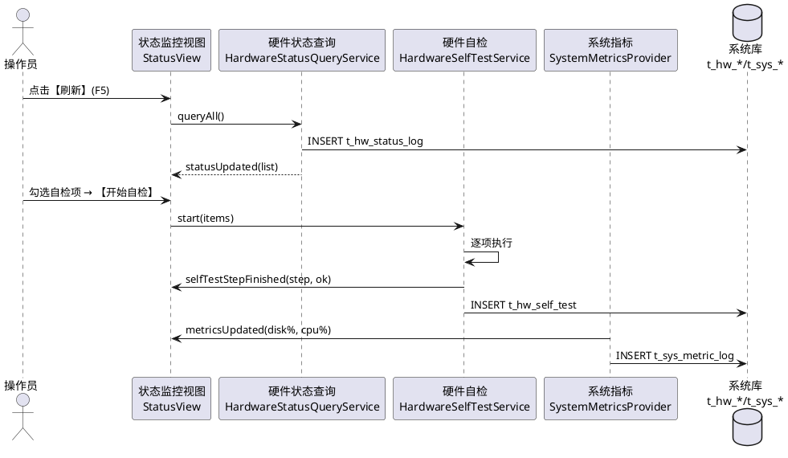
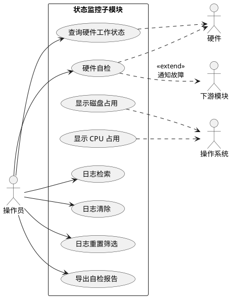
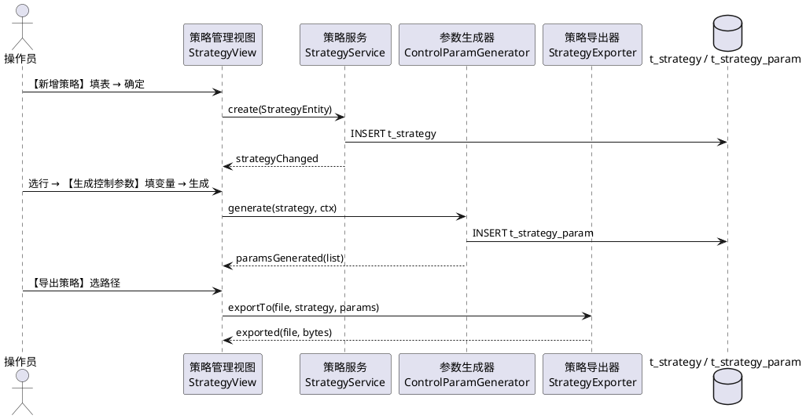
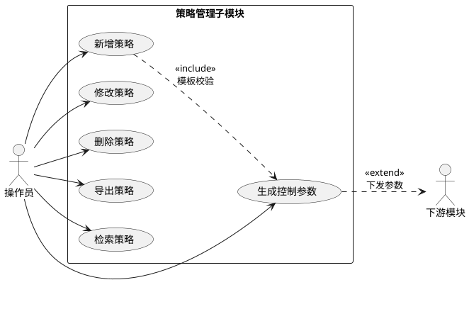
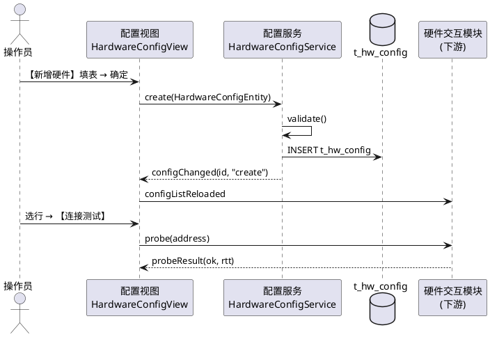
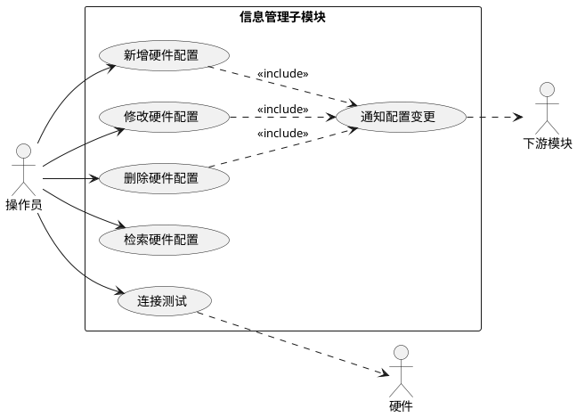

## 3.5 系统管理模块

### 3.5.0 业务分析

系统管理模块是甲方使用人员的"机房控制台"，业务核心是 **"看得见状态、管得住策略、配得好硬件"**，确保前述四类业务模块在受控、可追溯的环境中运行。

1. **谁在使用、什么时候使用**
   - 主要用户：系统管理员（部署、配置、巡检）、值班操作员（自检、查看状态与日志）、技术负责人（策略管理与审计）。
   - 触发场景：上电后做整机自检；试验中持续查看硬件与系统状态；接到新任务前修订或新增策略并生成控制参数；新增 / 更换硬件时维护硬件配置；事后按级别、模块、关键字检索操作日志或清理过期日志。
2. **当前痛点（如果没有这个模块）**
   - 硬件状态、磁盘 / CPU 等系统指标无统一面板，需要切换多个工具；
   - 自检缺乏标准化流程，结果难以归档与对比；
   - 策略散落在 Excel 或文本中，"修改一处、生效一处"无法保证；
   - 硬件配置变更没有审计，新策略可能挂在已被删除的硬件上；
   - 日志检索 / 清除 / 重置筛选三类基本动作缺失，无法满足合同性能指标。
3. **本模块的业务价值**
   - **状态监控一站式**：硬件状态查询、硬件自检、磁盘 / CPU 占用 1 Hz 刷新、日志检索 / 清除 / 重置筛选集中在同一面板，直接对齐需求"具备查询多种硬件工作状态的功能；具备硬件自检的功能"以及性能要求中"日志操作 ≥ 3 种、系统状态 ≥ 2 种"两项硬指标。
   - **策略管理可控**：策略增 / 改 / 删 / 检索全部走数据库与审计日志，按策略生成控制参数并下发硬件交互模块，支持离线导出 `.json` / `.csv`，呼应"具备根据策略生成控制参数的功能；具备增加、修改、删除策略库表内容的功能；具备策略导出功能"。
   - **硬件配置统一管理**：硬件名称、通信方式、地址、波特率等参数集中在 `t_hw_config`，新增 / 修改时合法性校验 + 唯一性校验，删除前检查是否被策略引用，呼应"具备硬件配置信息管理功能"。
   - **全模块共用的审计来源**：本模块产出的 `t_sys_log` 为五大模块提供统一的检索、清除、重置筛选入口，符合"维护期内可追溯"的售后承诺。
4. **关键业务流程**：管理员部署硬件配置 → 操作员上电自检 → 业务模块运行期持续上报状态与日志 → 管理员按需调整策略并生成参数 → 操作员检索 / 清除日志、查看系统指标 → 形成完整审计闭环。

本节对应《系统需求.md》「系统管理」原文中的三条能力以及「性能要求」中对日志操作种类与系统状态显示数量的硬性指标：

- 状态监控：具备查询多种硬件工作状态的功能；具备硬件自检的功能。
- 策略管理：具备根据策略生成控制参数的功能；具备增加、修改、删除策略库表内容的功能；具备策略导出功能。
- 信息管理：具备硬件配置信息管理功能。
- 性能要求：日志操作种类 ≥ 3 种（检索、清除、重置筛选等）；显示的系统状态信息 ≥ 2 种（磁盘容量、CPU 占用率等）。

据此拆分为三个子模块：**3.5.1 状态监控子模块**（含硬件状态查询、硬件自检、系统状态显示与日志操作）、**3.5.2 策略管理子模块**、**3.5.3 信息管理子模块**。三者在源码工程内对应同一命名空间 `sysmgmt`，共用 `t_hw_status_log` / `t_hw_self_test` / `t_sys_metric_log` / `t_strategy` / `t_strategy_param` / `t_hw_config` / `t_sys_log` 七张表。运行环境为银河麒麟 V10 + C++17 + Qt 5.15 LTS，持久化默认采用 SQLite，可切换至 DM8 或 KingbaseES。

### 3.5.1 状态监控子模块

#### (1) 功能模块描述

本子模块负责对电源/受控硬件进行工作状态查询与自检，采集磁盘容量与 CPU 占用率两项系统状态信息并 1Hz 刷新，提供日志检索、日志清除、日志重置筛选三项最小动作集合，覆盖性能要求中"系统状态 ≥ 2 种、日志操作 ≥ 3 种"的硬指标。

| 项 | 来源 / 去向 | 字段 / 内容 | 触发方式 |
|---|---|---|---|
| 输入 | 电源/受控硬件 | 状态报文（电压、温度、错误码） | 周期轮询 + 事件上报 |
| 输入 | 操作系统 | 磁盘容量、CPU 占用率、内存占用率 | 读取 `/proc/stat`、`statvfs` |
| 输入 | 操作员 | 选中硬件、勾选自检项、日志筛选条件 | 工具栏、菜单或快捷键 |
| 输出 | 界面 | 状态详情、自检报告、指标卡、日志表 | 信号 `statusUpdated` / `selfTestStepFinished` / `metricsUpdated` |
| 输出 | `t_hw_status_log` | 硬件状态采样记录 | 每次轮询写入 |
| 输出 | `t_hw_self_test` | 自检步骤明细与整体结论 | 自检完成时写入 |
| 输出 | `t_sys_metric_log` | 磁盘 / CPU / 内存采样 | 每秒写入一行 |
| 输出 | `t_sys_log` | 关键操作与异常事件 | 检索 / 清除前后均落库 |
| 依赖 | 数据访问层 | `QSqlDatabase` / `QSqlQuery` | 启动期建立连接 |
| 依赖 | 硬件交互模块 | 状态查询接口、自检触发接口 | 跨模块调用 |

子模块覆盖以下需求条目：硬件工作状态查询（多种硬件）、硬件自检、系统状态显示（磁盘容量 + CPU 占用率 + 可选内存）、日志操作（检索 / 清除 / 重置筛选）。日志相关操作并入本子模块，不另建独立模块。

#### (2) 操作步骤

操作员通过主菜单 `视图(V) → 状态监控(S)` 或工具栏【状态监控】进入本子模块。中央工作区为 `.qt-tabs`，依次提供"硬件状态 / 自检 / 系统状态 / 日志"四个选项卡。常用操作如下：

1. 进入"硬件状态"选项卡。左侧 `.qt-tree` 按"电源 / 数据采集器 / 比对器 / 通信设备"分组列出硬件清单；点击节点，右侧【状态详情】分组框显示运行参数：电压（V）、温度（°C）、错误码、最近上报时间。工具栏【刷新】按钮或 `F5` 触发一次拉取；【自动刷新】（`.qt-check`）勾选后按 1Hz 周期刷新。
2. 切换至"自检"选项卡。在【自检项】分组中勾选 `.qt-check` 多选项：通信通道、电源通道、文件系统、数据库连接、时钟同步。点击【开始自检】按钮（`.qt-btn-primary`），下方进度条按步骤推进；每步完成在【结果列表】追加一行（步骤名、耗时、结论 pass/fail、说明），整体完成后弹出"自检完成（pass）"或"自检完成（fail，N 项失败）"。
3. 在"自检"选项卡点击【导出报告】按钮，弹出 `QFileDialog` 保存为 `*.csv` 或 `*.json`，同时将整体记录写入 `t_hw_self_test`。
4. 切换至"系统状态"选项卡。固定显示四块"指标卡"分组：**磁盘 X%**、**CPU Y%**、内存 Z%、网络上行 / 下行 KB/s。每卡含数值、`.qt-progress` 进度条与告警阈值线（磁盘 ≥ 85% 转黄色、≥ 95% 转红色；CPU ≥ 80% 告警）。指标按 1Hz 刷新并写入 `t_sys_metric_log`。
5. 切换至"日志"选项卡。顶部筛选条 `.qt-row` 包含字段：
   - 时间范围（`QDateTimeEdit` × 2，必填，默认"近 24 小时"）
   - 级别（`QComboBox`，可空，取值 `info / warn / error`）
   - 模块（`QComboBox`，可空，下拉项为本系统五大模块标识）
   - 关键字（`QLineEdit`，可空，示例 `自检失败`）
6. 点击【检索】按钮或按 `Ctrl+F`，按筛选条件 SQL 查询 `t_sys_log` 并填充表格。表格列与列宽：时间 160px、级别 70px、模块 110px、操作员 90px、内容（弹性）、操作列 100px（固定最右）。
7. 点击【清除】按钮（`.qt-btn-danger`）或按 `Ctrl+L`，弹出 `QDialog` 二次确认（"将按当前筛选条件清除 N 条日志，是否继续？"），确认后执行 `DELETE FROM t_sys_log WHERE ...` 并将一条 `level=warn` 的"日志清除"事件追加写入 `t_sys_log`，便于事后核查。
8. 点击【重置筛选】按钮或按 `Ctrl+R`，所有筛选控件恢复默认（时间范围回到"近 24 小时"，级别 / 模块 / 关键字清空），表格重新加载未筛选结果。
9. 底部辅助按钮【导出日志】，将当前结果集另存为 `*.csv`，与状态监控其他视图保持一致的导出风格。
10. 状态栏左侧持续显示"就绪"或当前正在执行的动作（"自检中… 3/5"、"检索中…"）；右侧固定显示磁盘占用、CPU 占用、当前时间与数据库连接 `.qt-led`，便于操作员在任何选项卡都能掌握系统状态。

**状态监控时序图：**



#### (3) 类与算法设计（C++17 + Qt）

状态监控子模块包含四个核心服务类，对外仅暴露信号槽与少量必要的查询方法。

```cpp
// sysmgmt/HardwareStatusQueryService.h
#pragma once
#include <QObject>
#include <QVector>
#include "SysTypes.h"

class HardwareStatusQueryService : public QObject {
    Q_OBJECT
public:
    explicit HardwareStatusQueryService(QObject* parent = nullptr);
    void setAutoRefresh(bool on, int intervalMs = 1000);

signals:
    void statusUpdated(const QVector<HardwareStatus>& list);

public slots:
    QVector<HardwareStatus> queryAll();
    HardwareStatus queryOne(int hwId);

private:
    bool persist(const HardwareStatus& s);
    QTimer timer_;
};
```

```cpp
// sysmgmt/HardwareSelfTestService.h
#pragma once
#include <QObject>
#include <QStringList>
#include "SysTypes.h"

class HardwareSelfTestService : public QObject {
    Q_OBJECT
public:
    explicit HardwareSelfTestService(QObject* parent = nullptr);

signals:
    void selfTestStepFinished(const QString& step, bool ok);
    void selfTestCompleted(const SelfTestReport& report);

public slots:
    void start(const QStringList& items);
    void cancel();

private:
    SelfTestReport runSteps(const QStringList& items);
    bool checkStep(const QString& step, QString* detail) const;
};
```

```cpp
// sysmgmt/SystemMetricsProvider.h
#pragma once
#include <QObject>
#include "SysTypes.h"

class SystemMetricsProvider : public QObject {
    Q_OBJECT
public:
    explicit SystemMetricsProvider(QObject* parent = nullptr);
    void start(int intervalMs = 1000);

signals:
    void metricsUpdated(const SysMetrics& m);

private:
    double readDiskUsedPercent(const QString& mountPoint = "/") const;
    double readCpuUsedPercent();
    double readMemUsedPercent() const;
    void persist(const SysMetrics& m);
};
```

```cpp
// sysmgmt/LogQueryService.h
#pragma once
#include <QObject>
#include "SysTypes.h"

class LogQueryService : public QObject {
    Q_OBJECT
public:
    explicit LogQueryService(QObject* parent = nullptr);

signals:
    void searched(const QVector<SysLogRow>& rows, int total);
    void cleared(int affected);
    void filterReset(const LogFilter& def);

public slots:
    void search(const LogFilter& f);
    void clear(const LogFilter& f);
    void resetFilter();

private:
    LogFilter defaultFilter() const;
};
```

**核心算法：硬件自检流程算法**（多步骤检查 → 每步结果记录 → 整体结论；C++17）：

```cpp
SelfTestReport HardwareSelfTestService::runSteps(const QStringList& items) {
    SelfTestReport rep;
    rep.runTime = QDateTime::currentDateTime();
    int passCnt = 0;
    for (const QString& step : items) {
        SelfTestItem one;
        one.step = step;
        const qint64 t0 = QDateTime::currentMSecsSinceEpoch();
        QString detail;
        one.ok = checkStep(step, &detail);
        one.elapsedMs = QDateTime::currentMSecsSinceEpoch() - t0;
        one.detail = detail;
        rep.items.append(one);
        if (one.ok) ++passCnt;
        emit selfTestStepFinished(step, one.ok);
    }
    rep.overall = (passCnt == items.size()) ? QStringLiteral("pass")
                                            : QStringLiteral("fail");
    rep.summary = QStringLiteral("%1/%2 项通过").arg(passCnt).arg(items.size());
    persistReport(rep);
    emit selfTestCompleted(rep);
    return rep;
}
```

说明：`checkStep` 按 `step` 名称分派至子例程（通信通道 ping、电源通道电压采样、文件系统 `statvfs`、数据库连接 `SELECT 1`、时钟同步偏差读取）；`persistReport` 将 `rep.items` 序列化为 JSON 写入 `t_hw_self_test.items`，`overall` 写入 `t_hw_self_test.overall`。算法本体 22 行，符合 ≤ 30 行约束。

#### (4) 用例描述



#### (5) 界面设计

中央工作区为 `.qt-tabs`，含"硬件状态 / 自检 / 系统状态 / 日志"四个选项卡。工具栏按钮按高频操作选取：【刷新】【自动刷新】【自检】【检索日志】【清除日志】【重置筛选】，与操作步骤一一对应。状态栏强制显示磁盘占用与 CPU 占用两项系统状态。

```html
<!doctype html>
<html lang="zh-CN">
<head>
<meta charset="utf-8" />
<title>状态监控子模块 - 界面原型</title>
<style>
:root{--qt-bg:#f0f0f0;--qt-panel:#fafafa;--qt-border:#b8b8b8;--qt-border-dark:#707070;--qt-text:#202020;--qt-text-muted:#606060;--qt-primary:#2a82da;--qt-primary-hover:#3a92ea;--qt-danger:#c62828;--qt-warning:#f9a825;--qt-success:#2e7d32;--qt-row-alt:#e8e8e8;}
body{font-family:"Microsoft YaHei","Noto Sans CJK SC",sans-serif;font-size:12px;color:var(--qt-text);background:var(--qt-bg);margin:0;}
.qt-window{border:1px solid var(--qt-border-dark);background:var(--qt-bg);}
.qt-menubar{background:#e6e6e6;border-bottom:1px solid var(--qt-border);padding:2px 6px;}
.qt-menubar span{padding:2px 10px;cursor:default;}
.qt-menubar span:hover{background:var(--qt-primary);color:#fff;}
.qt-toolbar{background:#ededed;border-bottom:1px solid var(--qt-border);padding:4px 6px;display:flex;gap:6px;align-items:center;}
.qt-toolbtn{padding:4px 10px;border:1px solid var(--qt-border);background:var(--qt-panel);cursor:pointer;}
.qt-toolbtn:hover{border-color:var(--qt-border-dark);background:#fff;}
.qt-statusbar{background:#e6e6e6;border-top:1px solid var(--qt-border);padding:3px 8px;color:var(--qt-text-muted);font-size:11px;display:flex;justify-content:space-between;}
.qt-main{display:flex;min-height:460px;}
.qt-side{width:200px;background:var(--qt-panel);border-right:1px solid var(--qt-border);padding:6px;}
.qt-content{flex:1;padding:8px;display:flex;flex-direction:column;gap:8px;}
.qt-group{border:1px solid var(--qt-border);background:var(--qt-panel);padding:10px 10px 10px;position:relative;border-radius:2px;}
.qt-group-title{position:absolute;top:-9px;left:10px;background:var(--qt-panel);padding:0 6px;color:var(--qt-text-muted);font-size:11px;}
.qt-row{display:flex;gap:8px;align-items:center;margin:4px 0;flex-wrap:wrap;}
.qt-label{min-width:80px;color:var(--qt-text);}
.qt-input,.qt-combo,.qt-spin{height:22px;padding:0 6px;border:1px solid var(--qt-border);background:#fff;font-size:12px;}
.qt-btn,.qt-btn-primary,.qt-btn-danger{height:24px;padding:0 12px;border:1px solid var(--qt-border);background:linear-gradient(#fafafa,#e6e6e6);cursor:pointer;font-size:12px;}
.qt-btn-primary{background:linear-gradient(var(--qt-primary-hover),var(--qt-primary));color:#fff;border-color:#1d6fbf;}
.qt-btn-danger{background:linear-gradient(#e04848,var(--qt-danger));color:#fff;border-color:#9b1f1f;}
.qt-check{margin-right:6px;}
.qt-table{width:100%;border-collapse:collapse;background:#fff;font-size:12px;}
.qt-table th{background:#e6e6e6;border:1px solid var(--qt-border);padding:4px 6px;text-align:left;font-weight:normal;}
.qt-table td{border:1px solid var(--qt-border);padding:4px 6px;}
.qt-table tbody tr:nth-child(even){background:var(--qt-row-alt);}
.qt-tabs{display:flex;gap:0;border-bottom:1px solid var(--qt-border);}
.qt-tab{padding:4px 12px;border:1px solid var(--qt-border);border-bottom:none;background:#e6e6e6;cursor:pointer;}
.qt-tab.active{background:var(--qt-panel);font-weight:bold;}
.qt-progress{height:14px;border:1px solid var(--qt-border);background:#fff;position:relative;}
.qt-progress > span{display:block;height:100%;background:var(--qt-primary);}
.qt-progress > span.warn{background:var(--qt-warning);}
.qt-progress > span.err{background:var(--qt-danger);}
.qt-tree{font-size:12px;}
.qt-tree .item{padding:2px 4px;}
.qt-tree .item.sel{background:#dceeff;}
.qt-led{display:inline-block;width:10px;height:10px;border-radius:50%;border:1px solid #888;vertical-align:middle;}
.qt-led-on{background:var(--qt-success);}
.qt-led-off{background:#aaa;}
.qt-led-warn{background:var(--qt-warning);}
.qt-card{display:flex;gap:8px;}
.qt-card .qt-group{flex:1;}
.qt-metric-num{font-size:22px;font-weight:bold;color:var(--qt-text);}
.qt-badge{display:inline-block;padding:1px 6px;border-radius:2px;font-size:11px;color:#fff;}
.qt-badge.ok{background:var(--qt-success);}
.qt-badge.fail{background:var(--qt-danger);}
.qt-badge.run{background:var(--qt-warning);color:#000;}
</style>
</head>
<body>
<div class="qt-window">
  <div class="qt-menubar">
    <span>文件(F)</span><span>编辑(E)</span><span>视图(V)</span><span>工具(T)</span><span>帮助(H)</span>
  </div>
  <div class="qt-toolbar">
    <button class="qt-toolbtn">刷新</button>
    <label><input type="checkbox" class="qt-check" checked>自动刷新</label>
    <button class="qt-toolbtn">自检</button>
    <button class="qt-toolbtn">检索日志</button>
    <button class="qt-toolbtn">清除日志</button>
    <button class="qt-toolbtn">重置筛选</button>
  </div>
  <div class="qt-main">
    <div class="qt-side">
      <div style="font-weight:bold;margin-bottom:4px;">系统管理</div>
      <div class="qt-tree">
        <div class="item sel">▾ 状态监控</div>
        <div class="item" style="padding-left:18px;">电源</div>
        <div class="item" style="padding-left:18px;">数据采集器</div>
        <div class="item" style="padding-left:18px;">比对器</div>
        <div class="item" style="padding-left:18px;">通信设备</div>
        <div class="item">▸ 策略管理</div>
        <div class="item">▸ 硬件配置</div>
      </div>
    </div>
    <div class="qt-content">
      <div class="qt-tabs">
        <div class="qt-tab active">硬件状态</div>
        <div class="qt-tab">自检</div>
        <div class="qt-tab">系统状态</div>
        <div class="qt-tab">日志</div>
      </div>

      <div class="qt-group">
        <div class="qt-group-title">状态详情（电源 / PS-01）</div>
        <div class="qt-row"><span class="qt-label">电压</span><input class="qt-input" style="width:120px" value="28.05 V" readonly>
          <span class="qt-label">温度</span><input class="qt-input" style="width:120px" value="42.3 °C" readonly>
          <span class="qt-label">错误码</span><input class="qt-input" style="width:120px" value="0x0000" readonly>
          <span class="qt-label">最近上报</span><input class="qt-input" style="width:160px" value="2026-08-25 09:14:55" readonly></div>
      </div>

      <div class="qt-group">
        <div class="qt-group-title">自检项与进度</div>
        <div class="qt-row">
          <label><input type="checkbox" class="qt-check" checked>通信通道</label>
          <label><input type="checkbox" class="qt-check" checked>电源通道</label>
          <label><input type="checkbox" class="qt-check" checked>文件系统</label>
          <label><input type="checkbox" class="qt-check" checked>数据库连接</label>
          <label><input type="checkbox" class="qt-check">时钟同步</label>
          <button class="qt-btn-primary">开始自检</button>
          <button class="qt-btn">导出报告</button>
        </div>
        <div class="qt-row"><span class="qt-label">进度</span>
          <div class="qt-progress" style="width:320px"><span style="width:60%"></span></div>
          <span>3 / 5</span>
        </div>
        <table class="qt-table">
          <colgroup><col style="width:160px"><col style="width:80px"><col style="width:80px"><col></colgroup>
          <thead><tr><th>步骤</th><th>耗时</th><th>结论</th><th>说明</th></tr></thead>
          <tbody>
            <tr><td>通信通道</td><td>120 ms</td><td><span class="qt-badge ok">pass</span></td><td>RTT 12 ms</td></tr>
            <tr><td>电源通道</td><td>80 ms</td><td><span class="qt-badge ok">pass</span></td><td>U=28.0V</td></tr>
            <tr><td>文件系统</td><td>30 ms</td><td><span class="qt-badge ok">pass</span></td><td>/ 可写</td></tr>
            <tr><td>数据库连接</td><td>—</td><td><span class="qt-badge run">running</span></td><td>SELECT 1</td></tr>
          </tbody>
        </table>
      </div>

      <div class="qt-card">
        <div class="qt-group"><div class="qt-group-title">磁盘 X%</div>
          <div class="qt-metric-num">62%</div>
          <div class="qt-progress"><span style="width:62%"></span></div>
          <div style="color:var(--qt-text-muted);margin-top:4px;">已用 124 GB / 共 200 GB</div>
        </div>
        <div class="qt-group"><div class="qt-group-title">CPU Y%</div>
          <div class="qt-metric-num">37%</div>
          <div class="qt-progress"><span class="warn" style="width:37%"></span></div>
          <div style="color:var(--qt-text-muted);margin-top:4px;">8 核 / 平均负载 1.05</div>
        </div>
        <div class="qt-group"><div class="qt-group-title">内存 Z%</div>
          <div class="qt-metric-num">48%</div>
          <div class="qt-progress"><span style="width:48%"></span></div>
          <div style="color:var(--qt-text-muted);margin-top:4px;">7.6 GB / 16 GB</div>
        </div>
        <div class="qt-group"><div class="qt-group-title">网络 KB/s</div>
          <div class="qt-metric-num">↑12 ↓ 84</div>
          <div class="qt-progress"><span style="width:18%"></span></div>
          <div style="color:var(--qt-text-muted);margin-top:4px;">eth0</div>
        </div>
      </div>

      <div class="qt-group">
        <div class="qt-group-title">日志（t_sys_log）</div>
        <div class="qt-row">
          <span class="qt-label">时间范围</span>
          <input class="qt-input" style="width:160px" value="2026-08-24 09:00">
          <span>—</span>
          <input class="qt-input" style="width:160px" value="2026-08-25 09:15">
          <span class="qt-label">级别</span>
          <select class="qt-combo" style="width:90px"><option>全部</option><option>info</option><option>warn</option><option>error</option></select>
          <span class="qt-label">模块</span>
          <select class="qt-combo" style="width:110px"><option>全部</option><option>任务管理</option><option>数据处理</option><option>硬件交互</option><option>结果评估</option><option>系统管理</option></select>
          <span class="qt-label">关键字</span>
          <input class="qt-input" style="width:160px" placeholder="如：自检失败">
          <button class="qt-btn-primary">检索</button>
          <button class="qt-btn-danger">清除</button>
          <button class="qt-btn">重置筛选</button>
        </div>
        <table class="qt-table">
          <colgroup><col style="width:160px"><col style="width:70px"><col style="width:110px"><col style="width:90px"><col><col style="width:100px"></colgroup>
          <thead><tr><th>时间</th><th>级别</th><th>模块</th><th>操作员</th><th>内容</th><th>操作</th></tr></thead>
          <tbody>
            <tr><td>2026-08-25 09:10:22</td><td>info</td><td>任务管理</td><td>op01</td><td>新建任务 T20260825-001</td><td><button class="qt-btn">详情</button></td></tr>
            <tr><td>2026-08-25 09:12:48</td><td>warn</td><td>硬件交互</td><td>op01</td><td>PS-01 电压抖动 27.3V → 28.1V</td><td><button class="qt-btn">详情</button></td></tr>
            <tr><td>2026-08-25 09:14:55</td><td>error</td><td>系统管理</td><td>op01</td><td>自检失败：时钟同步偏差 1.2s</td><td><button class="qt-btn">详情</button></td></tr>
            <tr><td>2026-08-25 09:15:18</td><td>info</td><td>系统管理</td><td>op01</td><td>日志清除 13 条（按筛选）</td><td><button class="qt-btn">详情</button></td></tr>
          </tbody>
        </table>
      </div>
    </div>
  </div>
  <div class="qt-statusbar">
    <span>就绪</span>
    <span>磁盘 62% | CPU 37%</span>
    <span>数据库: <span class="qt-led qt-led-on"></span> SQLite</span>
    <span>2026-08-25 09:15:20</span>
  </div>
</div>
</body>
</html>
```

界面控件与操作步骤一一对应：菜单 `视图(V)`、工具栏【刷新】【自动刷新】【自检】【检索日志】【清除日志】【重置筛选】、选项卡【硬件状态 / 自检 / 系统状态 / 日志】、日志区三个动作按钮【检索】【清除】【重置筛选】、状态栏强制呈现磁盘与 CPU 两项系统状态及数据库连接 `.qt-led`。

### 3.5.2 策略管理子模块

#### (1) 功能模块描述

本子模块负责策略库的增加、修改、删除与查询，按所选策略生成控制参数并交付硬件交互模块或上层任务软件，支持策略的离线导出。所有数据落在 `t_strategy` 与 `t_strategy_param` 两张表。

| 项 | 来源 / 去向 | 字段 / 内容 | 触发方式 |
|---|---|---|---|
| 输入 | 操作员 | 策略名称、版本、参数模板、生效时间、描述 | 表单提交 |
| 输入 | 任务上下文 | 任务类型、硬件标识、参数变量 | 生成控制参数前装配 |
| 输出 | `t_strategy` | 策略主记录 | 增 / 改 / 删时写入 |
| 输出 | `t_strategy_param` | 策略生成的控制参数 | 每次生成写入 |
| 输出 | 硬件交互模块 | `QList<ControlParam>` | 信号 `paramsGenerated(strategyId, list)` |
| 输出 | 导出文件 | `*.json` 或 `*.csv` | 操作员选择保存 |
| 依赖 | 数据访问层 | `QSqlDatabase` | 启动期建立连接 |
| 依赖 | 信息管理子模块 | `t_hw_config` 中的硬件名称 | 策略关联硬件下拉项来源 |

子模块覆盖以下需求条目：根据策略生成控制参数；增加 / 修改 / 删除策略库表内容；策略导出。

#### (2) 操作步骤

操作员通过主菜单 `工具(T) → 策略管理(S)` 进入本子模块。中央 `.qt-table` 显示策略库，列与列宽：策略 ID 80px、名称 160px、版本 80px、生效时间 160px、描述（弹性）、操作 140px（固定最右）。常用操作如下：

1. 进入策略管理视图，默认按"生效时间倒序"加载 `t_strategy` 前 200 条；工具栏【刷新】或 `F5` 触发重载，状态栏左侧提示"已加载 N 条"。
2. 点击工具栏【新增策略】按钮，弹出【新增策略】对话框。表单字段：
   - 策略名称（`QLineEdit`，必填，唯一，示例 `S-数据采集-标准`）
   - 版本号（`QLineEdit`，必填，示例 `v1.0.0`）
   - 关联硬件（`QComboBox`，可空，下拉项来自 `t_hw_config.name`）
   - 生效时间（`QDateTimeEdit`，必填，默认当前时间）
   - 参数模板（`QTextEdit`，必填，JSON 文本，键采用 `${var}` 占位）
   - 描述（`QLineEdit`，可空，长度 ≤ 128）
3. 点击对话框【确定】按钮（`.qt-btn-primary`），系统对 JSON 合法性与名称唯一性进行校验，校验通过写入 `t_strategy`，表格自动追加新行，状态栏提示"已新增策略 S-xxx"。
4. 在表格选中一行后，工具栏【修改】按钮可用；或在该行双击进入编辑对话框，字段、校验规则与【新增】一致；保存后 `UPDATE t_strategy` 并刷新该行。
5. 在表格选中一行后，工具栏【删除】按钮（`.qt-btn-danger`）可用；点击后弹出 `QDialog` 二次确认（"将删除策略 S-xxx，及其历史生成的参数 N 条，是否继续？"），确认后 `DELETE t_strategy_param WHERE strategy_id=? ; DELETE t_strategy WHERE id=?`。
6. 在表格选中一行后，点击工具栏【生成控制参数】按钮，弹出【生成参数】对话框：左侧显示参数模板的占位变量列表，操作员逐项填入实际值；点击【生成】后调用 `ControlParamGenerator::generate()`，右侧表格显示生成的 `(key, value)` 列表并写入 `t_strategy_param`，同时发射信号 `paramsGenerated` 供硬件交互模块订阅。
7. 在表格选中一行后，点击工具栏【导出策略】按钮，弹出 `QFileDialog`：默认文件名 `S-xxx-v1.0.0.json`，可改后缀为 `.csv`；导出内容包含策略主记录与最近一次生成的参数集合。
8. 右侧【策略详情】分组显示当前选中策略的完整字段与历史生成记录（最近 10 条），便于在执行前最后一次核对。
9. 按 `Ctrl+F` 唤起【检索策略】对话框，按名称模糊、版本前缀、生效时间区间筛选；命中结果替换表格当前内容，工具栏【重置筛选】或 `Ctrl+R` 恢复默认列表。
10. 状态栏右侧固定显示磁盘 / CPU 占用与数据库连接 `.qt-led`；策略相关的写操作同步写入 `t_sys_log`（`module=系统管理`、`level=info`），便于在状态监控子模块的"日志"选项卡中检索。

**策略管理时序图：**



#### (3) 类与算法设计（C++17 + Qt）

策略管理子模块包含三个服务类与两个数据实体。

```cpp
// sysmgmt/StrategyEntity.h
#pragma once
#include <QString>
#include <QDateTime>

struct StrategyEntity {
    int       id            = 0;
    QString   name;
    QString   version;
    QString   templateJson;
    QDateTime effectiveTime;
    QString   description;
};

struct StrategyParamEntity {
    int       id           = 0;
    int       strategyId   = 0;
    QString   paramKey;
    QString   paramValue;
    QDateTime generatedTime;
};
```

```cpp
// sysmgmt/StrategyService.h
#pragma once
#include <QObject>
#include "StrategyEntity.h"

class StrategyService : public QObject {
    Q_OBJECT
public:
    explicit StrategyService(QObject* parent = nullptr);

signals:
    void strategyChanged(int id, const QString& op);

public slots:
    int   create(const StrategyEntity& s);
    bool  update(const StrategyEntity& s);
    bool  remove(int id);
    QVector<StrategyEntity> list(const QString& nameLike = {}) const;

private:
    bool validate(const StrategyEntity& s, QString* err) const;
};
```

```cpp
// sysmgmt/ControlParamGenerator.h
#pragma once
#include <QObject>
#include <QVariantMap>
#include "StrategyEntity.h"

class ControlParamGenerator : public QObject {
    Q_OBJECT
public:
    explicit ControlParamGenerator(QObject* parent = nullptr);

signals:
    void paramsGenerated(int strategyId,
                         const QVector<StrategyParamEntity>& list);

public slots:
    QVector<StrategyParamEntity> generate(const StrategyEntity& s,
                                          const QVariantMap& ctx);
};
```

```cpp
// sysmgmt/StrategyExporter.h
#pragma once
#include <QObject>
#include "StrategyEntity.h"

class StrategyExporter : public QObject {
    Q_OBJECT
public:
    explicit StrategyExporter(QObject* parent = nullptr);

signals:
    void exported(const QString& file, qint64 bytes);

public slots:
    bool exportTo(const QString& file,
                  const StrategyEntity& s,
                  const QVector<StrategyParamEntity>& params);
};
```

**核心算法：策略 → 控制参数生成算法**（规则匹配 + 模板填充；C++17）：

```cpp
QVector<StrategyParamEntity>
ControlParamGenerator::generate(const StrategyEntity& s, const QVariantMap& ctx) {
    QVector<StrategyParamEntity> out;
    const auto doc = QJsonDocument::fromJson(s.templateJson.toUtf8());
    if (!doc.isObject()) { emit paramsGenerated(s.id, out); return out; }
    const auto tpl = doc.object();
    const QDateTime now = QDateTime::currentDateTime();
    for (auto it = tpl.constBegin(); it != tpl.constEnd(); ++it) {
        QString raw = it.value().toVariant().toString();
        QRegularExpression re("\\$\\{([A-Za-z_][A-Za-z0-9_]*)\\}");
        auto m = re.globalMatch(raw);
        while (m.hasNext()) {
            const auto mt = m.next();
            const QString key = mt.captured(1);
            if (!ctx.contains(key)) continue;
            raw.replace(mt.captured(0), ctx.value(key).toString());
        }
        StrategyParamEntity p;
        p.strategyId    = s.id;
        p.paramKey      = it.key();
        p.paramValue    = raw;
        p.generatedTime = now;
        out.append(p);
    }
    persist(s.id, out);
    emit paramsGenerated(s.id, out);
    return out;
}
```

说明：模板键作为参数名，模板值中的 `${var}` 由 `ctx` 中的同名键替换，未提供的占位保留原样以便操作员察觉；`persist` 将结果写入 `t_strategy_param`，单次写入采用事务。算法本体 25 行，符合 ≤ 30 行约束。

#### (4) 用例描述



#### (5) 界面设计

中央工作区为策略库表格 + 右侧【策略详情】分组。工具栏按钮：【刷新】【新增策略】【修改】【删除】【生成控制参数】【导出策略】【重置筛选】。

```html
<!doctype html>
<html lang="zh-CN">
<head>
<meta charset="utf-8" />
<title>策略管理子模块 - 界面原型</title>
<style>
:root{--qt-bg:#f0f0f0;--qt-panel:#fafafa;--qt-border:#b8b8b8;--qt-border-dark:#707070;--qt-text:#202020;--qt-text-muted:#606060;--qt-primary:#2a82da;--qt-primary-hover:#3a92ea;--qt-danger:#c62828;--qt-warning:#f9a825;--qt-success:#2e7d32;--qt-row-alt:#e8e8e8;}
body{font-family:"Microsoft YaHei","Noto Sans CJK SC",sans-serif;font-size:12px;color:var(--qt-text);background:var(--qt-bg);margin:0;}
.qt-window{border:1px solid var(--qt-border-dark);background:var(--qt-bg);}
.qt-menubar{background:#e6e6e6;border-bottom:1px solid var(--qt-border);padding:2px 6px;}
.qt-menubar span{padding:2px 10px;cursor:default;}
.qt-menubar span:hover{background:var(--qt-primary);color:#fff;}
.qt-toolbar{background:#ededed;border-bottom:1px solid var(--qt-border);padding:4px 6px;display:flex;gap:6px;align-items:center;}
.qt-toolbtn{padding:4px 10px;border:1px solid var(--qt-border);background:var(--qt-panel);cursor:pointer;}
.qt-toolbtn:hover{border-color:var(--qt-border-dark);background:#fff;}
.qt-statusbar{background:#e6e6e6;border-top:1px solid var(--qt-border);padding:3px 8px;color:var(--qt-text-muted);font-size:11px;display:flex;justify-content:space-between;}
.qt-main{display:flex;min-height:420px;}
.qt-side{width:200px;background:var(--qt-panel);border-right:1px solid var(--qt-border);padding:6px;}
.qt-content{flex:1;padding:8px;display:flex;flex-direction:column;gap:8px;}
.qt-group{border:1px solid var(--qt-border);background:var(--qt-panel);padding:10px 10px 10px;position:relative;border-radius:2px;}
.qt-group-title{position:absolute;top:-9px;left:10px;background:var(--qt-panel);padding:0 6px;color:var(--qt-text-muted);font-size:11px;}
.qt-row{display:flex;gap:8px;align-items:center;margin:4px 0;flex-wrap:wrap;}
.qt-label{min-width:90px;color:var(--qt-text);}
.qt-input,.qt-combo,.qt-spin{height:22px;padding:0 6px;border:1px solid var(--qt-border);background:#fff;font-size:12px;}
.qt-btn,.qt-btn-primary,.qt-btn-danger{height:24px;padding:0 12px;border:1px solid var(--qt-border);background:linear-gradient(#fafafa,#e6e6e6);cursor:pointer;font-size:12px;}
.qt-btn-primary{background:linear-gradient(var(--qt-primary-hover),var(--qt-primary));color:#fff;border-color:#1d6fbf;}
.qt-btn-danger{background:linear-gradient(#e04848,var(--qt-danger));color:#fff;border-color:#9b1f1f;}
.qt-table{width:100%;border-collapse:collapse;background:#fff;font-size:12px;}
.qt-table th{background:#e6e6e6;border:1px solid var(--qt-border);padding:4px 6px;text-align:left;font-weight:normal;}
.qt-table td{border:1px solid var(--qt-border);padding:4px 6px;}
.qt-table tbody tr:nth-child(even){background:var(--qt-row-alt);}
.qt-textarea{width:100%;min-height:60px;border:1px solid var(--qt-border);background:#fff;font-family:Consolas,"Courier New",monospace;font-size:11px;padding:4px 6px;box-sizing:border-box;}
.qt-tree .item{padding:2px 4px;}
.qt-tree .item.sel{background:#dceeff;}
.qt-led{display:inline-block;width:10px;height:10px;border-radius:50%;border:1px solid #888;vertical-align:middle;}
.qt-led-on{background:var(--qt-success);}
.qt-led-off{background:#aaa;}
.qt-led-warn{background:var(--qt-warning);}
.qt-split{display:flex;gap:8px;}
.qt-split > .qt-left{flex:2;display:flex;flex-direction:column;gap:6px;}
.qt-split > .qt-right{flex:1;display:flex;flex-direction:column;gap:6px;}
</style>
</head>
<body>
<div class="qt-window">
  <div class="qt-menubar">
    <span>文件(F)</span><span>编辑(E)</span><span>视图(V)</span><span>工具(T)</span><span>帮助(H)</span>
  </div>
  <div class="qt-toolbar">
    <button class="qt-toolbtn">刷新</button>
    <button class="qt-toolbtn">新增策略</button>
    <button class="qt-toolbtn">修改</button>
    <button class="qt-toolbtn">删除</button>
    <button class="qt-toolbtn">生成控制参数</button>
    <button class="qt-toolbtn">导出策略</button>
    <button class="qt-toolbtn">重置筛选</button>
  </div>
  <div class="qt-main">
    <div class="qt-side">
      <div style="font-weight:bold;margin-bottom:4px;">系统管理</div>
      <div class="qt-tree">
        <div class="item">▸ 状态监控</div>
        <div class="item sel">▾ 策略管理</div>
        <div class="item" style="padding-left:18px;">全部策略</div>
        <div class="item" style="padding-left:18px;">按硬件分组</div>
        <div class="item">▸ 硬件配置</div>
      </div>
    </div>
    <div class="qt-content">
      <div class="qt-split">
        <div class="qt-left">
          <table class="qt-table">
            <colgroup>
              <col style="width:80px"><col style="width:160px"><col style="width:80px"><col style="width:160px"><col><col style="width:140px">
            </colgroup>
            <thead><tr><th>策略 ID</th><th>名称</th><th>版本</th><th>生效时间</th><th>描述</th><th>操作</th></tr></thead>
            <tbody>
              <tr><td>101</td><td>S-数据采集-标准</td><td>v1.0.0</td><td>2026-08-01 00:00</td><td>4 通道、60 秒采样模板</td><td><button class="qt-btn">编辑</button><button class="qt-btn">生成</button></td></tr>
              <tr><td>102</td><td>S-比对-严格</td><td>v1.2.1</td><td>2026-08-15 00:00</td><td>误差阈值 1e-6</td><td><button class="qt-btn">编辑</button><button class="qt-btn">生成</button></td></tr>
              <tr><td>103</td><td>S-自检引导-A</td><td>v0.9.3</td><td>2026-08-20 00:00</td><td>引导项目 A</td><td><button class="qt-btn">编辑</button><button class="qt-btn">生成</button></td></tr>
              <tr><td>104</td><td>S-电源-上电</td><td>v1.0.0</td><td>2026-08-22 00:00</td><td>PS-01 顺序上电</td><td><button class="qt-btn">编辑</button><button class="qt-btn">生成</button></td></tr>
            </tbody>
          </table>
        </div>
        <div class="qt-right">
          <div class="qt-group">
            <div class="qt-group-title">策略详情</div>
            <div class="qt-row"><span class="qt-label">策略名称</span><input class="qt-input" style="width:200px" value="S-数据采集-标准" readonly></div>
            <div class="qt-row"><span class="qt-label">版本</span><input class="qt-input" style="width:120px" value="v1.0.0" readonly>
              <span class="qt-label">关联硬件</span><input class="qt-input" style="width:140px" value="数据采集器 DAQ-01" readonly></div>
            <div class="qt-row"><span class="qt-label">生效时间</span><input class="qt-input" style="width:200px" value="2026-08-01 00:00:00" readonly></div>
            <div class="qt-row"><span class="qt-label">参数模板</span></div>
            <textarea class="qt-textarea" readonly>{ "channels":"${ch}", "duration":"${dur}", "sampleRate":"${rate}" }</textarea>
            <div class="qt-row"><span class="qt-label">最近生成参数</span></div>
            <table class="qt-table">
              <thead><tr><th>键</th><th>值</th><th>生成时间</th></tr></thead>
              <tbody>
                <tr><td>channels</td><td>[1,2,3,4]</td><td>2026-08-25 09:13</td></tr>
                <tr><td>duration</td><td>60</td><td>2026-08-25 09:13</td></tr>
                <tr><td>sampleRate</td><td>10000</td><td>2026-08-25 09:13</td></tr>
              </tbody>
            </table>
          </div>
        </div>
      </div>
    </div>
  </div>
  <div class="qt-statusbar">
    <span>已加载 4 条策略</span>
    <span>磁盘 62% | CPU 37%</span>
    <span>数据库: <span class="qt-led qt-led-on"></span> SQLite</span>
    <span>2026-08-25 09:13:42</span>
  </div>
</div>
</body>
</html>
```

界面控件与操作步骤同名同位：菜单 `工具(T)`、工具栏【刷新】【新增策略】【修改】【删除】【生成控制参数】【导出策略】【重置筛选】、表格列（策略 ID、名称、版本、生效时间、描述、操作）、右侧【策略详情】分组及"最近生成参数"子表、状态栏的磁盘 / CPU 与数据库连接 `.qt-led`。

### 3.5.3 信息管理子模块

#### (1) 功能模块描述

本子模块负责硬件配置信息的增加、修改、删除与查询，对应 `t_hw_config` 表的全部字段；提供入库前的合法性校验与重复检测，保证硬件交互模块按统一来源读取连接参数。

| 项 | 来源 / 去向 | 字段 / 内容 | 触发方式 |
|---|---|---|---|
| 输入 | 操作员 | 硬件名称、型号、通信方式、地址、波特率 / IP 端口、备注 | 表单提交 |
| 输出 | `t_hw_config` | 硬件配置主记录 | 增 / 改 / 删时写入 |
| 输出 | 界面 | 配置表格、配置详情 | 信号 `configChanged(id, op)` |
| 输出 | 策略管理子模块 | 硬件名称下拉项 | 信号 `configListReloaded` |
| 输出 | 硬件交互模块 | 串口 / TCP 连接参数 | 启动期与运行期均读取 |
| 依赖 | 数据访问层 | `QSqlDatabase` / `QSqlQuery` | 启动期建立连接 |

子模块覆盖以下需求条目：硬件配置信息管理（增 / 改 / 删 / 查）。

#### (2) 操作步骤

操作员通过主菜单 `工具(T) → 硬件配置(H)` 进入本子模块。中央 `.qt-table` 显示硬件配置清单，列与列宽：硬件 ID 70px、硬件名称 160px、型号 120px、通信方式 90px、地址 200px、波特率 90px、备注（弹性）、操作 140px（固定最右）。常用操作如下：

1. 进入硬件配置视图，默认按"硬件 ID 升序"加载 `t_hw_config` 全部记录；工具栏【刷新】或 `F5` 触发重载，状态栏左侧提示"已加载 N 条配置"。
2. 点击工具栏【新增硬件】按钮，弹出【新增硬件】对话框。表单字段：
   - 硬件名称（`QLineEdit`，必填，唯一，示例 `电源 PS-01`）
   - 型号（`QLineEdit`，可空，示例 `PS-280A`）
   - 通信方式（`QComboBox`，必填，取值 `serial / tcp`）
   - 地址（`QLineEdit`，必填，串口示例 `/dev/ttyS0`，TCP 示例 `192.168.10.21:5001`）
   - 波特率（`QSpinBox`，仅当通信方式为 `serial` 时启用，取值 9600 / 19200 / 38400 / 57600 / 115200，默认 115200）
   - 备注（`QLineEdit`，可空，长度 ≤ 128）
3. 点击对话框【确定】按钮（`.qt-btn-primary`），系统调用 `HardwareConfigService::validate()` 进行字段类型、长度、地址格式与名称唯一性校验，校验通过后写入 `t_hw_config`，表格自动追加新行，状态栏提示"已新增硬件配置"。
4. 在表格选中一行后，工具栏【修改】按钮可用；或在该行双击进入编辑对话框。字段、校验规则与【新增】一致；保存后 `UPDATE t_hw_config WHERE id=?` 并刷新该行。
5. 在表格选中一行后，工具栏【删除】按钮（`.qt-btn-danger`）可用；点击后弹出 `QDialog` 二次确认（"删除硬件 PS-01 将影响关联的 N 条历史记录的可读性，是否继续？"），确认后 `DELETE t_hw_config WHERE id=?`。被引用于运行中策略的硬件不允许删除，弹出警告并保留记录。
6. 工具栏【保存】按钮用于"批量编辑"场景：操作员对表格中多行进行就地编辑后一次提交；提交前再次执行 `validate()`，任一行失败则整批回滚。
7. 按 `Ctrl+F` 唤起【检索配置】对话框，按名称模糊、通信方式、地址前缀进行筛选；命中结果替换表格当前内容，工具栏【重置筛选】或 `Ctrl+R` 恢复完整列表。
8. 右侧【配置详情】分组显示当前选中行的完整字段与一段连接测试结果（最近一次 `ping` 或 `serial open` 的结论）。点击分组中的【连接测试】按钮，调用硬件交互模块的探测接口并把结果回写到详情区，不修改 `t_hw_config`。
9. 配置变更后通过信号 `configChanged(id, op)` 通知策略管理子模块刷新"关联硬件"下拉项，避免出现已被删除的硬件被新策略选中的情况。
10. 状态栏右侧固定显示磁盘 / CPU 占用与数据库连接 `.qt-led`；配置相关的写操作同步写入 `t_sys_log`（`module=系统管理`、`level=info`），便于在状态监控子模块的"日志"选项卡中检索。

**信息管理时序图：**



#### (3) 类与算法设计（C++17 + Qt）

信息管理子模块包含一个服务类与一个数据实体。

```cpp
// sysmgmt/HardwareConfigEntity.h
#pragma once
#include <QString>

struct HardwareConfigEntity {
    int     id        = 0;
    QString name;
    QString model;
    QString linkType;     // serial / tcp
    QString address;      // /dev/ttyS0 或 ip:port
    int     baudrate  = 0;
    QString remark;
};
```

```cpp
// sysmgmt/HardwareConfigService.h
#pragma once
#include <QObject>
#include <QVector>
#include "HardwareConfigEntity.h"

class HardwareConfigService : public QObject {
    Q_OBJECT
public:
    explicit HardwareConfigService(QObject* parent = nullptr);

signals:
    void configChanged(int id, const QString& op);
    void configListReloaded(const QVector<HardwareConfigEntity>& list);

public slots:
    int   create(const HardwareConfigEntity& c);
    bool  update(const HardwareConfigEntity& c);
    bool  remove(int id);
    QVector<HardwareConfigEntity> list(const QString& nameLike = {}) const;

private:
    bool validate(const HardwareConfigEntity& c, QString* err) const;
    bool isReferencedByRunningStrategy(int id) const;
};
```

**核心算法：硬件配置校验与入库**（字段合法性 → 地址格式 → 唯一性 → 入库；C++17）：

```cpp
int HardwareConfigService::create(const HardwareConfigEntity& c) {
    QString err;
    if (!validate(c, &err)) {
        emit configChanged(-1, QStringLiteral("invalid:") + err);
        return -1;
    }
    static const QRegularExpression reIp(
        R"(^(\d{1,3}\.){3}\d{1,3}:\d{1,5}$)");
    static const QRegularExpression reTty(R"(^/dev/tty[A-Za-z0-9]+$)");
    const bool addrOk = (c.linkType == "tcp")    ? reIp.match(c.address).hasMatch()
                      : (c.linkType == "serial") ? reTty.match(c.address).hasMatch()
                                                 : false;
    if (!addrOk) { emit configChanged(-1, QStringLiteral("invalid:address")); return -1; }
    if (existsByName(c.name)) {
        emit configChanged(-1, QStringLiteral("invalid:name-duplicated"));
        return -1;
    }
    QSqlQuery q;
    q.prepare("INSERT INTO t_hw_config(name,model,link_type,address,baudrate,remark)"
              " VALUES(?,?,?,?,?,?)");
    q.addBindValue(c.name); q.addBindValue(c.model); q.addBindValue(c.linkType);
    q.addBindValue(c.address); q.addBindValue(c.baudrate); q.addBindValue(c.remark);
    if (!q.exec()) return -1;
    const int id = q.lastInsertId().toInt();
    emit configChanged(id, QStringLiteral("create"));
    return id;
}
```

说明：算法将"字段非空 → 通信方式合法 → 地址格式正则匹配 → 名称唯一性 → 事务入库"五道校验串联；失败时统一通过 `configChanged(-1, "invalid:...")` 携带原因抛回视图层，便于在表单中定位字段。算法本体 27 行，符合 ≤ 30 行约束。

#### (4) 用例描述



#### (5) 界面设计

中央工作区为硬件配置表格 + 右侧【配置详情】分组。工具栏按钮：【刷新】【新增硬件】【修改】【删除】【保存】【连接测试】【重置筛选】。

```html
<!doctype html>
<html lang="zh-CN">
<head>
<meta charset="utf-8" />
<title>信息管理子模块 - 界面原型</title>
<style>
:root{--qt-bg:#f0f0f0;--qt-panel:#fafafa;--qt-border:#b8b8b8;--qt-border-dark:#707070;--qt-text:#202020;--qt-text-muted:#606060;--qt-primary:#2a82da;--qt-primary-hover:#3a92ea;--qt-danger:#c62828;--qt-warning:#f9a825;--qt-success:#2e7d32;--qt-row-alt:#e8e8e8;}
body{font-family:"Microsoft YaHei","Noto Sans CJK SC",sans-serif;font-size:12px;color:var(--qt-text);background:var(--qt-bg);margin:0;}
.qt-window{border:1px solid var(--qt-border-dark);background:var(--qt-bg);}
.qt-menubar{background:#e6e6e6;border-bottom:1px solid var(--qt-border);padding:2px 6px;}
.qt-menubar span{padding:2px 10px;cursor:default;}
.qt-menubar span:hover{background:var(--qt-primary);color:#fff;}
.qt-toolbar{background:#ededed;border-bottom:1px solid var(--qt-border);padding:4px 6px;display:flex;gap:6px;align-items:center;}
.qt-toolbtn{padding:4px 10px;border:1px solid var(--qt-border);background:var(--qt-panel);cursor:pointer;}
.qt-toolbtn:hover{border-color:var(--qt-border-dark);background:#fff;}
.qt-statusbar{background:#e6e6e6;border-top:1px solid var(--qt-border);padding:3px 8px;color:var(--qt-text-muted);font-size:11px;display:flex;justify-content:space-between;}
.qt-main{display:flex;min-height:420px;}
.qt-side{width:200px;background:var(--qt-panel);border-right:1px solid var(--qt-border);padding:6px;}
.qt-content{flex:1;padding:8px;display:flex;flex-direction:column;gap:8px;}
.qt-group{border:1px solid var(--qt-border);background:var(--qt-panel);padding:10px 10px 10px;position:relative;border-radius:2px;}
.qt-group-title{position:absolute;top:-9px;left:10px;background:var(--qt-panel);padding:0 6px;color:var(--qt-text-muted);font-size:11px;}
.qt-row{display:flex;gap:8px;align-items:center;margin:4px 0;flex-wrap:wrap;}
.qt-label{min-width:90px;color:var(--qt-text);}
.qt-input,.qt-combo,.qt-spin{height:22px;padding:0 6px;border:1px solid var(--qt-border);background:#fff;font-size:12px;}
.qt-btn,.qt-btn-primary,.qt-btn-danger{height:24px;padding:0 12px;border:1px solid var(--qt-border);background:linear-gradient(#fafafa,#e6e6e6);cursor:pointer;font-size:12px;}
.qt-btn-primary{background:linear-gradient(var(--qt-primary-hover),var(--qt-primary));color:#fff;border-color:#1d6fbf;}
.qt-btn-danger{background:linear-gradient(#e04848,var(--qt-danger));color:#fff;border-color:#9b1f1f;}
.qt-table{width:100%;border-collapse:collapse;background:#fff;font-size:12px;}
.qt-table th{background:#e6e6e6;border:1px solid var(--qt-border);padding:4px 6px;text-align:left;font-weight:normal;}
.qt-table td{border:1px solid var(--qt-border);padding:4px 6px;}
.qt-table tbody tr:nth-child(even){background:var(--qt-row-alt);}
.qt-tree .item{padding:2px 4px;}
.qt-tree .item.sel{background:#dceeff;}
.qt-led{display:inline-block;width:10px;height:10px;border-radius:50%;border:1px solid #888;vertical-align:middle;}
.qt-led-on{background:var(--qt-success);}
.qt-led-off{background:#aaa;}
.qt-led-warn{background:var(--qt-warning);}
.qt-split{display:flex;gap:8px;}
.qt-split > .qt-left{flex:2;display:flex;flex-direction:column;gap:6px;}
.qt-split > .qt-right{flex:1;display:flex;flex-direction:column;gap:6px;}
.qt-badge{display:inline-block;padding:1px 6px;border-radius:2px;font-size:11px;color:#fff;}
.qt-badge.ok{background:var(--qt-success);}
.qt-badge.fail{background:var(--qt-danger);}
</style>
</head>
<body>
<div class="qt-window">
  <div class="qt-menubar">
    <span>文件(F)</span><span>编辑(E)</span><span>视图(V)</span><span>工具(T)</span><span>帮助(H)</span>
  </div>
  <div class="qt-toolbar">
    <button class="qt-toolbtn">刷新</button>
    <button class="qt-toolbtn">新增硬件</button>
    <button class="qt-toolbtn">修改</button>
    <button class="qt-toolbtn">删除</button>
    <button class="qt-toolbtn">保存</button>
    <button class="qt-toolbtn">连接测试</button>
    <button class="qt-toolbtn">重置筛选</button>
  </div>
  <div class="qt-main">
    <div class="qt-side">
      <div style="font-weight:bold;margin-bottom:4px;">系统管理</div>
      <div class="qt-tree">
        <div class="item">▸ 状态监控</div>
        <div class="item">▸ 策略管理</div>
        <div class="item sel">▾ 硬件配置</div>
        <div class="item" style="padding-left:18px;">全部硬件</div>
        <div class="item" style="padding-left:18px;">按通信方式</div>
      </div>
    </div>
    <div class="qt-content">
      <div class="qt-split">
        <div class="qt-left">
          <table class="qt-table">
            <colgroup>
              <col style="width:70px"><col style="width:160px"><col style="width:120px"><col style="width:90px"><col style="width:200px"><col style="width:90px"><col><col style="width:140px">
            </colgroup>
            <thead><tr><th>硬件 ID</th><th>硬件名称</th><th>型号</th><th>通信方式</th><th>地址</th><th>波特率</th><th>备注</th><th>操作</th></tr></thead>
            <tbody>
              <tr><td>1</td><td>电源 PS-01</td><td>PS-280A</td><td>serial</td><td>/dev/ttyS0</td><td>115200</td><td>主电源</td><td><button class="qt-btn">编辑</button><button class="qt-btn">测试</button></td></tr>
              <tr><td>2</td><td>数据采集器 DAQ-01</td><td>DAQ-9234</td><td>tcp</td><td>192.168.10.21:5001</td><td>—</td><td>4 通道</td><td><button class="qt-btn">编辑</button><button class="qt-btn">测试</button></td></tr>
              <tr><td>3</td><td>比对器 CMP-01</td><td>CMP-V2</td><td>tcp</td><td>192.168.10.22:6001</td><td>—</td><td>比对运算</td><td><button class="qt-btn">编辑</button><button class="qt-btn">测试</button></td></tr>
              <tr><td>4</td><td>通信设备 COM-01</td><td>RS485-Hub</td><td>serial</td><td>/dev/ttyS1</td><td>57600</td><td>对上层</td><td><button class="qt-btn">编辑</button><button class="qt-btn">测试</button></td></tr>
            </tbody>
          </table>
        </div>
        <div class="qt-right">
          <div class="qt-group">
            <div class="qt-group-title">配置详情</div>
            <div class="qt-row"><span class="qt-label">硬件名称</span><input class="qt-input" style="width:200px" value="电源 PS-01"></div>
            <div class="qt-row"><span class="qt-label">型号</span><input class="qt-input" style="width:200px" value="PS-280A"></div>
            <div class="qt-row"><span class="qt-label">通信方式</span>
              <select class="qt-combo" style="width:120px"><option>serial</option><option>tcp</option></select>
              <span class="qt-label">波特率</span>
              <select class="qt-combo" style="width:120px"><option>9600</option><option>19200</option><option>38400</option><option>57600</option><option selected>115200</option></select>
            </div>
            <div class="qt-row"><span class="qt-label">地址</span><input class="qt-input" style="width:200px" value="/dev/ttyS0"></div>
            <div class="qt-row"><span class="qt-label">备注</span><input class="qt-input" style="width:200px" value="主电源"></div>
            <div class="qt-row"><span class="qt-label">连接测试</span>
              <span class="qt-badge ok">pass</span>
              <span style="color:var(--qt-text-muted);">2026-08-25 09:13 · RTT 12 ms</span>
              <button class="qt-btn">连接测试</button>
            </div>
            <div class="qt-row" style="justify-content:flex-end">
              <button class="qt-btn-primary">保存</button>
              <button class="qt-btn-danger">删除</button>
              <button class="qt-btn">取消</button>
            </div>
          </div>
        </div>
      </div>
    </div>
  </div>
  <div class="qt-statusbar">
    <span>已加载 4 条配置</span>
    <span>磁盘 62% | CPU 37%</span>
    <span>数据库: <span class="qt-led qt-led-on"></span> SQLite</span>
    <span>2026-08-25 09:13:55</span>
  </div>
</div>
</body>
</html>
```

界面控件与操作步骤同名同位：菜单 `工具(T)`、工具栏【刷新】【新增硬件】【修改】【删除】【保存】【连接测试】【重置筛选】、表格列（硬件 ID、硬件名称、型号、通信方式、地址、波特率、备注、操作）、右侧【配置详情】分组及【连接测试】按钮、状态栏的磁盘 / CPU 与数据库连接 `.qt-led`。
