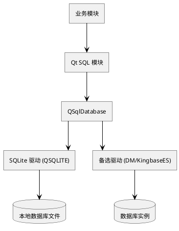
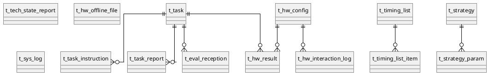

# 4. 数据库设计方案

## 4.1 数据库总体架构设计

系统数据库采用单库单 Schema 设计，部署于上位机本地，字符集 UTF-8，时区与操作系统一致。访问层使用 Qt SQL 模块（`QSqlDatabase` / `QSqlQuery` / `QAbstractTableModel`），不引入外部 ORM。

数据库选型如下：

| 选型 | 用途 | 版本 | 备注 |
|---|---|---|---|
| SQLite | 主选 | 3.x | 单文件嵌入式，Qt 原生驱动支持，零运维 |
| 达梦 DM8 | 备选 | DM8 | 信创场景，使用 Qt 通用驱动或厂家驱动 |
| 人大金仓 KingbaseES | 备选 | V8R6 | 信创场景 |

### 访问层组件图

## 4.2 核心业务数据表设计

下列字段表只列出关键字段，主键统一为自增 `id`（SQLite 为 `INTEGER PRIMARY KEY AUTOINCREMENT`，备选库为 `BIGINT IDENTITY` 或序列）。

### 4.2.1 任务管理相关表

**t_task** 任务主表

| 字段 | 类型 | 必填 | 说明 |
|---|---|---|---|
| id | INTEGER | 是 | 主键 |
| source_system | VARCHAR(64) | 是 | 来源软件标识 |
| task_no | VARCHAR(64) | 是 | 任务编号，唯一索引 |
| content | TEXT | 是 | 任务原文 |
| state | VARCHAR(16) | 是 | 状态：received / decomposed / running / done / failed |
| received_time | DATETIME | 是 | 接收时间 |
| finished_time | DATETIME | 否 | 完成时间 |

索引：`uk_task_no(task_no)`，`idx_state_time(state, received_time)`。

**t_task_instruction** 任务分解后的指令表

| 字段 | 类型 | 必填 | 说明 |
|---|---|---|---|
| id | INTEGER | 是 | 主键 |
| task_id | INTEGER | 是 | 外键→t_task.id |
| seq | INTEGER | 是 | 指令序号 |
| inst_code | VARCHAR(32) | 是 | 指令码 |
| inst_param | TEXT | 否 | 指令参数 JSON |
| state | VARCHAR(16) | 是 | 状态 |

索引：`idx_task_seq(task_id, seq)`。

**t_task_report** 结果上报记录

| 字段 | 类型 | 必填 | 说明 |
|---|---|---|---|
| id | INTEGER | 是 | 主键 |
| task_id | INTEGER | 是 | 外键 |
| target_system | VARCHAR(64) | 是 | 目标软件 |
| report_content | TEXT | 是 | 上报内容 |
| report_time | DATETIME | 是 | 上报时间 |
| state | VARCHAR(16) | 是 | success / failed |

**t_tech_state_report** 技术状态上报记录

| 字段 | 类型 | 必填 | 说明 |
|---|---|---|---|
| id | INTEGER | 是 | 主键 |
| target_system | VARCHAR(64) | 是 | 目标软件 |
| version | VARCHAR(32) | 是 | 软件版本 |
| config_snapshot | TEXT | 否 | 配置快照 |
| report_time | DATETIME | 是 | 上报时间 |
| state | VARCHAR(16) | 是 | success / failed |

### 4.2.2 数据处理相关表

**t_auto_process_log** 自动处理过程日志

| 字段 | 类型 | 必填 | 说明 |
|---|---|---|---|
| id | INTEGER | 是 | 主键 |
| batch_id | VARCHAR(32) | 是 | 处理批次 |
| hw_id | INTEGER | 是 | 关联硬件 |
| step | VARCHAR(64) | 是 | 步骤名 |
| step_time | DATETIME | 是 | 时间 |
| detail | TEXT | 否 | 详情 |

索引：`idx_batch(batch_id)`。

**t_db_table_meta** 业务表元数据登记

| 字段 | 类型 | 必填 | 说明 |
|---|---|---|---|
| id | INTEGER | 是 | 主键 |
| table_name | VARCHAR(64) | 是 | 表名，唯一 |
| purpose | VARCHAR(128) | 否 | 用途说明 |
| created_time | DATETIME | 是 | 登记时间 |

**t_table_compare_result** 表比对结果

| 字段 | 类型 | 必填 | 说明 |
|---|---|---|---|
| id | INTEGER | 是 | 主键 |
| left_table | VARCHAR(64) | 是 | 表 A |
| right_table | VARCHAR(64) | 是 | 表 B |
| diff_count | INTEGER | 是 | 差异条数 |
| diff_detail | TEXT | 否 | 差异明细 JSON |
| compare_time | DATETIME | 是 | 比对时间 |

**t_anomaly_alarm** 异常数据告警

| 字段 | 类型 | 必填 | 说明 |
|---|---|---|---|
| id | INTEGER | 是 | 主键 |
| level | VARCHAR(8) | 是 | info / warn / error |
| source | VARCHAR(64) | 是 | 来源 |
| content | TEXT | 是 | 告警内容 |
| alarm_time | DATETIME | 是 | 时间 |
| handled | INTEGER | 是 | 0/1 |

索引：`idx_level_time(level, alarm_time)`。

**t_manual_process_log** 手动处理记录

| 字段 | 类型 | 必填 | 说明 |
|---|---|---|---|
| id | INTEGER | 是 | 主键 |
| operator | VARCHAR(32) | 是 | 操作员标识 |
| action | VARCHAR(32) | 是 | 显示 / 控制 / 拼接 / 解析 / 算法 / 导出 / 保存 |
| target | VARCHAR(128) | 否 | 目标文件 / 表 / 算法 |
| action_time | DATETIME | 是 | 时间 |
| result | VARCHAR(16) | 是 | success / failed |

### 4.2.3 硬件交互相关表

**t_hw_interaction_log** 硬件交互过程日志

| 字段 | 类型 | 必填 | 说明 |
|---|---|---|---|
| id | INTEGER | 是 | 主键 |
| hw_id | INTEGER | 是 | 硬件配置 ID |
| direction | VARCHAR(8) | 是 | tx / rx |
| inst_code | VARCHAR(32) | 否 | 指令码 |
| payload | BLOB | 否 | 报文 |
| ts | DATETIME | 是 | 时间 |
| state | VARCHAR(16) | 是 | success / timeout / failed |

索引：`idx_hw_ts(hw_id, ts)`。

**t_hw_result** 硬件返回结果

| 字段 | 类型 | 必填 | 说明 |
|---|---|---|---|
| id | INTEGER | 是 | 主键 |
| task_id | INTEGER | 否 | 关联任务 |
| hw_id | INTEGER | 是 | 硬件 |
| file_path | VARCHAR(256) | 否 | 落盘文件路径 |
| summary | TEXT | 否 | 摘要 |
| ts | DATETIME | 是 | 时间 |

**t_hw_offline_file** 离线处理文件清单

| 字段 | 类型 | 必填 | 说明 |
|---|---|---|---|
| id | INTEGER | 是 | 主键 |
| file_path | VARCHAR(256) | 是 | 路径，唯一 |
| size | BIGINT | 是 | 字节数 |
| parsed | INTEGER | 是 | 0/1 |
| processed_time | DATETIME | 否 | 处理完成时间 |

### 4.2.4 结果评估相关表

**t_eval_reception** 接收效果评判记录

| 字段 | 类型 | 必填 | 说明 |
|---|---|---|---|
| id | INTEGER | 是 | 主键 |
| task_id | INTEGER | 否 | 关联任务 |
| integrity | REAL | 是 | 完整率 |
| error_rate | REAL | 是 | 误码率 |
| loss_rate | REAL | 是 | 丢包率 |
| grade | VARCHAR(2) | 是 | A/B/C |
| eval_time | DATETIME | 是 | 评判时间 |

**t_timing_list** 时序列表主表

| 字段 | 类型 | 必填 | 说明 |
|---|---|---|---|
| id | INTEGER | 是 | 主键 |
| task_id | INTEGER | 否 | 关联任务 |
| title | VARCHAR(128) | 是 | 列表名称 |
| created_time | DATETIME | 是 | 创建时间 |
| updated_time | DATETIME | 是 | 最近修改时间 |

**t_timing_list_item** 时序列表明细

| 字段 | 类型 | 必填 | 说明 |
|---|---|---|---|
| id | INTEGER | 是 | 主键 |
| list_id | INTEGER | 是 | 外键→t_timing_list.id |
| seq | INTEGER | 是 | 行号 |
| event_time | DATETIME | 是 | 事件时间 |
| event_name | VARCHAR(64) | 是 | 事件名 |
| params | TEXT | 否 | 参数 JSON |
| modified_by | VARCHAR(32) | 否 | 手动调整者 |
| modified_at | DATETIME | 否 | 手动调整时间 |

索引：`idx_list_seq(list_id, seq)`。

### 4.2.5 系统管理相关表

**t_hw_status_log** 硬件工作状态日志

| 字段 | 类型 | 必填 | 说明 |
|---|---|---|---|
| id | INTEGER | 是 | 主键 |
| hw_id | INTEGER | 是 | 硬件 |
| status | VARCHAR(16) | 是 | online / offline / warn |
| metrics | TEXT | 否 | 关键指标 JSON |
| ts | DATETIME | 是 | 采样时间 |

**t_hw_self_test** 自检结果

| 字段 | 类型 | 必填 | 说明 |
|---|---|---|---|
| id | INTEGER | 是 | 主键 |
| hw_id | INTEGER | 否 | 硬件，可空表示整机自检 |
| items | TEXT | 是 | 步骤结果 JSON |
| overall | VARCHAR(8) | 是 | pass / fail |
| run_time | DATETIME | 是 | 时间 |

**t_sys_metric_log** 系统状态采样（≥2 种指标）

| 字段 | 类型 | 必填 | 说明 |
|---|---|---|---|
| id | INTEGER | 是 | 主键 |
| ts | DATETIME | 是 | 采样时间 |
| disk_used | REAL | 是 | 磁盘占用百分比 |
| cpu_used | REAL | 是 | CPU 占用百分比 |
| mem_used | REAL | 否 | 内存占用百分比（可选） |

**t_strategy** 策略库

| 字段 | 类型 | 必填 | 说明 |
|---|---|---|---|
| id | INTEGER | 是 | 主键 |
| name | VARCHAR(64) | 是 | 名称，唯一 |
| version | VARCHAR(16) | 是 | 版本 |
| template | TEXT | 是 | 参数模板 JSON |
| effective_time | DATETIME | 否 | 生效时间 |
| description | TEXT | 否 | 描述 |

**t_strategy_param** 策略生成的控制参数

| 字段 | 类型 | 必填 | 说明 |
|---|---|---|---|
| id | INTEGER | 是 | 主键 |
| strategy_id | INTEGER | 是 | 外键 |
| param_key | VARCHAR(64) | 是 | 参数名 |
| param_value | TEXT | 是 | 参数值 |
| generated_time | DATETIME | 是 | 生成时间 |

**t_hw_config** 硬件配置信息

| 字段 | 类型 | 必填 | 说明 |
|---|---|---|---|
| id | INTEGER | 是 | 主键 |
| name | VARCHAR(64) | 是 | 硬件名称 |
| model | VARCHAR(64) | 否 | 型号 |
| link_type | VARCHAR(8) | 是 | serial / tcp |
| address | VARCHAR(64) | 是 | 端口或 IP:Port |
| baudrate | INTEGER | 否 | 波特率 |
| remark | VARCHAR(128) | 否 | 备注 |

**t_sys_log** 系统日志（支持 ≥3 种操作：检索 / 清除 / 重置筛选）

| 字段 | 类型 | 必填 | 说明 |
|---|---|---|---|
| id | INTEGER | 是 | 主键 |
| ts | DATETIME | 是 | 时间 |
| level | VARCHAR(8) | 是 | info / warn / error |
| module | VARCHAR(32) | 是 | 模块标识 |
| operator | VARCHAR(32) | 否 | 操作员 |
| content | TEXT | 是 | 内容 |

索引：`idx_log_ts(ts)`，`idx_log_level_module(level, module)`。

### ER 关系图

## 4.3 数据安全与运维设计

| 项 | 措施 |
|---|---|
| 备份 | 每日凌晨全量备份至备份目录；每小时增量备份，按周滚动覆盖 |
| 完整性 | 主键、外键、唯一、非空约束；外键约束在 SQLite 中需开启 `PRAGMA foreign_keys=ON` |
| 输入校验 | 入库前在服务层进行类型、范围、长度、格式校验，呼应安全性要求 |
| 审计 | 关键操作写入 `t_sys_log`，含操作员、模块、时间、内容，支撑日志检索 / 清除 / 重置筛选三类操作 |
| 历史归档 | `t_sys_log`、`t_hw_status_log`、`t_hw_interaction_log` 按月归档；归档后从在线库中清理，归档文件压缩落盘 |
| 慢查询 | 在开发与测试阶段开启 SQL 执行时间统计；运行期保留对 `t_sys_log` 的索引检查机制 |
| 容灾 | 维护期内出现故障，恢复后自动校验数据库文件完整性（SQLite `PRAGMA integrity_check`），异常则从最近备份恢复 |
