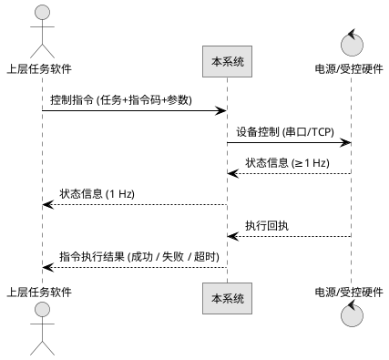

# 5. 性能与接口设计方案

本章对系统的性能与接口给出具体设计。性能部分严格落实系统需求中"日志操作种类 ≥3 种"与"系统状态信息显示 ≥2 种"两条硬性指标，并对实现路径进行展开。接口部分按系统需求中明确列出的控制指令、状态信息与指令执行结果三类，分别给出报文结构、字段含义、典型时序与可靠性保障机制。

## 5.1 性能设计

### 5.1.1 日志性能

系统对日志能力的要求来自两条线索：一是系统需求中"性能要求"明确日志操作种类不少于三种，包括检索、清除与重置筛选；二是日志在本系统中承担可追溯职责，是关键操作的事后凭据，因此既要满足上述操作能力，也要保证在常见数据规模下的响应速度。

操作能力上，系统至少提供检索、清除、重置筛选三种操作。检索按时间范围、日志级别、模块与关键字组合过滤；清除按筛选条件清除，并在执行前弹出二次确认对话框；重置筛选用于一键清空当前筛选条件并刷新表格视图。三种操作均可在系统管理模块的日志面板中通过按钮触发，并支持 Ctrl+F、Ctrl+L、Ctrl+R 等快捷键。

响应速度上，系统在数据库层面对 `t_sys_log` 表建立 `idx_log_ts(ts)` 与 `idx_log_level_module(level, module)` 两个复合索引，并采用分页查询（`LIMIT/OFFSET` 或主键游标）；在应用层面采用"内存队列 + 批量落库"的写入模式，默认 100 条或 1 秒触发一次落库，避免高频写入导致的磁盘 IO 抢占。在 10 万行级日志规模下，关键字与时间范围组合检索的目标响应时间为不超过 2 秒，清除与重置筛选的目标响应时间为不超过 1 秒。上述响应时间作为实施建议值，标注"建议值"以避免成为额外硬性需求。

历史日志的累积可能影响检索性能。为此，系统对 `t_sys_log` 实施按月归档策略：每月初由系统管理模块的定时任务将上一月度的日志压缩归档至文件目录，归档后从在线表中清理。归档文件保留原始字段与时间戳，可在事后回查时按月加载。

### 5.1.2 系统状态信息显示

系统需求明确显示的系统状态信息不少于两种，并举例为磁盘容量与 CPU 占用率。本方案在状态监控子模块中固定显示磁盘容量与 CPU 占用率两类指标，并预留内存占用率与网络收发速率作为可选扩展。

磁盘容量通过 `statvfs` 系统调用读取系统盘与数据盘的容量与使用率；CPU 占用率通过解析 `/proc/stat` 的累计时间差值计算；内存占用率通过解析 `/proc/meminfo`；网络速率通过解析 `/proc/net/dev` 的累计字节差值计算。上述采集逻辑封装在 `SystemMetricsProvider` 类中，在工作线程中以 1 Hz 频率运行，将每次采样结果写入 `t_sys_metric_log` 表。

界面层使用 `QTimer` 以 1 Hz 频率从内存中读取最新的采样结果并刷新指标卡。指标卡固定显示磁盘容量与 CPU 占用率两项，使用 Qt 自定义控件展示百分比与近一段时间的趋势条。采样与刷新解耦，避免界面线程被采样耗时拖累。

异常情况下（例如某项系统调用返回错误），相应指标卡显示"--"并在状态栏右侧标记告警图标；连续 3 次采样失败将以 `warn` 级别写入 `t_sys_log`，便于事后定位。

### 5.1.3 其他性能考虑

除上述两条硬性指标外，系统在其他维度对性能也作出基本承诺。任务接收与状态信息上报均以异步方式处理，避免界面卡顿；硬件交互层的串口与 TCP 通信均在独立线程中运行，并通过 Qt 信号槽与业务层通信；数据处理模块在自动处理过程中使用进度条反馈进度，长时操作支持取消。这些机制在第 3 章功能模块详细设计中进一步展开。

## 5.2 接口设计

系统对外接口按系统需求明确列出三类：控制指令、状态信息、指令执行结果。三类接口在传输方式、报文格式、可靠性机制上保持统一，便于实现与测试。

### 5.2.1 统一报文结构

系统对外接口采用二进制定长头加变长体的统一帧结构，覆盖控制指令、状态信息与指令执行结果三类。统一帧结构便于在不同接口之间复用解析逻辑，也便于通过通用工具进行抓包分析。

```
+--------+------+------+--------+--------+----------+--------+
| 帧头  | 版本 | 类型 | 序列号 | 长度  | 数据体  | CRC16 |
| 0xEB90 | 1B   | 1B   | 4B    | 4B     | N B      | 2B     |
+--------+------+------+--------+--------+----------+--------+
```

各字段含义如下：

- 帧头固定为 0xEB90，接收端通过帧头同步定位报文起始。
- 版本号 1 字节，初始版本为 0x01，便于后续协议演进。
- 类型 1 字节，0x01 表示控制指令、0x02 表示状态信息、0x03 表示指令执行结果。
- 序列号 4 字节，发送端在每个连接内严格递增；接收端在响应类型报文中原值回带，用于发送端进行请求与响应匹配。
- 长度 4 字节，给出数据体的字节数。
- 数据体为各类接口的实际内容，结构因类型不同而异。
- CRC16 采用 CRC-16/XMODEM 算法，覆盖"版本"到"数据体"的字节序列。

传输方式上，系统对外接口默认使用 TCP 长连接，与上层任务软件之间的连接由本系统作为客户端发起；与电源等支持串口的硬件之间的连接使用 `QSerialPort`，参数（波特率、数据位、停止位、校验位）由硬件配置信息管理子模块维护。

### 5.2.2 控制指令接口

控制指令接口承担两类职责：上层任务软件向本系统下发任务，以及本系统向硬件下发设备控制指令。两类职责使用同一种数据体结构，区别仅在通信端点。

数据体字段如下：

| 字段 | 类型 | 长度 | 含义 | 必填 |
|---|---|---|---|---|
| task_no | ASCII | 32 | 任务编号 | 是 |
| inst_code | UINT16 | 2 | 指令码 | 是 |
| target | UINT8 | 1 | 目标设备 ID | 是 |
| param_len | UINT16 | 2 | 参数长度 | 是 |
| param | BYTES | N | 指令参数 | 否 |
| issue_time | UINT64 | 8 | 下发时间（毫秒） | 是 |

字段说明：`task_no` 在上层下发场景中由上层分配，在系统向硬件下发场景中由本系统按任务分解结果生成；`inst_code` 由系统与上层双方约定的指令码表确定；`target` 在系统向硬件下发场景中表示目标设备 ID，在上层下发场景中可填 0 表示由本系统按策略路由；`param` 为指令参数，长度由 `param_len` 给出，编码方式由指令码决定；`issue_time` 用于在接收端记录下发时间，便于事后追溯。

### 5.2.3 状态信息接口

状态信息接口承担两类职责：硬件向本系统上报设备状态，以及本系统向上层任务软件聚合上报设备状态与系统状态。两类职责使用同一种数据体结构。

硬件向本系统上报的频率不低于 1 Hz；本系统向上层任务软件上报的默认频率为 1 Hz，可在硬件配置或运行时配置中调整。

数据体字段如下：

| 字段 | 类型 | 长度 | 含义 | 必填 |
|---|---|---|---|---|
| device_id | UINT8 | 1 | 设备 ID | 是 |
| state_code | UINT8 | 1 | 状态码：0 在线 / 1 离线 / 2 告警 | 是 |
| voltage | FLOAT | 4 | 电压（V），不适用时填 0 | 否 |
| current | FLOAT | 4 | 电流（A） | 否 |
| temperature | FLOAT | 4 | 温度（°C） | 否 |
| error_code | UINT16 | 2 | 故障码，0 表示无故障 | 否 |
| ts | UINT64 | 8 | 采样时间（毫秒） | 是 |

电压、电流、温度三个浮点字段在不同设备上的语义可能不同，由设备类型与指令码表统一约定。对不支持上报这些参数的设备，统一填 0。`state_code` 字段为状态判断的主依据，`error_code` 用于在设备处于 `告警` 状态时携带具体故障码。

### 5.2.4 指令执行结果接口

指令执行结果接口由本系统向上层任务软件单向上报，触发时机为指令执行成功、超时或失败。每个下发的指令在执行完毕后产生一次结果上报。

数据体字段如下：

| 字段 | 类型 | 长度 | 含义 | 必填 |
|---|---|---|---|---|
| task_no | ASCII | 32 | 任务编号 | 是 |
| inst_code | UINT16 | 2 | 指令码 | 是 |
| result | UINT8 | 1 | 0 成功 / 1 超时 / 2 失败 | 是 |
| err_msg_len | UINT16 | 2 | 失败原因长度 | 是 |
| err_msg | ASCII | N | 失败原因（UTF-8） | 否 |
| finish_time | UINT64 | 8 | 完成时间（毫秒） | 是 |

`result` 字段为整型枚举，0 表示成功、1 表示超时、2 表示失败；失败原因 `err_msg` 在 `result` 为 1 或 2 时填写人可读的简要说明，在 `result` 为 0 时长度为零。`finish_time` 用于上层进行任务节奏分析。

### 5.2.5 典型交互时序

一次完整的任务执行涉及上层任务软件、本系统与受控硬件三个端点，三类接口依次出现。下图描述典型时序：



上层任务软件下发任务后，本系统按任务分解结果生成一组硬件控制指令并依次下发。硬件在执行过程中持续上报状态信息，本系统对状态信息进行聚合后向上层上报。指令执行完毕后，本系统按执行情况向上层上报指令执行结果。在整个过程中，本系统将与硬件的全部交互写入 `t_hw_interaction_log` 表，将硬件回传结果写入 `t_hw_result` 表，将与上层的交互写入 `t_task_report` 与 `t_tech_state_report` 表。

### 5.2.6 错误码与版本约定

三类接口共用统一的错误码空间，承载在指令执行结果接口的 `result` 字段及状态信息接口的异常码字段中。错误码用于上层任务软件判断处置方式，并随交互写入 `t_hw_interaction_log` 以备追溯。

| 错误码 | 含义 | 触发条件 | 处理建议 |
|---|---|---|---|
| 0x00 | 成功 | 指令正常执行并收到硬件回执 | 正常流程，记录结果 |
| 0x01 | 超时 | 等待硬件回执超过配置超时阈值 | 按重试策略重试，超限按失败上报 |
| 0x02 | 执行失败 | 硬件回执为失败或结果校验不通过 | 记录失败原因，提示操作员人工确认 |
| 0x03 | 报文格式错误 | 帧头/长度/CRC 校验不通过 | 丢弃报文并记录，不重试 |
| 0x04 | 链路断开 | 串口/TCP 连接不可用 | 状态栏告警，恢复后续传 |
| 0x05 | 参数非法 | 指令参数越界或类型不符 | 拒绝执行，返回校验提示 |

**版本与序号（幂等）约定。** 报文头固定 1 字节版本号（初始 `0x01`），协议演进时递增并保持向后兼容；每条指令携带单调递增的 `序列号`，硬件回执与结果上报均回带同一序列号，本系统据此去重——对同一序列号的重复回执只处理一次，保证重试场景下的幂等。

## 5.3 接口可靠性与异常处理

接口可靠性是系统稳定运行的基础。本方案从超时、重试、心跳、报文校验、输入合法性五个维度构建接口可靠性机制，并以系统日志为最终的事后凭据。

**超时**。控制指令在下发到硬件后启动等待计时器，默认 5 秒超时；若在此期间未收到硬件回执，则触发超时处理。超时阈值在硬件配置信息中按硬件类型设置，对响应较慢的硬件可适当增大。

**重试**。超时后默认重试 2 次，每次间隔 1 秒。重试次数与间隔在配置文件中可调整。重试仍然失败的指令按"失败"上报至上层任务软件，并记录失败原因。

**心跳**。系统与上层任务软件、与硬件分别维持 1 Hz 心跳。连续丢失 3 次心跳即判定为离线，界面状态栏中相应的 `qt-led` 指示灯切换为离线颜色，并向操作员弹出提示。心跳间隔与离线判定次数在配置文件中可调。

**报文校验**。接收端按帧头、长度、CRC16 顺序校验报文。任一校验不通过即丢弃报文并写入日志。对长度异常的报文还需读取并丢弃后续字节，避免污染流式接收缓冲区。

**输入合法性**。在 CRC 校验通过后，系统对报文内容进行业务级合法性校验：指令码必须在已知集合内、目标设备必须存在、参数长度与指令码声明一致、`task_no` 必须符合命名规则。任一项不通过则拒绝执行并回执"失败"。

**日志凭据**。全部异常按 `error` 级写入 `t_sys_log`，关键交互写入 `t_hw_interaction_log`，可在系统管理模块的日志面板中按时间、级别、模块、关键字组合检索。
