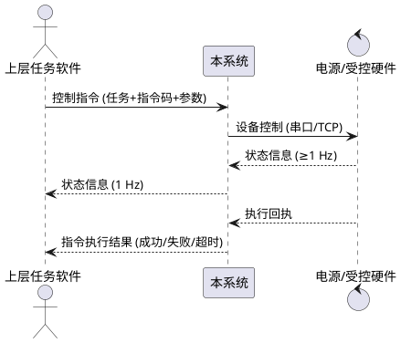

# 5. 性能与接口设计方案

## 5.1 性能设计

### 5.1.1 日志性能

| 项 | 取值 / 措施 |
|---|---|
| 日志操作种类 | ≥3 种：检索、清除、重置筛选 |
| 检索响应时间（建议值） | 10 万行级日志，关键字 + 时间范围检索 ≤2 s |
| 清除响应时间（建议值） | 按条件清除（不含历史归档读取）≤1 s |
| 重置筛选响应时间（建议值） | ≤1 s |
| 实现要点 | `t_sys_log` 加复合索引 `idx_log_ts(ts)`、`idx_log_level_module(level, module)`；分页查询（`LIMIT/OFFSET` 或主键游标）；大批量清除采用按月归档而非全表删除 |
| 高频写入控制 | 应用层日志先写内存队列，再批量落库；批量大小可配（默认 100 条 / 1 s 触发） |

### 5.1.2 系统状态信息显示

| 项 | 取值 / 措施 |
|---|---|
| 显示种类 | ≥2 种：磁盘容量、CPU 占用率（可扩展内存占用率、网络收发速率） |
| 刷新频率 | ≥1 Hz（采样与刷新解耦：采样 1 Hz 写 `t_sys_metric_log`，界面 `QTimer` 1 Hz 读最新值） |
| 实现要点 | `SystemMetricsProvider` 读取银河麒麟 V10 的 `/proc/stat`、`/proc/meminfo`、`statvfs` 等系统接口；主线程仅做展示，采样在工作线程完成 |
| 异常 | 采样失败显示"--"并在状态栏标记告警；连续 3 次失败写入 `t_sys_log` |

## 5.2 接口设计

系统对外接口共三类：控制指令、状态信息、指令执行结果。传输方式默认 TCP（`QTcpSocket` / `QTcpServer`），与电源等串口设备保留 `QSerialPort` 通路。报文采用二进制定长头 + 变长体的统一结构：

```
+--------+-------+--------+----------+--------+---------+--------+
| 帧头  | 版本 | 类型  | 序列号 | 长度  | 数据体 | CRC16 |
| 0xEB90 | 1B   | 1B    | 4B     | 4B    | N B     | 2B     |
+--------+-------+--------+----------+--------+---------+--------+
```

- 帧头：固定 0xEB90，用于同步定位。
- 类型：0x01 控制指令、0x02 状态信息、0x03 指令执行结果。
- 序列号：发送端递增，接收端原值回带，用于匹配响应。
- 长度：数据体字节数。
- CRC16：覆盖"版本"到"数据体"的字节序列，采用 CRC-16/XMODEM。

### 5.2.1 控制指令接口

- 方向：上层任务软件 → 本系统；本系统 → 电源/受控硬件。
- 传输：TCP 长连接为主，串口为辅。
- 触发：上层下发任务，或本系统按任务分解结果下发到硬件。

数据体字段：

| 字段 | 类型 | 长度 | 含义 | 必填 |
|---|---|---|---|---|
| task_no | ASCII | 32 | 任务编号 | 是 |
| inst_code | UINT16 | 2 | 指令码 | 是 |
| target | UINT8 | 1 | 目标设备 ID | 是 |
| param_len | UINT16 | 2 | 参数长度 | 是 |
| param | BYTES | N | 指令参数 | 否 |
| issue_time | UINT64 | 8 | 下发时间（毫秒） | 是 |

### 5.2.2 状态信息接口

- 方向：硬件 → 本系统；本系统 → 上层任务软件（聚合后上报）。
- 上报频率：硬件→本系统 ≥1 Hz；本系统→上层默认 1 Hz，可配置。

数据体字段：

| 字段 | 类型 | 长度 | 含义 | 必填 |
|---|---|---|---|---|
| device_id | UINT8 | 1 | 设备 ID | 是 |
| state_code | UINT8 | 1 | 状态码（在线/离线/告警） | 是 |
| voltage | FLOAT | 4 | 电压（V），无意义时填 0 | 否 |
| current | FLOAT | 4 | 电流（A） | 否 |
| temperature | FLOAT | 4 | 温度（°C） | 否 |
| error_code | UINT16 | 2 | 故障码，0 表示无故障 | 否 |
| ts | UINT64 | 8 | 采样时间（毫秒） | 是 |

### 5.2.3 指令执行结果接口

- 方向：本系统 → 上层任务软件。
- 触发：指令执行完成、超时或失败时各上报一次。

数据体字段：

| 字段 | 类型 | 长度 | 含义 | 必填 |
|---|---|---|---|---|
| task_no | ASCII | 32 | 任务编号 | 是 |
| inst_code | UINT16 | 2 | 指令码 | 是 |
| result | UINT8 | 1 | 0 成功 / 1 超时 / 2 失败 | 是 |
| err_msg_len | UINT16 | 2 | 失败原因长度 | 是 |
| err_msg | ASCII | N | 失败原因（UTF-8） | 否 |
| finish_time | UINT64 | 8 | 完成时间（毫秒） | 是 |

### 5.2.4 典型时序



## 5.3 接口可靠性与异常处理

| 类别 | 措施 |
|---|---|
| 超时 | 控制指令默认 5 s 等待硬件回执，超时则上报"指令执行结果=超时"，并写入 `t_hw_interaction_log` |
| 重试 | 默认重试 2 次（可配置），间隔 1 s；仍失败则上报"指令执行结果=失败" |
| 心跳 | 与上层任务软件、硬件分别维持 1 Hz 心跳；连续丢失 3 次置为离线，状态栏 `qt-led` 变红 |
| 报文校验 | 帧头、长度、CRC16 三层校验，任一不通过即丢弃并写日志 |
| 输入合法性 | 入参非法（长度越界、未知指令码、目标设备不存在）直接拒绝，并回执"失败"及原因 |
| 日志 | 全部异常按 `error` 级写入 `t_sys_log`，可在系统管理模块检索 |
