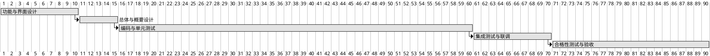

# 8. 项目实施与进度计划

本章给出本系统的实施方法、阶段划分、进度安排、关键里程碑、风险与组织分工。进度安排严格遵循《项目管理.md》"进度要求"中的 10、15、60、70、90 个工作日里程碑约束，并以 2026 年 8 月 31 日为最终交付截止日。

## 8.1 项目实施方法论

本系统采用迭代式开发与阶段评审相结合的实施方法。这种方法在保持 GJB 438C-2021 阶段评审节点的同时，又通过模块内部的迭代提升对需求变化与硬件联调问题的适应能力。

工作分解结构沿两条线展开。第一条线是文档章节线，按《大纲.md》的章节组织文档与对应的设计、编码、测试活动，每个章节有明确的责任人与产出物。第二条线是业务模块线，按系统需求中的五个一级模块（任务管理、数据处理、硬件交互、结果评估、系统管理）拆分到开发任务包，每个任务包又按子模块进一步拆分。两条线在每个阶段评审节点交汇，形成评审材料。

实施过程中坚持三条做法：第一，每一阶段进入下一阶段前必须通过评审，遗留问题必须有处置方案；第二，关键路径上的活动优先安排，避免后期返工；第三，硬件不到位等外部约束在阶段前期识别并准备替代方案，避免影响整体进度。

## 8.2 实施阶段划分

按《项目管理.md》进度要求，本项目划分为五个阶段。每个阶段都有明确的时间约束、主要交付物与主要活动。

**阶段一：功能与界面设计**。时间约束为合同签订后不超过 10 个工作日。主要任务包括与甲方共同确认需求条目、明确五大模块的功能边界、按统一 Qt Fusion 风格完成全部主要界面的原型设计、形成功能设计文档与界面原型文件。本阶段的产出是功能与界面设计评审的输入。

**阶段二：总体与概要设计**。时间约束为合同签订后不超过 15 个工作日（即从阶段一结束起约 5 个工作日内）。主要任务包括总体技术架构设计、Qt 与数据库选型论证、五大模块的概要设计、数据库设计与接口设计。本阶段的产出包括《系统建设方案》、概要设计说明、数据库设计说明、接口设计说明。

**阶段三：编码与单元测试**。时间约束为合同签订后不超过 60 个工作日。主要任务包括按详细设计完成源代码编写、组织单元测试、代码评审、注释率检查与静态分析。每个开发组在自身模块完成单元测试后向项目组提交单元测试报告。本阶段的产出是通过单元测试的源代码与单元测试报告。

**阶段四：集成测试与试运行**。时间约束为合同签订后不超过 70 个工作日。主要任务包括五大模块的集成、与硬件的联调、与上层任务软件的对接、试运行问题的处置。本阶段的产出包括集成测试报告与联调报告。

**阶段五：合格性测试与验收**。时间约束为合同签订后不超过 90 个工作日，且不晚于 2026 年 8 月 31 日。主要任务包括按测试方案开展合格性测试，覆盖功能、性能、边界、安全性与接口五类用例，提交合格性测试报告与验收材料，配合甲方完成验收。本阶段的产出是验收通过并签署相关材料。

各阶段的概要信息汇总如下：

| 阶段 | 时间约束 | 主要交付 | 主要活动 |
|---|---|---|---|
| 一 功能与界面设计 | ≤10 工作日 | 功能设计文档、界面原型 | 需求确认、五大模块定义、界面原型 |
| 二 总体与概要设计 | ≤15 工作日 | 系统建设方案、概要设计、数据库设计、接口设计 | 架构、Qt 与数据库选型、概要设计 |
| 三 编码与单元测试 | ≤60 工作日 | 源代码、单元测试报告 | 模块开发、QtTest 单测、代码评审、注释率检查 |
| 四 集成测试与试运行 | ≤70 工作日 | 集成测试报告、联调报告 | 集成测试、硬件联调、缺陷处置 |
| 五 合格性测试与验收 | ≤90 工作日 / 2026-08-31 | 合格性测试报告、验收材料 | 合格性测试、验收 |

## 8.3 进度甘特图

甘特图以合同签订日为时间零点，横轴单位为工作日。五个阶段的累计工作日与里程碑 10、15、60、70、90 严格一致，最终阶段不晚于 2026 年 8 月 31 日完成。

## 8.4 关键里程碑与评审节点

项目设置五个关键里程碑，每个里程碑配套评审或验收活动。里程碑既是阶段进入下一阶段的门槛，也是技术状态基线的形成节点。

| 里程碑 | 时间约束 | 配套评审 / 验收 | 形式 |
|---|---|---|---|
| M1 功能与界面设计完成 | 合同签订后 ≤10 工作日 | 功能与界面设计评审 | 内部 + 甲方 |
| M2 总体与概要设计完成 | 合同签订后 ≤15 工作日 | 总体与概要设计评审 | 内部 + 甲方 |
| M3 编码与单元测试完成 | 合同签订后 ≤60 工作日 | 单元测试出口评审 | 内部 |
| M4 集成测试与试运行完成 | 合同签订后 ≤70 工作日 | 集成测试与试运行评审 | 内部 + 甲方 |
| M5 合格性测试与验收 | 合同签订后 ≤90 工作日 / 2026-08-31 前 | 合格性测试评审与甲方验收 | 甲方组织 |

里程碑 M1 与 M2 同时也是功能基线与分配基线的形成节点；里程碑 M5 是产品基线的形成节点。基线一旦形成，对其变更需走变更评审流程。

## 8.5 风险与应对

项目实施过程存在若干典型风险。本节按风险来源进行分类，给出表现与应对措施。

**进度风险**。表现为关键路径阶段超期，可能由需求变更、人员调整或硬件不到位引起。应对措施包括：在阶段开始前完成阶段计划与资源分配；对关键路径任务设置缓冲期；将非关键路径任务并行展开；定期召开进度会，识别并解决进度阻塞点。

**单元测试覆盖不足**。表现为注释率或测试用例覆盖率未达约定值。应对措施包括：在持续集成流水线中加入注释率与用例覆盖率门禁；代码评审阶段重点检查测试代码的充分性；测试组提前介入，与开发组共同设计用例。

**硬件不到位**。表现为硬件采购或现场部署延迟，导致集成测试与联调无法开展。应对措施包括：在阶段一即与甲方约定硬件就位时间；提前准备硬件仿真器与桩，使集成测试在硬件到位前可部分进行；将硬件密切相关的测试用例放到硬件到位后的第一时间执行。

**接口变更频繁**。表现为上层任务软件调整接口字段或频率，导致本系统反复修改。应对措施包括：将接口设计纳入分配基线；接口变更通过变更评审流程统一管理；在协议层面预留版本字段，便于后续兼容。

**银河麒麟 V10 兼容问题**。表现为第三方库在麒麟环境下安装失败或运行异常。应对措施包括：在阶段二完成关键依赖的麒麟兼容性验证；备选依赖（如 SQLite 与 DM8 之间、QXlsx 与 LibXL 之间）预先评估；将兼容性问题纳入风险跟踪表。

**注释率未达 30%**。表现为提交时检测不通过。应对措施包括：在持续集成中加入注释率统计；开发过程中持续监控；评审阶段对注释充分性进行检查。

风险跟踪表在阶段评审时进行回顾，已处置完成的风险标记为关闭，新识别的风险纳入跟踪。

| 风险 | 表现 | 应对措施 |
|---|---|---|
| 进度延期 | 关键路径阶段超期 | 阶段缓冲、资源调配、并行非关键任务 |
| 单元测试覆盖不足 | 注释率或用例覆盖未达标 | CI 门禁、评审重点、测试组前置介入 |
| 硬件不到位 | 集成测试无法开展 | 仿真器/桩、约定硬件就位时间 |
| 接口变更频繁 | 上层接口字段调整 | 纳入分配基线、变更评审、版本字段预留 |
| 麒麟 V10 兼容 | 第三方库异常 | 兼容性验证前置、备选依赖 |
| 注释率不达标 | 提交检测不通过 | CI 统计、持续监控、评审检查 |

## 8.6 组织与分工

项目组织按"项目管理—架构—模块开发—测试—配置管理—质量保证"六类角色组织，覆盖从决策、设计、开发、测试到归档的全部环节。

| 角色 | 职责 |
|---|---|
| 项目经理 | 总体计划、资源协调、进度跟踪、对甲方接口 |
| 架构师 | 总体设计、技术选型、跨模块接口、关键技术问题处置 |
| 任务管理开发组 | 第 3.1 节模块的详细设计、编码、单元测试与缺陷修复 |
| 数据处理开发组 | 第 3.2 节模块的详细设计、编码、单元测试与缺陷修复 |
| 硬件交互开发组 | 第 3.3 节模块的详细设计、编码、单元测试与缺陷修复 |
| 结果评估开发组 | 第 3.4 节模块的详细设计、编码、单元测试与缺陷修复 |
| 系统管理开发组 | 第 3.5 节模块的详细设计、编码、单元测试与缺陷修复 |
| 测试组 | 测试方案、用例、执行、报告，覆盖功能、性能、边界、安全性、接口五类测试 |
| 配置管理员 | 基线管理、版本号规则维护、归档 |
| 质量保证 | 评审与过程监督，按 GJB 438C-2021 进行符合性检查 |

各角色之间通过项目计划、阶段评审、缺陷库、变更评审等机制协同。项目经理定期组织进度会与质量会，架构师定期组织技术评审与设计走查，测试组定期发布测试简报，配置管理员定期发布版本与归档报告，质量保证定期发布过程审计结果。
