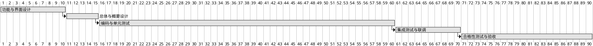

# 8. 项目实施与进度计划

## 8.1 项目实施方法论

项目采用迭代式开发结合阶段评审的模式，与 GJB 438C-2021 相兼容。WBS 沿两条线展开：纵向按文档章节（需求 → 设计 → 编码 → 测试 → 验收），横向按五个一级业务模块（任务管理、数据处理、硬件交互、结果评估、系统管理）。每个阶段完成后通过评审，遗留问题处置完成后才能进入下一阶段。

## 8.2 实施阶段划分

| 阶段 | 时间约束 | 主要交付 | 主要活动 |
|---|---|---|---|
| 一 功能与界面设计 | ≤10 工作日 | 功能设计文档、界面原型（Qt 风格 HTML） | 需求确认、五大模块功能定义、界面原型 |
| 二 总体与概要设计 | ≤15 工作日 | 总体设计说明、概要设计说明 | 架构、Qt 与数据库选型、接口设计 |
| 三 编码与单元测试 | ≤60 工作日 | 源代码、单元测试报告 | 模块开发、QtTest 单元测试、代码评审、注释率 ≥30% 校验 |
| 四 集成测试与试运行 | ≤70 工作日 | 集成测试报告、联调报告 | 集成测试、硬件联调、缺陷处置 |
| 五 合格性测试与验收 | ≤90 工作日 / 2026-08-31 前 | 合格性测试报告、验收材料 | 合格性测试（功能 / 性能 / 边界 / 安全性 / 接口）、验收 |

## 8.3 甘特图

> 说明：起始日期以合同签订日为零点，横轴单位为工作日，5 个阶段的累计天数与里程碑 10 / 15 / 60 / 70 / 90 工作日一致，最终交付不晚于 2026-08-31。

## 8.4 关键里程碑与评审节点

| 里程碑 | 时间约束 | 评审 / 验收形式 |
|---|---|---|
| M1 功能与界面设计完成 | 合同签订后 10 个工作日内 | 内部 + 甲方联合评审 |
| M2 总体与概要设计完成 | 合同签订后 15 个工作日内 | 内部 + 甲方联合评审 |
| M3 编码与单元测试完成 | 合同签订后 60 个工作日内 | 内部评审 |
| M4 集成测试与试运行完成 | 合同签订后 70 个工作日内 | 内部 + 甲方联合评审 |
| M5 合格性测试及验收 | 合同签订后 90 个工作日内 / 2026-08-31 前 | 甲方组织验收 |

## 8.5 风险与应对

| 风险 | 表现 | 应对措施 |
|---|---|---|
| 进度延期 | 关键路径阶段超期 | 提前识别瓶颈，增配人力，并将非关键活动并行展开 |
| 单元测试覆盖不足 | 注释率或用例覆盖未达标 | 加强代码评审；CI 强制门禁；测试组提前介入 |
| 硬件不到位 | 集成测试无法开展 | 提前准备仿真器/桩；与甲方约定硬件就位时间 |
| 接口变更频繁 | 上层任务软件调整接口字段 | 接口字段表纳入基线管理；变更走评审流程 |
| 麒麟 V10 兼容问题 | 第三方库在麒麟下不稳定 | 选型阶段在麒麟 V10 上完成兼容性验证；备选库提前准备 |
| 注释率未达 30% | 提交时检测不通过 | 在 CI 中加入注释率校验，开发过程持续监控 |

## 8.6 组织与分工

| 角色 | 职责 |
|---|---|
| 项目经理 | 总体计划、资源协调、对甲方接口 |
| 架构师 | 总体设计、技术选型、跨模块接口 |
| 任务管理开发组 | 3.1 节模块的开发与单元测试 |
| 数据处理开发组 | 3.2 节模块的开发与单元测试 |
| 硬件交互开发组 | 3.3 节模块的开发与单元测试 |
| 结果评估开发组 | 3.4 节模块的开发与单元测试 |
| 系统管理开发组 | 3.5 节模块的开发与单元测试 |
| 测试组 | 测试方案、用例、执行与报告，覆盖功能 / 性能 / 边界 / 安全性 / 接口 |
| 配置管理员 | 基线管理、版本号规则、归档 |
| 质量保证 | 评审与过程监督，按 GJB 438C-2021 检查 |
