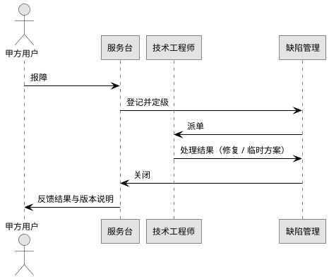

# 9. 售后服务与保障方案

## 9.1 售后服务总体策略

自系统验收合格之日起，乙方为甲方提供为期 5 年的维护服务。服务对象为本系统五个一级模块（任务管理、数据处理、硬件交互、结果评估、系统管理）。维护期内发生的软件故障与缺陷，由乙方负责解决；遇系统联调、所检、外场、用户验收，乙方按甲方要求派人参加。

## 9.2 服务内容

| 序号 | 服务项目 | 内容 |
|---|---|---|
| 1 | 软件故障与缺陷修复 | 修复维护期内出现的软件故障与缺陷，发布补丁版本 |
| 2 | 系统联调支持 | 派员到场参与联合调试，协助甲方定位与处理问题 |
| 3 | 所检与外场支持 | 配合所检与外场试验，提供现场技术支持 |
| 4 | 用户验收支持 | 参加用户验收，并协助解决验收期间出现的技术问题 |
| 5 | 用户手册更新 | 因缺陷修复带来的界面或操作变化，同步更新用户手册 |
| 6 | 必要的用户培训 | 围绕五大模块，按甲方需要提供培训 |

## 9.3 服务响应机制

报障渠道：电话、邮件、现场登记。报障后由服务台登记并按等级派单，处理过程在缺陷库中跟踪至关闭。

响应分级（建议值）：

| 等级 | 触发条件 | 建议响应时限 | 建议修复时限 |
|---|---|---|---|
| 紧急 | 系统不可用 | 4 小时内 | 48 小时内 |
| 一般 | 功能受限或部分异常 | 1 工作日 | 5 工作日 |
| 咨询 | 使用咨询或优化建议 | 3 工作日 | — |

## 9.4 现场支持与联调

| 项 | 内容 |
|---|---|
| 范围 | 系统联调、所检、外场、用户验收 |
| 方式 | 派驻工程师、远程协助、现场处置三种结合 |
| 协同 | 与甲方接口人对接，按周提交进展，问题统一记录到缺陷库 |

## 9.5 版本与升级管理

维护期内乙方仅承诺缺陷修复版本，不承诺新增功能。版本号规则：`主版本.次版本.修订号-补丁号`。补丁包发布前在内部完成回归测试；现场升级前提供回退预案与备份说明。

## 9.6 文档与培训支持

| 项 | 内容 |
|---|---|
| 用户手册 | 维护期内随补丁版本同步更新 |
| 培训 | 围绕五大模块按甲方需要安排培训，内容来自用户手册与缺陷修复说明 |
| 不承诺范围 | 不承诺超出本系统功能范围的内容（如其他第三方系统的运维代办） |

## 9.7 服务保障与质量监督

| 项 | 内容 |
|---|---|
| 服务台账 | 维护期内所有报障、处理过程、版本发布均记录在台账 |
| 年度服务总结 | 每年向甲方提交一次服务总结，含报障量、修复时限达成率、典型问题分析 |
| 定期回访 | 至少每半年回访一次，了解使用情况并收集改进建议 |
| 与评审衔接 | 维护期内的重大缺陷需启动评审流程，按 GJB 438C-2021 处理 |
