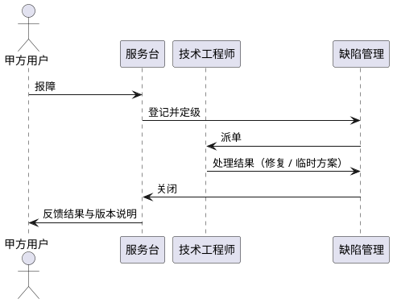

# 9. 售后服务与保障方案

本章给出本系统在 5 年维护期内的售后服务与保障安排，覆盖服务策略、服务内容、响应机制、现场支持、版本与升级、文档与培训以及质量监督七个方面。所有承诺以《系统需求.md》"保障性要求"与《项目管理.md》"质保周期要求""售后服务要求"的原文为依据，不作超出原文的额外承诺。

## 9.1 售后服务总体策略

本系统的售后服务自验收合格之日起 5 年内有效。服务对象为本《系统建设方案》所定义的五个一级业务模块（任务管理、数据处理、硬件交互、结果评估、系统管理）以及配套的数据库设计、接口设计与文档。服务由乙方专责团队承担，团队在维护期内保持稳定，并在出现人员变动时确保平滑交接。

服务的总体策略可以概括为三点：第一，对维护期内出现的软件故障与缺陷负责到底，按照分级响应机制提供及时处理；第二，按甲方要求派人参加系统联调、所检、外场与用户验收，与甲方共同解决期间出现的技术问题；第三，按版本管理规则发布缺陷修复版本与必要的兼容性补丁，确保软件长期稳定运行。

服务范围限定为本系统及其交付物。对其他第三方系统的运维、对超出系统需求范围的功能新增等内容，不在本方案承诺范围之内。如甲方在维护期内提出新需求，按变更需求纳入合同变更或新合同范围处理。

## 9.2 服务内容

本系统的售后服务覆盖六类内容，每一类对应《系统需求.md》或《项目管理.md》中的原文条款。

**软件故障与缺陷修复**。维护期内出现的软件故障与缺陷由乙方负责定位、修复与验证。修复成果以补丁版本发布，并配套发布说明与回归测试结论。

**系统联调支持**。乙方按甲方要求派员到场参与联合调试，配合甲方与其他系统、硬件设备完成对接，协助定位与处理调试过程中出现的问题。

**所检与外场支持**。乙方按甲方要求派员参加所检与外场试验，提供现场技术支持，配合完成试验大纲约定的事项。

**用户验收支持**。乙方按甲方要求派员参加用户验收，并协助解决验收期间出现的技术问题。

**用户手册更新**。维护期内因缺陷修复导致界面或操作发生变化时，乙方同步更新软件用户手册，并向甲方提交修订版。

**用户培训**。乙方按甲方需要围绕本系统五大模块组织培训，培训内容来自软件用户手册与缺陷修复说明。培训规模与频次按甲方需求安排。

服务内容汇总如下：

| 序号 | 服务项目 | 主要内容 | 触发方式 |
|---|---|---|---|
| 1 | 软件故障与缺陷修复 | 定位、修复、验证、发布补丁 | 报障 |
| 2 | 系统联调支持 | 派员到场、协助调试 | 甲方通知 |
| 3 | 所检与外场支持 | 派员到场、技术支持 | 甲方通知 |
| 4 | 用户验收支持 | 派员到场、协助处理验收问题 | 甲方通知 |
| 5 | 用户手册更新 | 缺陷修复带来的操作变化同步入册 | 版本发布 |
| 6 | 用户培训 | 围绕五大模块、用户手册与修复说明 | 甲方需求 |

## 9.3 服务响应机制

服务响应以"报障—登记—派单—处理—验证—关闭"流程组织。报障渠道包括电话、邮件与现场登记三种，三种渠道在登记后均进入统一的缺陷库进行跟踪。

报障登记后按以下分级标准定级。等级判定由服务台依据报障描述初判，必要时由技术工程师在初步分析后调整。

| 等级 | 触发条件 | 建议响应时限 | 建议修复时限 |
|---|---|---|---|
| 紧急 | 系统不可用，业务无法开展 | 4 小时内 | 48 小时内 |
| 一般 | 功能受限或部分异常，业务可继续开展 | 1 个工作日 | 5 个工作日 |
| 咨询 | 使用咨询、优化建议、非缺陷问题 | 3 个工作日 | — |

上述响应时限与修复时限为建议值，具体约定按合同附件执行。乙方在维护期内按上述分级提供服务，并将每一次报障的响应时限达成率纳入年度服务总结。

服务响应流程如下：

修复过程中如需在现场操作甲方环境，乙方按甲方要求派员到场，并在操作前后留存现场记录。修复结果向甲方反馈时一并提供影响分析与回退预案。

## 9.4 现场支持与联调

现场支持是售后服务的重要组成部分，覆盖系统联调、所检、外场与用户验收四类场景。乙方按甲方要求派遣工程师到场，到场频次与人数依据具体活动安排。

派驻工程师在现场期间，与甲方技术接口人保持每日同步，按周向项目经理与甲方提交进展报告。现场发现的问题统一记录到缺陷库，问题处理过程留痕；现场配置变更（如硬件配置、网络参数）由甲方与乙方共同确认后执行。

对不需要现场处置的问题，乙方可通过远程协助方式提供支持。远程协助在征得甲方同意后进行，并按甲方安全要求接入。

## 9.5 版本与升级管理

维护期内乙方仅承诺缺陷修复版本，不承诺新功能。版本号沿用"主版本.次版本.修订号-补丁号"规则，缺陷修复版本主要表现为修订号或补丁号的递增。

每一个补丁版本在发布前完成回归测试，回归测试覆盖与本次修复相关的功能、性能、边界、安全性与接口五类用例。回归测试通过后，乙方向甲方提交补丁版本与发布说明，发布说明列出本次修复的缺陷清单、影响分析、回归测试结果与回退预案。

现场升级前，乙方与甲方共同确认升级窗口、备份方案与回退预案。升级过程中对原版本可执行程序、数据库文件与配置文件进行备份。升级失败或验证未通过时，可按回退预案恢复到原版本。

## 9.6 文档与培训支持

维护期内乙方持续维护软件用户手册。每一次缺陷修复涉及界面或操作变化时，乙方同步更新手册并随版本发布。

用户培训按甲方需求安排。培训内容以软件用户手册为主线，结合现场实际使用场景与缺陷修复说明组织。培训形式可以是现场培训、远程培训或培训视频，按甲方需求确定。

不在维护范围内的内容包括：超出本系统功能范围的内容（如其他第三方系统的运维代办）、超出软件用户手册范围的高级开发指导等。如甲方有此类需求，按合同变更或新合同范围处理。

## 9.7 服务保障与质量监督

为保障服务质量，乙方建立服务台账、年度服务总结与定期回访机制。

**服务台账**。维护期内的全部报障、处理过程、版本发布、现场支持均记录在服务台账中。台账按月汇总，向项目经理与甲方接口人提交。

**年度服务总结**。每个服务年度结束时，乙方向甲方提交年度服务总结，内容包括报障数量与分级统计、响应时限达成率、修复时限达成率、典型问题分析、版本发布记录与改进建议。

**定期回访**。乙方至少每半年回访一次，了解系统使用情况、收集改进建议、确认服务满意度。回访结论纳入年度服务总结。

**重大缺陷处理**。维护期内出现重大缺陷时，乙方启动评审流程，按 GJB 438C-2021 的变更控制要求处理。重大缺陷的影响分析、修复方案、回归测试与版本发布均纳入评审与归档。
