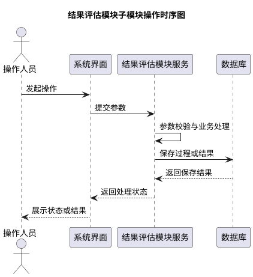
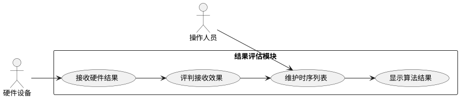

# 03.4 结果评估模块详细设计提示词

请你作为系统详细设计专家，根据《系统需求.md》和《大纲.md》编写“03.4 结果评估模块”详细设计。

## 通用编写约束

- 严格依据《系统需求.md》和《大纲.md》编写，不新增需求未提出的大模块、外部系统、用户角色或业务流程。
- 可以在既有功能要求内部拆分功能细节，但拆分必须服务于原始要求的解释、落地和验收。
- 语言采用正式、客观、工程化的系统建设方案表述。
- 涉及技术方案时优先体现成熟技术、模块化、高聚合低耦合、输入合法性检查、异常处理和误操作防护。
- 操作系统约束统一写为：银河麒麟 V10。
- 接口边界统一限定为：控制指令、状态信息、指令执行结果、任务结果报送、技术状态报送。
- 输出时禁止使用占位性措辞或空泛留白。


## 模块功能边界

本模块只覆盖结果评估相关功能：能够接收硬件返回结果；能够评判结果接收效果；能够生成时序列表；能够在时序列表手动调整内容；能够调用算法显示结果。

## 子模块拆分要求

- 结果接收与效果评判子模块：接收硬件返回结果、评判结果接收效果。
- 时序列表管理子模块：生成时序列表、手动调整时序列表内容。
- 算法结果显示子模块：调用算法并显示结果。

## 必须输出的详细设计结构

请对每个子模块分别输出以下内容；若模块只有一个连续流程，也必须按功能点分段描述，不能合并缺项。

### 一、功能模块描述

- 说明子模块职责、输入数据、输出数据、触发条件、依赖对象和处理结果。
- 明确与其他模块的关系，只描述系统需求中已有的交互。
- 标明相关数据需要入库、导出、展示或报送的场景。

### 二、操作步骤

- 使用编号步骤描述操作者或系统的处理流程。
- 包含正常流程、输入校验、异常提示、入库记录或结果输出。
- 必须加入一个简单明了的 PlantUML 时序图，示例如下，生成时请替换为本子模块的实际对象和步骤：



### 三、类 / 算法设计

- 使用 Java 代码块描述架构类、接口、核心算法或关键对象关系。
- 只写架构或核心算法，不写完整工程项目。
- Java 代码必须体现输入校验、状态流转、异常处理或结果封装。
- 参考以下代码风格，生成时请替换为本子模块的实际类名、方法名和字段：

```java
public interface ResultEvaluationService {
    OperationResult handle(EvaluationRequest request);
}

public class ResultEvaluationServiceImpl implements ResultEvaluationService {
    private final EvaluationRepository repository;

    public ResultEvaluationServiceImpl(EvaluationRepository repository) {
        this.repository = repository;
    }

    @Override
    public OperationResult handle(EvaluationRequest request) {
        if (request == null || !request.isValid()) {
            throw new IllegalArgumentException("输入参数不合法");
        }
        ProcessRecord record = ProcessRecord.start(request.getBusinessId());
        try {
            OperationResult result = executeCore(request);
            repository.save(record.success(result));
            return result;
        } catch (RuntimeException ex) {
            repository.save(record.failure(ex.getMessage()));
            throw ex;
        }
    }

    private OperationResult executeCore(EvaluationRequest request) {
        return OperationResult.success(request.getBusinessId(), "处理完成");
    }
}
```

### 四、用例描述

- 说明参与者、前置条件、基本流程、异常流程、后置条件。
- 必须使用 PlantUML 绘制简单明了的用例图，示例如下，生成时请替换为本子模块实际用例：



### 五、界面设计

- 使用 HTML 代码画界面，体现页面区域、输入项、按钮、状态展示、结果展示和异常提示。
- HTML 只表达结构和关键控件，不引入外部 CSS 或脚本依赖。
- 参考以下结构，生成时请替换为本子模块实际字段和操作；最终输出不得保留演示性文本、泛化参数名或默认状态文案：

```html
<section class="module-panel">
  <header>
    <h2>结果评估模块</h2>
    <p>用于展示本子模块的操作入口、状态信息和处理结果。</p>
  </header>
  <form>
    <label>业务编号：<input type="text" name="businessId" /></label>
    <label>功能参数：<input type="text" name="parameter" /></label>
    <button type="button">执行</button>
    <button type="reset">重置筛选</button>
  </form>
  <aside class="status">
    <strong>当前状态：</strong><span>待处理</span>
  </aside>
  <table>
    <thead>
      <tr><th>序号</th><th>处理内容</th><th>状态</th><th>时间</th></tr>
    </thead>
    <tbody>
      <tr><td>1</td><td>处理记录</td><td>成功</td><td>记录时间</td></tr>
    </tbody>
  </table>
  <div class="message error">输入不合法或处理异常时在此提示。</div>
</section>
```

## 模块专项写作要求

- 评估对象限定为硬件返回结果，不扩展为综合业务绩效评估。
- 接收效果评判需要说明完整性、有效性或一致性等工程判据，但不要新增需求外的复杂评分体系。
- 时序列表必须支持生成和手动调整，调整过程需要记录。
- 算法调用只用于显示结果，不扩展为算法训练或模型管理。

## 输出格式要求

- 使用 `03.4` 作为章节编号。
- 每个子模块都必须完整包含“五项详细设计内容”。
- PlantUML 代码块使用 `plantuml` 标记。
- Java 代码块使用 `java` 标记。
- HTML 代码块使用 `html` 标记。
- 不新增本模块边界之外的功能。
